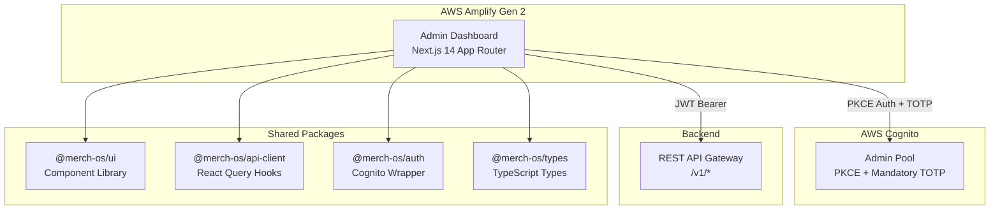
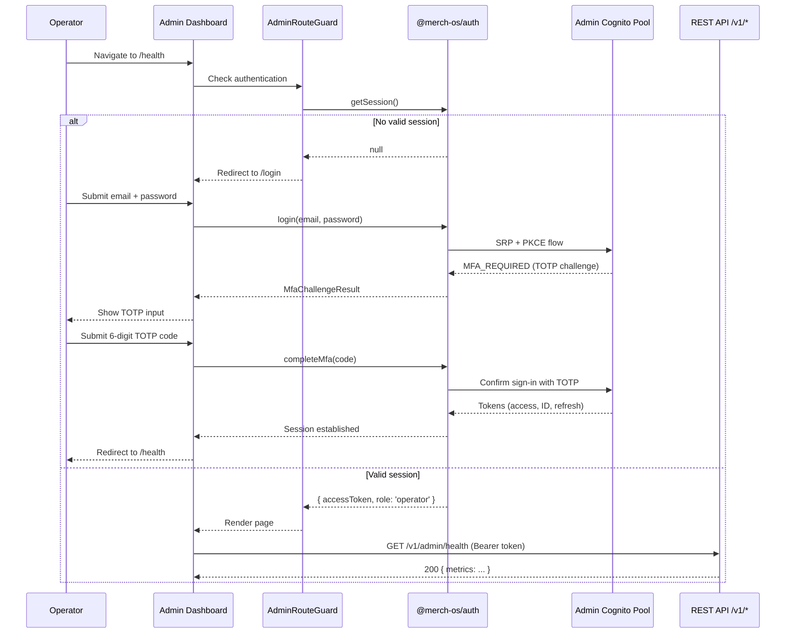
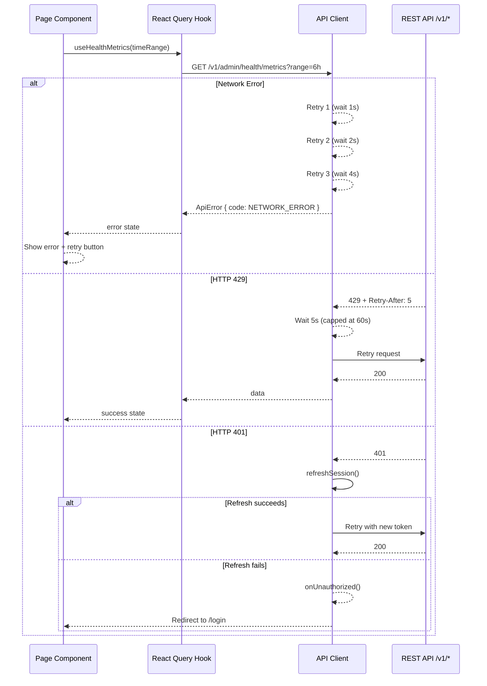

# Design Document: MerchOS Admin Dashboard

## Overview

The Admin Dashboard is a Next.js 14 App Router application that provides platform operators with monitoring, tenant management, compliance editing, taxonomy management, audit logging, alert resolution, and billing administration capabilities. It is deployed on AWS Amplify Gen 2 as a separate application from the Seller Dashboard but shares the same monorepo infrastructure and packages.

### Key Design Decisions

| Decision | Choice | Rationale |
|----------|--------|-----------|
| Framework | Next.js 14 (App Router) | Consistent with Seller Dashboard; provides SSR flexibility, file-based routing, and React Server Components |
| Auth | Separate Admin Cognito Pool with PKCE + Mandatory TOTP | Isolates operator credentials from tenant users; mandatory MFA enforces security for platform-level access |
| State Management | TanStack Query v5 (server state) + Zustand (client state) | Proven pattern from Seller Dashboard; handles caching, deduplication, retries, and background refetch |
| Styling | Tailwind CSS | Shared design tokens with Seller Dashboard via `@merch-os/ui`; utility-first for rapid development |
| Component Library | Radix UI primitives via `@merch-os/ui` | Accessible by default (WAI-ARIA), unstyled primitives for full Tailwind control |
| Charts | Recharts | Required for health metric visualizations; composable, accessible, lightweight |
| JSON Schema Forms | React Hook Form + Zod + custom `JsonSchemaForm` | Dynamic form generation from compliance rule schemas; type-safe validation |
| Inactivity Timeout | 30-minute client-side timer | Enforces session timeout for idle operators per security requirements |
| Polling for Taxonomy | 10-second interval via React Query `refetchInterval` | Simple mechanism for tracking REFRESHING state without WebSocket complexity |
| Role Model | Single "operator" role | All authenticated admin users have full access; no role hierarchy needed |

### Architecture Principles

1. **Shared packages, independent apps** — Admin Dashboard is independently deployable; shared logic lives in `packages/*`.
2. **API-first** — All data flows through `/v1/*` REST API. No direct AWS SDK calls from the frontend.
3. **Mandatory MFA** — Every login requires TOTP verification; no optional path.
4. **Resilient by default** — Exponential backoff retries, optimistic updates with rollback, graceful error boundaries.
5. **Accessible by default** — WCAG 2.1 AA via Radix primitives, semantic HTML, ARIA live regions, keyboard navigation.

---

## Architecture

### High-Level System Diagram



### Admin Dashboard Project Structure

```
apps/admin-dashboard/
├── app/
│   ├── (auth)/
│   │   ├── layout.tsx              # Minimal layout for auth pages
│   │   ├── login/
│   │   │   └── page.tsx            # Email + password form
│   │   └── mfa/
│   │       └── page.tsx            # TOTP code entry
│   ├── (dashboard)/
│   │   ├── layout.tsx              # Admin App Shell (sidebar, topbar, error boundary)
│   │   ├── health/
│   │   │   └── page.tsx            # Health monitoring with Recharts
│   │   ├── tenants/
│   │   │   └── page.tsx            # Tenant list + detail panel
│   │   ├── compliance/
│   │   │   └── page.tsx            # Channel compliance rule editor
│   │   ├── taxonomy/
│   │   │   └── page.tsx            # Taxonomy status + refresh triggers
│   │   ├── audit-log/
│   │   │   └── page.tsx            # Searchable audit event table
│   │   ├── alerts/
│   │   │   └── page.tsx            # Alert list + resolution forms
│   │   └── billing/
│   │       └── page.tsx            # Billing admin + plan override
│   ├── layout.tsx                  # Root layout (providers, metadata)
│   └── page.tsx                    # Redirect to /health
├── components/
│   ├── AdminAppShell.tsx           # Sidebar + topbar + content area
│   ├── AdminRouteGuard.tsx         # Auth enforcement + inactivity timeout
│   ├── InactivityTimer.tsx         # 30-min inactivity detection
│   ├── OfflineIndicator.tsx        # Network connectivity indicator
│   └── ErrorBoundaryFallback.tsx   # Page-level error boundary UI
├── hooks/
│   ├── useAdminAuth.ts             # Admin-specific auth hook (wraps @merch-os/auth)
│   └── useInactivityTimeout.ts     # Inactivity detection logic
├── stores/
│   └── ui-store.ts                 # Zustand: sidebar collapsed, mobile menu open
├── next.config.js
├── tailwind.config.ts
├── tsconfig.json
└── package.json
```

### Authentication Flow



### Request Flow with Error Handling



---

## Components and Interfaces

### Admin Auth Module Extension

The admin dashboard reuses `@merch-os/auth` but configures it against the Admin Cognito Pool. The key differences are:
- Mandatory TOTP (no optional MFA path)
- Single "operator" role (no role hierarchy)
- 30-minute inactivity timeout
- 5 failed attempts → 30-minute lockout

```typescript
// apps/admin-dashboard/hooks/useAdminAuth.ts
import { useAuth } from '@merch-os/auth';
import type { AdminUser } from '@merch-os/types';

export interface AdminAuthState {
  user: AdminUser | null;
  isAuthenticated: boolean;
  isLoading: boolean;
  accessToken: string | null;
  login: (email: string, password: string) => Promise<MfaChallengeResult>;
  completeMfa: (code: string) => Promise<void>;
  logout: () => Promise<void>;
  refreshSession: () => Promise<string>;
}

// AdminUser type (from @merch-os/types)
export interface AdminUser {
  userId: string;
  email: string;
  role: 'operator';
}
```

```typescript
// apps/admin-dashboard/hooks/useInactivityTimeout.ts
export interface InactivityTimeoutConfig {
  timeoutMs: number;        // 30 * 60 * 1000 = 1,800,000
  onTimeout: () => void;    // Trigger logout + redirect
  events: string[];         // ['mousedown', 'keydown', 'scroll', 'touchstart']
}

export function useInactivityTimeout(config: InactivityTimeoutConfig): void;
```

### Admin App Shell

```typescript
// apps/admin-dashboard/components/AdminAppShell.tsx
export interface AdminNavItem {
  label: string;
  href: string;
  icon: React.ReactNode;
  badge?: number;  // For alert count badge
}

const ADMIN_NAV_ITEMS: AdminNavItem[] = [
  { label: 'Health',     href: '/health',     icon: <ActivityIcon /> },
  { label: 'Tenants',    href: '/tenants',    icon: <UsersIcon /> },
  { label: 'Compliance', href: '/compliance', icon: <ShieldIcon /> },
  { label: 'Taxonomy',   href: '/taxonomy',   icon: <TreeIcon /> },
  { label: 'Audit Log',  href: '/audit-log',  icon: <FileTextIcon /> },
  { label: 'Alerts',     href: '/alerts',     icon: <AlertIcon />, badge: unresolvedCount },
  { label: 'Billing',    href: '/billing',    icon: <CreditCardIcon /> },
];
```

### Admin API Hooks (new hooks in `packages/api-client`)

```typescript
// packages/api-client/src/hooks/useAdminHealth.ts
export const adminHealthKeys = {
  all: ['admin', 'health'] as const,
  metrics: (range: TimeRange) => [...adminHealthKeys.all, 'metrics', range] as const,
  summary: () => [...adminHealthKeys.all, 'summary'] as const,
};

export type TimeRange = '1h' | '6h' | '24h' | '7d';

export function useHealthMetrics(range: TimeRange): UseQueryResult<HealthMetrics, ApiError>;
export function useHealthSummary(): UseQueryResult<HealthSummary, ApiError>;
```

```typescript
// packages/api-client/src/hooks/useAdminTenants.ts
export const adminTenantKeys = {
  all: ['admin', 'tenants'] as const,
  list: (params: TenantListParams) => [...adminTenantKeys.all, 'list', params] as const,
  detail: (tenantId: string) => [...adminTenantKeys.all, 'detail', tenantId] as const,
};

export interface TenantListParams {
  page?: number;
  pageSize?: number;       // default: 25
  search?: string;
  status?: 'active' | 'suspended';
  plan?: PlanId;
}

export function useAdminTenants(params: TenantListParams): UseQueryResult<PaginatedResponse<TenantSummary>, ApiError>;
export function useAdminTenantDetail(tenantId: string): UseQueryResult<TenantDetail, ApiError>;
export function useSuspendTenant(): UseMutationResult<void, ApiError, SuspendTenantPayload>;
export function useActivateTenant(): UseMutationResult<void, ApiError, ActivateTenantPayload>;
```

```typescript
// packages/api-client/src/hooks/useAdminCompliance.ts
export const adminComplianceKeys = {
  all: ['admin', 'compliance'] as const,
  channels: () => [...adminComplianceKeys.all, 'channels'] as const,
  ruleSet: (channelId: string) => [...adminComplianceKeys.all, 'ruleSet', channelId] as const,
};

export function useComplianceChannels(): UseQueryResult<ComplianceChannelSummary[], ApiError>;
export function useComplianceRuleSet(channelId: string): UseQueryResult<ComplianceRuleSet, ApiError>;
export function useSaveComplianceRules(): UseMutationResult<ComplianceRuleSet, ApiError, SaveCompliancePayload>;
```

```typescript
// packages/api-client/src/hooks/useAdminTaxonomy.ts
export const adminTaxonomyKeys = {
  all: ['admin', 'taxonomy'] as const,
  list: () => [...adminTaxonomyKeys.all, 'list'] as const,
  status: (channelId: string) => [...adminTaxonomyKeys.all, 'status', channelId] as const,
};

export function useTaxonomyList(): UseQueryResult<TaxonomyStatus[], ApiError>;
export function useTriggerTaxonomyRefresh(): UseMutationResult<void, ApiError, { channelId: string }>;
```

```typescript
// packages/api-client/src/hooks/useAdminAuditLog.ts
export const adminAuditKeys = {
  all: ['admin', 'audit'] as const,
  list: (params: AuditListParams) => [...adminAuditKeys.all, 'list', params] as const,
};

export interface AuditListParams {
  page?: number;
  pageSize?: number;         // default: 50
  search?: string;
  startDate?: string;        // ISO 8601
  endDate?: string;          // ISO 8601
  actionType?: string;
}

export function useAuditLog(params: AuditListParams): UseQueryResult<PaginatedResponse<AuditEvent>, ApiError>;
```

```typescript
// packages/api-client/src/hooks/useAdminAlerts.ts
export const adminAlertKeys = {
  all: ['admin', 'alerts'] as const,
  list: (status?: AlertStatusFilter) => [...adminAlertKeys.all, 'list', status] as const,
  unresolvedCount: () => [...adminAlertKeys.all, 'unresolvedCount'] as const,
};

export type AlertStatusFilter = 'all' | 'unresolved' | 'resolved';

export function useAlerts(status?: AlertStatusFilter): UseQueryResult<AlertItem[], ApiError>;
export function useUnresolvedAlertCount(): UseQueryResult<number, ApiError>;
export function useResolveAlert(): UseMutationResult<void, ApiError, ResolveAlertPayload>;
```

```typescript
// packages/api-client/src/hooks/useAdminBilling.ts
export const adminBillingKeys = {
  all: ['admin', 'billing'] as const,
  list: (params: AdminBillingListParams) => [...adminBillingKeys.all, 'list', params] as const,
  detail: (tenantId: string) => [...adminBillingKeys.all, 'detail', tenantId] as const,
};

export interface AdminBillingListParams {
  page?: number;
  pageSize?: number;        // default: 25
  search?: string;
  status?: SubscriptionStatus;
}

export function useAdminBillingList(params: AdminBillingListParams): UseQueryResult<PaginatedResponse<AdminBillingSummary>, ApiError>;
export function useAdminBillingDetail(tenantId: string): UseQueryResult<AdminBillingDetail, ApiError>;
export function usePlanOverride(): UseMutationResult<void, ApiError, PlanOverridePayload>;
```

### Shared UI Components Used

| Component | Package | Usage in Admin Dashboard |
|-----------|---------|--------------------------|
| `Sidebar` | `@merch-os/ui` | Navigation with collapsed/expanded modes |
| `DataTable` | `@merch-os/ui` | Tenant list, audit log, billing table, alert list |
| `Modal` | `@merch-os/ui` | Confirmation dialogs (suspend, activate, plan override) |
| `Toast` | `@merch-os/ui` | Error/success notifications |
| `Skeleton` | `@merch-os/ui` | Loading placeholders for charts and tables |
| `Badge` | `@merch-os/ui` | Status indicators, unresolved alert count |
| `JsonSchemaForm` | `@merch-os/ui` | Compliance rule editor dynamic forms |
| `Card` | `@merch-os/ui` | Health summary cards, metric panels |

### Admin-Specific Components

| Component | Location | Purpose |
|-----------|----------|---------|
| `HealthChart` | `app/(dashboard)/health/` | Recharts wrapper for time-series metrics |
| `TimeRangeSelector` | `app/(dashboard)/health/` | 1h/6h/24h/7d filter toggle |
| `TenantDetailPanel` | `app/(dashboard)/tenants/` | Slide-out panel for tenant info |
| `ComplianceFormRenderer` | `app/(dashboard)/compliance/` | JSON schema → form rendering |
| `TaxonomyStatusRow` | `app/(dashboard)/taxonomy/` | Row with refresh button + polling |
| `AuditEventDetailRow` | `app/(dashboard)/audit-log/` | Expandable row with JSON detail |
| `AlertResolutionForm` | `app/(dashboard)/alerts/` | Inline form for resolution notes |
| `PlanOverrideModal` | `app/(dashboard)/billing/` | Plan selection + reason form |

---

## Data Models

### API Response Types (Admin-specific DTOs)

```typescript
// packages/types/src/admin.ts

export type TenantStatus = 'active' | 'suspended';

export interface TenantSummary {
  tenantId: string;
  name: string;
  plan: PlanId;
  status: TenantStatus;
  userCount: number;
  productCount: number;
  registeredAt: string;   // ISO 8601
}

export interface TenantDetail extends TenantSummary {
  lastActivityAt: string; // ISO 8601
}

export interface SuspendTenantPayload {
  tenantId: string;
  reason: string;         // 1-500 characters
}

export interface ActivateTenantPayload {
  tenantId: string;
}

export interface HealthMetrics {
  lambdaErrorRates: MetricSeries[];
  stepFunctionsFailures: MetricSeries[];
  sqsQueueDepths: MetricSeries[];
  dynamoConsumedCapacity: MetricSeries[];
}

export interface HealthSummary {
  activeTenantCount: number;
  productsProcessedToday: number;
}

export interface MetricSeries {
  name: string;
  datapoints: MetricDatapoint[];
  unit: string;
}

export interface MetricDatapoint {
  timestamp: string;      // ISO 8601
  value: number;
}

export interface ComplianceChannelSummary {
  channelId: string;
  channelName: string;
  version: string;
  updatedAt: string;      // ISO 8601
}

export interface ComplianceRuleSet {
  channelId: string;
  channelName: string;
  version: string;
  updatedAt: string;
  rules: Record<string, unknown>;
  jsonSchema: Record<string, unknown>;
}

export interface SaveCompliancePayload {
  channelId: string;
  rules: Record<string, unknown>;
}

export type TaxonomyStatusValue = 'CURRENT' | 'STALE' | 'REFRESHING';

export interface TaxonomyStatus {
  channelId: string;
  channelName: string;
  version: string;
  lastRefreshDate: string;  // ISO 8601
  nodeCount: number;
  status: TaxonomyStatusValue;
}

export interface AuditEvent {
  eventId: string;
  timestamp: string;        // ISO 8601
  actor: string;            // email or system identifier
  actionType: string;
  resource: string;
  tenantId?: string;
  details: Record<string, unknown>;
}

export interface AlertItem {
  alertId: string;
  functionName: string;
  currentErrorRate: number;   // percentage 0-100
  errorCount: number;
  triggeredAt: string;        // ISO 8601
  resolved: boolean;
  resolvedAt?: string;
  resolutionNote?: string;
}

export interface ResolveAlertPayload {
  alertId: string;
  note: string;               // 1-1000 characters
}

export type SubscriptionStatus = 
  | 'active' 
  | 'past_due' 
  | 'canceled' 
  | 'trialing' 
  | 'incomplete' 
  | 'incomplete_expired' 
  | 'unpaid';

export interface AdminBillingSummary {
  tenantId: string;
  tenantName: string;
  plan: PlanId;
  billingCycle: 'monthly' | 'annual';
  status: SubscriptionStatus;
  currentPeriodEnd: string;   // ISO 8601
}

export interface AdminBillingDetail extends AdminBillingSummary {
  usage: {
    enrichmentCalls: number;
    enrichmentLimit: number;
    imageCalls: number;
    imageLimit: number;
    csvExports: number;
    csvExportLimit: number;
  };
  recentInvoices: InvoiceSummary[];
}

export interface PlanOverridePayload {
  tenantId: string;
  targetPlan: PlanId;
  reason: string;             // 1-500 characters
}
```

### Client-Side State (Zustand)

```typescript
// apps/admin-dashboard/stores/ui-store.ts
import { create } from 'zustand';

interface AdminUIStore {
  sidebarCollapsed: boolean;
  mobileSidebarOpen: boolean;
  toggleSidebar: () => void;
  setMobileSidebarOpen: (open: boolean) => void;
}

export const useAdminUIStore = create<AdminUIStore>((set) => ({
  sidebarCollapsed: false,
  mobileSidebarOpen: false,
  toggleSidebar: () => set((s) => ({ sidebarCollapsed: !s.sidebarCollapsed })),
  setMobileSidebarOpen: (open) => set({ mobileSidebarOpen: open }),
}));
```

### API Endpoints (Admin-specific)

| Method | Endpoint | Description |
|--------|----------|-------------|
| GET | `/v1/admin/health/metrics?range={range}` | Health metric time-series |
| GET | `/v1/admin/health/summary` | Active tenants + products processed today |
| GET | `/v1/admin/tenants?page&pageSize&search&status&plan` | Paginated tenant list |
| GET | `/v1/admin/tenants/:tenantId` | Tenant detail |
| POST | `/v1/admin/tenants/:tenantId/suspend` | Suspend a tenant |
| POST | `/v1/admin/tenants/:tenantId/activate` | Activate a tenant |
| GET | `/v1/admin/compliance/channels` | Compliance channel list |
| GET | `/v1/admin/compliance/channels/:channelId` | Channel rule set + schema |
| PUT | `/v1/admin/compliance/channels/:channelId` | Save compliance rules |
| GET | `/v1/admin/taxonomy` | Taxonomy status list |
| POST | `/v1/admin/taxonomy/:channelId/refresh` | Trigger taxonomy refresh |
| GET | `/v1/admin/audit?page&pageSize&search&startDate&endDate&actionType` | Paginated audit log |
| GET | `/v1/admin/alerts?status` | Alert list |
| GET | `/v1/admin/alerts/unresolved-count` | Unresolved alert count |
| POST | `/v1/admin/alerts/:alertId/resolve` | Resolve an alert |
| GET | `/v1/admin/billing?page&pageSize&search&status` | Admin billing list |
| GET | `/v1/admin/billing/:tenantId` | Tenant billing detail |
| POST | `/v1/admin/billing/:tenantId/plan-override` | Override tenant plan |


---

## Correctness Properties

*A property is a characteristic or behavior that should hold true across all valid executions of a system — essentially, a formal statement about what the system should do. Properties serve as the bridge between human-readable specifications and machine-verifiable correctness guarantees.*

### Property 1: Inactivity timeout fires only after idle period exceeds threshold

*For any* sequence of user activity events (mouse, keyboard, scroll, touch) with timestamps, the inactivity timeout callback SHALL fire if and only if the elapsed time since the last activity event exceeds 30 minutes (1,800,000ms). The timer SHALL reset on each activity event.

**Validates: Requirements 1.9**

### Property 2: Email display truncation

*For any* string representing an operator email, the displayed value SHALL equal the original string when its length is ≤ 30 characters, and SHALL equal the first 30 characters followed by an ellipsis character (…) when its length exceeds 30 characters.

**Validates: Requirements 2.2**

### Property 3: Error notification queue maintains maximum of 3 visible notifications

*For any* sequence of error notifications arriving over time, at most 3 notifications SHALL be visible simultaneously. When a new notification arrives and 3 are already visible, the oldest notification SHALL be dismissed before the new one is displayed.

**Validates: Requirements 2.7**

### Property 4: Text search filter returns only matching results

*For any* list of entities (tenants or billing entries) and any search string of 2 or more characters, every entity in the filtered result SHALL contain the search string (case-insensitive) in either the entity name or the entity ID. Conversely, no entity whose name and ID both fail to match the search string SHALL appear in the results.

**Validates: Requirements 4.2, 9.2**

### Property 5: Category filter invariant

*For any* list of entities and any selected filter value (tenant status, tenant plan, alert status, or subscription status), every entity in the filtered result SHALL have the attribute matching the selected filter value, and no entity with a non-matching attribute SHALL appear in the results.

**Validates: Requirements 4.3, 4.4, 8.5, 9.7**

### Property 6: Length-bounded input validation

*For any* string input subject to a length constraint [min, max] (suspension reason: [1, 500], resolution note: [1, 1000], plan override reason: [1, 500]), the validation function SHALL accept the input if and only if its trimmed length is ≥ min and ≤ max. Strings outside this range (empty, whitespace-only, or exceeding max) SHALL be rejected.

**Validates: Requirements 4.6, 8.3, 9.4**

### Property 7: Unsaved changes detection

*For any* form state and its corresponding last-saved state, the "has unsaved changes" predicate SHALL return true if and only if the current form values differ from the saved values (deep equality). When they are deeply equal, no navigation guard prompt SHALL be triggered.

**Validates: Requirements 5.7**

### Property 8: Audit log combined filter (logical AND)

*For any* set of audit events and any combination of active filters (search term of 3+ chars, date range [start, end], and action type), every event in the filtered result SHALL satisfy ALL active filter criteria simultaneously: the search term matches actor, action type, resource, or tenant ID; the timestamp falls within the inclusive date range; and the action type matches the selected type. Events failing any single active criterion SHALL be excluded.

**Validates: Requirements 7.1, 7.2, 7.3, 7.4, 7.7**

### Property 9: Alert partition ordering

*For any* list of alerts with mixed resolution states, when displayed in default order, all unresolved alerts SHALL appear before all resolved alerts. No resolved alert SHALL precede any unresolved alert in the list.

**Validates: Requirements 8.1**

### Property 10: Unresolved alert count accuracy

*For any* set of alerts, the unresolved count badge value SHALL equal the exact number of alerts where `resolved === false`. Adding or resolving an alert SHALL update the count accordingly.

**Validates: Requirements 8.6**

---

## Error Handling

### Error Categories and Responses

| Error Type | HTTP Code | Handling Strategy |
|-----------|-----------|-------------------|
| Network error | — | Retry up to 3× with exponential backoff (1s, 2s, 4s); show error notification on exhaustion |
| Unauthorized | 401 | Attempt silent token refresh; if refresh fails, clear session and redirect to login |
| Forbidden | 403 | Display access denied message; no retry |
| Rate limited | 429 | Wait Retry-After duration (capped at 60s); retry up to 3× |
| Server error | 5xx | Show error notification with status code and message; provide retry action |
| Validation error | 400/422 | Display field-level errors adjacent to invalid inputs |
| Timeout | — | Treat as network error; retry with backoff |

### Error Boundary Strategy

- **Page-level error boundaries** wrap each route's content area within the App Shell
- The error boundary displays a fallback UI with "Reload page" option without crashing the entire app
- The App Shell (sidebar + topbar) remains functional when a page component throws
- Error boundaries log the error details for debugging

### Notification System

- Error notifications appear as dismissible toasts in the top-right area
- Maximum 3 notifications visible simultaneously
- Auto-dismiss after 8 seconds unless manually dismissed
- Show HTTP status code and failure summary
- Oldest notification dismissed first when capacity exceeded

### Offline Handling

- Persistent offline indicator in the top bar when `navigator.onLine === false`
- Removed within 5 seconds of detecting reconnection (via `online` event)
- During offline state, mutations are disabled with appropriate messaging

---

## Testing Strategy

### Property-Based Testing

Property-based testing applies to this feature for the pure logic functions (filtering, validation, truncation, state management). The test library is **fast-check** (TypeScript PBT library compatible with Vitest).

**Configuration:**
- Minimum 100 iterations per property test
- Each property test references its design document property via comment tag
- Tag format: `// Feature: admin-dashboard, Property {N}: {title}`

**Properties to test with PBT:**
1. Inactivity timeout logic
2. Email truncation function
3. Notification queue management (max 3, FIFO eviction)
4. Text search filter logic
5. Category filter logic
6. Length-bounded input validation
7. Unsaved changes detection (deep equality comparison)
8. Audit log combined filter (AND composition)
9. Alert partition ordering
10. Unresolved alert count computation

### Unit Testing (Example-Based)

Unit tests cover specific scenarios that don't benefit from property-based testing:
- Auth flow (login, MFA challenge, logout, token refresh)
- Component rendering (sidebar items, chart rendering, detail panels)
- Error boundary behavior
- Navigation redirect logic
- Accessibility (ARIA attributes, landmark structure)

### Integration Testing

Integration tests verify external service interactions:
- Cognito authentication flows (PKCE + TOTP)
- API endpoint integration (actual HTTP calls with mocked backend)
- React Query cache invalidation after mutations

### Accessibility Testing

- Automated: `axe-core` integrated into test suite for WCAG 2.1 AA checks
- Component-level: Verify ARIA attributes, roles, and live regions
- Manual: Screen reader testing (VoiceOver/NVDA) for critical flows

### Test File Organization

```
apps/admin-dashboard/
├── __tests__/
│   ├── properties/                  # Property-based tests
│   │   ├── truncation.property.test.ts
│   │   ├── notification-queue.property.test.ts
│   │   ├── filters.property.test.ts
│   │   ├── validation.property.test.ts
│   │   ├── inactivity-timer.property.test.ts
│   │   ├── unsaved-changes.property.test.ts
│   │   ├── audit-filter.property.test.ts
│   │   ├── alert-ordering.property.test.ts
│   │   └── alert-count.property.test.ts
│   ├── unit/                        # Example-based unit tests
│   │   ├── auth-flow.test.ts
│   │   ├── app-shell.test.tsx
│   │   ├── health-page.test.tsx
│   │   ├── tenants-page.test.tsx
│   │   ├── compliance-page.test.tsx
│   │   ├── taxonomy-page.test.tsx
│   │   ├── audit-log-page.test.tsx
│   │   ├── alerts-page.test.tsx
│   │   └── billing-page.test.tsx
│   └── integration/                 # Integration tests
│       ├── auth-cognito.test.ts
│       └── api-hooks.test.ts
```
