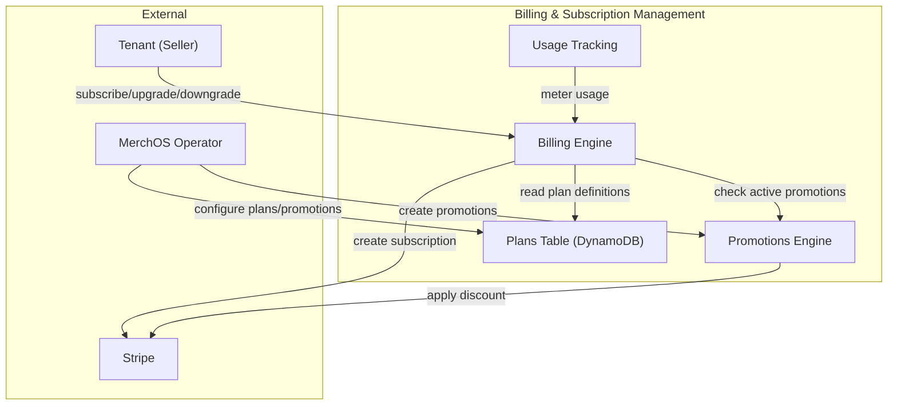
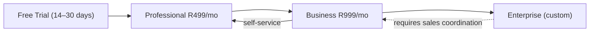
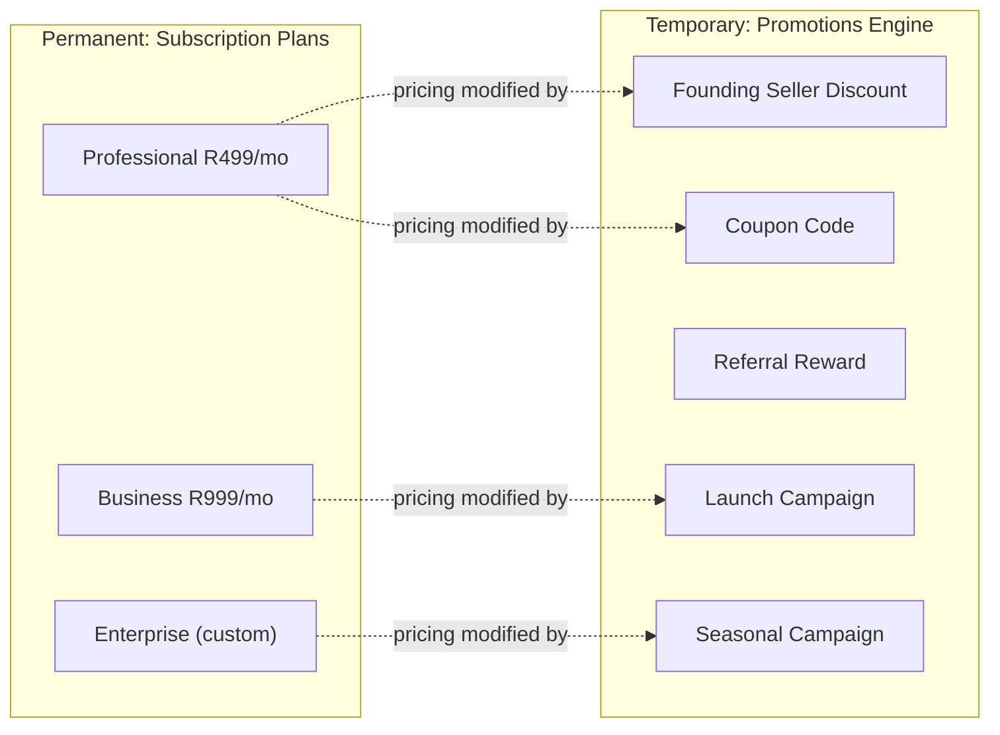

# MerchOS Platform — Design Document

## Overview

MerchOS is a production-grade, multi-tenant SaaS platform that transforms raw supplier data into marketplace-ready product listings across six sales channels: Takealot, Amazon, Makro Marketplace, Shopify, WooCommerce, and custom eCommerce websites.

The platform is AWS-native, serverless-first, API-first, and event-driven. All infrastructure is defined in AWS CDK (TypeScript). The system is designed to support 10,000 concurrent tenants with zero cross-tenant data leakage, 99.9% monthly availability on all tenant-facing APIs, and a fully automated product lifecycle from raw upload to published listing.

### Key Design Principles

- **Serverless-first**: Lambda + Step Functions + EventBridge handle all compute; no containers unless Lambda cannot satisfy the workload.
- **Event-driven decoupling**: Subsystems communicate exclusively through EventBridge events for async operations; no direct synchronous coupling between subsystems.
- **Tenant isolation by partition**: DynamoDB PK=TenantID on every table; S3 prefixes scoped to tenantId; IAM conditions enforce tenant context.
- **AI-assist, human-approve**: Bedrock generates all AI output; deterministic engines (Compliance, Taxonomy) make pass/fail decisions; humans approve AI recommendations.
- **Config-driven rules**: Compliance rules and channel taxonomies are stored as DynamoDB/S3 config, updateable without deployment.
- **CDK per-subsystem stacks**: Independent deployability with shared networking and security primitives from a foundation stack.


---

## Architecture

### High-Level System Diagram

```
┌─────────────────────────────────────────────────────────────────────────────────┐
│                              MERCH OS PLATFORM                                  │
│                                                                                 │
│  ┌──────────────────┐      ┌──────────────────┐      ┌──────────────────────┐  │
│  │   Sellers         │      │   Admin          │      │  External            │  │
│  │   Dashboard      │      │   Dashboard      │      │  Integrations        │  │
│  │ (Next.js/Amplify)│      │ (Next.js/Amplify)│      │ (Shopify/WooComm.)  │  │
│  └────────┬─────────┘      └────────┬─────────┘      └──────────┬───────────┘  │
│           │                         │                            │              │
│           └─────────────────────────┼────────────────────────────┘              │
│                                     │                                           │
│                         ┌───────────▼───────────┐                              │
│                         │   API Gateway v2       │                              │
│                         │   (REST /v1/*,         │                              │
│                         │    JWT Auth, Rate Limit)│                             │
│                         └───────────┬────────────┘                             │
│                                     │                                           │
│              ┌──────────────────────┼──────────────────────┐                   │
│              │              Lambda Router / Handler Layer   │                   │
│              │  ┌──────────────┐  ┌──────────────┐  ┌────────────────┐        │
│              │  │  Auth Lambda │  │  Product API │  │  Inventory API │        │
│              │  │  (Cognito)   │  │  Lambda      │  │  Lambda        │        │
│              │  └──────────────┘  └──────────────┘  └────────────────┘        │
│              └─────────────────────────────────────────────────────────        │
│                                     │                                           │
│                         ┌───────────▼───────────┐                              │
│                         │   EventBridge Bus      │                              │
│                         │   (merch-os-events)    │                              │
│                         └───────────┬────────────┘                             │
│                                     │                                           │
│   ┌───────────┐  ┌──────────────┐  ┌▼────────────┐  ┌──────────────────────┐  │
│   │ Ingestion │  │ Enrichment   │  │ Compliance  │  │ Marketplace Output   │  │
│   │ Pipeline  │  │ Engine       │  │ Engine      │  │ Engine               │  │
│   │(Step Fns) │  │ (Step Fns)   │  │ (Lambda)    │  │ (Step Fns / Lambda)  │  │
│   └─────┬─────┘  └──────┬───────┘  └──────┬──────┘  └──────────────────────┘  │
│         │               │                  │                                   │
│   ┌─────▼───────────────▼──────────────────▼────────────────────────────┐     │
│   │                    STORAGE LAYER                                     │     │
│   │  DynamoDB (Products/Tenants/Inventory)  OpenSearch  S3  ElastiCache │     │
│   └──────────────────────────────────────────────────────────────────────┘     │
└─────────────────────────────────────────────────────────────────────────────────┘
```

### Data Flow — Product Ingestion to Publication

```
Seller Uploads File
       │
       ▼
S3 (raw-uploads/{tenantId}/)
       │  S3 Event
       ▼
Ingestion Lambda (validate + AV scan)
       │
       ▼
Step Functions — Ingestion Workflow
  ├── Textract (PDFs)
  ├── Rekognition (images)
  ├── Bedrock (attribute extraction)
  └── Canonical Product → DynamoDB
       │ EventBridge: product.ingested
       ▼
Step Functions — Enrichment Workflow
  ├── Bedrock: titles / descriptions / keywords per channel
  ├── Bedrock: language detection + translation
  ├── Confidence scoring
  └── Low-confidence → REVIEW queue
       │ EventBridge: product.enriched
       ▼
Category Mapping Lambda
  ├── Bedrock: top-3 category recommendations
  └── Taxonomy deterministic validation
       │
       ▼
Compliance Engine Lambda
  ├── Rule engine per channel (deterministic)
  └── Validation report → DynamoDB
       │ EventBridge: compliance.passed / compliance.failed
       ▼
Marketplace Output Step Function
  ├── CSV generation per channel
  ├── Schema validation
  ├── S3 export storage
  └── Optional: direct Shopify/WooCommerce API publish
       │ EventBridge: product.exported / listing.published
       ▼
Seller Dashboard notified (in-app + email)
```


---

## Components and Interfaces

### 1. Multi-Tenant Foundation

**Responsibility**: Tenant lifecycle management, data isolation enforcement, and tenant-scoped resource provisioning.

**AWS Services**: Cognito (dedicated tenant user pool), DynamoDB (Tenants table), EventBridge, Lambda, IAM.

**Lambda Functions**:
- `tenant-registration-fn` — creates tenant record, provisions DynamoDB namespaces, emits `tenant.created` event.
- `tenant-suspension-fn` — invoked by admin API; updates tenant status, revokes Cognito tokens, emits `tenant.suspended`.
- `tenant-deletion-fn` — Step Functions workflow trigger; orchestrates data purge across all storage systems.
- `tenant-auth-authorizer-fn` — Lambda authorizer for API Gateway; validates JWT and injects TenantID into request context.

**DynamoDB Tables**:
- `Tenants` table — PK: `TENANT#<tenantId>`, SK: `METADATA`. Stores plan, status, createdAt, contactEmail, KMS key ARN.

**Tenant Isolation Enforcement**:
- All DynamoDB operations use `ConditionExpression: TenantID = :callerTenantId`.
- S3 key prefix policy enforced via IAM condition: `s3:prefix` must start with `${aws:PrincipalTag/TenantID}/`.
- Lambda authorizer injects `tenantId` header; downstream Lambdas reject requests where the header is absent.

**EventBridge Events Emitted**: `tenant.created`, `tenant.suspended`, `tenant.reactivated`, `tenant.deleted`.

---

### 2. Authentication and Authorisation

**Responsibility**: User identity, JWT issuance, RBAC enforcement, MFA, SAML federation.

**AWS Services**: Cognito (2 user pools: tenant pool + admin pool), Lambda (post-confirmation trigger, pre-token trigger), API Gateway Lambda Authorizer, Secrets Manager.

**Cognito Pools**:
- `merch-os-tenant-pool` — Seller users. Custom attributes: `tenantId`, `role` (Owner / Admin / Editor / Viewer). SAML IdP federation enabled for Enterprise tenants.
- `merch-os-admin-pool` — MerchOS operator users only. MFA required. Separate domain and app client.

**Lambda Functions**:
- `cognito-post-confirmation-fn` — writes user record to DynamoDB, assigns default Viewer role.
- `cognito-pre-token-fn` — injects `tenantId` and `role` claims into JWT.
- `api-authorizer-fn` — API Gateway Lambda authorizer; validates JWT, checks token expiry, returns IAM allow/deny policy with `tenantId` context.
- `account-lockout-fn` — triggered by Cognito failed-authentication events; counts failures; locks account after 5 failures in 10 minutes; sends SES email.

**RBAC Matrix**:

| Action | Owner | Admin | Editor | Viewer |
|--------|-------|-------|--------|--------|
| Manage users / roles | ✓ | ✗ | ✗ | ✗ |
| Connect channel integrations | ✓ | ✓ | ✗ | ✗ |
| Approve AI attributes | ✓ | ✓ | ✓ | ✗ |
| Upload products | ✓ | ✓ | ✓ | ✗ |
| View all products | ✓ | ✓ | ✓ | ✓ |
| Export listings | ✓ | ✓ | ✓ | ✗ |
| Billing management | ✓ | ✗ | ✗ | ✗ |

**JWT Configuration**: Access token TTL 60 minutes; refresh token TTL 30 days. Algorithm RS256.

---

### 3. Product Data Ingestion Pipeline

**Responsibility**: Accept raw supplier uploads (images, PDFs, URLs, ZIP archives), validate, scan, extract, and produce a canonical Product record.

**AWS Services**: S3, Lambda, Step Functions, SQS, Textract, Rekognition, Bedrock, DynamoDB, EventBridge, Lambda Layers (ClamAV antivirus).

**Lambda Functions**:
- `ingestion-trigger-fn` — triggered by S3 `ObjectCreated` event; validates file type/size; enqueues job to SQS.
- `ingestion-av-scan-fn` — runs ClamAV Lambda layer; quarantines infected files to `quarantine/{tenantId}/` S3 prefix.
- `ingestion-pdf-fn` — calls Textract `StartDocumentAnalysis`; extracts tables, key-value pairs, raw text.
- `ingestion-image-fn` — calls Rekognition `DetectLabels` + `DetectText`; extracts product labels and visible text.
- `ingestion-url-fn` — fetches URL via HTTP; extracts structured data using Bedrock (scraping/parsing prompt).
- `ingestion-merge-fn` — merges multi-source attribute sets; conflict resolution: most-recent-source wins.
- `ingestion-canonicalise-fn` — transforms merged attributes into canonical Product schema; writes to DynamoDB.

**Step Functions Workflow — IngestionWorkflow**:
```
StartIngestion
  → ValidateAndScan (Parallel)
      ├── FileTypeValidation
      └── AntivirusScan
  → ExtractContent (Choice by fileType)
      ├── PDFTextract
      ├── ImageRekognition
      ├── URLFetch
      └── ZIPUnpackAndFanOut (Map state)
  → MergeAttributes
  → CanonicaliseProduct
  → WriteToDatabase
  → EmitIngestionComplete
```

**API Endpoints**:
- `POST /v1/ingestion/upload` — presigned S3 URL for direct browser-to-S3 upload.
- `POST /v1/ingestion/url` — submit URL for ingestion.
- `GET /v1/ingestion/jobs/{jobId}` — poll job status.

**SQS Queues**:
- `ingestion-jobs-queue` — standard queue, visibility timeout 6 minutes, DLQ after 3 failures.
- `ingestion-dlq` — DLQ for failed ingestion jobs; triggers operator alert.


---

### 4. AI Enrichment Engine

**Responsibility**: Generate marketplace-optimised titles, descriptions, keywords, and confidence-scored attributes per channel using Bedrock; detect language; translate content; route low-confidence items to review queue.

**AWS Services**: Step Functions, Lambda, Bedrock, DynamoDB, SQS, EventBridge.

**Lambda Functions**:
- `enrichment-attribute-fn` — calls Bedrock Converse API with attribute extraction prompt; generates structured attribute JSON.
- `enrichment-title-fn` — per-channel title generation (respects character limits: Takealot 120, Amazon 200, Makro 150, Shopify 255, WooCommerce 120).
- `enrichment-description-fn` — per-channel description generation in channel-preferred format.
- `enrichment-keywords-fn` — generates 5–10 SEO keywords per channel.
- `enrichment-language-fn` — Bedrock language detection; returns ISO 639-1 language code.
- `enrichment-translation-fn` — Bedrock translation; accepts source text, source lang, target lang; returns translated text.
- `enrichment-confidence-fn` — aggregates attribute confidence scores; flags attributes < 0.70 for review.
- `enrichment-review-router-fn` — writes low-confidence Product to `review-queue` SQS topic; emits `product.review_required` event.

**Step Functions Workflow — EnrichmentWorkflow**:
```
StartEnrichment
  → DetectLanguage
  → ExtractAttributes (includes confidence scoring)
  → GenerateChannelContent (Map over 6 channels in parallel)
      ├── GenerateTitle
      ├── GenerateDescription
      └── GenerateKeywords
  → TranslateIfRequired (Choice: source language ≠ channel language)
  → AssessConfidenceScores
  → RouteToReviewOrAdvance (Choice: any score < 0.70 → REVIEW, else → CategoryMapping)
  → UpdateProductRecord
  → EmitEnrichmentComplete
```

**Bedrock Model Selection**: Anthropic Claude 3 Sonnet for attribute extraction and content generation; AWS Titan Text for keyword generation (lower cost for high-volume keyword tasks).

**Enrichment Layer Storage**: AI-generated values stored under `enrichmentLayer` field in DynamoDB, separate from `tenantSuppliedAttributes`. Tenant-supplied values are immutable until explicit Tenant approval.

**API Endpoints**:
- `POST /v1/products/{productId}/enrich` — trigger manual re-enrichment.
- `GET /v1/products/{productId}/enrichment` — retrieve enrichment layer with confidence scores.
- `POST /v1/products/{productId}/attributes/{attributeKey}/approve` — Tenant approval of AI attribute.

---

### 5. Image Processing Pipeline

**Responsibility**: Background removal, per-channel resizing, content moderation, watermark-free Hero Image generation, S3 storage, CloudFront delivery.

**AWS Services**: Lambda, Rekognition, S3, CloudFront, SQS, EventBridge.

**Lambda Layers**:
- `sharp-layer` — Node.js Sharp library for image manipulation (resize, crop, background fill, format conversion).
- `heic-convert-layer` — HEIC to JPEG/PNG conversion.

**Lambda Functions**:
- `image-ingest-fn` — validates format (JPEG/PNG/WEBP/HEIC), validates size, enqueues to image processing queue.
- `image-background-removal-fn` — calls Rekognition `DetectLabels` to get subject bounding box; crops subject; composites onto 255,255,255 white background using Sharp.
- `image-resize-fn` — per-channel resize/crop. Preserves aspect ratio with white padding. Flags upscaled images.
- `image-moderation-fn` — calls Rekognition `DetectModerationLabels`; quarantines images with NUDITY / VIOLENCE / DRUGS classifications above 0.80 confidence.
- `image-channel-packager-fn` — assembles per-channel image set; writes all variants to S3; records S3 keys in DynamoDB Product record.
- `image-signed-url-fn` — generates CloudFront signed URL (TTL 1 hour) for Seller Dashboard previews.

**Per-Channel Specifications**:

| Channel | Min Resolution | Max File Size | Formats |
|---------|---------------|---------------|---------|
| Takealot | 1000×1000 px | 5 MB | JPEG |
| Amazon | 1600×1600 px | 10 MB | JPEG |
| Makro | 800×800 px | 3 MB | JPEG |
| Shopify | 2048×2048 px | 20 MB | JPEG/PNG |
| WooCommerce | 800×800 px | 3 MB | JPEG/PNG |
| Custom | 1200×1200 px | 10 MB | JPEG/PNG |

**S3 Bucket Structure**:
```
merch-os-assets/
  {tenantId}/
    images/
      source/   {imageId}_original.{ext}
      processed/
        takealot/   {imageId}_1000x1000.jpg
        amazon/     {imageId}_1600x1600.jpg
        makro/      {imageId}_800x800.jpg
        shopify/    {imageId}_2048x2048.jpg
        woocommerce/{imageId}_800x800.jpg
    quarantine/   {imageId}_quarantined_{timestamp}
```

**API Endpoints**:
- `POST /v1/images/upload` — presigned S3 URL.
- `GET /v1/images/{imageId}` — retrieve image metadata and per-channel S3 keys.
- `GET /v1/images/{imageId}/url/{channel}` — get CloudFront signed URL for channel-specific image.


---

### 6. Category Mapping Engine

**Responsibility**: Maintain channel taxonomies, recommend categories via Bedrock, validate against deterministic taxonomy rules, enforce leaf-node selection.

**AWS Services**: Lambda, Bedrock, DynamoDB, OpenSearch, EventBridge, S3 (taxonomy JSON storage), EventBridge Scheduler (weekly refresh).

**Lambda Functions**:
- `taxonomy-refresh-fn` — fetches current taxonomy from each channel's public source; stores full taxonomy JSON in S3; indexes leaf nodes in OpenSearch; invalidates DynamoDB taxonomy cache.
- `category-recommend-fn` — calls Bedrock with product attributes + taxonomy context; returns top-3 category candidates with confidence scores.
- `category-validate-fn` — deterministic validation: checks selected node exists in current taxonomy and is a leaf node.
- `category-search-fn` — OpenSearch query across taxonomy index; returns nodes matching keyword; sub-500ms response.
- `category-revalidate-fn` — triggered by taxonomy refresh event; re-validates all products with affected taxonomy nodes.

**Taxonomy Storage**:
- Full taxonomy JSON: `s3://merch-os-config/{channel}/taxonomy/taxonomy_{yyyyMMdd}.json`
- Leaf-node OpenSearch index: `taxonomy-{channel}-{yyyyMMdd}` with fields: `nodeId`, `path`, `displayName`, `isLeaf`, `parentId`.

**Category Mapping DynamoDB Record** (stored within Product record under `categoryMappings`):
```json
{
  "channelId": "takealot",
  "recommendedNodes": [
    {"nodeId": "electronics/laptops", "confidence": 0.92},
    {"nodeId": "electronics/computers", "confidence": 0.78},
    {"nodeId": "electronics/tablets", "confidence": 0.55}
  ],
  "confirmedNodeId": "electronics/laptops",
  "confirmedBy": "user:{userId}",
  "confirmedAt": "2025-01-15T10:30:00Z",
  "taxonomyVersion": "2025-01-14"
}
```

**API Endpoints**:
- `GET /v1/categories/{channel}/search?q={keyword}` — keyword search.
- `GET /v1/categories/{channel}/tree` — full taxonomy tree.
- `POST /v1/products/{productId}/categories/{channel}` — confirm category selection.
- `POST /v1/admin/taxonomy/refresh/{channel}` — operator-triggered manual refresh.

---

### 7. Marketplace Output Engine

**Responsibility**: Generate channel-specific CSV and JSON exports, validate against channel schemas, store in S3, support direct Shopify/WooCommerce API publishing.

**AWS Services**: Step Functions, Lambda, S3, DynamoDB, SQS, EventBridge, Secrets Manager (OAuth tokens).

**Lambda Functions**:
- `export-orchestrator-fn` — validates product is in EXPORT_READY state; checks all channels have confirmed categories; triggers export Step Functions.
- `takealot-csv-fn` — generates Takealot bulk upload CSV; validates TSIN eligibility, barcode, lead time fields.
- `amazon-csv-fn` — generates Amazon flat-file CSV; validates ASIN/UPC, Browse Node, fulfilment method.
- `makro-csv-fn` — generates Makro bulk upload CSV.
- `shopify-csv-fn` — generates Shopify product import CSV including variant columns.
- `woocommerce-csv-fn` — generates WooCommerce product import CSV.
- `custom-json-fn` — generates channel-agnostic JSON export.
- `export-schema-validator-fn` — validates generated CSV/JSON against channel schema (JSON Schema validation); blocks export on failure.
- `shopify-publish-fn` — uses Shopify Admin API (OAuth) to create/update products directly.
- `woocommerce-publish-fn` — uses WooCommerce REST API (OAuth) to create/update products directly.
- `export-storage-fn` — writes validated exports to `s3://merch-os-exports/{tenantId}/{channel}/{productId}_{timestamp}.csv`.

**Step Functions Workflow — ExportWorkflow**:
```
StartExport
  → ValidateExportReadiness (check lifecycle state + category confirmed)
  → GenerateChannelExports (Parallel over requested channels)
      ├── TakealotCSV → ValidateSchema
      ├── AmazonCSV → ValidateSchema
      ├── MakroCSV → ValidateSchema
      ├── ShopifyCSV → ValidateSchema (or direct publish if OAuth connected)
      ├── WooCommerceCSV → ValidateSchema (or direct publish if OAuth connected)
      └── CustomJSON → ValidateSchema
  → StoreExports
  → UpdateProductLifecycle → PUBLISHED
  → EmitExportComplete
```

**Export Retention**: 90 days in `merch-os-exports` S3 bucket with lifecycle policy to Glacier after 90 days.

**API Endpoints**:
- `POST /v1/products/{productId}/export` — trigger export for specified channels.
- `GET /v1/exports/{exportId}` — retrieve export status and S3 download URL.
- `GET /v1/exports?productId={id}&channel={ch}` — list exports.
- `POST /v1/integrations/shopify/connect` — initiate Shopify OAuth flow.
- `POST /v1/integrations/woocommerce/connect` — initiate WooCommerce OAuth flow.


---

### 8. Inventory Management

**Responsibility**: SKU stock ledger, multi-warehouse tracking, supplier feed polling, WhatsApp image stock updates, channel availability synchronisation.

**AWS Services**: Lambda, DynamoDB, SQS, EventBridge, EventBridge Scheduler, Step Functions (WhatsApp ingestion), SNS.

**Lambda Functions**:
- `inventory-update-fn` — processes stock updates from all sources; validates non-negative available quantity; updates DynamoDB atomically using conditional writes.
- `inventory-feed-poller-fn` — invoked by EventBridge Scheduler at tenant-configured intervals (min 15 min); fetches supplier feed URL; parses CSV/JSON; enqueues reconciliation.
- `inventory-reconcile-fn` — compares feed quantities against on-hand; generates reconciliation report; applies delta updates.
- `inventory-channel-sync-fn` — triggered by DynamoDB Streams on Inventory table; updates channel availability for all connected channels when available qty changes.
- `inventory-reservation-fn` — decrements available qty on order received; releases reservation on cancellation; enforces non-negative constraint.
- `inventory-alert-fn` — triggered by DynamoDB Streams; detects qty = 0 transitions; emits `inventory.stockout` EventBridge event; notifies tenant via SES.
- `inventory-whatsapp-router-fn` — receives routed Ingestion Pipeline result from WhatsApp image processing; extracts SKU+qty; routes to `inventory-update-fn`.

**DynamoDB Design — Inventory Table**:
- PK: `TENANT#<tenantId>`, SK: `SKU#<sku>#WAREHOUSE#<warehouseId>`
- Attributes: `onHand`, `reserved`, `available` (derived: onHand - reserved), `warehouseId`, `updatedAt`
- GSI1: PK `SKU#<sku>` — look up all warehouses for a SKU.

**Inventory Transaction Ledger**:
- Separate DynamoDB table: `InventoryTransactions`
- PK: `TENANT#<tenantId>`, SK: `TXN#<timestamp>#<txnId>` (time-sortable)
- Immutable append-only. Fields: `actor`, `source`, `deltaQty`, `previousQty`, `newQty`, `warehouseId`, `orderId`.

**API Endpoints**:
- `GET /v1/inventory` — list all SKUs with stock levels.
- `PUT /v1/inventory/{sku}` — manual stock update.
- `POST /v1/inventory/import` — CSV bulk import.
- `GET /v1/inventory/{sku}/transactions` — ledger history.
- `POST /v1/inventory/feeds` — configure supplier feed URL and polling interval.

---

### 9. Compliance Validation Engine

**Responsibility**: Deterministic rule-based validation of product listings against channel-specific requirements. No AI in pass/fail decisions. Config-driven rule sets updatable without deployment.

**AWS Services**: Lambda, DynamoDB (rule configuration), S3 (rule set JSON), EventBridge, SQS.

**Lambda Functions**:
- `compliance-validate-fn` — loads rule set for each channel from DynamoDB/S3; evaluates Product Listing against all rules; generates validation report.
- `compliance-rule-loader-fn` — caches rule set in Lambda memory (5-minute TTL); invalidated on rule set update event.
- `compliance-report-fn` — writes validation report to DynamoDB; emits `compliance.passed` or `compliance.failed` EventBridge event.

**Rule Set Structure** (stored as JSON in S3, referenced from DynamoDB):
```json
{
  "channelId": "amazon",
  "version": "2025-01-15",
  "rules": [
    {
      "ruleId": "TITLE_MAX_LENGTH",
      "field": "listing.title",
      "constraint": { "type": "maxLength", "value": 200 },
      "violationCode": "AMZN-001",
      "remediation": "Shorten title to 200 characters or fewer."
    },
    {
      "ruleId": "ASIN_REQUIRED",
      "field": "listing.asin",
      "constraint": { "type": "required" },
      "violationCode": "AMZN-002",
      "remediation": "Provide a valid ASIN or UPC barcode."
    }
  ]
}
```

**Validation Report Structure**:
```json
{
  "productId": "...",
  "channelId": "amazon",
  "ruleSetVersion": "2025-01-15",
  "result": "FAIL",
  "violations": [
    {
      "ruleId": "TITLE_MAX_LENGTH",
      "violationCode": "AMZN-001",
      "fieldValue": "...",
      "remediation": "Shorten title to 200 characters or fewer."
    }
  ],
  "evaluatedAt": "2025-01-15T11:00:00Z"
}
```

**Rule Update Flow**: Admin edits rule set in Admin Dashboard → `PUT /v1/admin/compliance/rules/{channel}` → Lambda writes new JSON to S3 + updates DynamoDB config record → emits `compliance.rules_updated` EventBridge event → `compliance-rule-loader-fn` caches are invalidated. Changes effective within 5 minutes.

**API Endpoints**:
- `POST /v1/products/{productId}/validate` — trigger manual validation.
- `GET /v1/products/{productId}/compliance` — get validation reports per channel.
- `GET /v1/admin/compliance/rules/{channel}` — get current rule set.
- `PUT /v1/admin/compliance/rules/{channel}` — update rule set.


---

### 10. Billing and Subscription Management

**Responsibility**: Stripe subscription lifecycle, plan enforcement, usage metering, PDF invoice generation, prorated upgrades/downgrades, free trial provisioning and conversion.

**AWS Services**: Lambda, DynamoDB, SQS, EventBridge, SES, S3 (PDF invoices), Secrets Manager (Stripe API key).

#### Billing Subsystem Context



**Lambda Functions**:
- `billing-stripe-webhook-fn` — receives Stripe webhook events (invoice.payment_succeeded, invoice.payment_failed, customer.subscription.updated); processes subscription lifecycle transitions including trial expiry.
- `billing-usage-meter-fn` — triggered by EventBridge for every AI enrichment call, image processing call, CSV export; increments usage counters in DynamoDB with atomic updates.
- `billing-limit-enforcer-fn` — reads current plan limits (including trial-specific limits when `planId` is `"trial"`) and usage from DynamoDB; returns ALLOWED or BLOCKED.
- `billing-plan-change-fn` — handles upgrade/downgrade via Stripe API; applies proration; updates plan record in DynamoDB.
- `billing-trial-provision-fn` — provisions new tenant with Free Trial status; sets configurable expiry date from `CONFIG#trial`; applies trial-specific usage limits.
- `billing-trial-conversion-fn` — triggered on trial expiry; converts to paid Professional subscription (if payment method on file) or suspends access pending payment method collection.
- `billing-invoice-pdf-fn` — triggered by `invoice.payment_succeeded` Stripe webhook; generates PDF using PDFKit Lambda layer; stores in `s3://merch-os-invoices/{tenantId}/{invoiceId}.pdf`; retains for 3 years.
- `billing-alert-fn` — monitors usage at 80% and 100% thresholds; sends SES email to tenant Owner.
- `billing-payment-retry-fn` — EventBridge Scheduler triggered at day+3 and day+7 after payment failure; retries Stripe charge; downgrades to read-only on day+7 failure.

**Integration Point — Promotions Engine:** Before creating a Stripe subscription (during trial conversion or new subscription creation), the Billing Engine checks active promotions via the Promotions Engine. If an applicable promotion exists for the target plan, the Billing Engine applies the corresponding Stripe Coupon to the subscription at creation time. This ensures promotional pricing is applied without altering plan entitlements or usage limits.

**DynamoDB Design — Billing Table**:
- PK: `TENANT#<tenantId>`, SK: `SUBSCRIPTION#current`
- Attributes: `planId`, `stripeCustomerId`, `stripeSubscriptionId`, `billingCycle`, `currentPeriodStart`, `currentPeriodEnd`, `status`
- SK: `USAGE#<yyyyMM>` — monthly usage counters (`enrichmentCalls`, `imageCalls`, `csvExports`)
- SK: `INVOICE#<invoiceId>` — invoice records with S3 PDF key

#### Feature Matrix

The comprehensive Feature Matrix defines entitlements and capabilities across all subscription tiers, including the Free Trial acquisition period. All plan definitions are stored in the DynamoDB `Plans` table and are updatable by operators without code deployment.

| Feature | Free Trial | Professional (R499/mo) | Business (R999/mo) | Enterprise (custom) |
|---------|-----------|------------------------|--------------------|--------------------|
| Products | 500 | 10,000 | 50,000 | Unlimited (contract) |
| Channels | 2 | 4 | 6 | 6 |
| Team Members | 2 | 5 | 25 | Unlimited (contract) |
| AI Enrichment Calls/mo | 500 | 10,000 | 100,000 | Custom (contract) |
| Image Processing Calls/mo | 200 | 5,000 | 50,000 | Custom (contract) |
| CSV Exports/mo | 10 | 100 | 500 | Custom (contract) |
| Priority Support | ✗ | ✗ | ✓ | ✓ |
| Dedicated Account Manager | ✗ | ✗ | ✗ | ✓ |
| SAML SSO | ✗ | ✗ | ✓ | ✓ |
| Custom Integrations | ✗ | ✗ | ✗ | ✓ |
| SLA Guarantee | — | 99.9% | 99.9% | Custom (up to 99.99%) |

*Notes:*
- *Professional is the visually highlighted/recommended tier in pricing presentation contexts.*
- *Enterprise entitlements are defined per contract and stored in tenant-level configuration rather than hardcoded.*
- *Free Trial grants access to Professional Plan features with reduced usage limits for 14–30 days (configurable).*
- *All plan definitions reside in the DynamoDB Plans table and are updatable by operators without code deployment.*

#### Subscription Plan Structure

MerchOS defines exactly three Subscription Plans:

1. **Professional (R499/month)** — For independent sellers managing multi-channel e-commerce. This is the recommended entry-level paid plan, visually highlighted in pricing UI contexts.
2. **Business (R999/month)** — For teams, agencies, and high-volume sellers requiring higher limits and priority support.
3. **Enterprise (custom pricing)** — For large retailers, manufacturers, and distributors. Entitlements are defined per contract and stored in per-tenant configuration rather than hardcoded. Pricing is determined through sales coordination.

**Configuration-driven plan management:** All plan definitions are stored in the DynamoDB `Plans` table. Operators can update plan names, pricing, entitlements, and limits without code deployment. The Billing Engine reads plan definitions from this table at runtime.

**DynamoDB Plans Table — Data Model Examples:**

Professional Plan:
```json
{
  "PK": "PLAN#professional",
  "SK": "METADATA",
  "planId": "professional",
  "name": "Professional",
  "priceMonthly": 49900,
  "currency": "ZAR",
  "description": "For independent sellers managing multi-channel e-commerce",
  "highlighted": true,
  "entitlements": {
    "maxProducts": 10000,
    "maxChannels": 4,
    "maxUsers": 5,
    "aiEnrichmentCallsPerMonth": 10000,
    "imageProcessingCallsPerMonth": 5000,
    "csvExportsPerMonth": 100
  },
  "stripePriceId": "price_professional_monthly",
  "isActive": true,
  "sortOrder": 1
}
```

Business Plan:
```json
{
  "PK": "PLAN#business",
  "SK": "METADATA",
  "planId": "business",
  "name": "Business",
  "priceMonthly": 99900,
  "currency": "ZAR",
  "description": "For teams, agencies, and high-volume sellers",
  "highlighted": false,
  "entitlements": {
    "maxProducts": 50000,
    "maxChannels": 6,
    "maxUsers": 25,
    "aiEnrichmentCallsPerMonth": 100000,
    "imageProcessingCallsPerMonth": 50000,
    "csvExportsPerMonth": 500
  },
  "stripePriceId": "price_business_monthly",
  "isActive": true,
  "sortOrder": 2
}
```

Enterprise Plan:
```json
{
  "PK": "PLAN#enterprise",
  "SK": "METADATA",
  "planId": "enterprise",
  "name": "Enterprise",
  "priceMonthly": null,
  "currency": "ZAR",
  "description": "For large retailers, manufacturers, and distributors",
  "highlighted": false,
  "entitlements": {
    "maxProducts": -1,
    "maxChannels": 6,
    "maxUsers": -1,
    "aiEnrichmentCallsPerMonth": -1,
    "imageProcessingCallsPerMonth": -1,
    "csvExportsPerMonth": -1
  },
  "stripePriceId": null,
  "customPricing": true,
  "isActive": true,
  "sortOrder": 3
}
```

*Note: `-1` denotes "unlimited / defined per contract". Enterprise entitlements are overridden per-tenant in the Tenants table based on individual contract terms.*

**API Endpoints**:
- `GET /v1/billing` — current plan, usage, next invoice.
- `POST /v1/billing/upgrade` — initiate plan upgrade.
- `POST /v1/billing/downgrade` — schedule plan downgrade.
- `GET /v1/billing/invoices` — list invoices.
- `GET /v1/billing/invoices/{invoiceId}/pdf` — signed S3 URL for PDF download.
- `POST /v1/admin/billing/credits` — operator manual credit adjustment.

#### Free Trial Strategy

The Free Trial is the **primary acquisition mechanism** for MerchOS, replacing low-cost entry plans. Rather than offering discounted subscription tiers, new tenants experience the full Professional Plan feature set with reduced usage limits during a configurable trial period.

**Trial provisioning:** On new tenant registration, the Billing Engine provisions a Free Trial by reading trial configuration from DynamoDB at runtime. The trial grants access to all Professional Plan *features* (AI enrichment, image processing, multi-channel export, inventory management) but enforces *reduced usage limits* that are distinct from the full Professional Plan entitlements.

**Configurable Trial Duration:** Trial duration supports values of 14 days or 30 days, stored in the platform configuration table (`CONFIG#trial`) and read at runtime — never hardcoded in application logic. Operators can adjust the default trial duration without code deployment.

**Reduced usage limits during trial** (distinct from full Professional Plan limits):

| Entitlement | Free Trial | Professional (full) |
|-------------|-----------|---------------------|
| Products | 500 | 10,000 |
| Channels | 2 | 4 |
| Team Members | 2 | 5 |
| AI Enrichment Calls/mo | 500 | 10,000 |
| Image Processing Calls/mo | 200 | 5,000 |
| CSV Exports/mo | 10 | 100 |

**Trial expiry behaviour:**
- **Payment method on file:** The Billing Engine auto-converts the tenant to a paid Professional Plan subscription. Stripe creates the first invoice and billing cycle begins immediately.
- **No payment method on file:** The Billing Engine suspends tenant access pending payment method collection. The dashboard displays a payment collection prompt; no data is deleted during suspension.

**DynamoDB — Free Trial Configuration (`CONFIG#trial`):**

```json
{
  "PK": "CONFIG#trial",
  "SK": "METADATA",
  "trialDurationDays": 14,
  "supportedDurations": [14, 30],
  "basePlanId": "professional",
  "trialEntitlements": {
    "maxProducts": 500,
    "maxChannels": 2,
    "maxUsers": 2,
    "aiEnrichmentCallsPerMonth": 500,
    "imageProcessingCallsPerMonth": 200,
    "csvExportsPerMonth": 10
  },
  "conversionBehaviour": "subscribe_or_suspend",
  "isActive": true
}
```

*Note: `trialDurationDays` is the current default. `supportedDurations` defines the set of valid values an operator may configure. `conversionBehaviour` of `subscribe_or_suspend` means: convert to paid subscription if payment method exists, otherwise suspend access.*

**Tenant Billing Record — During Trial:**

```json
{
  "PK": "TENANT#<tenantId>",
  "SK": "SUBSCRIPTION#current",
  "planId": "trial",
  "basePlanId": "professional",
  "status": "trialing",
  "trialStatus": "active",
  "trialStartedAt": "2025-01-20T00:00:00Z",
  "trialExpiresAt": "2025-02-03T00:00:00Z",
  "paymentMethodOnFile": false
}
```

*Note: `planId: "trial"` indicates the tenant is in trial status. `basePlanId: "professional"` identifies which plan's features are accessible (with reduced limits from `CONFIG#trial`). The `billing-limit-enforcer-fn` reads `trialEntitlements` from the trial configuration when `planId` is `"trial"`. On conversion, `planId` transitions to `"professional"` and full Professional Plan limits apply.*

#### Pricing Philosophy

- MerchOS is a **professional business platform** — pricing reflects the business value delivered through operational time savings, multi-channel automation, and AI-powered productivity improvements.
- The pricing objective is to **attract serious sellers** who derive measurable ROI from the platform, not to maximise low-value subscription volume.
- Customers subscribe because MerchOS **saves operational time** and improves productivity for their e-commerce operations across multiple channels.
- The tier structure starts at R499/month — there is no entry-level "hobby" tier. The Free Trial serves as the low-barrier acquisition mechanism.

#### Upgrade Path

The subscription upgrade path defines the linear progression for tenants from initial acquisition through to enterprise-level engagement:

**Free Trial → Professional → Business → Enterprise**

The **Free Trial is the primary acquisition mechanism** and entry point for all new Tenants. Every new seller begins with a configurable trial period (14–30 days) granting access to Professional Plan features at reduced usage limits. From there, tenants progress through paid tiers as their business needs grow.

**Upgrade transitions** follow the proration and entitlement unlock behaviour documented in the Billing Engine specification. When a tenant upgrades, their current billing period is prorated (credit for unused time on the current plan) and the new plan's entitlements are unlocked immediately. Usage limits reset to the higher plan's values at the moment of upgrade.

**Downgrade from Enterprise** requires MerchOS sales coordination. Enterprise contracts include custom entitlements, SLAs, and pricing defined per-contract. Transitioning away from these terms requires review and coordination through the MerchOS sales team to ensure proper contract wind-down and entitlement adjustment.

**Self-service downgrade** is available between Professional and Business. Tenants on the Business plan can downgrade to Professional through the dashboard without sales involvement. The downgrade takes effect at the end of the current billing period to avoid mid-cycle entitlement reduction.



**Upgrade/Downgrade Rules:**

| Transition | Mechanism | Billing |
|-----------|-----------|---------|
| Free Trial → Professional | Auto-convert on expiry (if payment method) or manual | First charge at period start |
| Professional → Business | Self-service via dashboard | Prorated credit + new charge |
| Business → Enterprise | Sales-coordinated | Custom invoice |
| Business → Professional | Self-service downgrade | Takes effect at period end |
| Enterprise → Business/Professional | Requires MerchOS sales coordination | Custom handling |

*Notes:*
- *Upgrades are immediate: entitlements unlock and prorated billing applies from the moment of upgrade.*
- *Self-service downgrades are deferred: the current plan remains active until the end of the billing period, then the lower plan takes effect.*
- *Enterprise downgrades always involve sales coordination due to custom contract terms, SLAs, and pricing arrangements.*
- *The Free Trial to Professional conversion is handled by `billing-trial-conversion-fn` as documented in the Free Trial Strategy section above.*

#### Promotions Engine

**Responsibility**: Manage temporary pricing modifications applied to Subscription Plans. Supports creation, activation, expiry, and application of promotional discounts via Stripe Coupons and Promotion Codes. The Promotions Engine is architecturally separate from Subscription Plan logic — promotions modify what a tenant pays temporarily without altering feature access, usage limits, or plan-level entitlements.

**AWS Services**: Lambda, DynamoDB (Promotions table), EventBridge, EventBridge Scheduler (expiry), Stripe (Coupons API).

**Lambda Functions**:
- `promotions-create-fn` — creates promotion record in DynamoDB; creates corresponding Stripe Coupon; sets mandatory expiry via EventBridge Scheduler.
- `promotions-apply-fn` — applies promotion to tenant's Stripe subscription; validates promotion is active and not expired; records application in billing record.
- `promotions-expire-fn` — triggered by EventBridge Scheduler at promotion expiry; removes Stripe discount; updates promotion status to EXPIRED.
- `promotions-list-fn` — returns active, scheduled, and expired promotions for operator dashboard.

**Promotion Types Supported**:

| Type | Description | Pricing Modification |
|------|-------------|---------------------|
| Founding Seller | Early adopter recognition | Percentage discount for defined period |
| Launch Campaign | Time-limited introductory pricing | Fixed or percentage discount |
| Referral Reward | Credit for referring new tenants | Fixed amount credit |
| Coupon Code | Redeemable promotional code | Percentage or fixed discount |
| Percentage Discount | General percentage reduction | Percentage off monthly fee |
| Fixed Amount Discount | Absolute amount reduction | Fixed ZAR amount off monthly fee |
| Seasonal Campaign | Event-tied promotions (e.g. Black Friday) | Percentage or fixed discount |

*Note: Every Promotion has a mandatory expiry date after which promotional pricing ceases to apply. There are no perpetual promotions — all pricing modifications are time-bound.*

*Important: The Founding Seller concept is preserved solely as a promotion type within the Promotions Engine. It is NOT a subscription plan, permanent pricing tier, or programme. Early adopter recognition is achieved through a time-limited percentage discount applied to an existing Subscription Plan.*

**DynamoDB Design — Promotions Table**:

| Key / Attribute | Value | Description |
|-----------------|-------|-------------|
| PK | `PROMO#<promotionId>` | Partition key — unique promotion identifier |
| SK | `METADATA` | Sort key — fixed value for the promotion record |
| `type` | `founding_seller` \| `launch_campaign` \| `referral_reward` \| `coupon_code` \| `percentage_discount` \| `fixed_amount_discount` \| `seasonal_campaign` | Promotion type from supported types |
| `name` | String | Human-readable promotion name |
| `discountType` | `percentage` \| `fixed` | How the discount is applied |
| `discountValue` | Number | Discount magnitude (percentage 0–100 or fixed amount in minor currency units) |
| `currency` | `ZAR` | Currency for fixed discounts |
| `startDate` | ISO 8601 timestamp | When the promotion becomes active |
| `expiryDate` | ISO 8601 timestamp | Mandatory expiry date |
| `status` | `DRAFT` \| `ACTIVE` \| `EXPIRED` | Current promotion lifecycle state |
| `maxRedemptions` | Number | Maximum number of tenants who can redeem |
| `currentRedemptions` | Number | Atomic counter of redemptions applied |
| `applicablePlans[]` | String array | Plan IDs this promotion applies to (e.g. `["professional", "business"]`) |
| `stripeCouponId` | String | Corresponding Stripe Coupon ID |

**GSI1 — Active Promotions by Expiry**:
- GSI1 PK: `STATUS#<status>` — enables querying all promotions with a given status
- GSI1 SK: `expiryDate` — sorts results by expiry date for efficient retrieval of soon-to-expire promotions

*Usage: Query GSI1 with PK = `STATUS#ACTIVE` to retrieve all active promotions ordered by expiry date. Used by `promotions-list-fn` and operator dashboard.*

**Promotion Record Example**:

```json
{
  "PK": "PROMO#founding-seller-2025",
  "SK": "METADATA",
  "promotionId": "founding-seller-2025",
  "type": "founding_seller",
  "name": "Founding Seller — 50% Off First 6 Months",
  "discountType": "percentage",
  "discountValue": 50,
  "currency": "ZAR",
  "startDate": "2025-02-01T00:00:00Z",
  "expiryDate": "2025-08-01T00:00:00Z",
  "status": "ACTIVE",
  "maxRedemptions": 100,
  "currentRedemptions": 34,
  "applicablePlans": ["professional", "business"],
  "stripeCouponId": "coup_founding2025",
  "createdBy": "admin:operator@merchos.co.za",
  "createdAt": "2025-01-15T10:00:00Z"
}
```

**API Endpoints**:

| Method | Path | Description | Access |
|--------|------|-------------|--------|
| `POST` | `/v1/admin/promotions` | Create a new promotion (status: DRAFT) | MerchOS Operator |
| `GET` | `/v1/admin/promotions` | List promotions with optional status filter (`?status=ACTIVE`) | MerchOS Operator |
| `PUT` | `/v1/admin/promotions/{promotionId}` | Update promotion details (only allowed when status is DRAFT) | MerchOS Operator |
| `DELETE` | `/v1/admin/promotions/{promotionId}` | Cancel/archive a promotion | MerchOS Operator |
| `POST` | `/v1/billing/promotions/apply` | Tenant applies a coupon code to their subscription | Tenant (Seller) |
| `GET` | `/v1/billing/promotions/active` | Tenant views active promotions on their subscription | Tenant (Seller) |

*Notes:*
- *Admin endpoints (`/v1/admin/promotions/*`) require the `platform:operator` or `platform:super_admin` role.*
- *Tenant endpoints (`/v1/billing/promotions/*`) are scoped to the authenticated tenant's subscription.*
- *The `PUT` endpoint only permits updates when promotion status is `DRAFT`. Once a promotion is `ACTIVE`, it cannot be modified — only cancelled via `DELETE`.*
- *The `POST /v1/billing/promotions/apply` endpoint validates: promotion exists, status is ACTIVE, expiry has not passed, `maxRedemptions` has not been reached, and the tenant's current plan is in `applicablePlans[]`.*

#### Billing Principles

The following architectural principles govern the relationship between Subscription Plans and Promotions within the Billing and Subscription Management subsystem:

1. **Separation of concerns** — Subscription Plans and Promotions are independent architectural concepts with separate storage, APIs, and lifecycles. Plans are managed through the Plans Table and Billing Engine; Promotions are managed through the Promotions Table and Promotions Engine. Neither subsystem depends on the other's internal state.

2. **Plans define entitlements** — A Subscription Plan determines feature access, usage limits, and operational capabilities for a tenant. The plan a tenant subscribes to dictates what they can do on the platform: how many products they can manage, how many channels they can connect, how many AI enrichment calls they can make, and which premium features (Priority Support, SAML SSO, Custom Integrations) they can access.

3. **Promotions modify pricing only** — A Promotion temporarily changes what a tenant pays without altering what they can do. No promotion — regardless of type (Founding Seller, Launch Campaign, Referral Reward, Coupon Code, Seasonal Campaign) — changes usage limits, feature gates, or plan-level entitlements. A tenant on the Professional Plan with a 50% Founding Seller discount has identical feature access and usage limits to a tenant on the Professional Plan paying full price.

4. **Independent lifecycles** — Plans follow: creation → subscription → renewal → upgrade → cancellation. Promotions follow: creation → activation → expiry. These lifecycles are decoupled. A promotion can expire without affecting the tenant's plan status; a plan can be upgraded without affecting active promotions (promotions re-evaluate applicability to the new plan independently).

5. **Configuration-driven** — Both plans and promotions are defined in DynamoDB configuration tables, modifiable by operators without code deployment. The Plans Table stores plan definitions, entitlements, and pricing. The Promotions Table stores promotion types, discount mechanics, and expiry rules. Neither requires Lambda redeployment or infrastructure changes to add new entries.

**Architectural Separation Diagram:**



**Summary principle:** Subscription plans define *what* a tenant gets (entitlements, limits). Promotions define *how much* a tenant pays temporarily (discounts, campaigns). A promotion never alters feature access or usage limits.

#### Configuration-Driven Extensibility

The Billing and Subscription Management subsystem is designed for runtime extensibility through configuration rather than code changes.

**Subscription Plans are not hardcoded.** The number of Subscription Plans is not fixed in application logic. Additional plans can be introduced at any time through configuration updates to the DynamoDB Plans table. The current three-tier structure (Professional, Business, Enterprise) is a business decision reflected in configuration — not an architectural constraint enforced by code.

**The Billing Engine is configuration-driven.** At runtime, the Billing Engine reads all plan definitions, entitlements, and usage limits from the DynamoDB Plans table. The `billing-limit-enforcer-fn`, `billing-plan-change-fn`, and `billing-trial-conversion-fn` Lambda functions resolve plan capabilities dynamically from configuration rather than relying on hardcoded plan identifiers or limit values. This means the Billing Engine automatically recognises and enforces any new plan added to the Plans table without modification.

**Adding a new Subscription Plan requires only a configuration entry.** To introduce a new plan (e.g., a future "Essentials" or "Agency" tier), an operator creates a new record in the DynamoDB Plans table with the plan's `planId`, `name`, `priceMonthly`, `entitlements`, and `stripePriceId`. No application code changes, Lambda redeployments, or infrastructure updates are required. The Billing Engine, Feature Matrix enforcement, and usage metering automatically operate against the new plan definition.

**The Promotions Engine is similarly configuration-driven.** New promotion types are supported through configuration rather than code changes. The `promotions-create-fn` reads supported promotion types and their validation rules from configuration. Adding a new promotion type (e.g., a "Partner Bundle" or "Volume Discount") requires only a configuration entry defining the type's discount mechanics, validation constraints, and applicable plans — no code deployment needed.

#### Tenant Billing Record

The Tenant Billing Record represents the current subscription state for a tenant, stored in DynamoDB with `PK: TENANT#<tenantId>`, `SK: SUBSCRIPTION#current`. The record structure varies depending on the tenant's subscription status.

**Active Subscription with Promotions:**

```json
{
  "PK": "TENANT#<tenantId>",
  "SK": "SUBSCRIPTION#current",
  "planId": "professional",
  "stripeCustomerId": "cus_xxx",
  "stripeSubscriptionId": "sub_xxx",
  "billingCycle": "monthly",
  "currentPeriodStart": "2025-02-01T00:00:00Z",
  "currentPeriodEnd": "2025-03-01T00:00:00Z",
  "status": "active",
  "trialStatus": null,
  "trialExpiresAt": null,
  "activePromotions": [
    {
      "promotionId": "founding-seller-2025",
      "appliedAt": "2025-02-01T00:00:00Z",
      "expiresAt": "2025-08-01T00:00:00Z"
    }
  ]
}
```

*Note: `activePromotions` is an array of currently applied promotions. Each entry references a promotion managed by the Promotions Engine. The `expiresAt` field indicates when the promotional pricing ceases — managed by the `promotions-expire-fn` EventBridge Scheduler trigger. Promotions modify pricing only; they do not alter `planId`, entitlements, or usage limits.*

**Trial Status:**

```json
{
  "PK": "TENANT#<tenantId>",
  "SK": "SUBSCRIPTION#current",
  "planId": "trial",
  "basePlanId": "professional",
  "status": "trialing",
  "trialStatus": "active",
  "trialStartedAt": "2025-01-20T00:00:00Z",
  "trialExpiresAt": "2025-02-03T00:00:00Z",
  "paymentMethodOnFile": false
}
```

*Note: `planId: "trial"` indicates the tenant is in trial status. `basePlanId: "professional"` identifies which plan's features are accessible (with reduced limits from `CONFIG#trial`). The `billing-limit-enforcer-fn` reads `trialEntitlements` from the trial configuration when `planId` is `"trial"`. On conversion, `planId` transitions to `"professional"` and full Professional Plan limits apply. `paymentMethodOnFile` determines conversion behaviour on trial expiry.*

#### Scope Boundaries

> **This documentation update is limited to Section 10 (Billing and Subscription Management) and directly related plan references in adjacent sections.**

The following boundaries apply to this architecture section:

1. **In scope:** Subscription Plan definitions, Free Trial strategy, Promotions Engine, Billing Engine, Feature Matrix, Upgrade Path, Pricing Philosophy, configuration-driven extensibility — all within Section 10.
2. **Out of scope — RBAC:** No modifications to the Role-Based Access Control documentation (Section 2: Authentication and Authorisation). The RBAC matrix, role definitions, and permission model remain unchanged.
3. **Out of scope — Non-billing APIs:** No modifications to API endpoint specifications beyond billing-specific endpoints (`/v1/billing/*`, `/v1/admin/billing/*`, `/v1/admin/promotions/*`). Product, ingestion, inventory, compliance, and marketplace APIs are unaffected.
4. **Out of scope — Authentication/Authorisation architecture:** No modifications to Cognito configuration, JWT handling, Lambda authorizers, or tenant isolation enforcement.
5. **Out of scope — Implementation artefacts:** This section documents architecture only. No implementation code, Lambda function source, infrastructure-as-code templates (CDK), or deployment scripts are included. Lambda function names and behaviours are documented for architectural reference — not as executable implementations.

*Traceability: All architectural decisions in this section trace to the approved business decisions documented in the Subscription & Billing Architecture Update requirements: consolidation to three subscription tiers, Free Trial as the acquisition mechanism, Promotions Engine replacing the Founding Seller programme, and architectural separation of plans from promotions.*

---

### 11. Seller Dashboard

**Responsibility**: React/Next.js web application for tenant product management, review queue, inventory, exports, and account settings.

**AWS Services**: Amplify (hosting + CI/CD), CloudFront, S3 (static assets), API Gateway (all data via REST API), Cognito (auth), OpenSearch (product search).

**Tech Stack**: Next.js 14 (App Router), TypeScript, Tailwind CSS, AWS Amplify Gen 2, React Query (data fetching/caching).

**Key Pages and Components**:
- `/dashboard` — product catalogue with lifecycle state indicators; recent activity feed.
- `/dashboard/products` — paginated/searchable product list (OpenSearch-backed, < 500ms).
- `/dashboard/products/{id}` — product detail: AI attributes with confidence scores; approve/override inline; per-channel compliance status.
- `/dashboard/review` — prioritised review queue; count badge; inline approve/reject.
- `/dashboard/inventory` — SKU list with stock levels; manual adjustment modal.
- `/dashboard/exports` — export history per channel; download links.
- `/dashboard/settings` — user management, RBAC assignment, webhook configuration, channel OAuth connections.
- `/dashboard/billing` — current plan usage meters; invoice history; upgrade CTA.

**Real-time Updates**: AWS AppSync or API Gateway WebSocket API for in-app notification delivery; new notification badge updates without page refresh.

**WCAG 2.1 AA Compliance**: Semantic HTML, ARIA labels on all interactive elements, keyboard navigation for all flows, 4.5:1 colour contrast ratio minimum.

**Performance Targets**: Initial product catalogue load < 3 seconds on broadband (10,000 products); search results < 500ms (100,000 products).

---

### 12. Admin Dashboard

**Responsibility**: MerchOS operator interface for platform health monitoring, tenant management, compliance rule editing, taxonomy refresh, audit log, and billing oversight.

**AWS Services**: Amplify, CloudFront, API Gateway (admin endpoints), Cognito (admin pool), CloudWatch (metrics data via API), OpenSearch (audit log queries).

**Tech Stack**: Next.js 14, TypeScript, Tailwind CSS, Recharts (metrics visualisation), AWS Amplify Gen 2.

**Key Pages**:
- `/admin/health` — real-time Lambda error rates, Step Functions failures, SQS depths, DynamoDB capacity, active tenant count (CloudWatch metrics via `/v1/admin/metrics`).
- `/admin/tenants` — searchable tenant list; suspend/reactivate/delete actions.
- `/admin/compliance/{channel}` — rule set editor (JSON schema-driven form); save triggers rule update within 5 min.
- `/admin/taxonomy` — per-channel taxonomy status; trigger manual refresh button.
- `/admin/audit-log` — filterable audit log (by tenant, event type, actor, date range); OpenSearch-backed, < 2 second query for 90-day range.
- `/admin/billing` — MRR by plan, payment status per tenant, manual credit form.
- `/admin/alerts` — Lambda functions with error rate > 1% in last 5 minutes highlighted.

**Access Control**: Admin Cognito pool; MFA required; all admin API endpoints validate `custom:role = operator` claim.


---

## Data Models

### Canonical Product Schema

```typescript
interface Product {
  // Identity
  productId: string;           // UUID v4
  tenantId: string;            // Tenant partition key
  sku: string;                 // Unique per tenant

  // Core content
  title: string;               // Default language title
  description: string;         // Default language description
  brand: string;
  attributes: Record<string, string | number | boolean>;  // key-value map

  // Images
  images: ImageReference[];    // Ordered; first = Hero Image

  // Variants
  variants: Variant[];

  // Lifecycle
  lifecycleState: LifecycleState;
  lifecycleHistory: LifecycleTransition[];

  // AI enrichment layer (never overwrites tenant-supplied values)
  enrichmentLayer: {
    attributes: Record<string, EnrichedAttribute>;
    channelContent: Record<ChannelId, ChannelContent>;
    languageVersions: Record<LanguageCode, LanguageContent>;
    detectedLanguage: string;  // ISO 639-1
    enrichedAt: string;        // ISO 8601
  };

  // Category mappings
  categoryMappings: Record<ChannelId, CategoryMapping>;

  // Compliance
  complianceReports: Record<ChannelId, ComplianceReport>;

  // Timestamps
  createdAt: string;
  updatedAt: string;
  deletedAt?: string;
}

interface ImageReference {
  imageId: string;
  s3Key: string;               // source image S3 key
  channelKeys: Record<ChannelId, string>;  // processed per-channel S3 keys
  isHero: boolean;
  isUpscaled: boolean;
  moderationStatus: 'APPROVED' | 'REJECTED' | 'PENDING';
  uploadedAt: string;
}

interface Variant {
  variantId: string;
  sku: string;
  attributes: Record<string, string>;  // e.g. { "size": "L", "colour": "Blue" }
  images: ImageReference[];
  inventory: InventoryRecord;
}

interface EnrichedAttribute {
  value: string | number | boolean;
  confidence: number;          // 0.0–1.0
  source: 'bedrock' | 'textract' | 'rekognition' | 'url-extract';
  flaggedForReview: boolean;   // true if confidence < 0.70
  approvedBy?: string;         // userId if approved
  approvedAt?: string;
}

interface ChannelContent {
  title: string;
  description: string;
  keywords: string[];
  price?: number;
  currency?: string;
}

type LifecycleState =
  | 'DRAFT'
  | 'INGESTED'
  | 'ENRICHED'
  | 'REVIEW'
  | 'VALIDATED'
  | 'EXPORT_READY'
  | 'PUBLISHED'
  | 'ARCHIVED';

interface LifecycleTransition {
  from: LifecycleState;
  to: LifecycleState;
  actor: string;         // 'system' or 'user:{userId}'
  timestamp: string;
  reason?: string;
}
```

### Canonical Listing Schema

```typescript
interface Listing extends Product {
  channelId: ChannelId;
  channelSpecificFields: Record<string, unknown>;  // channel-specific required fields
  complianceStatus: 'PASSING' | 'FAILING' | 'PENDING';
  exportHistory: ExportRecord[];
  channelPrice: number;
  channelCurrency: string;
  channelListingId?: string;   // ASIN, TSIN, etc. once published
  publishedAt?: string;
}

interface ExportRecord {
  exportId: string;
  channelId: ChannelId;
  format: 'CSV' | 'JSON';
  s3Key: string;
  generatedAt: string;
  status: 'SUCCESS' | 'FAILED' | 'PENDING';
  recordCount: number;
}
```

### Tenant Schema

```typescript
interface Tenant {
  tenantId: string;            // UUID v4, globally unique
  organisationName: string;
  contactEmail: string;
  plan: PlanId;
  status: 'ACTIVE' | 'SUSPENDED' | 'DELETED';
  mfaRequired: boolean;
  samlEnabled: boolean;        // Enterprise plan only
  kmsKeyArn?: string;          // Enterprise plan: tenant CMK
  s3Prefix: string;            // {tenantId}/ — IAM enforced
  stripeCustomerId: string;
  createdAt: string;
  suspendedAt?: string;
  deletedAt?: string;
  settings: TenantSettings;
}

interface TenantSettings {
  defaultLanguage: LanguageCode;
  webhooks: WebhookConfig[];
  notificationPreferences: Record<EventType, NotificationChannel[]>;
  channelIntegrations: Record<ChannelId, ChannelIntegration>;
}
```

### Inventory Schema

```typescript
interface InventoryRecord {
  tenantId: string;
  sku: string;
  warehouseId: string;
  onHand: number;
  reserved: number;
  available: number;           // computed: onHand - reserved; never negative
  updatedAt: string;
}

interface InventoryTransaction {
  tenantId: string;
  txnId: string;
  sku: string;
  warehouseId: string;
  actor: string;
  source: 'manual' | 'csv-import' | 'api' | 'whatsapp' | 'feed' | 'order' | 'cancellation';
  deltaQty: number;
  previousQty: number;
  newQty: number;
  orderId?: string;
  timestamp: string;
}
```


### DynamoDB Table Designs

#### Products Table

| Key | Value | Description |
|-----|-------|-------------|
| PK | `TENANT#<tenantId>` | Tenant partition |
| SK | `PRODUCT#<productId>` | Product record |
| SK | `PRODUCT#<productId>#LISTING#<channelId>` | Listing record per channel |

**GSI1** (by SKU): PK `TENANT#<tenantId>#SKU#<sku>` — look up product by SKU.  
**GSI2** (by lifecycle): PK `TENANT#<tenantId>`, SK `STATE#<lifecycleState>#<updatedAt>` — filter products by lifecycle state.  
**GSI3** (by export readiness): PK `EXPORT_READY#<channelId>`, SK `TENANT#<tenantId>#PRODUCT#<productId>` — operator view of export queue.

#### Tenants Table

| Key | Value |
|-----|-------|
| PK | `TENANT#<tenantId>` |
| SK | `METADATA` |
| SK | `USER#<userId>` |
| SK | `WEBHOOK#<webhookId>` |
| SK | `INTEGRATION#<channelId>` |

#### Inventory Table

| Key | Value |
|-----|-------|
| PK | `TENANT#<tenantId>` |
| SK | `SKU#<sku>#WH#<warehouseId>` |

**GSI1**: PK `SKU#<sku>`, SK `TENANT#<tenantId>` — cross-tenant lookup (operator use only, access-controlled).

#### InventoryTransactions Table

| Key | Value |
|-----|-------|
| PK | `TENANT#<tenantId>` |
| SK | `TXN#<timestamp>#<txnId>` (ISO8601 for time-ordering) |

**TTL**: None (immutable ledger; archived to S3 Glacier after 2 years).

#### Billing Table

| Key | Value |
|-----|-------|
| PK | `TENANT#<tenantId>` |
| SK | `SUBSCRIPTION#current` |
| SK | `USAGE#<yyyyMM>` |
| SK | `INVOICE#<invoiceId>` |

#### AuditLog Table

| Key | Value |
|-----|-------|
| PK | `TENANT#<tenantId>` |
| SK | `AUDIT#<timestamp>#<eventId>` |

**GSI1** (by event type): PK `EVENTTYPE#<eventType>`, SK `<timestamp>` — admin-level event type queries.  
**TTL**: None (3-year minimum retention; synced to OpenSearch for query performance).

#### ComplianceRules Table

| Key | Value |
|-----|-------|
| PK | `CHANNEL#<channelId>` |
| SK | `RULESET#current` |
| SK | `RULESET#<version>` |

---

## API Design

All endpoints are served via `API Gateway v2` under base path `/v1/`. Authentication: JWT Bearer (Cognito). Rate limits enforced per tenant per plan.

### Products

| Method | Path | Description |
|--------|------|-------------|
| GET | `/v1/products` | List products (paginated, OpenSearch-backed) |
| GET | `/v1/products/{productId}` | Get product detail |
| POST | `/v1/products` | Create product (DRAFT state) |
| PUT | `/v1/products/{productId}` | Update product (triggers re-validation) |
| DELETE | `/v1/products/{productId}` | Archive product (soft delete) |
| GET | `/v1/products/{productId}/lifecycle` | Lifecycle history |
| POST | `/v1/products/{productId}/advance` | Advance lifecycle state |
| POST | `/v1/products/bulk/advance` | Bulk lifecycle advance |

### Ingestion

| Method | Path | Description |
|--------|------|-------------|
| POST | `/v1/ingestion/upload` | Get presigned S3 upload URL |
| POST | `/v1/ingestion/url` | Submit URL for ingestion |
| GET | `/v1/ingestion/jobs/{jobId}` | Get job status |
| GET | `/v1/ingestion/jobs` | List recent jobs |

### Images

| Method | Path | Description |
|--------|------|-------------|
| POST | `/v1/images/upload` | Get presigned S3 upload URL |
| GET | `/v1/images/{imageId}` | Get image metadata |
| GET | `/v1/images/{imageId}/url/{channel}` | Get signed CloudFront URL |
| DELETE | `/v1/images/{imageId}` | Remove image from product |

### Categories

| Method | Path | Description |
|--------|------|-------------|
| GET | `/v1/categories/{channel}/search` | Search taxonomy nodes |
| GET | `/v1/categories/{channel}/tree` | Full taxonomy tree |
| POST | `/v1/products/{productId}/categories/{channel}` | Confirm category |
| GET | `/v1/products/{productId}/categories` | Get all category mappings |

### Exports

| Method | Path | Description |
|--------|------|-------------|
| POST | `/v1/products/{productId}/export` | Trigger export |
| GET | `/v1/exports/{exportId}` | Get export status + download URL |
| GET | `/v1/exports` | List exports (filterable by channel, product) |
| POST | `/v1/integrations/shopify/connect` | Initiate Shopify OAuth |
| POST | `/v1/integrations/woocommerce/connect` | Initiate WooCommerce OAuth |
| DELETE | `/v1/integrations/{channel}` | Disconnect channel integration |

### Inventory

| Method | Path | Description |
|--------|------|-------------|
| GET | `/v1/inventory` | List all SKUs with stock |
| GET | `/v1/inventory/{sku}` | Get SKU stock across warehouses |
| PUT | `/v1/inventory/{sku}` | Manual stock update |
| POST | `/v1/inventory/import` | CSV bulk import |
| GET | `/v1/inventory/{sku}/transactions` | Ledger history |
| POST | `/v1/inventory/feeds` | Configure supplier feed |
| PUT | `/v1/inventory/feeds/{feedId}` | Update feed config |
| GET | `/v1/inventory/feeds` | List configured feeds |

### Compliance

| Method | Path | Description |
|--------|------|-------------|
| POST | `/v1/products/{productId}/validate` | Trigger validation |
| GET | `/v1/products/{productId}/compliance` | Get compliance reports |
| GET | `/v1/products/{productId}/compliance/{channel}` | Channel-specific report |

### Enrichment

| Method | Path | Description |
|--------|------|-------------|
| POST | `/v1/products/{productId}/enrich` | Trigger re-enrichment |
| GET | `/v1/products/{productId}/enrichment` | Get enrichment layer |
| POST | `/v1/products/{productId}/attributes/{key}/approve` | Approve AI attribute |
| PUT | `/v1/products/{productId}/attributes/{key}` | Override attribute |

### Billing

| Method | Path | Description |
|--------|------|-------------|
| GET | `/v1/billing` | Current plan, usage, next invoice |
| POST | `/v1/billing/upgrade` | Upgrade plan |
| POST | `/v1/billing/downgrade` | Schedule downgrade |
| GET | `/v1/billing/invoices` | Invoice list |
| GET | `/v1/billing/invoices/{id}/pdf` | PDF download URL |

### Webhooks

| Method | Path | Description |
|--------|------|-------------|
| GET | `/v1/webhooks` | List configured webhooks |
| POST | `/v1/webhooks` | Create webhook endpoint |
| PUT | `/v1/webhooks/{webhookId}` | Update webhook |
| DELETE | `/v1/webhooks/{webhookId}` | Delete webhook |
| GET | `/v1/webhooks/{webhookId}/deliveries` | Delivery history |
| POST | `/v1/webhooks/{webhookId}/test` | Send test event |

### Notifications

| Method | Path | Description |
|--------|------|-------------|
| GET | `/v1/notifications` | List notifications (last 90 days) |
| PUT | `/v1/notifications/{id}/read` | Mark as read |
| GET | `/v1/notifications/preferences` | Get preferences |
| PUT | `/v1/notifications/preferences` | Update preferences |

### Admin Endpoints

| Method | Path | Description |
|--------|------|-------------|
| GET | `/v1/admin/tenants` | List all tenants |
| GET | `/v1/admin/tenants/{tenantId}` | Tenant detail |
| POST | `/v1/admin/tenants/{tenantId}/suspend` | Suspend tenant |
| POST | `/v1/admin/tenants/{tenantId}/reactivate` | Reactivate tenant |
| DELETE | `/v1/admin/tenants/{tenantId}` | Delete tenant |
| GET | `/v1/admin/metrics` | Platform health metrics |
| GET | `/v1/admin/audit-log` | Audit log (filterable) |
| GET | `/v1/admin/compliance/rules/{channel}` | Get rule set |
| PUT | `/v1/admin/compliance/rules/{channel}` | Update rule set |
| POST | `/v1/admin/taxonomy/refresh/{channel}` | Trigger taxonomy refresh |
| GET | `/v1/admin/billing` | Billing overview |
| POST | `/v1/admin/billing/credits` | Manual credit adjustment |


---

## Event Architecture

### EventBridge Bus

- **Bus name**: `merch-os-events`
- **Source prefix**: `merch-os.{subsystem}`
- All events use `detail-type` following the convention: `{resource}.{action}` (e.g., `product.ingested`).

### Event Catalog

#### Tenant Events — source: `merch-os.tenant`

| Detail-Type | Key Fields | Consumers |
|-------------|-----------|-----------|
| `tenant.created` | `tenantId`, `plan`, `email` | Billing, Notifications |
| `tenant.suspended` | `tenantId`, `reason`, `actor` | Auth (token revoke), Notifications |
| `tenant.reactivated` | `tenantId`, `actor` | Auth, Notifications |
| `tenant.deleted` | `tenantId`, `purgeScheduledAt` | Data purge workflow |

#### Product Events — source: `merch-os.ingestion`

| Detail-Type | Key Fields | Consumers |
|-------------|-----------|-----------|
| `product.ingested` | `tenantId`, `productId`, `jobId`, `sourceType` | Enrichment Engine |
| `ingestion.failed` | `tenantId`, `jobId`, `reason`, `inputS3Key` | Notifications |
| `product.enriched` | `tenantId`, `productId`, `reviewRequired` | Category Mapping |
| `product.review_required` | `tenantId`, `productId`, `flaggedAttributes[]` | Seller Dashboard, Notifications |

#### Compliance Events — source: `merch-os.compliance`

| Detail-Type | Key Fields | Consumers |
|-------------|-----------|-----------|
| `compliance.passed` | `tenantId`, `productId`, `channelId` | Marketplace Output Engine, Notifications |
| `compliance.failed` | `tenantId`, `productId`, `channelId`, `violations[]` | Seller Dashboard, Notifications |
| `compliance.rules_updated` | `channelId`, `ruleSetVersion` | Compliance rule loader (cache invalidation) |

#### Lifecycle Events — source: `merch-os.lifecycle`

| Detail-Type | Key Fields | Consumers |
|-------------|-----------|-----------|
| `product.state_changed` | `tenantId`, `productId`, `from`, `to`, `actor` | Audit Log, Notifications, Dashboard |
| `product.exported` | `tenantId`, `productId`, `channelId`, `exportId`, `s3Key` | Notifications, Seller Dashboard |
| `listing.published` | `tenantId`, `productId`, `channelId`, `channelListingId` | Notifications, Inventory |
| `product.archived` | `tenantId`, `productId` | Inventory, Marketplace Output Engine |

#### Inventory Events — source: `merch-os.inventory`

| Detail-Type | Key Fields | Consumers |
|-------------|-----------|-----------|
| `inventory.updated` | `tenantId`, `sku`, `warehouseId`, `newQty`, `deltaQty` | Channel sync, Webhooks |
| `inventory.stockout` | `tenantId`, `sku`, `channelIds[]` | Notifications, Channel sync |
| `inventory.restocked` | `tenantId`, `sku`, `newQty` | Notifications, Channel sync |

#### Billing Events — source: `merch-os.billing`

| Detail-Type | Key Fields | Consumers |
|-------------|-----------|-----------|
| `billing.payment_failed` | `tenantId`, `invoiceId`, `attemptNumber` | Notifications |
| `billing.plan_downgraded` | `tenantId`, `fromPlan`, `toPlan` | Entitlement enforcement |
| `billing.limit_reached` | `tenantId`, `resource`, `percentUsed` | Notifications |

#### Infrastructure Events — source: `merch-os.infra`

| Detail-Type | Key Fields | Consumers |
|-------------|-----------|-----------|
| `stepfunctions.execution_failed` | `executionArn`, `stateMachine`, `failedState`, `error`, `cause` | Admin alerts |
| `taxonomy.refresh_complete` | `channelId`, `version`, `nodeCount` | Category Mapping Engine |
| `taxonomy.refresh_failed` | `channelId`, `error` | Admin alerts |

### Webhook Delivery

- `webhook-delivery-fn` — subscribes to all `merch-os-events` bus events; filters by tenant webhook subscription config; delivers via HTTPS POST.
- Payload includes `X-MerchOS-Signature: SHA256 HMAC` header signed with tenant-specific secret (stored in Secrets Manager).
- Retry: exponential backoff — 1 min, 5 min, 30 min, 2 hr, 8 hr, 24 hr. After 24 hours, marks webhook delivery as FAILED and emits notification.
- Delivery records stored in DynamoDB `Tenants` table SK: `WEBHOOK_DELIVERY#<deliveryId>`.


---

## Infrastructure Design

### CDK Stack Decomposition

Each stack is independently deployable. Stacks reference shared outputs via SSM Parameter Store rather than cross-stack references to avoid circular dependencies.

```
merch-os-{env}/
  ├── FoundationStack          — VPC (if needed), KMS keys, S3 buckets, shared IAM roles, EventBridge bus
  ├── AuthStack                — Cognito user pools, Lambda triggers, API Gateway authorizer
  ├── IngestionStack           — S3 triggers, ingestion Lambdas, Step Functions, SQS queues
  ├── EnrichmentStack          — Enrichment Step Functions, Bedrock IAM, enrichment Lambdas
  ├── ImagePipelineStack       — Image Lambdas, Lambda layers, CloudFront distribution
  ├── CategoryMappingStack     — Taxonomy Lambdas, OpenSearch domain (taxonomy index)
  ├── OutputEngineStack        — Export Step Functions, channel CSV Lambdas, Shopify/WooCommerce OAuth Lambdas
  ├── InventoryStack           — Inventory Lambdas, DynamoDB Streams consumers, feed scheduler
  ├── ComplianceStack          — Compliance Lambdas, rule set S3 bucket, DynamoDB rule cache
  ├── BillingStack             — Stripe webhook Lambda, billing Lambdas, invoice S3 bucket
  ├── DashboardStack           — Amplify apps (Seller + Admin), CloudFront, WAF
  ├── ObservabilityStack       — CloudWatch dashboards, alarms, X-Ray groups, SNS alert topics
  ├── NotificationStack        — SES configuration, notification Lambdas, WebSocket API
  └── ApiStack                 — API Gateway v2, all route integrations, usage plans
```

### Environment Strategy

| Environment | Account | CDK Context | Notes |
|-------------|---------|-------------|-------|
| `dev` | Dev AWS account | `env=dev` | Auto-deploy on PR merge to `develop` |
| `staging` | Staging AWS account | `env=staging` | Auto-deploy on merge to `main` |
| `production` | Prod AWS account | `env=production` | Manual approval gate required |

Environment-specific config injected via CDK context file (`cdk.context.json`) and SSM Parameter Store:
- `/merch-os/{env}/api/domain`
- `/merch-os/{env}/cognito/tenant-pool-id`
- `/merch-os/{env}/opensearch/endpoint`
- `/merch-os/{env}/stripe/webhook-secret` (Secrets Manager)

### Resource Tagging Strategy

All CDK constructs tagged via `Tags.of(app).add(...)` at the app level:

| Tag Key | Value |
|---------|-------|
| `Environment` | `dev` / `staging` / `production` |
| `Subsystem` | Stack logical name (e.g., `Ingestion`) |
| `TenantScope` | `platform` (shared resources) |
| `CostCenter` | `merch-os-platform` |
| `ManagedBy` | `cdk` |

AWS Config rule `required-tags` enforces these tags; untagged resources flagged within 1 hour.

### CI/CD Pipeline (GitHub Actions)

```yaml
# Triggered on: push to main, PRs
on:
  push:
    branches: [main]
  pull_request:

jobs:
  test:           # Unit tests + PBT
  lint:           # ESLint + tsc --noEmit
  security-scan:  # Snyk dependency scan (blocks on CRITICAL CVE)
  cdk-synth:      # cdk synth --all
  deploy-staging: # cdk deploy --all (auto, staging account)
  integration-tests: # API integration tests against staging
  deploy-prod:    # cdk deploy --all (requires manual approval)
```

### Drift Detection

EventBridge Scheduler triggers `drift-detection-fn` daily:
- Runs `cdk diff` against all production stacks.
- If drift detected → SNS alert to operator.
- Drift report stored in S3 `merch-os-ops/drift-reports/{date}.json`.


---

## Security Design

### IAM Role Patterns

Each Lambda function gets its own execution role with only the permissions it needs. No shared roles across subsystems.

**Pattern — Ingestion Lambda IAM Role**:
```json
{
  "Statement": [
    { "Effect": "Allow", "Action": "s3:GetObject",
      "Resource": "arn:aws:s3:::merch-os-raw-uploads/${aws:PrincipalTag/TenantID}/*" },
    { "Effect": "Allow", "Action": ["textract:StartDocumentAnalysis", "textract:GetDocumentAnalysis"],
      "Resource": "*" },
    { "Effect": "Allow", "Action": "dynamodb:PutItem",
      "Resource": "arn:aws:dynamodb:*:*:table/merch-os-products",
      "Condition": { "ForAllValues:StringEquals": { "dynamodb:LeadingKeys": ["${aws:PrincipalTag/TenantID}"] } } }
  ]
}
```

**Principle**: Every Lambda role uses DynamoDB `LeadingKeys` condition and S3 `s3:prefix` condition scoped to the tenant ID injected as a principal tag at invocation time.

### Cognito Pool Architecture

```
merch-os-tenant-pool
  ├── App client: seller-dashboard (SPA, no secret, PKCE)
  ├── App client: api-gateway (resource server, JWT)
  ├── Custom attributes: tenantId (string), role (string)
  ├── SAML IdP federation (Enterprise plan tenants)
  ├── Password policy: min 12 chars, upper+lower+num+symbol
  └── Advanced security: compromised credentials check, adaptive auth

merch-os-admin-pool
  ├── App client: admin-dashboard (SPA, no secret, PKCE)
  ├── MFA: required (TOTP)
  ├── Custom attributes: role (string, value: "operator")
  └── Advanced security: enabled
```

### KMS Key Strategy

| Key Alias | Scope | Key Type |
|-----------|-------|----------|
| `merch-os/platform` | Default encryption for all DynamoDB tables, S3 buckets | AWS Managed Key |
| `merch-os/enterprise/{tenantId}` | Enterprise tenant CMK for data at rest | Customer Managed Key |
| `merch-os/secrets` | Secrets Manager key | AWS Managed Key |
| `merch-os/cloudtrail` | CloudTrail log integrity | AWS Managed Key |

### Network Security

- All Lambda functions run in the **default VPC** unless they require access to resources in a private subnet (e.g., if OpenSearch is placed in a VPC). Lambda functions are not placed in VPC by default to avoid cold start penalties.
- API Gateway endpoints are regional; WAF (AWS WAF v2) attached with:
  - AWS Managed Rule: `AWSManagedRulesCommonRuleSet`
  - AWS Managed Rule: `AWSManagedRulesAmazonIpReputationList`
  - Rate limit rule: 2,000 requests per 5 minutes per IP.
- CloudFront distributions backed by WAF with geo-restriction configurable per tenant (future).
- S3 buckets: Block all public access. Access only via signed URLs (CloudFront for images, presigned URLs for uploads).
- OpenSearch: VPC-deployed (private subnet), no public endpoint.

### Security Monitoring

- GuardDuty, Security Hub, Config, CloudTrail enabled in all accounts and regions.
- CloudTrail: all management and data events, log integrity validation, stored in `merch-os-cloudtrail` S3 bucket (access-restricted, separate account if possible).
- HIGH/CRITICAL Security Hub findings → SNS `security-alerts` topic → PagerDuty/email within 15 minutes.
- Secrets Manager rotation: 90-day schedule on all secrets; Lambda rotation functions per secret type.
- Dependency scanning: Snyk in CI/CD pipeline; CRITICAL CVE blocks deployment.


---

## Observability and Reliability

### CloudWatch Dashboard per Subsystem

Each CDK stack creates a CloudWatch dashboard with:
- Lambda: Invocations, Errors, Duration (p50/p95/p99), Throttles, ConcurrentExecutions.
- Step Functions: ExecutionsStarted, ExecutionsFailed, ExecutionThrottled, ExecutionTime.
- SQS: NumberOfMessagesSent, ApproximateNumberOfMessagesVisible (queue depth), NumberOfMessagesDeleted.
- DynamoDB: ConsumedReadCapacityUnits, ConsumedWriteCapacityUnits, SuccessfulRequestLatency, SystemErrors.
- API Gateway: Count, 4xx, 5xx, Latency.

### Alarms and Alerting

All alarms route to SNS topic `merch-os-alarms-{env}`, connected to on-call notification (PagerDuty or Slack).

Key alarms:
- Lambda error rate > 1% over 5 minutes → P2 alert.
- SQS DLQ depth > 0 → P2 alert.
- Step Functions failure rate > 5% over 15 minutes → P1 alert.
- API Gateway 5xx rate > 0.1% over 5 minutes → P1 alert.
- DynamoDB throttled requests > 0 → P3 alert.

### X-Ray Tracing

- All Lambda functions: `TracingConfig: Active`.
- API Gateway: X-Ray tracing enabled.
- Step Functions: X-Ray enabled.
- X-Ray groups defined per subsystem for filtered trace analysis.

### Lambda Powertools

All Lambda functions use [AWS Lambda Powertools for TypeScript](https://docs.powertools.aws.dev/lambda/typescript/):
- `Logger` — structured JSON logs with correlation IDs.
- `Tracer` — X-Ray subsegments per downstream call.
- `Metrics` — custom CloudWatch metrics (e.g., `products_ingested`, `enrichment_calls`).
- Middleware pattern: `middy` with Powertools middleware stack.

### SQS Dead-Letter Queues

Every SQS queue has a DLQ (`maxReceiveCount: 3`). DLQ messages trigger a Lambda that:
1. Logs the failed message to CloudWatch.
2. Emits a `stepfunctions.execution_failed` or `queue.message_failed` EventBridge event.
3. Sends SNS alert.

### Circuit Breakers

`circuit-breaker-fn` library layer implements per-external-API circuit breaker:
- State stored in DynamoDB (`CircuitBreaker` table) per `{service}/{endpoint}`.
- OPEN after 5 consecutive failures; HALF-OPEN after 60 seconds; CLOSED on successful recovery.
- Applies to: Shopify API, WooCommerce API, Stripe API, all external URL fetch calls.

---

## Repository Structure

```
merch-os/                          # GitHub monorepo
│
├── infrastructure/                # AWS CDK (TypeScript)
│   ├── bin/
│   │   └── merch-os.ts            # CDK app entry point
│   ├── lib/
│   │   ├── foundation-stack.ts
│   │   ├── auth-stack.ts
│   │   ├── ingestion-stack.ts
│   │   ├── enrichment-stack.ts
│   │   ├── image-pipeline-stack.ts
│   │   ├── category-mapping-stack.ts
│   │   ├── output-engine-stack.ts
│   │   ├── inventory-stack.ts
│   │   ├── compliance-stack.ts
│   │   ├── billing-stack.ts
│   │   ├── dashboard-stack.ts
│   │   ├── observability-stack.ts
│   │   ├── notification-stack.ts
│   │   └── api-stack.ts
│   ├── test/                      # CDK snapshot tests
│   ├── cdk.json
│   └── package.json
│
├── services/                      # Lambda functions (one dir per Lambda)
│   ├── shared/                    # Shared utilities, types, Powertools config
│   │   ├── types/                 # TypeScript interfaces (Product, Listing, etc.)
│   │   ├── utils/                 # DynamoDB client, Bedrock client, circuit breaker
│   │   └── middleware/            # Middy + Powertools middleware stack
│   ├── tenant/
│   │   ├── registration/
│   │   ├── suspension/
│   │   └── authorizer/
│   ├── ingestion/
│   │   ├── trigger/
│   │   ├── av-scan/
│   │   ├── pdf-extract/
│   │   ├── image-extract/
│   │   ├── url-fetch/
│   │   ├── merge/
│   │   └── canonicalise/
│   ├── enrichment/
│   │   ├── attributes/
│   │   ├── titles/
│   │   ├── descriptions/
│   │   ├── keywords/
│   │   ├── language/
│   │   ├── translation/
│   │   └── confidence/
│   ├── image-pipeline/
│   │   ├── ingest/
│   │   ├── background-removal/
│   │   ├── resize/
│   │   ├── moderation/
│   │   ├── packager/
│   │   └── signed-url/
│   ├── category-mapping/
│   │   ├── taxonomy-refresh/
│   │   ├── recommend/
│   │   ├── validate/
│   │   └── search/
│   ├── output-engine/
│   │   ├── orchestrator/
│   │   ├── takealot-csv/
│   │   ├── amazon-csv/
│   │   ├── makro-csv/
│   │   ├── shopify-csv/
│   │   ├── woocommerce-csv/
│   │   ├── custom-json/
│   │   ├── schema-validator/
│   │   ├── shopify-publish/
│   │   └── woocommerce-publish/
│   ├── inventory/
│   │   ├── update/
│   │   ├── feed-poller/
│   │   ├── reconcile/
│   │   ├── channel-sync/
│   │   └── reservation/
│   ├── compliance/
│   │   ├── validate/
│   │   ├── rule-loader/
│   │   └── report/
│   ├── billing/
│   │   ├── stripe-webhook/
│   │   ├── usage-meter/
│   │   ├── limit-enforcer/
│   │   ├── plan-change/
│   │   ├── invoice-pdf/
│   │   └── payment-retry/
│   ├── notifications/
│   │   ├── dispatcher/
│   │   ├── email/
│   │   └── in-app/
│   └── webhooks/
│       ├── delivery/
│       └── retry/
│
├── layers/                        # Lambda layers
│   ├── sharp/
│   ├── heic-convert/
│   ├── clamav/
│   ├── pdfkit/
│   └── circuit-breaker/
│
├── apps/                          # Frontend applications
│   ├── seller-dashboard/          # Next.js 14
│   │   ├── src/
│   │   │   ├── app/               # Next.js App Router pages
│   │   │   ├── components/
│   │   │   ├── hooks/
│   │   │   ├── lib/               # API client, auth config
│   │   │   └── types/
│   │   ├── public/
│   │   ├── next.config.ts
│   │   └── package.json
│   └── admin-dashboard/           # Next.js 14
│       ├── src/
│       └── package.json
│
├── config/                        # Compliance rules + taxonomy configs
│   ├── compliance-rules/
│   │   ├── takealot.json
│   │   ├── amazon.json
│   │   ├── makro.json
│   │   ├── shopify.json
│   │   └── woocommerce.json
│   └── channel-schemas/           # JSON Schema for CSV validation
│       ├── takealot-schema.json
│       ├── amazon-schema.json
│       └── ...
│
├── docs/
│   ├── openapi/
│   │   └── merch-os-api-v1.yaml   # OpenAPI 3.0 spec
│   ├── architecture/
│   └── runbooks/
│
├── .github/
│   └── workflows/
│       ├── ci.yml                 # Test + lint + security scan
│       ├── deploy-staging.yml
│       └── deploy-prod.yml        # Requires manual approval
│
├── package.json                   # Root workspace (npm workspaces)
├── turbo.json                     # Turborepo build orchestration
└── tsconfig.base.json             # Shared TypeScript config
```


---

## Correctness Properties

*A property is a characteristic or behavior that should hold true across all valid executions of a system — essentially, a formal statement about what the system should do. Properties serve as the bridge between human-readable specifications and machine-verifiable correctness guarantees.*

The MerchOS platform is amenable to property-based testing in its core processing logic: ingestion parsing, enrichment serialization, compliance rule evaluation, CSV generation, inventory accounting, lifecycle state machine, and webhook signing. These are pure or near-pure functions with well-defined input/output contracts. Infrastructure and UI rendering sections are excluded from PBT (covered by CDK snapshot tests and visual regression tests respectively).

---

### Property 1: Tenant ID Uniqueness

*For any* set of tenant registrations, all assigned Tenant IDs must be globally unique — no two tenants share the same Tenant ID.

**Validates: Requirements 1.1**

---

### Property 2: Tenant Isolation Invariant

*For any* API request carrying Tenant ID `A`, any attempt to read, write, or delete a resource belonging to Tenant ID `B` (where A ≠ B) must be denied with HTTP 403, regardless of which endpoint, method, or resource type is targeted.

**Validates: Requirements 1.3, 1.5**

---

### Property 3: Tenant Lifecycle Events Emitted

*For any* tenant lifecycle operation (create, suspend, reactivate, delete), the corresponding EventBridge event must be emitted with a `detail.tenantId` matching the affected tenant and a `detail-type` matching the operation performed.

**Validates: Requirements 1.9**

---

### Property 4: RBAC Denial for Unauthorised Roles

*For any* user with role R and any action A where the RBAC matrix marks R as not permitted to perform A, the platform must return HTTP 403 and not perform the action.

**Validates: Requirements 2.6**

---

### Property 5: JWT Access Token Validity Window

*For any* issued JWT access token, the difference between the `exp` claim and the `iat` claim must be less than or equal to 3600 seconds (60 minutes).

**Validates: Requirements 2.7**

---

### Property 6: Ingestion Output Conforms to Canonical Product Schema

*For any* valid ingestion input (JPEG, PNG, WEBP, HEIC, PDF, plain text, URL, ZIP archive), the structured output produced by the Ingestion Pipeline must be a valid Product record that satisfies the canonical Product JSON Schema — all required fields present and correctly typed.

**Validates: Requirements 3.12, 14.1**

---

### Property 7: Enrichment Confidence Scores in [0, 1]

*For any* product processed by the Enrichment Engine, every confidence score in the `enrichmentLayer.attributes` map must satisfy `0.0 ≤ score ≤ 1.0`.

**Validates: Requirements 4.6**

---

### Property 8: Tenant-Supplied Attributes Are Preserved After Enrichment

*For any* product that enters the Enrichment Engine with a non-empty set of tenant-supplied attributes, after enrichment completes the original tenant-supplied attribute values must be byte-for-byte identical to their pre-enrichment values. The enrichment engine must write only to `enrichmentLayer`, never to `tenantSuppliedAttributes`.

**Validates: Requirements 4.10**

---

### Property 9: Enrichment JSON Round-Trip

*For any* enrichment output object, serializing it to JSON and then deserializing the result must produce an object that is deeply equal to the original. No field values may be lost, coerced, or reordered in a way that changes semantic meaning.

**Validates: Requirements 4.13**

---

### Property 10: Image Output Meets Channel Dimension Requirements

*For any* source image processed by the Image Pipeline for a given channel, the output image dimensions must exactly match the channel's required dimensions (Takealot 1000×1000, Amazon 1600×1600, Makro 800×800, Shopify 2048×2048, WooCommerce 800×800), and the product subject must not be distorted (aspect ratio preserved via white padding, not stretching).

**Validates: Requirements 5.3, 5.4**

---

### Property 11: Upscaled Images Are Correctly Flagged

*For any* source image whose dimensions are below the minimum required for a target channel, after processing the output image must (a) meet the channel's minimum resolution and (b) have `isUpscaled = true` in the `ImageReference` record.

**Validates: Requirements 5.5**

---

### Property 12: Category Leaf-Node Enforcement

*For any* category node selection submitted by a tenant for any channel, the selection must be accepted if and only if the node exists in the current channel taxonomy AND `isLeaf = true`. Any non-leaf node or non-existent node must be rejected.

**Validates: Requirements 6.4, 9.9 (deterministic validation)**

---

### Property 13: Per-Channel Category Mapping Independence

*For any* product with confirmed category mappings for multiple channels, modifying or confirming the category for channel C must not alter the confirmed category for any other channel C' (C ≠ C').

**Validates: Requirements 6.7**

---

### Property 14: CSV Export Passes Channel Schema Validation

*For any* product in EXPORT_READY state exported to any channel, the generated CSV file must be parseable and must pass validation against that channel's published JSON Schema without any violations.

**Validates: Requirements 7.8**

---

### Property 15: CSV Export Round-Trip Serialization

*For any* exported CSV file, parsing the file into a list of records and re-serializing those records back to CSV must produce a file where every field value is identical to the corresponding field in the original export.

**Validates: Requirements 7.13**

---

### Property 16: Inventory Available Quantity Invariant

*For any* sequence of stock updates and reservation operations on any SKU, the invariant `available = onHand - reserved` must hold after every operation, and `available` must never be negative (`available ≥ 0`).

**Validates: Requirements 8.1, 8.6**

---

### Property 17: Inventory Transaction Ledger Completeness

*For any* stock update operation (from any source: manual, CSV, API, WhatsApp, supplier feed, order, cancellation), a transaction record must exist in the `InventoryTransactions` table with the correct `actor`, `timestamp`, `source`, `previousQty`, `deltaQty`, and `newQty` values after the operation completes.

**Validates: Requirements 8.9**

---

### Property 18: Compliance Validation Covers All Channels

*For any* product that undergoes compliance validation, the engine must produce an independent validation report for each of the six supported channels (Takealot, Amazon, Makro, Shopify, WooCommerce, Custom).

**Validates: Requirements 9.2**

---

### Property 19: Compliance Validation Determinism

*For any* product and any rule set version, running compliance validation multiple times with identical inputs must produce identical results — the same pass/fail verdict and the same set of violation codes on every execution.

**Validates: Requirements 9.5**

---

### Property 20: Usage Events Recorded for All Metered Operations

*For any* metered operation (AI enrichment call, image processing call, CSV export), a usage event record must exist in the `Billing` table attributed to the correct tenant and the correct billing period after the operation completes.

**Validates: Requirements 10.4**

---

### Property 21: Webhook Signature Correctness

*For any* webhook payload delivered to a tenant endpoint, the `X-MerchOS-Signature` header value must equal `HMAC-SHA256(tenantWebhookSecret, rawPayloadBody)` using the tenant's webhook secret stored in Secrets Manager.

**Validates: Requirements 13.6**

---

### Property 22: Lifecycle State Machine Validity

*For any* sequence of lifecycle state transition requests on a product, only transitions that are valid edges in the state machine `DRAFT→INGESTED→ENRICHED→REVIEW→VALIDATED→EXPORT_READY→PUBLISHED→ARCHIVED` (and the backward edge `any→REVIEW` on edit) must succeed. All invalid transitions (e.g., DRAFT→PUBLISHED, ARCHIVED→ENRICHED) must be rejected.

**Validates: Requirements 19.1, 19.3**

---

### Property 23: Lifecycle Transitions Recorded in Audit Log

*For any* product lifecycle state transition that succeeds, an audit log entry must be written with `actor`, `timestamp`, `previousState`, and `newState` fields matching the transition that occurred.

**Validates: Requirements 19.2**

---

### Property 24: Enriched Channel Content Satisfies Structural Constraints

*For any* product enriched for a given channel, the generated channel content must satisfy all structural constraints simultaneously: title length ≤ channel maximum (Takealot 120, Amazon 200, Makro 150, Shopify 255, WooCommerce 120), description length between 100 and 2000 characters, and keyword count between 5 and 10.

**Validates: Requirements 4.2, 4.3, 4.4**

---

### Property 25: Language Version Isolation

*For any* product with content stored in two or more language versions, editing the content in language L must leave all other language versions L' (L ≠ L') byte-for-byte unchanged.

**Validates: Requirements 20.7**


---

## Error Handling

### API Gateway Layer

- Missing/expired JWT → HTTP 401 `{"code": "UNAUTHORIZED", "message": "Token expired or missing"}`
- Invalid tenant scope → HTTP 403 `{"code": "FORBIDDEN", "message": "Access denied"}`
- Rate limit exceeded → HTTP 429 with `Retry-After: {seconds}` header
- Request body validation failure → HTTP 400 with field-level error details
- Internal error → HTTP 500 with correlation ID; error detail hidden from client, logged to CloudWatch

### Ingestion Pipeline Errors

- Unsupported file type → FAILED status, `reason: UNSUPPORTED_FILE_TYPE`, original file retained 7 days
- File too large → FAILED immediately at upload stage (API Gateway request size limit)
- Antivirus positive → FAILED, `reason: MALWARE_DETECTED`, file quarantined to `quarantine/{tenantId}/`
- Textract / Rekognition timeout → SQS retry (max 3 attempts), then DLQ; operator alert
- URL fetch failure (4xx/5xx/timeout) → FAILED with `reason: URL_FETCH_FAILED`, no retry for 4xx

### Enrichment Engine Errors

- Bedrock API error → exponential backoff retry (1s, 4s, 16s); after 3 failures, product stays in INGESTED state, operator alert via EventBridge
- Low confidence (< 0.70) → not an error; product routes to REVIEW queue, tenant notified

### Image Pipeline Errors

- Unreadable image (corrupt file) → rejected immediately, `reason: CORRUPT_IMAGE`
- Below minimum resolution with upscale failure → FAILED with `reason: UPSCALE_FAILED`
- Content moderation rejection → image quarantined for 30 days; tenant notified with moderation labels

### Compliance Engine Errors

- Missing rule set for channel → alert to operator; validation blocked for that channel
- Rule evaluation exception → defensive: channel fails compliance with `reason: RULE_EVALUATION_ERROR`; alerts operator

### Billing and Stripe Errors

- Stripe API unavailable → circuit breaker opens; queued in SQS for retry; Stripe has its own webhook retry
- Usage record write failure → SQS DLQ; operator alert; billing under-counting is a critical issue

### General Error Patterns

- All Lambda functions use `try/catch` with Powertools Logger to capture error details.
- All unhandled errors emit a CloudWatch metric `errors` in the subsystem namespace.
- Correlation IDs are generated at API Gateway and propagated through all Lambda functions via event context.
- Step Functions execution failures emit `stepfunctions.execution_failed` EventBridge event with execution ARN and error detail.

---

## Testing Strategy

### Dual Testing Approach

Unit tests and property-based tests are complementary. Unit tests cover specific examples and integration points; property-based tests provide broad input coverage for the 25 properties defined above.

### Property-Based Testing

**Library**: [fast-check](https://fast-check.dev/) (TypeScript, well-maintained, excellent arbitrary generators).

**Configuration**: Each property test runs a minimum of **100 iterations** (configured via `fc.configureGlobal({ numRuns: 100 })`).

**Tag format**: Each property test is tagged with a comment:
```typescript
// Feature: merch-os-platform, Property N: <property text>
```

**Property Test Implementation Plan**:

| Property | Test File | Arbitrary Generators Needed |
|----------|-----------|---------------------------|
| 1: Tenant ID uniqueness | `services/tenant/registration/__tests__/tenant-id.property.test.ts` | `fc.string()` (email), `fc.integer()` (n registrations) |
| 2: Tenant isolation | `services/tenant/authorizer/__tests__/isolation.property.test.ts` | `fc.uuid()` (tenantId pairs), `fc.constantFrom(...endpoints)` |
| 6: Ingestion output schema | `services/ingestion/canonicalise/__tests__/schema.property.test.ts` | `fc.record()` for raw attributes |
| 7: Confidence scores in [0,1] | `services/enrichment/confidence/__tests__/scores.property.test.ts` | `fc.record()` for attribute map |
| 8: Tenant attrs preserved | `services/enrichment/__tests__/immutability.property.test.ts` | `fc.dictionary(fc.string(), fc.string())` |
| 9: Enrichment JSON round-trip | `services/enrichment/__tests__/roundtrip.property.test.ts` | `fc.record()` for EnrichmentOutput |
| 10: Image dimensions | `services/image-pipeline/resize/__tests__/dimensions.property.test.ts` | `fc.integer({min:1,max:5000})` (w/h), `fc.constantFrom(...channels)` |
| 11: Upscale flag | `services/image-pipeline/resize/__tests__/upscale.property.test.ts` | Small image dimensions |
| 12: Leaf-node enforcement | `services/category-mapping/validate/__tests__/leafnode.property.test.ts` | `fc.record()` for taxonomy nodes |
| 13: Per-channel category independence | `services/category-mapping/__tests__/channel-independence.property.test.ts` | `fc.constantFrom(...channels)` pairs |
| 14: CSV schema validation | `services/output-engine/__tests__/csv-schema.property.test.ts` | `fc.record()` for Product |
| 15: CSV round-trip | `services/output-engine/__tests__/csv-roundtrip.property.test.ts` | `fc.record()` for Product |
| 16: Inventory invariant | `services/inventory/update/__tests__/invariant.property.test.ts` | `fc.array(fc.record({delta: fc.integer()}))` |
| 17: Ledger completeness | `services/inventory/__tests__/ledger.property.test.ts` | `fc.constantFrom(...sources)`, `fc.integer()` |
| 18: Compliance all channels | `services/compliance/validate/__tests__/allchannels.property.test.ts` | `fc.record()` for Product |
| 19: Compliance determinism | `services/compliance/validate/__tests__/determinism.property.test.ts` | `fc.record()` for Product + ruleSet |
| 20: Usage events recorded | `services/billing/usage-meter/__tests__/usage.property.test.ts` | `fc.constantFrom(...operations)` |
| 21: Webhook signature | `services/webhooks/delivery/__tests__/signature.property.test.ts` | `fc.string()` (payload), `fc.string()` (secret) |
| 22: Lifecycle state machine | `services/shared/lifecycle/__tests__/state-machine.property.test.ts` | `fc.array(fc.constantFrom(...transitions))` |
| 23: Lifecycle audit log | `services/shared/lifecycle/__tests__/audit-log.property.test.ts` | `fc.record()` for transition |
| 24: Channel content constraints | `services/enrichment/__tests__/content-constraints.property.test.ts` | `fc.record()` for Product, `fc.constantFrom(...channels)` |
| 25: Language version isolation | `services/enrichment/translation/__tests__/lang-isolation.property.test.ts` | `fc.constantFrom(...languages)` pairs |

### Unit Testing

Unit tests use **Jest** with `ts-jest`. Focus areas:
- Specific ingestion examples (known PDF layouts, known image types).
- RBAC examples for each role × action combination.
- Compliance rule evaluation with concrete rule violations (TSIN missing, title too long, etc.).
- Billing proration calculation with specific date/amount examples.
- Error condition handling (malware detected, Bedrock timeout, invalid category selection).

### Integration Testing

Integration tests run against the staging environment after deployment:
- End-to-end ingestion of a known test PDF → verify Product record in DynamoDB.
- End-to-end image processing → verify S3 keys and CloudFront URLs.
- Stripe webhook delivery simulation → verify invoice PDF in S3.
- Shopify OAuth flow → verify product create via Shopify API.

### CDK Snapshot Tests

All CDK stacks have snapshot tests (`infrastructure/test/*.test.ts`) using `assertions.Template.fromStack()`. These catch unintended infrastructure changes (IAM policy drift, missing tags, removed resources).

### Frontend Testing

- **Unit**: Vitest + React Testing Library for component behaviour.
- **Visual regression**: Playwright screenshot comparison in CI.
- **Accessibility**: axe-core integration in Playwright tests for WCAG 2.1 AA validation (note: full compliance requires manual assistive technology testing).

