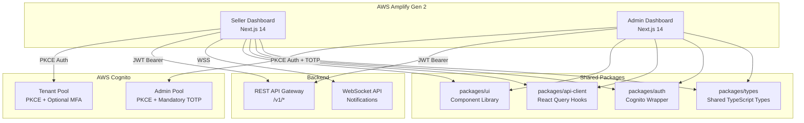
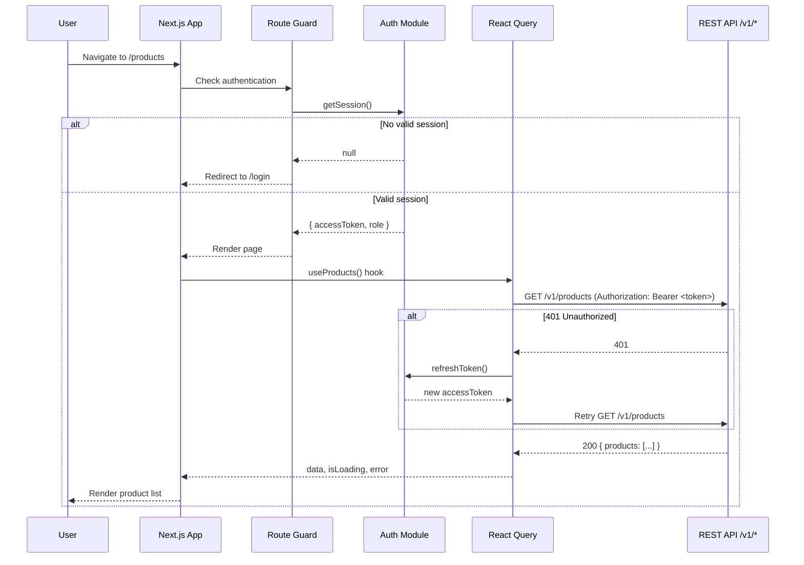

# Design Document: MerchOS Website

## Overview

This design covers the two frontend web applications for the MerchOS platform: the **Seller Dashboard** and the **Admin Dashboard**. Both are Next.js 14 App Router applications using TypeScript, Tailwind CSS, and React Query for server state management. They are hosted on AWS Amplify Gen 2 and communicate exclusively with the existing MerchOS REST API at `/v1/*`.

### Key Design Decisions

| Decision | Choice | Rationale |
|----------|--------|-----------|
| Framework | Next.js 14 (App Router) | Required by requirements; provides SSR/SSG flexibility, file-based routing, and React Server Components |
| State Management | React Query (TanStack Query v5) | Required by R21; handles server state caching, deduplication, retries, and background refetching |
| Client State | React Context + Zustand | Context for auth/role propagation (R4.6); Zustand for UI-local state (notifications, sidebar) |
| Styling | Tailwind CSS | Required; utility-first approach enables responsive design (R24) and design system consistency |
| Component Library | Radix UI Primitives + custom Tailwind wrappers | Accessible by default (WAI-ARIA patterns), unstyled primitives allow full Tailwind control |
| Auth Library | `@aws-amplify/auth` (v6) | Direct Cognito PKCE integration, token management, MFA support |
| WebSocket | Native WebSocket + custom reconnection logic | Lightweight, no external dependency; exponential backoff per R20.4 |
| Form Validation | Zod + React Hook Form | Type-safe schema validation, JSON-schema-driven forms for compliance editor |
| Charts | Recharts | Lightweight, composable, good accessibility support for admin health metrics |
| Monorepo | Turborepo (already configured) | Existing setup; `apps/*` workspace pattern per root `package.json` |
| Deployment | AWS Amplify Gen 2 | Required; per-branch previews, CI/CD, environment variables from SSM |

### Architecture Principles

1. **Shared-nothing between apps** — Each app is independently deployable; shared code lives in `packages/` workspace packages.
2. **API-first** — No direct AWS SDK calls from the frontend; all data flows through `/v1/*` REST API.
3. **Optimistic updates** — Mutations use React Query optimistic updates with rollback on failure (R7.5, R7.9).
4. **Progressive enhancement** — Core flows work without JavaScript where possible via Server Components.
5. **Accessibility by default** — Radix primitives, semantic HTML, ARIA live regions, keyboard navigation.

---

## Architecture

### High-Level System Diagram



### Project Structure

```
MerchOS/
├── apps/
│   ├── seller-dashboard/          # Next.js 14 App Router
│   │   ├── app/
│   │   │   ├── (auth)/            # Auth route group (login, callback, logout)
│   │   │   ├── (dashboard)/       # Protected route group with App Shell
│   │   │   │   ├── products/
│   │   │   │   ├── review-queue/
│   │   │   │   ├── inventory/
│   │   │   │   ├── exports/
│   │   │   │   ├── settings/
│   │   │   │   ├── billing/
│   │   │   │   └── layout.tsx     # App Shell with sidebar, header
│   │   │   ├── layout.tsx         # Root layout (providers)
│   │   │   └── page.tsx           # Redirect to /products
│   │   ├── next.config.js
│   │   ├── tailwind.config.ts
│   │   ├── tsconfig.json
│   │   └── package.json
│   └── admin-dashboard/           # Next.js 14 App Router
│       ├── app/
│       │   ├── (auth)/
│       │   ├── (dashboard)/
│       │   │   ├── health/
│       │   │   ├── tenants/
│       │   │   ├── compliance/
│       │   │   ├── taxonomy/
│       │   │   ├── audit-log/
│       │   │   ├── billing/
│       │   │   ├── alerts/
│       │   │   └── layout.tsx
│       │   ├── layout.tsx
│       │   └── page.tsx
│       ├── next.config.js
│       ├── tailwind.config.ts
│       ├── tsconfig.json
│       └── package.json
├── packages/
│   ├── ui/                        # Shared component library
│   │   ├── src/
│   │   │   ├── primitives/        # Radix-wrapped accessible components
│   │   │   ├── data-display/      # Table, Badge, Card, Stat, Chart
│   │   │   ├── feedback/          # Toast, Skeleton, ErrorBoundary, Alert
│   │   │   ├── navigation/        # Sidebar, Tabs, Breadcrumb
│   │   │   └── forms/             # Input, Select, Modal, JsonSchemaForm
│   │   ├── package.json
│   │   └── tsconfig.json
│   ├── api-client/                # React Query hooks + HTTP client
│   │   ├── src/
│   │   │   ├── client.ts          # Axios instance with interceptors
│   │   │   ├── hooks/             # Per-domain React Query hooks
│   │   │   ├── types/             # Request/Response DTOs
│   │   │   └── errors.ts          # Error normalization
│   │   ├── package.json
│   │   └── tsconfig.json
│   ├── auth/                      # Cognito auth wrapper
│   │   ├── src/
│   │   │   ├── provider.tsx       # AuthProvider context
│   │   │   ├── hooks.ts           # useAuth, useRole, useSession
│   │   │   ├── route-guard.tsx    # RouteGuard component
│   │   │   ├── cognito.ts         # Amplify Auth config + helpers
│   │   │   └── types.ts           # Auth types
│   │   ├── package.json
│   │   └── tsconfig.json
│   └── types/                     # Shared TypeScript interfaces
│       ├── src/
│       │   └── index.ts           # Re-exports from services/shared/types
│       ├── package.json
│       └── tsconfig.json
├── services/                      # Existing backend (unchanged)
├── infrastructure/                # Existing CDK (unchanged)
└── package.json                   # Root workspace config
```

### Request Flow



---

## Components and Interfaces

### Auth Module (`packages/auth`)

```typescript
// packages/auth/src/types.ts
export type SellerRole = 'owner' | 'admin' | 'editor' | 'viewer';

export interface AuthUser {
  userId: string;
  email: string;
  tenantId: string;
  role: SellerRole;
  givenName?: string;
  familyName?: string;
}

export interface AdminUser {
  userId: string;
  email: string;
  role: 'operator';
}

export interface AuthState {
  user: AuthUser | AdminUser | null;
  isAuthenticated: boolean;
  isLoading: boolean;
  accessToken: string | null;
}

export interface AuthContextValue extends AuthState {
  login: (email: string, password: string) => Promise<MfaChallengeResult | void>;
  completeMfa: (code: string) => Promise<void>;
  logout: () => Promise<void>;
  refreshSession: () => Promise<string>;  // returns new access token
}

export interface MfaChallengeResult {
  challengeType: 'TOTP' | 'SMS';
  session: string;
}
```

```typescript
// packages/auth/src/route-guard.tsx
export interface RouteGuardProps {
  children: React.ReactNode;
  /** Minimum role required to access the route */
  requiredRole?: SellerRole;
  /** If true, redirects to read-only version instead of access denied */
  redirectToReadOnly?: boolean;
  /** Path to redirect to on auth failure */
  loginPath?: string;
}
```

### API Client (`packages/api-client`)

```typescript
// packages/api-client/src/client.ts
export interface ApiClientConfig {
  baseUrl: string;           // e.g., 'https://api.merchos.io/v1'
  getAccessToken: () => Promise<string>;
  onUnauthorized: () => void; // trigger login redirect
}

export interface ApiError {
  statusCode: number;
  message: string;
  requestId: string;
  code?: string;
}

// packages/api-client/src/hooks/useProducts.ts
export function useProducts(params: ProductListParams): UseQueryResult<PaginatedResponse<ProductSummary>>;
export function useProduct(productId: string): UseQueryResult<Product>;
export function useApproveAttribute(): UseMutationResult<void, ApiError, ApproveAttributePayload>;
export function useOverrideAttribute(): UseMutationResult<void, ApiError, OverrideAttributePayload>;
export function useTransitionLifecycle(): UseMutationResult<void, ApiError, TransitionPayload>;
```

### Notification System

```typescript
// packages/api-client/src/notifications/websocket-manager.ts
export interface WebSocketManagerConfig {
  url: string;
  getAccessToken: () => Promise<string>;
  onMessage: (notification: Notification) => void;
  onConnectionChange: (connected: boolean) => void;
  maxReconnectAttempts: number;  // default: 5
  maxBackoff: number;            // default: 30000ms
  pollingInterval: number;       // default: 30000ms (fallback)
}

export interface Notification {
  id: string;
  type: EventType;
  title: string;
  message: string;
  resourceId?: string;
  timestamp: string;
  read: boolean;
}

export class WebSocketManager {
  connect(): void;
  disconnect(): void;
  markAsRead(notificationId: string): void;
  getUnreadCount(): number;
}
```

### UI Component Library (`packages/ui`)

Key accessible primitives built on Radix UI:

| Component | Radix Primitive | Purpose |
|-----------|----------------|---------|
| `Sidebar` | `NavigationMenu` | App navigation with active state, keyboard nav |
| `DataTable` | — | Paginated sortable table with ARIA labels |
| `Modal` | `Dialog` | Confirmation dialogs, forms |
| `Toast` | `Toast` | Notification toasts with ARIA live region |
| `Tabs` | `Tabs` | Settings page tabbed interface |
| `Select` | `Select` | Filter dropdowns with keyboard support |
| `Badge` | — | Status badges (lifecycle, compliance) |
| `Skeleton` | — | Loading state placeholder |
| `ProgressBar` | `Progress` | Usage meters, export progress |
| `JsonSchemaForm` | — | Dynamic form from JSON schema (compliance editor) |
| `SkipNav` | — | Skip navigation link for accessibility |

### App Shell Component

```typescript
// Seller Dashboard App Shell (apps/seller-dashboard/app/(dashboard)/layout.tsx)
export interface AppShellProps {
  children: React.ReactNode;
}

// Navigation items derived from user role
interface NavItem {
  label: string;
  href: string;
  icon: React.ComponentType;
  badge?: number;           // e.g., review queue count
  requiredRole?: SellerRole;
}

const SELLER_NAV_ITEMS: NavItem[] = [
  { label: 'Dashboard', href: '/dashboard', icon: HomeIcon },
  { label: 'Products', href: '/products', icon: PackageIcon },
  { label: 'Review Queue', href: '/review-queue', icon: ClipboardCheckIcon },
  { label: 'Inventory', href: '/inventory', icon: WarehouseIcon },
  { label: 'Exports', href: '/exports', icon: DownloadIcon },
  { label: 'Settings', href: '/settings', icon: SettingsIcon, requiredRole: 'admin' },
  { label: 'Billing', href: '/billing', icon: CreditCardIcon },
];
```

---

## Data Models

### Frontend DTOs (API Response Types)

These types map to the REST API responses and are used by React Query hooks. They mirror the backend types from `services/shared/types/` but represent the wire format.

```typescript
// packages/api-client/src/types/product.dto.ts

export interface ProductSummary {
  productId: string;
  tenantId: string;
  sku: string;
  title: string;
  thumbnailUrl: string | null;
  lifecycleState: LifecycleState;
  updatedAt: string;  // ISO 8601
}

export interface PaginatedResponse<T> {
  items: T[];
  total: number;
  page: number;
  pageSize: number;
  hasMore: boolean;
}

export interface ProductListParams {
  page?: number;
  pageSize?: number;      // default: 50
  search?: string;
  lifecycleState?: LifecycleState;
  sortBy?: 'title' | 'createdAt' | 'updatedAt' | 'lifecycleState';
  sortOrder?: 'asc' | 'desc';
}

export interface ApproveAttributePayload {
  productId: string;
  attributeName: string;
}

export interface OverrideAttributePayload {
  productId: string;
  attributeName: string;
  newValue: string | number | boolean;
}

export interface TransitionPayload {
  productId: string;
  targetState: LifecycleState;
  reason?: string;
}
```

```typescript
// packages/api-client/src/types/inventory.dto.ts

export interface InventorySummary {
  sku: string;
  productId: string;
  productTitle: string;
  onHand: number;
  reserved: number;
  available: number;
  updatedAt: string;
}

export interface StockAdjustmentPayload {
  sku: string;
  newQuantity: number;
  reason: string;
}
```

```typescript
// packages/api-client/src/types/export.dto.ts

export interface ExportSummary {
  exportId: string;
  channelId: ChannelId;
  exportDate: string;
  productCount: number;
  status: 'SUCCESS' | 'FAILED' | 'PARTIAL';
  downloadUrl?: string;   // Signed S3 URL (generated on demand)
}

export interface TriggerExportPayload {
  channelId: ChannelId;
}
```

```typescript
// packages/api-client/src/types/billing.dto.ts

export interface BillingOverview {
  planName: string;
  planId: PlanId;
  billingCycleStart: string;
  billingCycleEnd: string;
  usage: UsageMeters;
  limits: PlanLimits;
}

export interface UsageMeters {
  products: number;
  channels: number;
  users: number;
  aiCalls: number;
  imageCalls: number;
}

export interface InvoiceSummary {
  invoiceId: string;
  date: string;
  amount: number;
  currency: string;
  status: 'paid' | 'failed' | 'pending';
  downloadUrl?: string;
}
```

```typescript
// packages/api-client/src/types/admin.dto.ts

export interface TenantSummary {
  tenantId: string;
  name: string;
  plan: PlanId;
  status: TenantStatus;
  userCount: number;
  productCount: number;
  registeredAt: string;
}

export interface HealthMetrics {
  lambdaErrorRates: MetricSeries[];
  stepFunctionsFailures: MetricSeries[];
  sqsQueueDepths: MetricSeries[];
  dynamoConsumedCapacity: MetricSeries[];
  activeTenantCount: number;
  productsProcessedToday: number;
}

export interface MetricSeries {
  name: string;
  datapoints: { timestamp: string; value: number }[];
  unit: string;
}

export interface AlertItem {
  functionName: string;
  currentErrorRate: number;   // percentage
  errorCount: number;
  triggeredAt: string;
  resolved: boolean;
  resolvedAt?: string;
}

export interface ComplianceRuleSet {
  channelId: ChannelId;
  version: string;
  updatedAt: string;
  rules: Record<string, unknown>;  // JSON schema-defined
  jsonSchema: Record<string, unknown>;  // Schema for form generation
}

export interface TaxonomyStatus {
  channelId: ChannelId;
  channelName: string;
  version: string;
  lastRefreshDate: string;
  nodeCount: number;
  status: 'CURRENT' | 'STALE' | 'REFRESHING';
}

export interface AuditEvent {
  eventId: string;
  timestamp: string;
  actor: string;
  actionType: string;
  resource: string;
  tenantId?: string;
  details: Record<string, unknown>;
}
```

### Client-Side State Models

```typescript
// Notification store (Zustand)
interface NotificationStore {
  notifications: Notification[];
  unreadCount: number;
  connectionStatus: 'connected' | 'reconnecting' | 'polling' | 'disconnected';
  addNotification: (n: Notification) => void;
  markAsRead: (id: string) => void;
  markAllAsRead: () => void;
  setConnectionStatus: (status: NotificationStore['connectionStatus']) => void;
}

// UI state store (Zustand)
interface UIStore {
  sidebarCollapsed: boolean;
  toggleSidebar: () => void;
}
```

---

