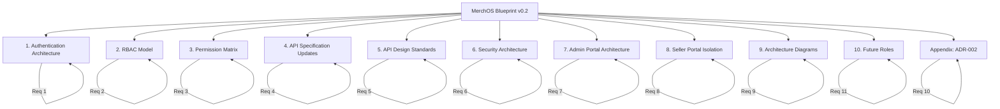
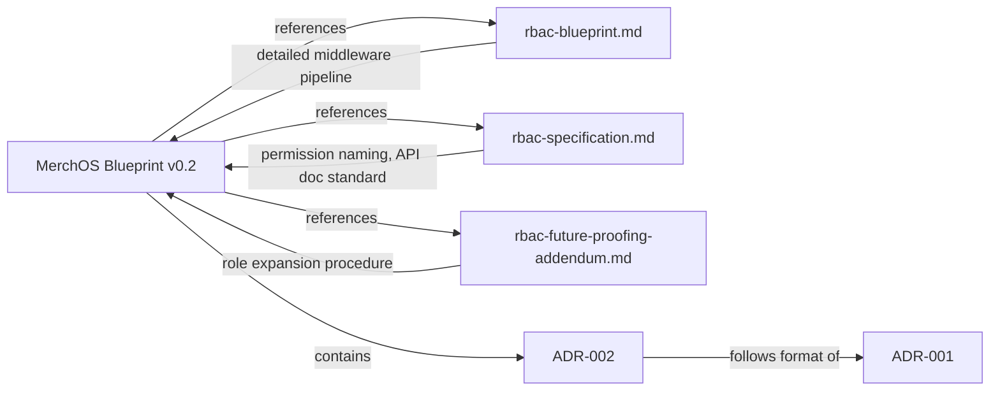

# Design Document: MerchOS Blueprint v2

## Overview

This design defines the structure, content organization, and authoring approach for the MerchOS Blueprint Version 0.2 — the main engineering architecture document for the platform. The Blueprint is a standalone document separate from the RBAC-specific documents (rbac-blueprint.md, rbac-specification.md, rbac-future-proofing-addendum.md) and serves as the single source of truth for platform architecture.

**Deliverable:** An updated Markdown document (`docs/architecture/merchos-blueprint.md`) and a new ADR (`docs/architecture/adr/ADR-002-single-cognito-user-pool-rbac.md`).

**Nature:** Documentation-only. No application code is modified.

### Design Goals

1. **Single source of truth** — Engineers reference one Blueprint for all architectural decisions regarding authentication, authorization, security, API design, and portal architecture.
2. **Reference, don't duplicate** — The Blueprint references the detailed RBAC documents for middleware pipeline internals, permission naming standards, and role expansion procedures. It does not restate content already documented there.
3. **Discoverable** — Each section is self-contained with clear cross-references. Engineers can navigate to the exact information they need.
4. **Auditable** — The Permission Matrix and API documentation standards make security requirements verifiable.
5. **Maintainable** — Mermaid diagrams render in standard markdown viewers. ADR format ensures decisions are preserved with rationale.

---

## Architecture

### Document Architecture

The Blueprint v2 is organized as a hierarchical Markdown document with the following top-level sections, each mapping to one or more requirements:



### Relationship to Existing Documents



The Blueprint provides the **high-level architectural overview** while the RBAC documents provide **implementation-level detail**:

| Concern | Blueprint Coverage | RBAC Document Coverage |
|---------|-------------------|----------------------|
| Authentication flow | Full (Cognito, JWT, API Gateway) | N/A |
| Role definitions | Summary with boundaries | N/A |
| Permission Matrix | Comprehensive table | Detailed domain breakdowns (rbac-specification.md) |
| Middleware pipeline | Referenced only | Full specification (rbac-blueprint.md) |
| Permission naming | Referenced only | Full standard (rbac-specification.md) |
| API doc standard | Template + 3 examples | Full standard + compliance rules (rbac-specification.md §5) |
| Ownership validation | Referenced only | Full architecture (rbac-blueprint.md §2) |
| Future role expansion | Summary + guarantees | Full procedure (rbac-future-proofing-addendum.md) |
| Security layers | Full defense-in-depth | Tenant isolation detail (rbac-blueprint.md §1) |
| Portal architecture | Full (Admin + Seller) | N/A |
| Architecture diagrams | Full (Mermaid) | Flow-specific diagrams in each doc |

---

## Components and Interfaces

Since this is a documentation deliverable, "components" refers to the sections of the Blueprint document and the ADR. Each component maps to a requirement and has defined content boundaries.

### Component 1: Authentication Architecture Section (Req 1)

**Content:**
- Amazon Cognito as sole Identity Provider
- Single User Pool architecture (all users regardless of role)
- Single App Client configuration
- JWT Bearer token requirement for all protected endpoints
- API Gateway JWT validation (signature, expiration, issuer)
- Lambda trust model (pre-validated identity, no re-validation)
- Complete authentication flow narrative
- Mermaid sequence diagram: Frontend → Cognito → JWT → API Gateway → Lambda → Business Services
- Authentication failure responses (401 with MISSING_TOKEN, INVALID_TOKEN, TOKEN_EXPIRED)

**Cross-references:** Links to rbac-blueprint.md for middleware pipeline details.

### Component 2: RBAC Section (Req 2)

**Content:**
- Three Cognito Groups: Admin, Support, Seller
- Admin role: unrestricted access, cross-tenant, system config, user management, monitoring
- Support role: read cross-tenant for troubleshooting, subscription/invoice visibility, product read; restrictions on data modification, billing changes, system config
- Seller role: full CRUD own-tenant products, AI content, marketplace exports, self-service subscriptions; restrictions on cross-tenant access, system ops
- Platform Role resolution exclusively from JWT cognito:groups claim (client-supplied claims never trusted)

**Cross-references:** 
- `[rbac-blueprint.md](./rbac-blueprint.md)` for middleware pipeline and ownership validation
- `[rbac-specification.md](./rbac-specification.md)` for permission naming standards

### Component 3: Permission Matrix Section (Req 3)

**Content:**
- Tables with rows = API resources, columns = Platform Roles (Seller, Support, Admin)
- Action categories: Read, Create, Update, Delete, Administrative
- Resource domains: Products, System, AI, Marketplace, Subscription, Users, Tenants, Audit Log
- Notation: ✅ (full access), 🔒 (own-tenant only), ❌ (denied)
- Consistency note referencing @merch-os/rbac PermissionRegistry
- Maintenance requirement: update before deploying new endpoints

### Component 4: API Specification Updates (Req 4)

**Content:**
- Definition of "protected endpoint"
- Required metadata fields for every protected endpoint
- Bearer JWT authentication method
- Cognito Group specification per endpoint
- Expected JWT claims: sub, custom:tenantId, cognito:groups
- Standard error codes: 401 (MISSING_TOKEN, INVALID_TOKEN, TOKEN_EXPIRED) and 403 (INSUFFICIENT_PERMISSIONS, TENANT_ISOLATION_VIOLATION, OWNERSHIP_VALIDATION_FAILURE)
- Reference to RBAC Specification §5 as authoritative format
- Three representative YAML examples (Admin global, Support bypassed, Seller scoped+owned)
- Public endpoint documentation format

### Component 5: API Design Standards Section (Req 5)

**Content:**
- Bearer JWT in Authorization header for all protected endpoints
- Tenant identity from JWT custom:tenantId only (never client-supplied)
- Platform Role from JWT cognito:groups only (never client-supplied)
- API Gateway JWT validation before Lambda
- Lambda receives pre-validated Authorization Context (role, userId, tenantId, permissions)
- Standard error responses (401/403)
- Conformance requirement for new endpoints

### Component 6: Security Architecture Section (Req 6)

**Content:**
- Defense-in-depth layers (outermost to innermost):
  1. Rate limiting (API Gateway)
  2. API Gateway authorization
  3. JWT validation
  4. Cognito authentication
  5. Zero Trust posture
  6. RBAC enforcement
  7. Least Privilege principle
  8. Tenant Isolation
  9. Input validation
  10. Audit logging
- Cognito responsibility: credentials, passwords, token issuance
- JWT validation at API Gateway layer
- API Gateway as authorization boundary
- Least Privilege: minimum permissions per role per Permission Matrix
- Tenant Isolation: middleware enforcement for Seller role
- Zero Trust: authenticate/authorize every request regardless of origin
- Input validation: type, format, length, required fields
- Audit logging: actor, tenant, timestamp, action, resource
- Rate limiting at API Gateway
- MFA planned for Admin (future)
- Cross-references to Authentication Architecture and RBAC sections

### Component 7: Admin Portal Architecture Section (Req 7)

**Content:**
- Shared application for Admin and Support roles
- Role resolution from Cognito Group membership
- Navigation filtering by permission check against @merch-os/rbac
- Route guards and component guards for page/action visibility
- No separate Support application
- Frontend guards consume @merch-os/rbac permissions
- Support → Admin-only page: redirect to access-denied (no flash of protected content)
- Unauthenticated → protected route: redirect to login (no protected content rendered)

### Component 8: Seller Portal Isolation Section (Req 8)

**Content:**
- Own-tenant resource access only
- JWT included in every backend request; middleware validates tenant ownership
- No cross-tenant navigation, search, or data retrieval
- URLs do not contain manipulable tenant identifiers
- Tenant identity from JWT custom:tenantId (never in request params/body/headers)
- TENANT_ISOLATION_VIOLATION on tenantId mismatch
- Frontend route guards and component guards via @merch-os/rbac

### Component 9: Architecture Diagrams Section (Req 9)

**Content (all in Mermaid syntax):**
- End-to-end authentication flow: Frontend → Cognito → JWT → API Gateway → Lambda → DynamoDB
- Authorization pipeline showing Cognito Group resolution
- System topology: Admin Portal, Seller Portal, Cognito, API Gateway, Lambda services
- Maintenance note: update diagrams when architectural components change

### Component 10: Future Roles Section (Req 11)

**Content:**
- Named future roles: Finance, Sales, Developer, QA, Enterprise Customer
- Adding a role requires: create Cognito Group, update @merch-os/rbac config, assign users
- No middleware/guard/navigation/business logic code changes required
- Supports 20+ distinct roles with O(1) authorization latency
- PermissionRegistry uses pre-built hash maps for constant-time lookups
- Reference to rbac-future-proofing-addendum.md for governance process
- Architectural guarantees: runtime config reads, dynamic permission evaluation, permission-derived navigation

### Component 11: ADR-002 (Req 10)

**File:** `docs/architecture/adr/ADR-002-single-cognito-user-pool-rbac.md`

**Structure (following ADR-001 format):**
- Title: "Adoption of Single Cognito User Pool with Role-Based Access Control"
- Status: Accepted (with date)
- Context: Authentication requirements and constraints (minimum 3)
- Decision: Single User Pool + Cognito Groups for role assignment
- Alternatives Considered:
  - Multiple User Pools: rejected (operational complexity, user management overhead, inability to share auth infrastructure)
  - Third-party IdP: rejected (minimum 2 drawbacks)
- Benefits of Cognito Groups: config-only expansion, single auth endpoint, simplified user management, JWT-based role delivery
- Consequences: 3+ benefits, 2+ trade-offs with mitigation strategies
- Scalability: future roles without redesign, 300-group limit, role precedence resolution
- Numbered ADR-002, same directory as ADR-001

---

## Data Models

Since this is a documentation-only feature, there are no application data models. The "data" produced is structured Markdown content. The key structural elements are:

### Permission Matrix Table Schema

| Column | Description |
|--------|-------------|
| Resource Domain | Logical grouping (Products, System, AI, etc.) |
| Resource | Specific API resource or operation |
| Seller | Access state: ✅ / 🔒 / ❌ |
| Support | Access state: ✅ / 🔒 / ❌ |
| Admin | Access state: ✅ / 🔒 / ❌ |

**Access State Notation:**
- ✅ = Full access (granted unconditionally)
- 🔒 = Own-tenant only (granted but scoped to user's tenant)
- ❌ = Denied (not permitted)

### API Endpoint Documentation Schema (YAML)

```yaml
endpoint: <METHOD> /api/<path>
method: <HTTP verb>
authentication: Bearer JWT (Cognito) | None (Public)
required_role: [<Role1>, <Role2>]
required_permission: <resource.action.scope>
ownership_required: <boolean>
ownership_field: <field | null>
tenant_isolation: <scoped | global | bypassed>
error_responses:
  401: [{ code, description }]
  403: [{ code, description }]
```

### ADR Document Schema

```
# ADR-NNN: <Title>
## Status — Accepted | Superseded | Deprecated (Date)
## Context — Problem statement + motivating requirements
## Decision — Adopted approach
## Alternatives Considered — Rejected options with reasons
## Consequences — Benefits + Trade-offs (with mitigations)
```

---

## Error Handling

Since this is a documentation deliverable, error handling refers to content correctness and maintenance processes rather than runtime errors.

### Content Consistency Errors

| Error Type | Detection | Resolution |
|------------|-----------|------------|
| Permission Matrix diverges from @merch-os/rbac | Manual review during permission changes | Update Blueprint Permission Matrix when PermissionRegistry changes |
| Missing endpoint documentation | PR review process | Block deployment until API doc standard metadata is added |
| Broken cross-references | Markdown link validation | Fix relative paths when documents are moved |
| Stale diagrams | Architecture review during component changes | Update Mermaid diagrams when auth/authz flow changes |
| ADR format non-compliance | Template validation during authoring | Follow ADR-001 structure exactly |

### Maintenance Triggers

The Blueprint requires updates when:
1. A new API resource is added (Permission Matrix update — Req 3.4)
2. A new architectural component joins the auth/authz flow (Diagram update — Req 9.5)
3. The @merch-os/rbac PermissionRegistry is modified (Permission Matrix consistency — Req 3.6)
4. A new protected endpoint is deployed (API doc standard compliance — Req 4)

---

## Correctness Properties

This is a documentation-only feature with no executable code. Traditional property-based testing does not apply. Instead, the following documentation correctness invariants must hold and are verified through manual review and structural validation.

### Property 1: Completeness

**Validates: Requirements 1, 2, 3, 4, 5, 6, 7, 8, 9, 10, 11**

Every requirement's acceptance criteria maps to content present in the Blueprint document. No acceptance criterion is left unaddressed.

### Property 2: Permission Matrix Consistency

**Validates: Requirements 3.6**

The Permission Matrix in the Blueprint matches the @merch-os/rbac PermissionRegistry — no role-resource-action combination contradicts the code's `defaultPermissionConfig`.

### Property 3: Referential Integrity

**Validates: Requirements 2.5, 6.12, 11.5**

All relative-path hyperlinks to RBAC documents (rbac-blueprint.md, rbac-specification.md, rbac-future-proofing-addendum.md) resolve to existing files at the referenced paths.

### Property 4: Notation Uniqueness

**Validates: Requirements 3.5**

Every cell in the Permission Matrix resolves to exactly one of three states (✅ full access, 🔒 own-tenant only, ❌ denied). No cell is ambiguous or empty.

### Property 5: ADR Format Compliance

**Validates: Requirements 10.2, 10.3, 10.4, 10.5, 10.9**

ADR-002 contains all sections present in ADR-001 (Status, Context, Decision, Alternatives Considered, Consequences) with no structural omissions.

### Property 6: Diagram Renderability

**Validates: Requirements 9.4**

All Mermaid diagrams produce valid rendered output in GitHub-flavored Markdown viewers without syntax errors.

---

## Testing Strategy

### Approach: Manual Review + Structural Validation

Since this feature produces documentation (Markdown files), not executable code, **property-based testing does not apply**. The testing strategy focuses on:

1. **Structural completeness review** — Verify every requirement's acceptance criteria maps to content in the Blueprint document.
2. **Cross-reference validation** — Verify all relative-path hyperlinks resolve to existing files.
3. **Permission Matrix consistency** — Manually verify the Blueprint Permission Matrix aligns with the @merch-os/rbac package's `defaultPermissionConfig`.
4. **ADR format compliance** — Verify ADR-002 follows ADR-001's structure (Status, Context, Decision, Alternatives, Consequences).
5. **Mermaid diagram rendering** — Verify all diagrams render correctly in a standard Markdown viewer (GitHub, VS Code preview).
6. **Notation correctness** — Verify the Permission Matrix uses exactly three distinct cell values (✅, 🔒, ❌) with no ambiguous entries.

### Why PBT Does Not Apply

This feature is a **documentation-only** update. The deliverables are Markdown files containing architectural prose, tables, diagrams, and an ADR. There are no functions with inputs and outputs, no data transformations, no parsers, and no business logic. The correctness of documentation is validated through human review against acceptance criteria, not automated property testing.

### Verification Checklist (per requirement)

| Requirement | Verification Method |
|-------------|-------------------|
| Req 1: Authentication Architecture | Section exists with all 9 acceptance criteria addressed |
| Req 2: RBAC Section | Section exists with all 6 criteria; references RBAC docs |
| Req 3: Permission Matrix | Table covers 8 domains; uses 3-state notation; references PermissionRegistry |
| Req 4: API Specification | 3 YAML examples present; all fields from §5.1 populated |
| Req 5: API Design Standards | Section documents all 7 design standards |
| Req 6: Security Architecture | 10 defense-in-depth layers documented; cross-references present |
| Req 7: Admin Portal | Shared app documented; no-flash redirect behavior specified |
| Req 8: Seller Portal | Tenant isolation guarantees documented; no URL manipulation possible |
| Req 9: Architecture Diagrams | 3+ Mermaid diagrams; auth flow, authz pipeline, system topology |
| Req 10: ADR-002 | Follows ADR-001 format; all required sections present |
| Req 11: Future Roles | Config-only expansion documented; references addendum |
