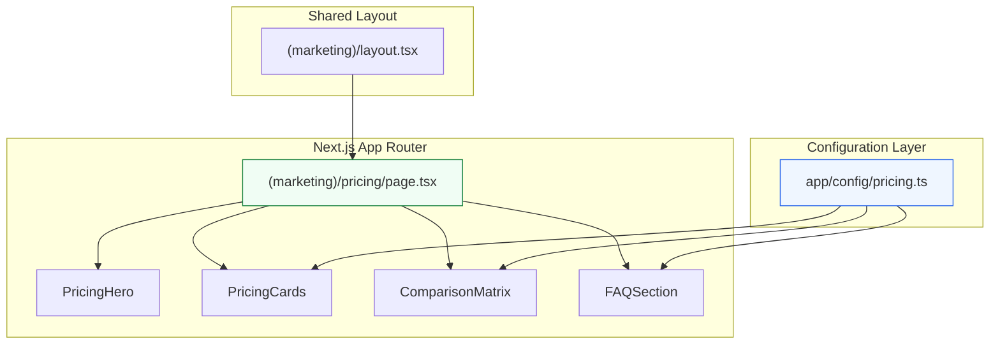
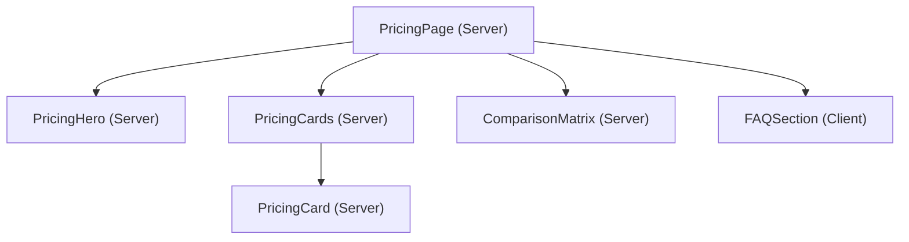

# Design Document: Pricing Page

## Overview

This design describes the architecture and implementation of a dedicated `/pricing` route within the MerchOS seller-dashboard marketing section. The page renders five subscription tiers (Launch, Growth, Professional, Business, Enterprise) as pricing cards, a feature comparison matrix, and an FAQ accordion — all driven by a single TypeScript configuration object.

The design follows the existing marketing page patterns: Next.js 14 App Router with the `(marketing)` route group, Tailwind CSS using the project's design tokens, and semantic HTML for accessibility. No external state management or API calls are required — the page is fully static and configuration-driven.

## Architecture



**Key architectural decisions:**

1. **Static page with no client-side data fetching** — All pricing data is defined at build time in a config file. This enables static generation (SSG) and eliminates loading states.
2. **Configuration-driven rendering** — Components iterate over config arrays, so adding/removing tiers, features, or FAQ items requires zero component code changes.
3. **Component decomposition** — The page is split into focused sub-components (PricingHero, PricingCards, ComparisonMatrix, FAQSection) for maintainability and testability.
4. **Client component only for FAQ** — The FAQ accordion requires interactive state (expand/collapse), so only that component uses `"use client"`. All other sections are server components.

## Components and Interfaces

### Page Component

**File:** `app/(marketing)/pricing/page.tsx`

Server component that composes the page sections. Exports metadata for the document title.

```typescript
// Metadata export for <title> tag
export const metadata: Metadata = {
  title: 'Pricing — MerchOS',
  description: 'Compare MerchOS subscription plans...',
};

export default function PricingPage() {
  return (
    <>
      <PricingHero />
      <PricingCards tiers={pricingConfig.tiers} />
      <ComparisonMatrix categories={pricingConfig.comparison} tiers={pricingConfig.tiers} />
      <FAQSection items={pricingConfig.faq} />
    </>
  );
}
```

### PricingHero

**File:** `app/(marketing)/pricing/components/PricingHero.tsx`

Static section with heading and subtitle. No props required.

```typescript
interface PricingHeroProps {}
```

### PricingCards

**File:** `app/(marketing)/pricing/components/PricingCards.tsx`

Renders the tier cards grid with responsive layout.

```typescript
interface PricingCardsProps {
  tiers: PricingTier[];
}
```

### PricingCard

**File:** `app/(marketing)/pricing/components/PricingCard.tsx`

Individual card component for a single tier.

```typescript
interface PricingCardProps {
  tier: PricingTier;
}
```

### ComparisonMatrix

**File:** `app/(marketing)/pricing/components/ComparisonMatrix.tsx`

Renders the feature comparison table with sticky first column on mobile.

```typescript
interface ComparisonMatrixProps {
  categories: ComparisonCategory[];
  tiers: PricingTier[];
}
```

### FAQSection

**File:** `app/(marketing)/pricing/components/FAQSection.tsx`

Client component implementing an exclusive accordion (one item open at a time).

```typescript
'use client';

interface FAQSectionProps {
  items: FAQItem[];
}
```

### Component Hierarchy



## Data Models

### Pricing Configuration Types

**File:** `app/config/pricing.ts`

```typescript
export interface PricingTier {
  /** Unique identifier for the tier (e.g., "launch", "growth") */
  id: string;
  /** Display name (e.g., "Launch", "Growth") */
  name: string;
  /** Monthly price in ZAR cents, or null for contact-based pricing */
  priceMonthly: number | null;
  /** Currency code */
  currency: 'ZAR';
  /** Optional badge text (e.g., "Most Popular") */
  badge: string | null;
  /** Whether this tier is visually highlighted as recommended */
  highlighted: boolean;
  /** Short description of who this tier is for */
  description: string;
  /** List of key features shown on the card */
  features: string[];
  /** CTA button label */
  ctaLabel: string;
  /** CTA button destination path */
  ctaHref: string;
}

export interface ComparisonFeature {
  /** Feature display name */
  name: string;
  /** Value per tier: true = included, false = excluded, string = specific value */
  tiers: Record<string, boolean | string>;
}

export interface ComparisonCategory {
  /** Category heading name */
  name: string;
  /** Features within this category */
  features: ComparisonFeature[];
}

export interface FAQItem {
  /** The question text */
  question: string;
  /** The answer text (supports plain text) */
  answer: string;
}

export interface PricingConfig {
  tiers: PricingTier[];
  comparison: ComparisonCategory[];
  faq: FAQItem[];
}
```

### Example Configuration Shape

```typescript
export const pricingConfig: PricingConfig = {
  tiers: [
    {
      id: 'launch',
      name: 'Launch',
      priceMonthly: 49900, // R499.00
      currency: 'ZAR',
      badge: null,
      highlighted: false,
      description: 'Perfect for new marketplace sellers getting started',
      features: ['500 products/month', '1,000 AI credits', '1 team member', '2 marketplaces'],
      ctaLabel: 'Get Started',
      ctaHref: '/register?plan=launch',
    },
    // ... Growth, Professional (highlighted), Business, Enterprise (priceMonthly: null)
  ],
  comparison: [
    {
      name: 'Product Management',
      features: [
        { name: 'Monthly products', tiers: { launch: '500', growth: '2,500', professional: '10,000', business: '25,000', enterprise: 'Unlimited' } },
        { name: 'AI credits', tiers: { launch: '1,000', growth: '5,000', professional: '25,000', business: '100,000', enterprise: 'Unlimited' } },
        // ...
      ],
    },
    // ... more categories
  ],
  faq: [
    { question: 'Can I upgrade later?', answer: 'Yes, you can upgrade...' },
    // ...
  ],
};
```

### Price Formatting

Prices are stored as integers (cents) and formatted for display:

```typescript
function formatPrice(priceInCents: number): string {
  return `R${(priceInCents / 100).toLocaleString('en-ZA')}`;
}
```

For the Enterprise tier where `priceMonthly` is `null`, the card displays "Contact Us" instead.

## Correctness Properties

*A property is a characteristic or behavior that should hold true across all valid executions of a system — essentially, a formal statement about what the system should do. Properties serve as the bridge between human-readable specifications and machine-verifiable correctness guarantees.*

### Property 1: Config-to-cards rendering completeness

*For any* valid `PricingConfig` with N tiers, rendering the PricingCards component should produce exactly N card elements, each displaying the corresponding tier's name, formatted price (or "Contact Us" for null price), all listed features, badge (if non-null), and a CTA button with the configured label and href.

**Validates: Requirements 2.1, 2.5, 2.6, 4.1, 4.2, 8.4**

### Property 2: Highlighted vs non-highlighted styling differentiation

*For any* tier in the config, if `highlighted` is `true`, the rendered card should have the accent border class, tinted background class, elevated shadow class, and a filled CTA button style. If `highlighted` is `false`, the card should have the standard border, white background, standard shadow, and an outlined CTA button style. The two sets of classes must be mutually exclusive.

**Validates: Requirements 3.1, 4.4, 4.5**

### Property 3: Comparison matrix config-to-table rendering

*For any* valid `PricingConfig` with C categories containing a total of F features and T tiers, the rendered ComparisonMatrix should produce: exactly C category heading rows each spanning all columns, exactly F feature rows each containing T value cells, and T column headers in tier order. Each value cell should render a checkmark for `true`, a cross for `false`, or the literal string value for string entries.

**Validates: Requirements 6.2, 6.3, 6.5, 8.5**

### Property 4: FAQ accordion exclusivity

*For any* sequence of FAQ item activations, at most one FAQ item should be in the expanded state at any given time. When a new item is activated, the previously expanded item (if any) must collapse before or simultaneously with the new item expanding.

**Validates: Requirements 7.5**

### Property 5: Accessible aria-controls linkage

*For any* FAQ item rendered in the accordion, the trigger button's `aria-controls` attribute value must exactly match the `id` attribute of the corresponding answer panel element, and both attributes must be non-empty strings.

**Validates: Requirements 10.3**

### Property 6: Matrix icon accessibility semantics

*For any* cell in the ComparisonMatrix that renders a decorative icon (checkmark or cross), the icon element must have `aria-hidden="true"` set, and an adjacent visually-hidden `<span>` must provide semantic text ("Included" for checkmarks, "Not included" for crosses).

**Validates: Requirements 10.6**

## Error Handling

Since the pricing page is a static, configuration-driven page with no runtime data fetching, error scenarios are limited:

| Scenario | Handling |
|----------|----------|
| Invalid config shape | TypeScript compilation fails — caught at build time via exported types |
| Missing tier data | Config is validated by type system; all fields are required (non-optional) |
| Null price rendering | Explicit conditional: `priceMonthly === null` renders "Contact Us" instead of formatted price |
| Empty features array | Card renders feature list with zero items (no visual break) |
| Empty FAQ array | FAQ section renders heading with no accordion items |
| Empty comparison array | Comparison section renders table header with no body rows |

**No runtime error boundaries are needed** for this page since all data is static and type-checked at compile time. The existing marketing layout's error boundary (if any) provides a catch-all fallback.

## Testing Strategy

### Unit Tests (Example-Based)

Unit tests verify specific rendering behaviors and edge cases:

- **Page structure:** Verify heading contains "Pricing", subtitle is ≤ 150 characters, metadata includes "Pricing" and "MerchOS"
- **Responsive layout classes:** Verify correct grid/flex classes at desktop, tablet, and mobile breakpoints
- **Highlighted card visuals:** Verify "Most Popular" badge, accent border, scale transform, and non-color indicator
- **Hover animation:** Verify CSS transform/transition classes are present on cards
- **FAQ initial state:** Verify all items collapsed on mount (aria-expanded="false")
- **FAQ required questions:** Verify all 7 required questions are present
- **Comparison matrix mobile:** Verify sticky first column and horizontal scroll wrapper
- **Accessibility:** Verify semantic HTML elements, table scope attributes, keyboard focus indicators

### Property-Based Tests

Property tests verify universal correctness across all valid configurations using [fast-check](https://github.com/dubzzz/fast-check):

- **Minimum 100 iterations** per property test
- Each test references its design property via tag comment
- Generators produce arbitrary valid `PricingConfig` objects with varying tier counts, feature counts, category counts, and FAQ items

| Property | What it validates | Generator |
|----------|-------------------|-----------|
| Property 1: Config-to-cards completeness | All config data appears in rendered output | Random valid PricingConfig with 1–10 tiers |
| Property 2: Highlight styling exclusivity | Highlighted/non-highlighted classes are mutually exclusive | Random tiers with varying `highlighted` flag |
| Property 3: Matrix rendering correctness | Table structure matches config dimensions and values | Random categories (1–5) with features (1–20) and tiers (2–8) |
| Property 4: Accordion exclusivity | At most one item open at a time | Random FAQ items (1–15) with random activation sequences |
| Property 5: Aria-controls linkage | Trigger → panel id mapping is correct | Random FAQ items (1–15) |
| Property 6: Icon accessibility | All icons have aria-hidden and sr-only text | Random comparison matrix with mixed boolean/string values |

**Test tag format:** `// Feature: pricing-page, Property {N}: {title}`

### Test Setup

Tests will use:
- **Vitest** as the test runner (consistent with admin-dashboard)
- **@testing-library/react** for component rendering
- **fast-check** for property-based test generation
- **jsdom** environment for DOM testing

A `vitest.config.ts` will be added to the seller-dashboard app if not already present, following the admin-dashboard pattern.
