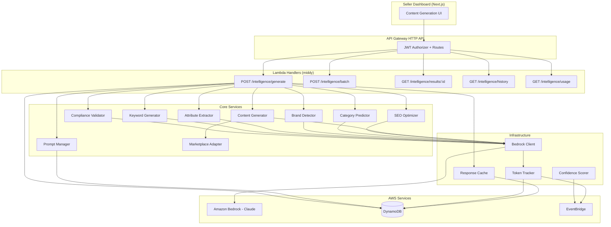

# Design Document: Product Intelligence Engine

## Overview

The Product Intelligence Engine is a backend service within MerchOS that uses Amazon Bedrock (Claude models) to generate, optimize, and validate product content for marketplace listings. It follows the established MerchOS service architecture — middy-based Lambda handlers, shared middleware (tenant context, RBAC, rate limiting), DynamoDB single-table design with TENANT# key prefixes, CDK v2 infrastructure, and Zod-validated request schemas.

The engine exposes a RESTful API via API Gateway HTTP API that allows sellers to submit generation requests for titles, descriptions, bullet points, SEO optimization, category prediction, brand detection, attribute extraction, marketplace tailoring, keyword generation, and compliance validation. All AI outputs include confidence scores, and the system supports versioned prompt templates with A/B testing, response caching, retry logic with exponential backoff, cost tracking per tenant, and batch processing.

### Key Design Decisions

1. **Single Lambda per endpoint** — Consistent with existing MerchOS services (supplier-intelligence). Each API route maps to a dedicated Lambda handler using middy middleware stack.
2. **DynamoDB single-table design** — All data (generation results, prompt templates, cache entries, token usage) stored in a single table with TENANT# partition key prefixes for tenant isolation.
3. **Amazon Bedrock direct invocation** — Uses `@aws-sdk/client-bedrock-runtime` with a dedicated Bedrock_Client service layer handling retries, token tracking, and model selection.
4. **Cache-aside pattern** — SHA-256 hash-based cache lookup in DynamoDB before Bedrock invocations; configurable TTL with cache invalidation on prompt version changes.
5. **Event-driven observability** — Emits EventBridge events for low-confidence results, budget exceeded, and Bedrock failures, consistent with existing platform event patterns.
6. **fast-check for property testing** — Uses the established fast-check library (already a devDependency in the monorepo) with vitest for property-based tests.

## Architecture



### Request Flow

1. Seller submits a `Generation_Request` via the dashboard UI
2. API Gateway validates JWT, routes to the appropriate Lambda handler
3. Middy middleware stack runs: `tenantContextMiddleware` → `rbacMiddleware` → `rateLimitMiddleware` → `inputValidationMiddleware`
4. Handler resolves the active prompt template (with A/B variant selection)
5. Response cache is checked using SHA-256 hash of normalized inputs
6. On cache miss: Bedrock Client invokes the model with retry logic
7. Token usage is recorded; confidence score is calculated
8. Marketplace adapter applies platform-specific rules if applicable
9. Result is cached, stored in DynamoDB, and returned to the seller
10. EventBridge events emitted for low confidence, budget exceeded, or failures

## Components and Interfaces

### Lambda Handlers

All handlers follow the existing MerchOS pattern: middy-wrapped with tenant context, RBAC, rate limiting, and Zod input validation.

```typescript
// Handler: POST /intelligence/generate
interface GenerateHandler {
  input: GenerationRequest;
  output: GenerationResult;
  middleware: [tenantContextMiddleware, rbacMiddleware, rateLimitMiddleware, inputValidationMiddleware];
  resource: 'intelligence';
  action: 'write';
}

// Handler: POST /intelligence/batch
interface BatchHandler {
  input: BatchGenerationRequest;
  output: BatchGenerationResult;
  middleware: [tenantContextMiddleware, rbacMiddleware, rateLimitMiddleware, inputValidationMiddleware];
  resource: 'intelligence';
  action: 'write';
}

// Handler: GET /intelligence/results/{resultId}
interface GetResultHandler {
  input: { resultId: string };
  output: GenerationResult;
  middleware: [tenantContextMiddleware, rbacMiddleware, rateLimitMiddleware];
  resource: 'intelligence';
  action: 'read';
}

// Handler: GET /intelligence/history
interface HistoryHandler {
  input: { limit?: number; lastEvaluatedKey?: string; type?: GenerationType };
  output: { results: GenerationResult[]; lastEvaluatedKey?: string };
  middleware: [tenantContextMiddleware, rbacMiddleware, rateLimitMiddleware];
  resource: 'intelligence';
  action: 'read';
}

// Handler: GET /intelligence/usage
interface UsageHandler {
  input: { period?: 'daily' | 'monthly' };
  output: TokenUsageSummary;
  middleware: [tenantContextMiddleware, rbacMiddleware, rateLimitMiddleware];
  resource: 'intelligence';
  action: 'read';
}
```

### Bedrock Client

Encapsulates all Bedrock API interactions with retry logic, token tracking, and model selection.

```typescript
interface BedrockClient {
  invoke(params: BedrockInvocationParams): Promise<BedrockInvocationResult>;
}

interface BedrockInvocationParams {
  modelId: string;
  prompt: string;
  maxTokens: number;
  temperature?: number;
  topP?: number;
  stopSequences?: string[];
}

interface BedrockInvocationResult {
  content: string;
  inputTokens: number;
  outputTokens: number;
  modelId: string;
  latencyMs: number;
}
```

**Retry Configuration:**
- Max retries: 3
- Initial backoff: 1 second
- Multiplier: 2
- Max backoff: 10 seconds
- Full jitter applied to each interval
- Retryable errors: `ThrottlingException`, `ServiceUnavailableException`, `InternalServerError`

### Prompt Manager

Stores, versions, and selects prompt templates with A/B testing support.

```typescript
interface PromptManager {
  getActiveTemplate(generationType: GenerationType, abConfig?: ABTestConfig): Promise<PromptTemplate>;
  createVersion(template: CreatePromptTemplateInput): Promise<PromptTemplate>;
  deactivateVersion(templateId: string, version: number): Promise<void>;
  interpolate(template: string, variables: Record<string, string>): string;
}

interface PromptTemplate {
  templateId: string;
  generationType: GenerationType;
  version: number;
  content: string;
  variables: string[];
  active: boolean;
  createdAt: string;
  trafficPercentage?: number; // For A/B testing
}

interface ABTestConfig {
  enabled: boolean;
  variants: { templateId: string; version: number; trafficPercentage: number }[];
}
```

### Content Generator

Orchestrates content generation by resolving prompts, invoking Bedrock, and applying marketplace rules.

```typescript
interface ContentGenerator {
  generateTitle(request: TitleGenerationInput): Promise<GenerationResult>;
  generateDescription(request: DescriptionGenerationInput): Promise<GenerationResult>;
  generateBullets(request: BulletGenerationInput): Promise<GenerationResult>;
}

interface TitleGenerationInput {
  productData: ProductData;
  marketplace?: MarketplaceId;
  attributes?: Record<string, string>;
}

interface DescriptionGenerationInput {
  productData: ProductData;
  marketplace?: MarketplaceId;
  tone?: 'professional' | 'casual' | 'luxury';
  wordCountRange?: { min: number; max: number };
}

interface BulletGenerationInput {
  productData: ProductData;
  marketplace?: MarketplaceId;
  count?: number; // defaults to 5
  attributes?: Record<string, string>;
}
```

### SEO Optimizer

```typescript
interface SEOOptimizer {
  analyze(request: SEOAnalysisInput): Promise<SEOAnalysisResult>;
}

interface SEOAnalysisResult {
  keywordDensity: Record<string, number>; // keyword -> percentage
  suggestions: string[];
  optimizedContent: string;
  metaDescription?: string; // <= 155 characters
  keywordStuffingFlags: { keyword: string; density: number }[];
  confidenceScore: number;
}
```

### Category Predictor

```typescript
interface CategoryPredictor {
  predict(request: CategoryPredictionInput): Promise<CategoryPredictionResult>;
}

interface CategoryPredictionResult {
  predictions: {
    categoryId: string;
    categoryPath: string[]; // breadcrumb
    confidenceScore: number;
  }[];
  manualReviewRecommended: boolean; // true if all scores < 0.3
}
```

### Brand Detector

```typescript
interface BrandDetector {
  detect(request: BrandDetectionInput): Promise<BrandDetectionResult>;
}

interface BrandDetectionResult {
  brands: {
    name: string;
    type: 'primary' | 'sub-brand';
    confidenceScore: number;
    registryValidated?: boolean;
    recognized: boolean;
  }[];
  unidentified: boolean; // true if no brand scores > 0.5
}
```

### Attribute Extractor

```typescript
interface AttributeExtractor {
  extract(request: AttributeExtractionInput): Promise<AttributeExtractionResult>;
}

interface AttributeExtractionResult {
  attributes: {
    key: string;
    value: string;
    normalizedValue?: string;
    unit?: string;
    confidenceScore: number;
    normalizationFailed: boolean;
  }[];
}
```

### Marketplace Adapter

```typescript
interface MarketplaceAdapter {
  apply(content: string, marketplace: MarketplaceId, contentType: GenerationType): MarketplaceAdaptedContent;
}

interface MarketplaceAdaptedContent {
  content: string;
  complianceStatus: 'compliant' | 'warnings' | 'non_compliant';
  warnings: string[];
  truncated: boolean;
  appliedRules: string[];
}

type MarketplaceId = 'amazon' | 'shopify' | 'ebay';
```

### Keyword Generator

```typescript
interface KeywordGenerator {
  generate(request: KeywordGenerationInput): Promise<KeywordGenerationResult>;
}

interface KeywordGenerationResult {
  keywords: {
    term: string;
    category: 'primary' | 'secondary' | 'long-tail';
    relevanceScore: number;
  }[];
  gapKeywords?: string[]; // Only when competitor keywords provided
  overallQualityScore: number;
}
```

### Compliance Validator

```typescript
interface ComplianceValidator {
  validate(request: ComplianceValidationInput): Promise<ComplianceValidationResult>;
}

interface ComplianceValidationResult {
  status: 'pass' | 'fail' | 'warnings_only';
  complianceScore: number;
  violations: {
    type: string;
    severity: 'error' | 'warning';
    offendingText: string;
    span: { start: number; end: number };
    suggestedFix: string;
  }[];
  correctedContent?: string; // Only when status === 'fail'
}
```

### Response Cache

```typescript
interface ResponseCache {
  get(cacheKey: string): Promise<GenerationResult | null>;
  set(cacheKey: string, result: GenerationResult, ttlSeconds?: number): Promise<void>;
  invalidateByPromptVersion(generationType: GenerationType, oldVersion: number): Promise<void>;
  computeKey(input: CacheKeyInput): string; // SHA-256 hash
}

interface CacheKeyInput {
  normalizedInput: string;
  generationType: GenerationType;
  marketplace?: MarketplaceId;
  promptVersion: number;
}
```

### Token Tracker

```typescript
interface TokenTracker {
  record(usage: TokenUsageRecord): Promise<void>;
  getTenantUsage(tenantId: string, period: 'daily' | 'monthly'): Promise<TokenUsageSummary>;
  checkBudget(tenantId: string): Promise<{ allowed: boolean; remaining: number }>;
}

interface TokenUsageRecord {
  tenantId: string;
  generationType: GenerationType;
  inputTokens: number;
  outputTokens: number;
  modelId: string;
  timestamp: string;
}

interface TokenUsageSummary {
  tenantId: string;
  period: 'daily' | 'monthly';
  totalInputTokens: number;
  totalOutputTokens: number;
  totalCost: number;
  budgetLimit: number;
  budgetRemaining: number;
  breakdown: Record<GenerationType, { inputTokens: number; outputTokens: number }>;
}
```

### Confidence Scorer

```typescript
interface ConfidenceScorer {
  calculate(params: ConfidenceInput): number; // Always 0.0 to 1.0
}

interface ConfidenceInput {
  modelProbability: number; // From Bedrock response
  inputCompleteness: number; // 0-1, based on required fields present
  historicalAccuracy: number; // 0-1, based on past results for this generation type
}
```

## Data Models

### DynamoDB Table: product-intelligence-{env}

Single-table design with TENANT# prefixed partition keys for tenant isolation.

#### Access Patterns

| Access Pattern | PK | SK | Index |
|---|---|---|---|
| Get Result | TENANT#{tenantId} | RESULT#{resultId} | Main |
| List Results by Type (history) | TENANT#{tenantId} | RESULT#TYPE#{type}#CREATED#{ts} | Main |
| Get Prompt Template | PROMPT#{generationType} | VERSION#{version} | Main |
| List Active Templates | PROMPT#{generationType} | VERSION# (begins_with) | Main |
| Cache Lookup | CACHE#{cacheKey} | ENTRY | Main |
| Get Token Usage (daily) | TENANT#{tenantId}#USAGE | DAY#{date} | Main |
| Get Token Usage (monthly) | TENANT#{tenantId}#USAGE | MONTH#{yearMonth} | Main |
| List Results by Date (GSI1) | TENANT#{tenantId} | RESULT#CREATED#{ts} | GSI1 |
| List Results by Confidence (GSI2) | TENANT#{tenantId}#CONFIDENCE | SCORE#{score}#CREATED#{ts} | GSI2 |

#### Item Schemas

**Generation Result:**
```typescript
interface GenerationResultItem {
  PK: `TENANT#${string}`;
  SK: `RESULT#${string}`;
  GSI1PK: `TENANT#${string}`;
  GSI1SK: `RESULT#CREATED#${string}`;
  GSI2PK: `TENANT#${string}#CONFIDENCE`;
  GSI2SK: `SCORE#${string}#CREATED#${string}`;
  resultId: string;
  tenantId: string;
  generationType: GenerationType;
  status: 'completed' | 'failed';
  request: GenerationRequest;
  result: GeneratedContent;
  confidenceScore: number;
  reviewRecommended: boolean;
  tokenUsage: { inputTokens: number; outputTokens: number };
  promptVersion: number;
  promptTemplateId: string;
  marketplace?: MarketplaceId;
  marketplaceCompliance?: 'compliant' | 'warnings' | 'non_compliant';
  cached: boolean;
  createdAt: string;
  ttl?: number;
}
```

**Prompt Template:**
```typescript
interface PromptTemplateItem {
  PK: `PROMPT#${string}`;
  SK: `VERSION#${string}`;
  templateId: string;
  generationType: GenerationType;
  version: number;
  content: string;
  variables: string[];
  active: boolean;
  trafficPercentage?: number;
  createdAt: string;
  createdBy: string;
}
```

**Response Cache Entry:**
```typescript
interface CacheEntryItem {
  PK: `CACHE#${string}`; // CACHE#{sha256Hash}
  SK: 'ENTRY';
  cacheKey: string;
  generationType: GenerationType;
  promptVersion: number;
  result: GeneratedContent;
  confidenceScore: number;
  tokenUsage: { inputTokens: number; outputTokens: number };
  createdAt: string;
  ttl: number; // DynamoDB TTL attribute (epoch seconds)
}
```

**Token Usage Record:**
```typescript
interface TokenUsageItem {
  PK: `TENANT#${string}#USAGE`;
  SK: `DAY#${string}` | `MONTH#${string}`;
  tenantId: string;
  period: string;
  totalInputTokens: number;
  totalOutputTokens: number;
  breakdown: Record<string, { inputTokens: number; outputTokens: number }>;
  budgetLimit: number;
  updatedAt: string;
}
```

### Shared Types

```typescript
type GenerationType = 
  | 'title' 
  | 'description' 
  | 'bullets' 
  | 'seo' 
  | 'category' 
  | 'brand' 
  | 'attributes' 
  | 'keywords' 
  | 'compliance';

interface GenerationRequest {
  type: GenerationType;
  productData: ProductData;
  marketplace?: MarketplaceId;
  options?: Record<string, unknown>;
}

interface GenerationResult {
  resultId: string;
  type: GenerationType;
  status: 'completed' | 'failed';
  content: GeneratedContent;
  confidenceScore: number;
  reviewRecommended: boolean;
  metadata: {
    promptVersion: number;
    promptTemplateId: string;
    tokenUsage: { inputTokens: number; outputTokens: number };
    cached: boolean;
    modelId: string;
    latencyMs: number;
    marketplace?: MarketplaceId;
    marketplaceCompliance?: 'compliant' | 'warnings' | 'non_compliant';
  };
  error?: { code: string; message: string };
  createdAt: string;
}

interface ProductData {
  name?: string;
  description?: string;
  category?: string;
  brand?: string;
  attributes?: Record<string, string>;
  images?: string[];
  price?: { amount: number; currency: string };
  existingContent?: string;
}

type GeneratedContent = 
  | { type: 'title'; title: string }
  | { type: 'description'; description: string; truncated: boolean }
  | { type: 'bullets'; bullets: string[] }
  | { type: 'seo'; analysis: SEOAnalysisResult }
  | { type: 'category'; predictions: CategoryPredictionResult }
  | { type: 'brand'; detection: BrandDetectionResult }
  | { type: 'attributes'; extraction: AttributeExtractionResult }
  | { type: 'keywords'; keywords: KeywordGenerationResult }
  | { type: 'compliance'; validation: ComplianceValidationResult };

interface BatchGenerationRequest {
  items: GenerationRequest[];
  concurrencyLimit?: number; // Default: 5
}

interface BatchGenerationResult {
  results: GenerationResult[];
  summary: { total: number; succeeded: number; failed: number; totalTokens: number };
}

/** Model selection configuration per generation type */
interface ModelConfig {
  generationType: GenerationType;
  modelId: string; // e.g. 'anthropic.claude-3-haiku-20240307-v1:0'
  maxTokens: number;
  temperature: number;
}
```

### Model Selection Strategy

| Generation Type | Default Model | Rationale |
|---|---|---|
| title | Claude 3 Haiku | Short output, low complexity |
| description | Claude 3 Sonnet | Longer creative output, medium complexity |
| bullets | Claude 3 Haiku | Short structured output |
| seo | Claude 3 Sonnet | Analysis requires reasoning |
| category | Claude 3 Haiku | Classification task, low token cost |
| brand | Claude 3 Haiku | Entity extraction, low complexity |
| attributes | Claude 3 Haiku | Structured extraction |
| keywords | Claude 3 Haiku | List generation, low complexity |
| compliance | Claude 3 Sonnet | Policy reasoning requires deeper analysis |


## Correctness Properties

*A property is a characteristic or behavior that should hold true across all valid executions of a system — essentially, a formal statement about what the system should do. Properties serve as the bridge between human-readable specifications and machine-verifiable correctness guarantees.*

### Property 1: Confidence score invariant

*For any* generation type and *for any* valid generation request, the confidence score in the result SHALL be a number in the inclusive range [0.0, 1.0].

**Validates: Requirements 1.3, 2.4, 3.4, 4.5, 5.1, 6.4, 7.3, 9.5, 10.5, 11.1**

### Property 2: Confidence score monotonicity with input completeness

*For any* two confidence calculations where model probability and historical accuracy are held constant, if input completeness A > input completeness B, then the resulting confidence score for A SHALL be greater than or equal to the score for B.

**Validates: Requirements 11.2, 19.4**

### Property 3: Confidence review threshold

*For any* generation result, if the confidence score is below 0.7 then `reviewRecommended` SHALL be true, and if the confidence score is 0.7 or above then `reviewRecommended` SHALL be false.

**Validates: Requirements 11.3**

### Property 4: Marketplace character limit enforcement

*For any* generated content (title, description, or adapted content) and *for any* target marketplace, the output character length SHALL never exceed that marketplace's configured maximum character limit for the given content type.

**Validates: Requirements 1.2, 2.5, 8.2**

### Property 5: Prompt template interpolation round-trip

*For any* valid variable map and *for any* prompt template containing double-brace placeholders (e.g., `{{variable_name}}`), interpolating the template with the variable map and then extracting the variable positions SHALL produce output where every placeholder has been replaced with its corresponding value and no double-brace placeholders remain.

**Validates: Requirements 12.6, 19.1**

### Property 6: Cache key determinism and collision resistance

*For any* two cache key inputs, if the normalized input data, generation type, marketplace, and prompt version are identical, the computed SHA-256 cache key SHALL be identical. If any of those fields differ, the computed cache key SHALL be different.

**Validates: Requirements 13.6, 19.2**

### Property 7: Retry count never exceeds maximum

*For any* sequence of Bedrock invocation failures, the total number of attempts (initial + retries) SHALL never exceed 4 (1 initial attempt + 3 retries).

**Validates: Requirements 14.2, 19.3**

### Property 8: Retry backoff monotonic increase

*For any* retry attempt number n (1, 2, 3), the calculated backoff interval before jitter SHALL equal min(1 * 2^n, 10) seconds, which is monotonically non-decreasing across attempts.

**Validates: Requirements 14.1, 14.3, 19.3**

### Property 9: Retry jitter bounded

*For any* retry attempt, the actual wait time after applying full jitter SHALL be in the range [0, calculated_backoff] where calculated_backoff = min(1 * 2^n, 10).

**Validates: Requirements 14.4, 19.3**

### Property 10: Token usage aggregation invariant

*For any* tenant and *for any* sequence of token usage recordings within a period, the aggregated total (daily or monthly) SHALL equal the sum of all individual inputTokens and outputTokens recorded during that period.

**Validates: Requirements 15.1, 15.2**

### Property 11: Budget enforcement threshold

*For any* tenant whose accumulated monthly token usage meets or exceeds their configured budget limit, the next generation request SHALL be rejected with error code "BUDGET_EXCEEDED".

**Validates: Requirements 15.3**

### Property 12: Input validation rejects malformed requests

*For any* request body that does not conform to the Zod schema for the generation endpoint (missing required fields, wrong types, or invalid enum values), the handler SHALL return HTTP 400 with a structured error containing the field path and a validation message.

**Validates: Requirements 16.3, 16.6**

### Property 13: Keyword stuffing detection threshold

*For any* text content where a single keyword's density exceeds 3 percent of total word count, the SEO optimizer SHALL flag that keyword as stuffed. For keyword density at or below 3 percent, no stuffing flag SHALL be raised for that keyword.

**Validates: Requirements 4.6**

### Property 14: Meta description length constraint

*For any* SEO optimization request where a meta description is generated, the resulting meta description SHALL be 155 characters or fewer.

**Validates: Requirements 4.4**

### Property 15: Category predictions sorted by confidence descending

*For any* category prediction result, the predictions array SHALL be sorted by confidence score in descending order, and SHALL contain at least 3 entries.

**Validates: Requirements 5.1, 5.2**

### Property 16: Bullet count matches specification

*For any* bullet generation request specifying a count N (where 1 ≤ N ≤ 20), the result SHALL contain exactly N bullet points. When no count is specified, the result SHALL contain exactly 5 bullet points.

**Validates: Requirements 3.2, 3.3**

### Property 17: Prompt version monotonically increasing

*For any* sequence of prompt template version creations for the same generation type, each new version number SHALL be strictly greater than all previous version numbers.

**Validates: Requirements 12.2**

### Property 18: Compliance violation structure completeness

*For any* compliance validation result that contains violations, each violation SHALL include all required fields: type (non-empty string), severity ('error' or 'warning'), offendingText (non-empty string), span (with numeric start and end where start < end), and suggestedFix (non-empty string).

**Validates: Requirements 10.3**

### Property 19: A/B traffic distribution

*For any* A/B test configuration with variant traffic percentages summing to 100, over a sufficiently large number of requests (≥ 1000), the observed distribution of requests across variants SHALL be within 10 percentage points of the configured percentages.

**Validates: Requirements 12.3**


## Error Handling

### Error Response Format

All error responses follow the existing MerchOS pattern:

```typescript
interface ErrorResponse {
  error: {
    code: string;
    message: string;
    field?: string; // For validation errors
  };
}
```

### Error Codes

| Code | HTTP Status | Trigger | Recovery |
|---|---|---|---|
| `VALIDATION_ERROR` | 400 | Request body fails Zod schema validation | Fix request body per field path |
| `MISSING_TENANT` | 401 | No tenant context in JWT claims | Re-authenticate |
| `TENANT_MISMATCH` | 403 | Cross-tenant access attempt | Use correct tenant credentials |
| `FORBIDDEN` | 403 | Insufficient RBAC permissions | Request elevated role |
| `RATE_LIMIT_EXCEEDED` | 429 | > 60 requests/minute/tenant | Wait `Retry-After` seconds |
| `BUDGET_EXCEEDED` | 402 | Monthly token budget exceeded | Upgrade plan or wait for reset |
| `GENERATION_FAILED` | 502 | Bedrock invocation failed after all retries | Retry later |
| `BEDROCK_UNAVAILABLE` | 503 | Bedrock service unavailable after all retries | Retry with backoff |
| `INTERNAL_ERROR` | 500 | Unexpected server error | Contact support |

### Retry Strategy

The Bedrock Client implements exponential backoff with full jitter:

```
attempt 1: wait = random(0, min(1 * 2^1, 10)) = random(0, 2) seconds
attempt 2: wait = random(0, min(1 * 2^2, 10)) = random(0, 4) seconds
attempt 3: wait = random(0, min(1 * 2^3, 10)) = random(0, 8) seconds
```

After 3 failed retries:
1. Return `BEDROCK_UNAVAILABLE` error to caller
2. Emit `product-intelligence.bedrock-failure` event to EventBridge
3. Log error with full context (request ID, model ID, error type)

### Circuit Breaker (Future Enhancement)

Not in initial scope, but the Bedrock Client interface is designed to support a circuit breaker pattern in future iterations if failure rates exceed a threshold.

### EventBridge Events

| Event Detail Type | Trigger |
|---|---|
| `product-intelligence.low-confidence` | Generation result confidence < 0.5 |
| `product-intelligence.budget-exceeded` | Tenant exceeds monthly token budget |
| `product-intelligence.bedrock-failure` | All retry attempts exhausted |


## Testing Strategy

### Overview

The testing approach uses a dual strategy combining property-based tests (fast-check) for universal invariants and unit tests for specific examples, edge cases, and integration points. This follows the established pattern in the monorepo (see `services/supplier-intelligence/vitest.config.ts`).

### Property-Based Tests (fast-check)

Property-based tests use **fast-check v3.19.0** with **vitest** and are located in `__tests__/properties/`. Each property test runs a minimum of **100 iterations** and is tagged with the design property it validates.

Tag format: `Feature: product-intelligence-engine, Property {number}: {property_text}`

**Test files:**

| File | Properties Covered |
|---|---|
| `confidence-scorer.property.test.ts` | Properties 1, 2, 3 |
| `marketplace-adapter.property.test.ts` | Property 4 |
| `prompt-manager.property.test.ts` | Properties 5, 17, 19 |
| `response-cache.property.test.ts` | Property 6 |
| `retry-logic.property.test.ts` | Properties 7, 8, 9 |
| `token-tracker.property.test.ts` | Properties 10, 11 |
| `input-validation.property.test.ts` | Property 12 |
| `seo-optimizer.property.test.ts` | Properties 13, 14 |
| `category-predictor.property.test.ts` | Property 15 |
| `content-generator.property.test.ts` | Property 16 |
| `compliance-validator.property.test.ts` | Property 18 |

### Unit Tests

Unit tests cover specific examples, edge cases, and integration points:

| File | Coverage |
|---|---|
| `generate-handler.unit.test.ts` | Handler middleware stack, tenant isolation, error responses |
| `batch-handler.unit.test.ts` | Concurrency limiting, partial failure handling |
| `bedrock-client.unit.test.ts` | Model selection, timeout handling, error mapping |
| `compliance-validator.unit.test.ts` | Restricted term detection, trademark checks |
| `marketplace-adapter.unit.test.ts` | A+ content structure, specific marketplace rules |
| `brand-detector.unit.test.ts` | Primary/sub-brand differentiation, registry validation |
| `attribute-extractor.unit.test.ts` | Standard attribute extraction, normalization failures |

### Integration Tests

Integration tests verify end-to-end flows with mocked AWS services:

| File | Coverage |
|---|---|
| `generate-flow.integration.test.ts` | Full generation flow from request to DynamoDB storage |
| `cache-flow.integration.test.ts` | Cache hit/miss paths, invalidation on version change |
| `budget-enforcement.integration.test.ts` | Token accumulation and budget rejection |

### Test Configuration

```typescript
// vitest.config.ts
export default defineConfig({
  test: {
    globals: true,
    environment: 'node',
    include: [
      '__tests__/unit/**/*.test.ts',
      '__tests__/integration/**/*.test.ts',
      '__tests__/properties/**/*.property.test.ts',
    ],
    coverage: {
      provider: 'v8',
    },
  },
});
```

### Mocking Strategy

- **Bedrock API**: `aws-sdk-client-mock` for mocking `@aws-sdk/client-bedrock-runtime`
- **DynamoDB**: `aws-sdk-client-mock` for mocking document client operations
- **EventBridge**: `aws-sdk-client-mock` for verifying event emissions
- **Clock**: `vi.useFakeTimers()` for retry timing and TTL tests

### Dependencies

```json
{
  "devDependencies": {
    "fast-check": "3.19.0",
    "vitest": "1.6.0",
    "aws-sdk-client-mock": "4.0.1",
    "@types/aws-lambda": "8.10.140",
    "typescript": "5.4.5"
  }
}
```
