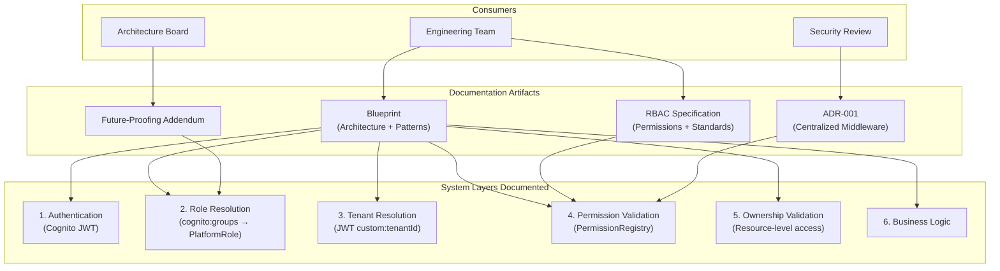
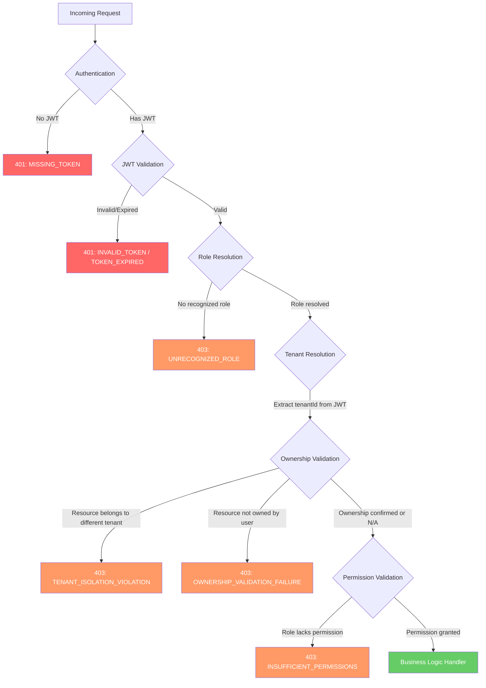
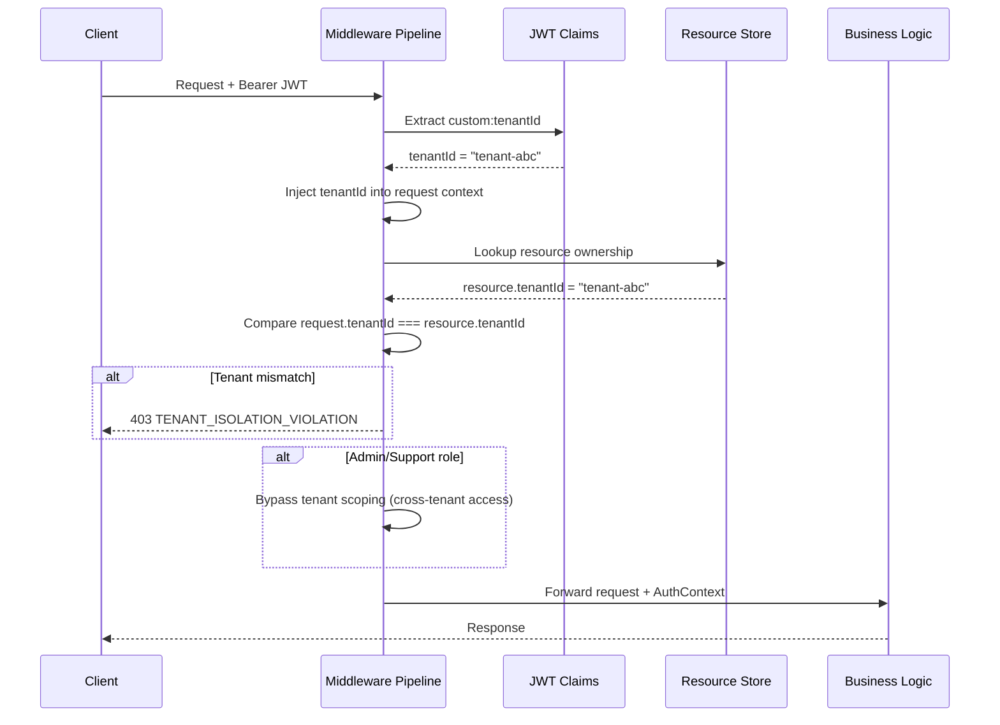
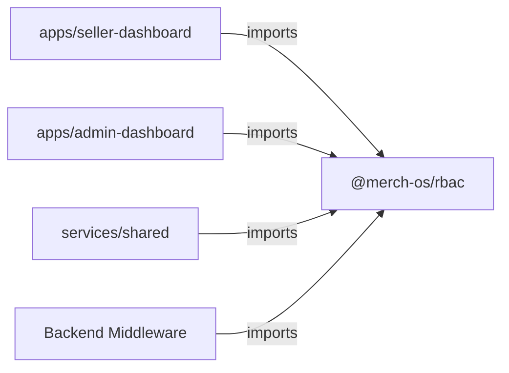

# Design Document: RBAC Architecture Update

## Overview

This design specifies the structure, content, and organization of updated architecture documentation for the MerchOS platform RBAC system. The deliverable is documentation only — no application code is generated. The design extends the approved RBAC baseline (`.kiro/specs/rbac-platform-access-control/`) by producing four documentation artifacts:

1. **Blueprint Update** — Extends the existing MerchOS architecture Blueprint with tenant isolation principles, ownership validation patterns, middleware pipeline documentation, shared library specification, and future-proofing guidance.
2. **RBAC Specification Update** — Extends the RBAC specification with expanded permission domains, a standardized permission naming convention, API documentation standards, and a role-permission matrix.
3. **Architecture Decision Record (ADR)** — A standalone ADR documenting the decision to use centralized middleware authorization.
4. **Future-Proofing Addendum** — Configuration-only role expansion procedures, example future role configurations, and governance processes.

### Key Design Decisions

1. **Single-file Blueprint update**: All tenant isolation, ownership validation, middleware pipeline, and shared library documentation is consolidated into one cohesive Blueprint document rather than scattered across multiple files. This makes the Blueprint the authoritative reference for engineers.
2. **Permission naming migrates to `resource.action.scope`**: The existing `resource` + `actions[]` model in `@merch-os/rbac` remains valid at runtime, but the documentation introduces the canonical naming format `resource.action.scope` for human-readable identification, audit logs, and API annotations. The registry data structure does not change.
3. **ADR as a standalone document**: The ADR follows the standard format (Status, Context, Decision, Consequences, Alternatives) and lives alongside the Blueprint for discoverability.
4. **Documentation uses Mermaid diagrams**: All sequence diagrams, flowcharts, and component diagrams use Mermaid syntax for rendering in Markdown viewers and CI tooling.
5. **Backward compatibility**: The documentation extends but does not invalidate the baseline spec. All existing permission definitions and middleware patterns remain valid.

## Architecture

The documentation architecture describes the layered authorization system and its documentation artifacts:



### Middleware Pipeline (Documented Flow)

The Blueprint documents the following pipeline stages that the middleware executes sequentially:



### Tenant Isolation Sequence



## Components and Interfaces

### 1. Blueprint Document Structure

The Blueprint update is organized into the following sections:

| Section | Content | Requirements Addressed |
|---------|---------|----------------------|
| Tenant Isolation Principles | JWT extraction, injection, validation rules | Req 1 |
| Ownership Validation Architecture | Middleware stage, patterns, code examples | Req 2 |
| Middleware Pipeline Specification | Stage ordering, responsibilities, error codes | Req 5 |
| Shared Authorization Library | `@merch-os/rbac` API surface, dependency graph | Req 6 |
| Future-Proofing Guide | Role addition procedure, example configs, governance | Req 9 |

### 2. RBAC Specification Document Structure

| Section | Content | Requirements Addressed |
|---------|---------|----------------------|
| Permission Naming Standard | Format definition, rules, examples | Req 3 |
| Expanded Permission Domains | System, AI, Marketplace, Subscription permissions | Req 4 |
| Role-Permission Matrix | Complete mapping table of roles to permissions | Req 4 |
| API Documentation Standard | Endpoint metadata template, examples | Req 7 |
| Permission Domain Addition Process | Workflow for new domains | Req 4 |

### 3. ADR Document Structure

| Section | Content | Requirements Addressed |
|---------|---------|----------------------|
| Status | "Accepted" | Req 8 |
| Context | Security risks of endpoint-level auth | Req 8 |
| Decision | Centralized middleware authorization | Req 8 |
| Consequences | Benefits and trade-offs | Req 8 |
| Alternatives Considered | Endpoint guards, decorators, API Gateway-only | Req 8 |

### 4. Permission Naming Standard (`resource.action.scope`)

The RBAC Specification introduces the canonical naming format:

```
<resource>.<action>[.<scope>]
```

**Components:**
- **resource**: Lowercase dot-delimited domain noun (e.g., `products`, `system.logs`, `ai.training`, `marketplace.takealot`)
- **action**: Operation type (e.g., `read`, `update`, `manage`, `generate`, `export`)
- **scope**: Optional access boundary qualifier (e.g., `own`, `all`; omitted when scope is implicit)

**Rules:**
- Lowercase only
- Dot-delimited hierarchy
- Maximum 128 characters total
- No special characters except dots (`.`) and hyphens (`-`) within segments
- Every new permission must conform before use

**Examples:**
| Permission Identifier | Resource | Action | Scope |
|----------------------|----------|--------|-------|
| `products.read.own` | products | read | own |
| `products.update.own` | products | update | own |
| `system.logs` | system | logs | (implicit) |
| `ai.generate` | ai | generate | (implicit) |
| `marketplace.takealot.export` | marketplace.takealot | export | (implicit) |
| `subscription.manage` | subscription | manage | (implicit) |

### 5. Expanded Permission Model

**System Domain:**
| Permission | Description | Roles |
|-----------|-------------|-------|
| `system.logs` | View system logs | Admin, Support |
| `system.metrics` | View system metrics | Admin |
| `system.health` | View system health | Admin, Support |
| `system.configuration` | Manage system config | Admin |
| `system.jobs` | Manage background jobs | Admin |

**AI Domain:**
| Permission | Description | Roles |
|-----------|-------------|-------|
| `ai.generate` | Generate AI content | Admin, Seller |
| `ai.images` | Generate AI images | Admin, Seller |
| `ai.catalogue` | AI catalogue operations | Admin, Seller |
| `ai.jobs` | View/manage AI jobs | Admin, Seller |
| `ai.training` | Manage AI training | Admin |

**Marketplace Domain:**
| Permission | Description | Roles |
|-----------|-------------|-------|
| `marketplace.takealot.export` | Export to Takealot | Admin, Seller |
| `marketplace.amazon.export` | Export to Amazon | Admin, Seller |
| `marketplace.makro.export` | Export to Makro | Admin, Seller |
| `marketplace.shopify.export` | Export to Shopify | Admin, Seller |

**Subscription Domain:**
| Permission | Description | Roles |
|-----------|-------------|-------|
| `subscription.view` | View subscription | Admin, Support, Seller |
| `subscription.change` | Change subscription plan | Admin, Seller |
| `subscription.cancel` | Cancel subscription | Admin, Seller |
| `subscription.invoice` | View/download invoices | Admin, Support, Seller |
| `subscription.manage` | Full subscription admin | Admin |

### 6. Ownership Validation Pattern

The Blueprint documents the ownership validation middleware stage:

```typescript
// Documented pattern — architecture reference, not implementation code

interface OwnershipValidationConfig {
  /** Extract the resource identifier from the request */
  extractResourceId: (request: Request) => string | null;
  /** Look up the owner of the resource */
  lookupResourceOwner: (resourceId: string) => Promise<{ ownerId: string; tenantId: string } | null>;
  /** Roles that bypass ownership validation (cross-tenant access) */
  bypassRoles: PlatformRole[];
}

interface OwnershipCheckResult {
  passed: boolean;
  reason?: 'RESOURCE_NOT_FOUND' | 'TENANT_ISOLATION_VIOLATION' | 'OWNERSHIP_VALIDATION_FAILURE';
}
```

**Key principles documented:**
- Business logic handlers NEVER perform ownership checks
- Ownership validation executes AFTER permission validation, BEFORE business logic
- Admin and Support roles bypass tenant-scoped ownership validation
- Seller roles are always validated against `custom:tenantId` from JWT

### 7. Request Context Object

The Blueprint documents the enriched request context passed to business logic:

```typescript
// Documented shape of the request context after all middleware stages pass

interface AuthorizedRequestContext {
  /** Resolved platform role (Admin | Support | Seller | future roles) */
  role: string;
  /** User's unique identifier (JWT sub claim) */
  userId: string;
  /** Tenant identifier extracted from JWT custom:tenantId */
  tenantId: string;
  /** Whether ownership validation was performed and passed */
  ownershipVerified: boolean;
  /** The specific permission that was validated for this request */
  grantedPermission: string;
}
```

### 8. API Documentation Standard Template

Every protected endpoint must document the following metadata:

```yaml
# API Endpoint Documentation Standard
endpoint: POST /api/products
method: POST
authentication: Bearer JWT (Cognito)
required_role: Seller | Admin
required_permission: products.create.own
ownership_required: true
ownership_field: tenantId
tenant_isolation: scoped (Seller) | global (Admin)
error_responses:
  401:
    - code: MISSING_TOKEN
      description: No JWT provided
    - code: TOKEN_EXPIRED
      description: JWT has expired
  403:
    - code: INSUFFICIENT_PERMISSIONS
      description: Role lacks required permission
    - code: TENANT_ISOLATION_VIOLATION
      description: Resource belongs to another tenant
    - code: OWNERSHIP_VALIDATION_FAILURE
      description: User does not own the resource
```

### 9. Shared Library (`@merch-os/rbac`) Documentation

The Blueprint documents the public API surface of the shared package:

| Export | Type | Description |
|--------|------|-------------|
| `PermissionRegistry` | Class | Permission lookup engine |
| `defaultPermissionConfig` | Object | Default role-permission mapping |
| `resolveRoleFromClaims` | Function | JWT claims → PlatformRole resolution |
| `createAuthorizationCheck` | Function | Factory for middleware authorization |
| `filterNavigationItems` | Function | Role-based navigation filtering |
| `RequireAdmin` | Component | Admin-only UI guard |
| `RequireSupport` | Component | Admin/Support UI guard |
| `RequireSeller` | Component | Seller-only UI guard |
| `RequirePermission` | Component | Permission-based UI guard |

**Dependency Relationship:**


**Versioning strategy:** All consumer applications pin the same version of `@merch-os/rbac` within a release. The package uses workspace protocol (`workspace:*`) in the monorepo, ensuring all apps and services always consume the same version.

### 10. Future Role Addition Procedure

The Blueprint documents the configuration-only procedure:

1. **Create Cognito Group** — Add the new group to the Cognito User Pool (e.g., `Finance`)
2. **Update `@merch-os/rbac` config** — Add a role entry with permissions to `defaultPermissionConfig`
3. **Assign users** — Add users to the new Cognito Group
4. **No code changes required** — Middleware, guards, and navigation automatically pick up the new role

**Example future role configurations:**

| Role | Projected Permissions |
|------|----------------------|
| Finance | `subscription.manage`, `billing.read`, `billing.update`, `analytics.read`, `subscription.invoice` |
| Developer | `system.logs`, `system.metrics`, `system.health`, `system.jobs`, `ai.training`, `infrastructure.read` |
| Enterprise Customer | `products.read.own`, `analytics.read`, `exports.read`, `marketplace.*.export` |

## Data Models

### Permission Naming Standard Schema

```typescript
/** Canonical permission identifier following resource.action.scope format */
interface PermissionIdentifier {
  /** Full canonical name, e.g., "products.read.own" */
  canonical: string;
  /** Parsed resource component */
  resource: string;
  /** Parsed action component */
  action: string;
  /** Parsed scope component (optional) */
  scope?: string;
}

/** Validation rules for permission identifiers */
interface PermissionNamingRules {
  maxLength: 128;
  allowedCharacters: RegExp; // /^[a-z][a-z0-9.\-]*$/
  separators: '.';
  requiredComponents: ['resource', 'action'];
  optionalComponents: ['scope'];
}
```

### Role-Permission Matrix (Data Model)

```typescript
/** Extended permission configuration for expanded domains */
interface ExpandedPermissionConfig extends PermissionRegistryConfig {
  roles: Array<{
    roleId: string;
    permissions: Array<{
      resource: string;          // dot-delimited resource path
      actions: Action[];         // CRUD subset
      scope?: 'own' | 'all';    // access boundary (documented, not enforced in registry)
    }>;
    /** Metadata for documentation */
    description?: string;
    tenantScoped: boolean;       // whether this role is tenant-isolated
    bypassOwnership: boolean;   // whether this role bypasses ownership checks
  }>;
}
```

### ADR Document Schema

```typescript
/** Architecture Decision Record structure */
interface ArchitectureDecisionRecord {
  id: string;                    // "ADR-001"
  title: string;                 // "Centralized Middleware Authorization"
  status: 'Proposed' | 'Accepted' | 'Deprecated' | 'Superseded';
  date: string;                  // ISO 8601 date
  context: string;               // Problem description
  decision: string;              // What was decided
  consequences: {
    benefits: string[];
    tradeoffs: string[];
  };
  alternativesConsidered: Array<{
    name: string;
    description: string;
    rejectionReason: string;
  }>;
}
```

### API Endpoint Documentation Schema

```typescript
/** Standard metadata for every protected API endpoint */
interface ApiEndpointDocumentation {
  endpoint: string;              // e.g., "POST /api/products"
  method: 'GET' | 'POST' | 'PUT' | 'PATCH' | 'DELETE';
  authentication: 'Bearer JWT (Cognito)';
  requiredRole: string[];        // e.g., ['Seller', 'Admin']
  requiredPermission: string;    // canonical permission identifier
  ownershipRequired: boolean;
  ownershipField?: string;       // field used for ownership check
  tenantIsolation: 'scoped' | 'global' | 'none';
  errorResponses: {
    401: Array<{ code: string; description: string }>;
    403: Array<{ code: string; description: string }>;
  };
}
```

### Middleware Stage Documentation Schema

```typescript
/** Documentation for each middleware pipeline stage */
interface MiddlewareStageDoc {
  order: number;                 // 1-based position in pipeline
  name: string;                  // e.g., "Authentication"
  inputs: string[];              // what it reads from the request
  outputs: string[];             // what it adds to the context
  failureModes: Array<{
    condition: string;
    httpStatus: 401 | 403;
    errorCode: string;
    errorMessage: string;
  }>;
  description: string;
}
```

## Error Handling

Since the deliverable is architecture documentation, error handling refers to documentation standards for error responses rather than runtime behavior.

### Documented Error Response Standards

The Blueprint and RBAC Specification document the following structured error response format for all authorization failures:

```json
{
  "error": {
    "code": "MACHINE_READABLE_CODE",
    "message": "Human-readable description of the failure",
    "details": {
      "requiredPermission": "products.update.own",
      "userRole": "Seller",
      "stage": "OWNERSHIP_VALIDATION"
    }
  }
}
```

### Error Code Registry (Documented)

| Stage | HTTP Status | Error Code | Description |
|-------|------------|------------|-------------|
| Authentication | 401 | `MISSING_TOKEN` | No JWT provided |
| JWT Validation | 401 | `INVALID_TOKEN` | Malformed or invalid signature |
| JWT Validation | 401 | `TOKEN_EXPIRED` | JWT `exp` claim in the past |
| JWT Validation | 401 | `INVALID_ISSUER` | `iss` doesn't match Cognito Pool |
| Role Resolution | 403 | `MISSING_GROUP` | No `cognito:groups` claim |
| Role Resolution | 403 | `UNRECOGNIZED_ROLE` | Groups don't match any Platform_Role |
| Tenant Resolution | 403 | `TENANT_ISOLATION_VIOLATION` | Resource belongs to different tenant |
| Ownership Validation | 403 | `OWNERSHIP_VALIDATION_FAILURE` | User doesn't own the resource |
| Permission Validation | 403 | `INSUFFICIENT_PERMISSIONS` | Role lacks required permission |

### Documentation Validation Rules

To ensure documentation quality and completeness:

1. **Every endpoint must have complete API documentation metadata** — Missing fields make the endpoint non-compliant.
2. **Every permission identifier must conform to naming standard** — Non-conforming identifiers are rejected during documentation review.
3. **Every new role must have a governance proposal** — Undocumented roles cannot be added to the system.
4. **Sequence diagrams must cover all failure paths** — Diagrams that only show the happy path are incomplete.

## Testing Strategy

Since this feature produces architecture documentation only (no application code), property-based testing does not apply. The deliverables are specification documents, ADRs, and architecture diagrams — not functions with inputs and outputs.

**Why PBT is NOT applicable:** The output of this feature is prose documentation, tables, diagrams, and configuration schemas. There are no pure functions, data transformations, or algorithms to validate with generated inputs. The correctness of documentation is validated through human review and structural completeness checks, not automated property assertions.

### Documentation Validation Approach

1. **Structural completeness review** — Verify every requirement's acceptance criteria maps to a documented section with the specified content.
2. **Cross-reference validation** — Verify that all permission identifiers in the RBAC Specification match the naming standard, and that all roles in the matrix have corresponding Cognito Group definitions.
3. **Diagram accuracy review** — Verify sequence diagrams and flowcharts accurately reflect the middleware pipeline stages and their ordering.
4. **Template conformance** — Verify API documentation examples follow the declared standard template with all required fields.
5. **Backward compatibility check** — Verify the documentation does not contradict or invalidate the existing RBAC baseline spec.
6. **Example completeness** — Verify the three representative endpoint examples (Admin, Support, Seller) are present and complete.
7. **Future role configuration examples** — Verify at least three future role configurations (Finance, Developer, Enterprise Customer) are documented with projected permissions.

### Review Criteria

| Check | Method | Pass Criteria |
|-------|--------|---------------|
| All 9 requirements addressed | Section mapping | Every acceptance criterion has corresponding documentation |
| Permission naming standard complete | Manual review | Format, rules, and examples all present |
| Role-permission matrix complete | Cross-reference | All domains × all roles populated |
| ADR follows standard format | Template check | Status, Context, Decision, Consequences, Alternatives present |
| API doc standard has 3 examples | Count check | Admin, Support, and Seller endpoint examples present |
| Mermaid diagrams render | Tooling check | All diagrams produce valid Mermaid output |
| Backward compatibility | Diff review | No contradictions with existing baseline |
