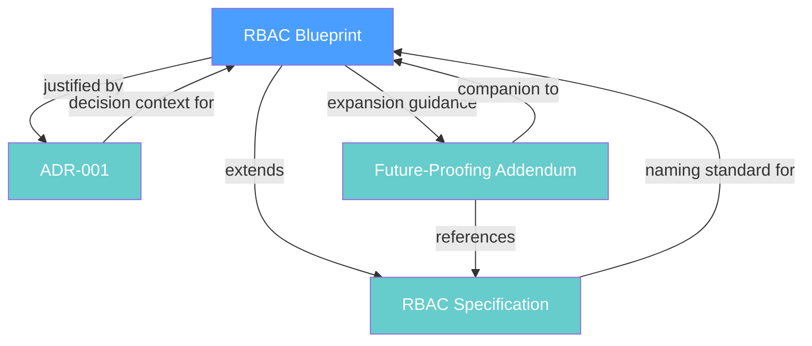
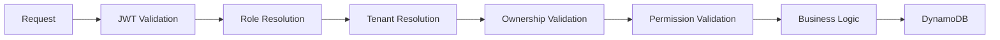

# Design Document

## Overview

This design describes the documentation-only improvements to the MerchOS RBAC architecture documentation suite. The scope is limited to content additions and organizational enhancements across four existing documents:

- `docs/architecture/rbac-blueprint.md` — RBAC Blueprint (primary target)
- `docs/architecture/rbac-specification.md` — RBAC Specification
- `docs/architecture/adr/ADR-001-centralized-middleware-authorization.md` — ADR-001
- `docs/architecture/rbac-future-proofing-addendum.md` — Future-Proofing Addendum

No implementation code is modified. No architectural decisions are changed. The deliverable is polished documentation with new diagrams, principles, patterns, and cross-references.

### Design Rationale

The existing documentation already contains substantial architectural detail (pipeline flowcharts, ownership patterns, stage responsibilities). This polish effort fills specific gaps identified by the engineering team:

1. A simplified "canonical flow" diagram that shows the happy-path pipeline without error branches
2. An explicit security principle callout for "Never Trust the Client"
3. A formal Authorization Context field reference table
4. A clear Lambda vs. middleware responsibility boundary
5. A numbered 10-step lifecycle sequence with inputs/outputs/failure conditions
6. Consistent cross-reference navigation between all RBAC documents

---

## Architecture

This feature does not introduce or modify system architecture. It documents the existing architecture more clearly. The documentation artifacts are static Markdown files stored in the `docs/architecture/` directory and rendered by any Markdown viewer (GitHub, IDE preview, documentation site).

### Document Relationship

The RBAC Blueprint is the primary document. All other documents support it. Cross-references flow bidirectionally but the Blueprint is the "home" document for architectural understanding.

---

## Components and Interfaces

Since this is a documentation-only feature, "components" refer to documentation sections being added or modified.

### Component 1: Canonical Authorization Flow Diagram (Requirement 1)

**Location:** Added to three documents (identical Mermaid code block in each)

- RBAC Blueprint — within Section 3 (Middleware Pipeline Specification)
- RBAC Specification — before the first subsection as an overview visual
- ADR-001 — in the Decision section

**Diagram content:** A simplified Mermaid `flowchart LR` showing the sequential pipeline stages without error branches:

**Design decision:** This diagram intentionally omits error branches (which are already covered by the detailed flowchart in Section 3.2 of the Blueprint). Its purpose is to provide a quick mental model of the happy path. The heading "Canonical Authorization Flow" immediately precedes each placement.

**Distinction from existing Section 3.2 diagram:** The existing Section 3.2 flowchart is a detailed decision tree showing all error codes and failure paths. The new Canonical Authorization Flow is a linear overview diagram — a one-glance reference for the sequential pipeline order without branching logic.

### Component 2: Security Principle Section (Requirement 2)

**Location:** RBAC Blueprint, as a new section (positioned after Tenant Isolation Principles, before Ownership Validation Architecture)

**Format:** Blockquote markup for visual distinction from surrounding prose.

**Content structure:**
1. Section title: "Security Principle — Never Trust the Client"
2. Explanation of why the client is never authoritative (forgery, tampering, replay)
3. Enumerated list of values never trusted from the client: tenantId, role, permissions, ownership claims, resource identifiers
4. Statement that all authorization decisions derive from server-side validated identity through the Middleware Pipeline
5. Statement that the Authorization Context (constructed by middleware) is the trusted source

### Component 3: Authorization Context Section (Requirement 3)

**Location:** RBAC Blueprint, as a new section following the Security Principle section (logically: the principle says "don't trust the client" → the context section says "trust this instead")

**Content structure:**
1. Section title: "Authorization Context"
2. Prose explaining that middleware constructs this trusted object and passes it to Lambda handlers
3. Field reference table with 7 fields (userId, tenantId, role, permissions, ownershipContext, requestId, correlationId)
4. Each field row includes: field name, data type, presence condition (always/conditional), description
5. For conditional fields: explicit statement of when present vs. absent
6. Statement that business logic must consume this context rather than parsing JWTs or querying Cognito

**Design decision:** The existing `AuthorizedRequestContext` interface in Section 3.6 has 5 fields (role, userId, tenantId, ownershipVerified, grantedPermission). The new Authorization Context section documents an expanded 7-field model that includes `permissions` (array), `ownershipContext` (object), `requestId`, and `correlationId`. This represents the full context available to Lambda functions, including fields for observability and debugging. The existing Section 3.6 interface remains as the middleware-internal type; the new section documents the complete Lambda-facing contract.

### Component 4: Lambda Responsibilities Section (Requirement 4)

**Location:** RBAC Blueprint, positioned after the Authorization Context section

**Content structure:**
1. Section title: "Lambda Responsibilities"
2. Named principle: "Separation of Concerns: Middleware vs. Lambda"
3. Two-column table or side-by-side lists:
   - **Middleware responsibilities:** JWT parsing, role resolution, permission resolution, tenant resolution, ownership validation
   - **Lambda responsibilities:** Data persistence (CRUD), business rule execution, external service integration, response construction, domain-specific transformations
4. Explicit statement: Lambda functions receive a pre-validated Authorization Context and must consume it as the sole source of identity/authorization
5. Complete enumeration such that any operation can be classified into exactly one category

**Design decision:** Although Section 3.5 already contains a "Business Logic Separation Principle" with a bullet list, the new section provides a more formal, visually distinct presentation using a comparison table. The existing Section 3.5 content remains and receives a cross-reference to the new Lambda Responsibilities section.

### Component 5: Authorization Sequence (Requirement 5)

**Location:** RBAC Blueprint, positioned after Lambda Responsibilities (or as a subsection within the Middleware Pipeline Specification section)

**Content structure:**
1. Section title: "Authorization Lifecycle Sequence"
2. Label: "Standard Authorization Lifecycle"
3. Numbered list of exactly 10 steps:
   1. Receive Request
   2. Validate JWT
   3. Resolve Cognito Groups
   4. Resolve Platform Role
   5. Resolve Tenant
   6. Resolve Permissions
   7. Validate Ownership
   8. Execute Business Logic
   9. Write Audit Log
   10. Return Response
4. Each step includes: input, output, responsibility
5. For steps that can terminate the pipeline early (steps 2–7): failure condition and resulting behavior

**Design decision:** This 10-step sequence is more granular than the existing 7-stage pipeline (Section 3.1). The difference is that the 10-step lifecycle splits certain stages (e.g., "Role Resolution" splits into "Resolve Cognito Groups" + "Resolve Platform Role") and adds post-business-logic steps (Audit Log, Return Response). This provides a complete request lifecycle view from receipt to response, including observability concerns.

### Component 6: Cross-Reference Index (Requirement 6)

**Location:** RBAC Blueprint, as a new section at the end of the document

**Content structure:**
1. Section title: "Related Architecture Documents"
2. Table with columns: Document Name (hyperlinked), Relationship Description
3. Entries for:
   - API Blueprint → relationship to RBAC
   - Security Architecture → relationship to RBAC
   - Authentication Architecture → relationship to RBAC
   - ADR-001 → relationship to RBAC
   - Shared RBAC Package documentation → relationship to RBAC
4. All references use relative paths
5. If a document does not exist at the specified path, the entry includes a `[pending]` indicator with expected location

**Additional cross-references throughout documents:**
- RBAC Specification gets a cross-reference to the Blueprint's Authorization Context section (instead of restating)
- ADR-001 gets a cross-reference to the Blueprint's pipeline specification
- Future-Proofing Addendum already has cross-references; verify they remain accurate after other additions

---

## Data Models

This feature does not introduce or modify data models. The Authorization Context field reference table documents an existing runtime data structure — it does not define a new one.

### Authorization Context Field Reference (Documentation Only)

The following table will be documented in the Blueprint. It describes the existing runtime context object:

| Field | Type | Presence | Description |
|-------|------|----------|-------------|
| `userId` | `string` | Always | Unique user identifier from JWT `sub` claim |
| `tenantId` | `string` | Always | Tenant identifier from JWT `custom:tenantId` claim |
| `role` | `string` | Always | Resolved Platform Role (Admin, Support, Seller, or configured role) |
| `permissions` | `string[]` | Always | Array of permission identifiers granted to the resolved role |
| `ownershipContext` | `object \| null` | Conditional | Resource ownership details; present when ownership validation was performed on a specific resource, null for list/create operations |
| `requestId` | `string` | Always | Unique identifier for the current request, used for tracing and audit correlation |
| `correlationId` | `string` | Conditional | Correlation identifier for multi-request workflows; present when the client provides an `X-Correlation-Id` header, absent otherwise |

---

## Correctness Properties

Not applicable to this feature. This feature produces only static documentation (Markdown files) with no runtime behavior, no functions, no algorithms, and no data transformations. There is no input space to randomize and no outputs to assert properties on. Property-based testing is not appropriate for documentation-only deliverables.

Verification is performed through manual review checklists, Markdown linting, and link-checking automation (see Testing Strategy below).

---

## Error Handling

This feature does not introduce error handling logic. Documentation changes cannot produce runtime errors.

**Documentation accuracy risk:** If documented patterns (e.g., the Authorization Context fields) diverge from the actual implementation, engineers may write incorrect code. This is mitigated by:

1. Cross-referencing the field table against the existing `AuthorizedRequestContext` TypeScript interface in the Blueprint
2. Noting the expanded fields (permissions, ownershipContext, requestId, correlationId) as the target Lambda contract
3. Using consistent terminology across all documents

---

## Testing Strategy

Since this feature produces only documentation (Markdown files), property-based testing is not applicable. There are no functions, algorithms, or data transformations to test with PBT.

### Verification Approach

**Manual review checklist:**
- [ ] Mermaid diagrams render correctly in GitHub Markdown preview
- [ ] The Canonical Authorization Flow diagram appears identically in all three documents
- [ ] The "Canonical Authorization Flow" heading exists immediately above each diagram placement
- [ ] The Security Principle section uses blockquote markup and is visually distinct
- [ ] The Authorization Context field reference table includes all 7 fields with type, presence, and description
- [ ] Conditional fields document both the present and absent conditions
- [ ] The Lambda Responsibilities section uses a comparison format (table or two-column list)
- [ ] The 10-step sequence is numbered, labeled as "Standard Authorization Lifecycle", and each step has input/output/responsibility
- [ ] Steps that can fail early document the failure condition and behavior
- [ ] All cross-references use valid relative paths
- [ ] Non-existent reference targets are marked with `[pending]`

**Automated checks (CI-friendly):**
- Markdown lint (consistent formatting, no broken relative links within the repo)
- Mermaid syntax validation (diagrams parse without errors)
- Link checker for relative paths (verify referenced files exist)

### Why PBT Does Not Apply

Property-based testing requires pure functions or clear input/output behavior where universal properties hold across varied inputs. This feature:
- Produces static documentation content (no runtime behavior)
- Has no input space to randomize
- Has no functions to invoke
- Produces no outputs to assert properties on

The appropriate verification method is human review supplemented by linting and link-checking automation.
