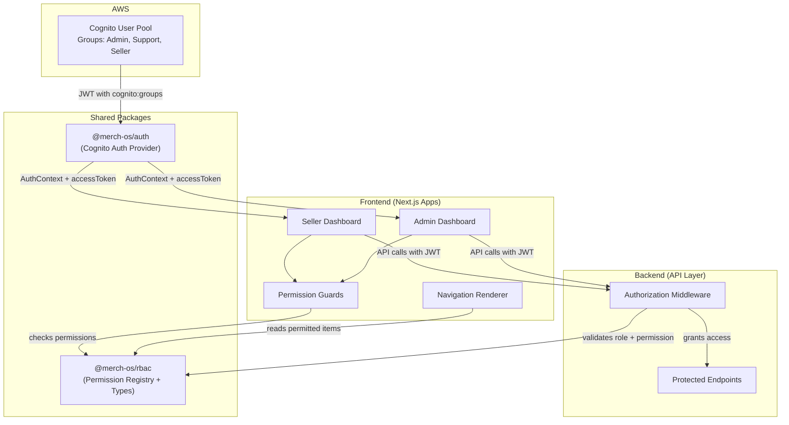
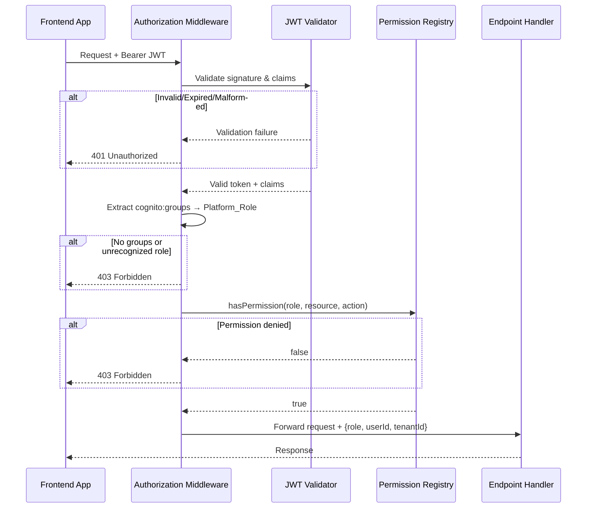

# Design Document: RBAC Platform Access Control

## Overview

This design introduces a centralized Role-Based Access Control (RBAC) system to MerchOS, leveraging the existing Amazon Cognito User Pool infrastructure with three Cognito Groups (Admin, Support, Seller) mapped to Platform Roles. The system adds a shared permission registry package (`@merch-os/rbac`), backend authorization middleware, frontend permission guard components, dynamic navigation rendering, and unauthorized access handling — all designed to be extensible to future roles without code changes.

### Key Design Decisions

1. **New shared package `@merch-os/rbac`**: A dedicated package in `packages/rbac` contains the permission registry, role types, and authorization utilities shared between frontend and backend. This provides a single source of truth.
2. **Data-driven permission model**: Permissions are defined as a configuration object (not code branches). Adding a new role means adding a configuration entry — no guard, middleware, or navigation code changes.
3. **JWT `cognito:groups` claim as role source**: The middleware extracts the platform role from the standard Cognito Groups claim, resolving multiple memberships via a priority hierarchy (Admin > Support > Seller).
4. **Middleware-first enforcement**: All authorization decisions are enforced at the API layer before business logic executes. Frontend guards provide UX convenience but are not the security boundary.
5. **Composition over hierarchy**: Permission guards compose via React children pattern, making them declarative and reusable across both dashboards.

## Architecture



### Request Authorization Flow



## Components and Interfaces

### 1. `@merch-os/rbac` Package

A new shared package providing the permission registry, role types, and authorization utilities.

```typescript
// packages/rbac/src/types.ts

/** Platform-level roles derived from Cognito Groups */
export type PlatformRole = 'Admin' | 'Support' | 'Seller';

/** Allowed CRUD actions */
export type Action = 'create' | 'read' | 'update' | 'delete';

/** A single permission entry: resource + allowed actions */
export interface Permission {
  resource: string; // dot-delimited, max 128 chars, e.g. "products", "users.profile"
  actions: Action[];
}

/** A role entry in the registry */
export interface RoleEntry {
  roleId: PlatformRole | string;
  permissions: Permission[];
}

/** The full permission registry configuration */
export interface PermissionRegistryConfig {
  roles: RoleEntry[];
}

/** Result of a permission check */
export interface PermissionCheckResult {
  granted: boolean;
  reason?: string;
}
```

```typescript
// packages/rbac/src/registry.ts

import type { PlatformRole, Action, PermissionRegistryConfig, RoleEntry, PermissionCheckResult } from './types';

/**
 * Centralized Permission Registry.
 * Data-driven: no if/else or switch/case on role names.
 */
export class PermissionRegistry {
  private readonly roleMap: Map<string, RoleEntry>;

  constructor(config: PermissionRegistryConfig) {
    this.validate(config);
    this.roleMap = new Map(config.roles.map(r => [r.roleId, r]));
  }

  /** Check if a role has a specific permission (resource + action) */
  hasPermission(role: string, resource: string, action: Action): PermissionCheckResult {
    const entry = this.roleMap.get(role);
    if (!entry) {
      return { granted: false, reason: `Unrecognized role: ${role}` };
    }
    const perm = entry.permissions.find(p => p.resource === resource);
    if (!perm || !perm.actions.includes(action)) {
      return { granted: false, reason: `Role '${role}' lacks '${action}' on '${resource}'` };
    }
    return { granted: true };
  }

  /** Get all permissions for a role */
  getPermissionsForRole(role: string): Permission[] | null {
    return this.roleMap.get(role)?.permissions ?? null;
  }

  /** Check if a role has access to a given resource (any action) */
  hasResourceAccess(role: string, resource: string): boolean {
    const entry = this.roleMap.get(role);
    if (!entry) return false;
    return entry.permissions.some(p => p.resource === resource);
  }

  /** Validate a registry configuration */
  private validate(config: PermissionRegistryConfig): void {
    const validActions: Action[] = ['create', 'read', 'update', 'delete'];
    for (const role of config.roles) {
      if (!role.roleId || typeof role.roleId !== 'string') {
        throw new Error('Missing or invalid role identifier');
      }
      if (!role.permissions || role.permissions.length === 0) {
        throw new Error(`Role '${role.roleId}' has an empty permission set`);
      }
      for (const perm of role.permissions) {
        if (!perm.resource || perm.resource.length > 128) {
          throw new Error(`Invalid resource identifier in role '${role.roleId}'`);
        }
        for (const action of perm.actions) {
          if (!validActions.includes(action)) {
            throw new Error(`Invalid action '${action}' in role '${role.roleId}'`);
          }
        }
      }
    }
  }
}
```

```typescript
// packages/rbac/src/config.ts — Default MerchOS permission configuration

import type { PermissionRegistryConfig } from './types';

export const defaultPermissionConfig: PermissionRegistryConfig = {
  roles: [
    {
      roleId: 'Seller',
      permissions: [
        { resource: 'products', actions: ['create', 'read', 'update', 'delete'] },
        { resource: 'suppliers', actions: ['create', 'read', 'update', 'delete'] },
        { resource: 'ai-listings', actions: ['create', 'read', 'update', 'delete'] },
        { resource: 'analytics', actions: ['read'] },
        { resource: 'exports', actions: ['create', 'read'] },
        { resource: 'subscription', actions: ['read', 'update'] },
      ],
    },
    {
      roleId: 'Support',
      permissions: [
        { resource: 'users.search', actions: ['read'] },
        { resource: 'users.profile', actions: ['read'] },
        { resource: 'processing-jobs', actions: ['read'] },
        { resource: 'logs', actions: ['read'] },
        { resource: 'users.verification', actions: ['create'] }, // resend verification email
      ],
    },
    {
      roleId: 'Admin',
      permissions: [
        { resource: 'products', actions: ['create', 'read', 'update', 'delete'] },
        { resource: 'suppliers', actions: ['create', 'read', 'update', 'delete'] },
        { resource: 'ai-listings', actions: ['create', 'read', 'update', 'delete'] },
        { resource: 'analytics', actions: ['create', 'read', 'update', 'delete'] },
        { resource: 'exports', actions: ['create', 'read', 'update', 'delete'] },
        { resource: 'subscription', actions: ['create', 'read', 'update', 'delete'] },
        { resource: 'users', actions: ['create', 'read', 'update', 'delete'] },
        { resource: 'users.search', actions: ['read'] },
        { resource: 'users.profile', actions: ['read', 'update'] },
        { resource: 'users.verification', actions: ['create'] },
        { resource: 'processing-jobs', actions: ['create', 'read', 'update', 'delete'] },
        { resource: 'logs', actions: ['read'] },
        { resource: 'platform-settings', actions: ['create', 'read', 'update', 'delete'] },
        { resource: 'billing', actions: ['create', 'read', 'update', 'delete'] },
        { resource: 'infrastructure', actions: ['read', 'update'] },
        { resource: 'tenants', actions: ['create', 'read', 'update', 'delete'] },
        { resource: 'compliance', actions: ['create', 'read', 'update', 'delete'] },
        { resource: 'taxonomy', actions: ['create', 'read', 'update', 'delete'] },
        { resource: 'alerts', actions: ['read', 'update'] },
        { resource: 'audit-log', actions: ['read'] },
      ],
    },
  ],
};
```

### 2. JWT Token Parsing & Role Resolution

```typescript
// packages/rbac/src/jwt.ts

import type { PlatformRole } from './types';

/** Role priority for resolving multiple group memberships */
const ROLE_PRIORITY: Record<PlatformRole, number> = {
  Admin: 3,
  Support: 2,
  Seller: 1,
};

const VALID_ROLES: Set<string> = new Set(['Admin', 'Support', 'Seller']);

export interface JwtClaims {
  sub: string;
  iss: string;
  exp: number;
  'cognito:groups'?: string[];
  'custom:tenantId'?: string;
  [key: string]: unknown;
}

export interface RoleResolutionResult {
  success: true;
  role: PlatformRole;
  userId: string;
  tenantId?: string;
} | {
  success: false;
  errorCode: string;
  message: string;
  httpStatus: 401 | 403;
}

/**
 * Resolve Platform_Role from JWT claims.
 * Uses highest-privilege group when multiple memberships exist.
 */
export function resolveRoleFromClaims(claims: JwtClaims, expectedIssuer: string): RoleResolutionResult {
  // Verify issuer
  if (claims.iss !== expectedIssuer) {
    return { success: false, errorCode: 'INVALID_ISSUER', message: 'Token issuer mismatch', httpStatus: 401 };
  }

  // Check expiration
  const now = Math.floor(Date.now() / 1000);
  if (claims.exp <= now) {
    return { success: false, errorCode: 'TOKEN_EXPIRED', message: 'Token has expired', httpStatus: 401 };
  }

  // Extract groups
  const groups = claims['cognito:groups'];
  if (!groups || !Array.isArray(groups) || groups.length === 0) {
    return { success: false, errorCode: 'MISSING_GROUP', message: 'No cognito:groups claim present', httpStatus: 403 };
  }

  // Filter to recognized roles and resolve highest priority
  const recognizedRoles = groups.filter(g => VALID_ROLES.has(g)) as PlatformRole[];
  if (recognizedRoles.length === 0) {
    return { success: false, errorCode: 'UNRECOGNIZED_ROLE', message: 'No recognized platform role in groups', httpStatus: 403 };
  }

  const resolvedRole = recognizedRoles.reduce((highest, current) =>
    ROLE_PRIORITY[current] > ROLE_PRIORITY[highest] ? current : highest
  );

  return {
    success: true,
    role: resolvedRole,
    userId: claims.sub,
    tenantId: claims['custom:tenantId'],
  };
}
```

### 3. Backend Authorization Middleware

```typescript
// packages/rbac/src/middleware.ts

import type { Action } from './types';
import { PermissionRegistry } from './registry';
import { resolveRoleFromClaims } from './jwt';
import type { JwtClaims } from './jwt';

/** Endpoint authorization annotation */
export interface EndpointPermission {
  resource: string;
  action: Action;
}

/** Context attached to request after successful authorization */
export interface AuthorizationContext {
  role: string;
  userId: string;
  tenantId?: string;
}

/** Structured error response for 401/403 */
export interface AuthErrorResponse {
  error: {
    code: string;
    message: string;
  };
}

/**
 * Creates an authorization middleware function.
 * Framework-agnostic: returns a check function that can be adapted
 * to Express, API Gateway Lambda authorizer, or Next.js middleware.
 */
export function createAuthorizationCheck(
  registry: PermissionRegistry,
  expectedIssuer: string,
) {
  return function authorize(
    claims: JwtClaims | null,
    endpoint: EndpointPermission,
  ): { authorized: true; context: AuthorizationContext } | { authorized: false; status: 401 | 403; body: AuthErrorResponse } {
    // No claims = no JWT provided
    if (!claims) {
      return {
        authorized: false,
        status: 401,
        body: { error: { code: 'MISSING_TOKEN', message: 'Authentication required' } },
      };
    }

    // Resolve role from claims
    const resolution = resolveRoleFromClaims(claims, expectedIssuer);
    if (!resolution.success) {
      return {
        authorized: false,
        status: resolution.httpStatus,
        body: { error: { code: resolution.errorCode, message: resolution.message } },
      };
    }

    // Check permission
    const check = registry.hasPermission(resolution.role, endpoint.resource, endpoint.action);
    if (!check.granted) {
      return {
        authorized: false,
        status: 403,
        body: { error: { code: 'INSUFFICIENT_PERMISSIONS', message: check.reason ?? 'Access denied' } },
      };
    }

    return {
      authorized: true,
      context: {
        role: resolution.role,
        userId: resolution.userId,
        tenantId: resolution.tenantId,
      },
    };
  };
}
```

### 4. Frontend Permission Guard Components

```typescript
// packages/rbac/src/components/PermissionGuard.tsx
'use client';

import React from 'react';
import type { PlatformRole, Action } from '../types';
import { PermissionRegistry } from '../registry';

interface PermissionGuardProps {
  children: React.ReactNode;
  registry: PermissionRegistry;
  userRole: PlatformRole | null;
  isResolved: boolean; // whether auth state has been determined
}

/** Base guard: renders nothing while unresolved or when role is null */
function BaseGuard({ children, userRole, isResolved, check }: PermissionGuardProps & { check: (role: PlatformRole) => boolean }) {
  if (!isResolved || !userRole) return null;
  if (!check(userRole)) return null;
  return <>{children}</>;
}

/** RequireAdmin — renders children only for Admin role */
export function RequireAdmin(props: PermissionGuardProps) {
  return <BaseGuard {...props} check={(role) => role === 'Admin'} />;
}

/** RequireSupport — renders children for Admin or Support */
export function RequireSupport(props: PermissionGuardProps) {
  return <BaseGuard {...props} check={(role) => role === 'Admin' || role === 'Support'} />;
}

/** RequireSeller — renders children only for Seller role */
export function RequireSeller(props: PermissionGuardProps) {
  return <BaseGuard {...props} check={(role) => role === 'Seller'} />;
}

/** RequirePermission — renders children if role has specified resource permission */
export function RequirePermission(props: PermissionGuardProps & { resource: string; action?: Action }) {
  const { registry, resource, action = 'read', ...rest } = props;
  return (
    <BaseGuard
      {...rest}
      registry={registry}
      check={(role) => {
        if (!resource || typeof resource !== 'string') return false;
        const result = registry.hasPermission(role, resource, action);
        return result.granted;
      }}
    />
  );
}
```

### 5. Dynamic Navigation Renderer

```typescript
// packages/rbac/src/navigation.ts

import type { PlatformRole, Action } from './types';
import { PermissionRegistry } from './registry';

/** Navigation item with permission requirement */
export interface NavigationItem {
  id: string;
  label: string;
  href: string;
  icon?: string;
  requiredResource: string;
  requiredAction?: Action; // defaults to 'read'
  children?: NavigationItem[];
}

/**
 * Filter navigation items to only those permitted for the given role.
 * Data-driven: reads permissions from the registry at render time.
 */
export function filterNavigationItems(
  items: NavigationItem[],
  role: PlatformRole,
  registry: PermissionRegistry,
): NavigationItem[] {
  return items.reduce<NavigationItem[]>((acc, item) => {
    const action = item.requiredAction ?? 'read';
    const { granted } = registry.hasPermission(role, item.requiredResource, action);
    if (granted) {
      const filteredChildren = item.children
        ? filterNavigationItems(item.children, role, registry)
        : undefined;
      acc.push({ ...item, children: filteredChildren });
    }
    return acc;
  }, []);
}
```

### 6. Unauthorized Access Handling

The `PermissionGuard` at the route level redirects unauthorized users:
- Authenticated but lacking permission → `/access-denied` page
- Unauthenticated → `/login` page

The Access Denied page displays the attempted resource path and provides a link back to the user's permitted dashboard home.

## Data Models

### Permission Registry Schema

```typescript
interface PermissionRegistryConfig {
  roles: Array<{
    roleId: string;            // "Admin" | "Support" | "Seller" | future roles
    permissions: Array<{
      resource: string;        // dot-delimited, max 128 chars
      actions: Action[];       // subset of ['create', 'read', 'update', 'delete']
    }>;
  }>;
}
```

### JWT Token Claims (from Cognito)

```typescript
interface CognitoJwtPayload {
  sub: string;                    // User unique ID
  iss: string;                    // Cognito User Pool URL
  exp: number;                    // Expiration timestamp
  iat: number;                    // Issued at timestamp
  'cognito:groups': string[];     // ["Admin"] or ["Support"] or ["Seller"]
  'custom:tenantId'?: string;     // Seller's tenant ID (not present for Admin/Support)
  email: string;
  // ... other standard claims
}
```

### Authorization Context (attached to request)

```typescript
interface AuthorizationContext {
  role: PlatformRole;       // Resolved from JWT
  userId: string;           // sub claim
  tenantId?: string;        // For tenant-scoped operations
}
```

### Navigation Item Configuration

```typescript
interface NavigationItem {
  id: string;
  label: string;
  href: string;
  icon?: string;
  requiredResource: string;       // maps to permission registry resource
  requiredAction?: Action;        // defaults to 'read'
  children?: NavigationItem[];
}
```

