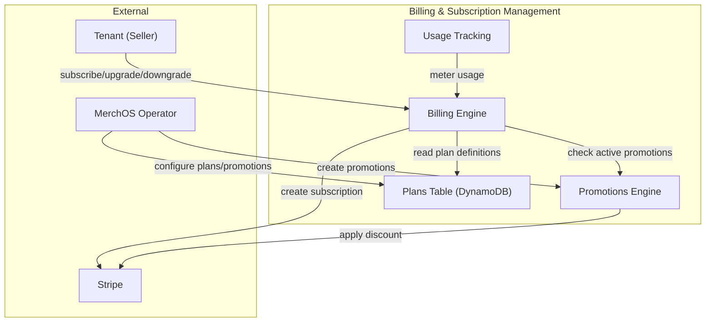
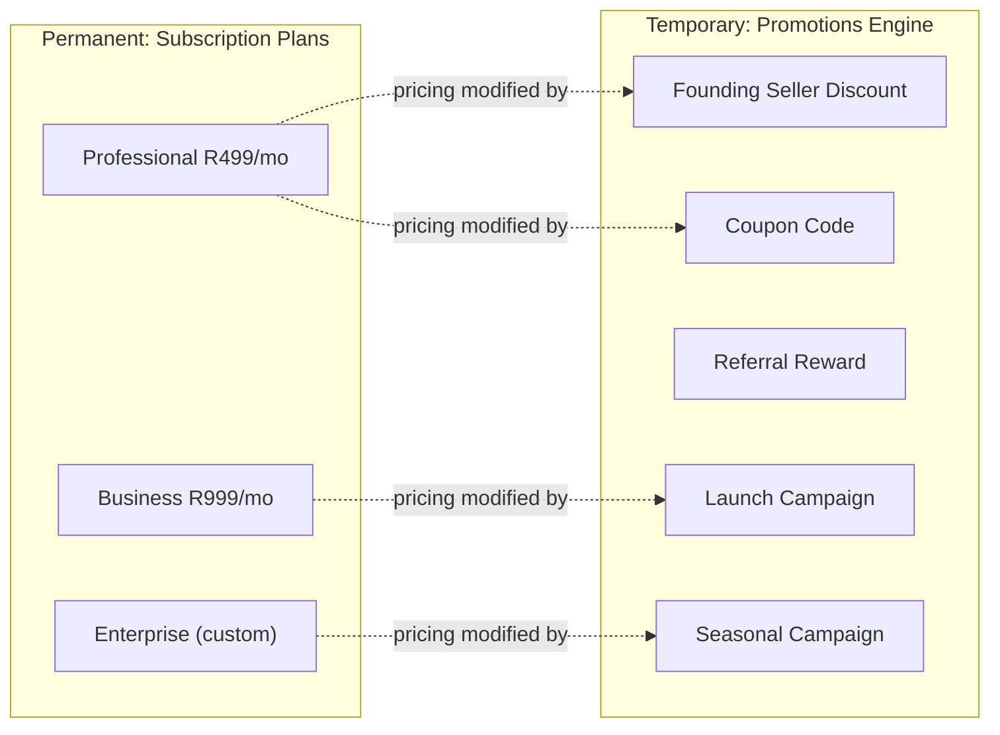

# Design Document: Subscription & Billing Architecture Update

## Overview

This design specifies the content and structural changes to Section 10 (Billing and Subscription Management) of the MerchOS platform design document (``.kiro/specs/merch-os-platform/design.md``). The update replaces the deprecated 4-tier plan model (Starter, Growth, Professional, Enterprise) with an approved 3-tier structure (Professional, Business, Enterprise), introduces a Free Trial acquisition mechanism, documents the Promotions Engine as a distinct subsystem, and establishes an architectural separation between permanent subscription plans and temporary marketing promotions.

**This is a documentation-only deliverable.** No code, Lambda functions, infrastructure-as-code, or application logic is produced. The output is an updated architecture section that serves as the single source of truth for developers implementing the billing subsystem.

### Key Design Decisions

1. **Three tiers, not five** — The previous Launch/Starter and Growth tiers are eliminated. Professional (R499/mo) becomes the entry-level paid plan, Business (R999/mo) targets high-volume sellers, and Enterprise remains custom-priced.
2. **Free Trial as acquisition** — Low-cost entry plans are replaced by a configurable free trial (14 or 30 days) that grants Professional-level features with reduced usage limits.
3. **Promotions Engine as separate subsystem** — The Founding Seller programme is reclassified from a plan tier to a promotion type. All temporary pricing modifications live in the Promotions Engine, architecturally decoupled from subscription plan logic.
4. **Configuration-driven extensibility** — Plan definitions, trial parameters, and promotion types remain stored in DynamoDB config tables, supporting additions without code deployment.

## Architecture

### Billing Subsystem Context



### Architectural Separation: Plans vs Promotions



**Principle:** Subscription plans define *what* a tenant gets (entitlements, limits). Promotions define *how much* a tenant pays temporarily (discounts, campaigns). A promotion never alters feature access or usage limits.

### Upgrade Path


## Components and Interfaces

### Billing Engine (Updated)

**Responsibility**: Stripe subscription lifecycle, plan enforcement, usage metering, PDF invoice generation, prorated upgrades/downgrades, free trial provisioning and conversion.

**AWS Services**: Lambda, DynamoDB, SQS, EventBridge, SES, S3 (PDF invoices), Secrets Manager (Stripe API key).

**Lambda Functions** (documentation scope — no implementation changes):
- `billing-stripe-webhook-fn` — receives Stripe webhook events; processes subscription lifecycle transitions including trial expiry.
- `billing-usage-meter-fn` — triggered by EventBridge for every AI enrichment call, image processing call, CSV export; increments usage counters with atomic updates.
- `billing-limit-enforcer-fn` — reads current plan limits (including trial limits) and usage from DynamoDB; returns ALLOWED or BLOCKED.
- `billing-plan-change-fn` — handles upgrade/downgrade via Stripe API; applies proration; updates plan record.
- `billing-trial-provision-fn` — provisions new tenant with Free Trial status; sets configurable expiry date; applies trial-specific usage limits.
- `billing-trial-conversion-fn` — triggered on trial expiry; converts to paid Professional subscription or suspends access pending payment method.
- `billing-invoice-pdf-fn` — generates and stores PDF invoices.
- `billing-alert-fn` — monitors usage at 80% and 100% thresholds; sends SES alerts.
- `billing-payment-retry-fn` — retries failed payments at day+3 and day+7.

### Promotions Engine (New Subsystem)

**Responsibility**: Manage temporary pricing modifications applied to subscription plans. Supports creation, activation, expiry, and application of promotional discounts via Stripe Coupons and Promotion Codes.

**AWS Services**: Lambda, DynamoDB (Promotions table), EventBridge, EventBridge Scheduler (expiry), Stripe (Coupons API).

**Lambda Functions** (documented architecture):
- `promotions-create-fn` — creates promotion record in DynamoDB; creates corresponding Stripe Coupon; sets mandatory expiry via EventBridge Scheduler.
- `promotions-apply-fn` — applies promotion to tenant's Stripe subscription; validates promotion is active and not expired; records application in billing record.
- `promotions-expire-fn` — triggered by EventBridge Scheduler at promotion expiry; removes Stripe discount; updates promotion status to EXPIRED.
- `promotions-list-fn` — returns active, scheduled, and expired promotions for operator dashboard.

**Promotion Types Supported**:
| Type | Description | Pricing Modification |
|------|-------------|---------------------|
| Founding Seller | Early adopter recognition | Percentage discount for defined period |
| Launch Campaign | Time-limited introductory pricing | Fixed or percentage discount |
| Referral Reward | Credit for referring new tenants | Fixed amount credit |
| Coupon Code | Redeemable promotional code | Percentage or fixed discount |
| Percentage Discount | General percentage reduction | Percentage off monthly fee |
| Fixed Amount Discount | Absolute amount reduction | Fixed ZAR amount off monthly fee |
| Seasonal Campaign | Event-tied promotions (e.g. Black Friday) | Percentage or fixed discount |

**DynamoDB Design — Promotions Table**:
- PK: `PROMO#<promotionId>`, SK: `METADATA`
- Attributes: `type`, `name`, `discountType` (percentage|fixed), `discountValue`, `currency`, `startDate`, `expiryDate`, `status` (DRAFT|ACTIVE|EXPIRED), `maxRedemptions`, `currentRedemptions`, `applicablePlans[]`, `stripeCouponId`
- GSI1: PK `STATUS#<status>`, SK `expiryDate` — query active promotions sorted by expiry

**API Endpoints** (documented architecture):
- `POST /v1/admin/promotions` — create promotion
- `GET /v1/admin/promotions` — list promotions with status filter
- `PUT /v1/admin/promotions/{promotionId}` — update promotion (only DRAFT status)
- `DELETE /v1/admin/promotions/{promotionId}` — cancel promotion
- `POST /v1/billing/promotions/apply` — tenant applies coupon code
- `GET /v1/billing/promotions/active` — tenant views active promotions on their subscription

### Billing Principles Section (New)

The updated architecture document will include a dedicated Billing Principles section establishing:

1. **Separation of concerns** — Subscription Plans and Promotions are independent architectural concepts with separate storage, APIs, and lifecycles.
2. **Plans define entitlements** — A Subscription Plan determines feature access, usage limits, and operational capabilities.
3. **Promotions modify pricing only** — A Promotion temporarily changes what a tenant pays without altering what they can do. No promotion changes usage limits, feature gates, or plan-level entitlements.
4. **Independent lifecycles** — Plans follow: creation → subscription → renewal → upgrade → cancellation. Promotions follow: creation → activation → expiry. These lifecycles are decoupled.
5. **Configuration-driven** — Both plans and promotions are defined in DynamoDB configuration tables, modifiable by operators without code deployment.

### Pricing Philosophy Section (New)

The architecture document will include a Pricing Philosophy section documenting:

- MerchOS is a **professional business platform** — pricing reflects the business value delivered through operational time savings, multi-channel automation, and AI-powered productivity improvements.
- The pricing objective is to **attract serious sellers** who derive measurable ROI from the platform, not to maximise low-value subscription volume.
- Customers subscribe because MerchOS **saves operational time** and improves productivity for their e-commerce operations across multiple channels.
- The tier structure starts at R499/month — there is no entry-level "hobby" tier. The Free Trial serves as the low-barrier acquisition mechanism.

## Data Models

### Subscription Plan Definitions (Updated)

**DynamoDB Plans Table** — configuration-driven, operator-updatable:

```json
{
  "PK": "PLAN#professional",
  "SK": "METADATA",
  "planId": "professional",
  "name": "Professional",
  "priceMonthly": 49900,
  "currency": "ZAR",
  "description": "For independent sellers managing multi-channel e-commerce",
  "highlighted": true,
  "entitlements": {
    "maxProducts": 10000,
    "maxChannels": 4,
    "maxUsers": 5,
    "aiEnrichmentCallsPerMonth": 10000,
    "imageProcessingCallsPerMonth": 5000,
    "csvExportsPerMonth": 100
  },
  "stripePriceId": "price_professional_monthly",
  "isActive": true,
  "sortOrder": 1
}
```

```json
{
  "PK": "PLAN#business",
  "SK": "METADATA",
  "planId": "business",
  "name": "Business",
  "priceMonthly": 99900,
  "currency": "ZAR",
  "description": "For teams, agencies, and high-volume sellers",
  "highlighted": false,
  "entitlements": {
    "maxProducts": 50000,
    "maxChannels": 6,
    "maxUsers": 25,
    "aiEnrichmentCallsPerMonth": 100000,
    "imageProcessingCallsPerMonth": 50000,
    "csvExportsPerMonth": 500
  },
  "stripePriceId": "price_business_monthly",
  "isActive": true,
  "sortOrder": 2
}
```

```json
{
  "PK": "PLAN#enterprise",
  "SK": "METADATA",
  "planId": "enterprise",
  "name": "Enterprise",
  "priceMonthly": null,
  "currency": "ZAR",
  "description": "For large retailers, manufacturers, and distributors",
  "highlighted": false,
  "entitlements": {
    "maxProducts": -1,
    "maxChannels": 6,
    "maxUsers": -1,
    "aiEnrichmentCallsPerMonth": -1,
    "imageProcessingCallsPerMonth": -1,
    "csvExportsPerMonth": -1
  },
  "stripePriceId": null,
  "customPricing": true,
  "isActive": true,
  "sortOrder": 3
}
```

*Note: `-1` denotes "unlimited / defined per contract". Enterprise entitlements are overridden per-tenant in the Tenants table.*

### Free Trial Configuration

```json
{
  "PK": "CONFIG#trial",
  "SK": "METADATA",
  "trialDurationDays": 14,
  "supportedDurations": [14, 30],
  "basePlanId": "professional",
  "trialEntitlements": {
    "maxProducts": 500,
    "maxChannels": 2,
    "maxUsers": 2,
    "aiEnrichmentCallsPerMonth": 500,
    "imageProcessingCallsPerMonth": 200,
    "csvExportsPerMonth": 10
  },
  "conversionBehaviour": "subscribe_or_suspend",
  "isActive": true
}
```

**Trial behaviour**:
- New tenant registration provisions a Free Trial with `trialEntitlements` limits.
- Trial grants access to all Professional Plan *features* but with reduced *usage limits*.
- On expiry: Billing Engine either converts to paid Professional subscription (if payment method on file) or suspends access pending payment method collection.
- Trial duration is read from configuration at runtime — not hardcoded.

### Feature Matrix (Updated)

| Feature | Free Trial | Professional (R499/mo) | Business (R999/mo) | Enterprise (custom) |
|---------|-----------|------------------------|--------------------|--------------------|
| Products | 500 | 10,000 | 50,000 | Unlimited (contract) |
| Channels | 2 | 4 | 6 | 6 |
| Team Members | 2 | 5 | 25 | Unlimited (contract) |
| AI Enrichment Calls/mo | 500 | 10,000 | 100,000 | Custom (contract) |
| Image Processing Calls/mo | 200 | 5,000 | 50,000 | Custom (contract) |
| CSV Exports/mo | 10 | 100 | 500 | Custom (contract) |
| Priority Support | ✗ | ✗ | ✓ | ✓ |
| Dedicated Account Manager | ✗ | ✗ | ✗ | ✓ |
| SAML SSO | ✗ | ✗ | ✓ | ✓ |
| Custom Integrations | ✗ | ✗ | ✗ | ✓ |
| SLA Guarantee | — | 99.9% | 99.9% | Custom (up to 99.99%) |

### Promotion Data Model

```json
{
  "PK": "PROMO#founding-seller-2025",
  "SK": "METADATA",
  "promotionId": "founding-seller-2025",
  "type": "founding_seller",
  "name": "Founding Seller — 50% Off First 6 Months",
  "discountType": "percentage",
  "discountValue": 50,
  "currency": "ZAR",
  "startDate": "2025-02-01T00:00:00Z",
  "expiryDate": "2025-08-01T00:00:00Z",
  "status": "ACTIVE",
  "maxRedemptions": 100,
  "currentRedemptions": 34,
  "applicablePlans": ["professional", "business"],
  "stripeCouponId": "coup_founding2025",
  "createdBy": "admin:operator@merchos.co.za",
  "createdAt": "2025-01-15T10:00:00Z"
}
```

### Tenant Billing Record (Updated)

```json
{
  "PK": "TENANT#<tenantId>",
  "SK": "SUBSCRIPTION#current",
  "planId": "professional",
  "stripeCustomerId": "cus_xxx",
  "stripeSubscriptionId": "sub_xxx",
  "billingCycle": "monthly",
  "currentPeriodStart": "2025-02-01T00:00:00Z",
  "currentPeriodEnd": "2025-03-01T00:00:00Z",
  "status": "active",
  "trialStatus": null,
  "trialExpiresAt": null,
  "activePromotions": [
    {
      "promotionId": "founding-seller-2025",
      "appliedAt": "2025-02-01T00:00:00Z",
      "expiresAt": "2025-08-01T00:00:00Z"
    }
  ]
}
```

For tenants currently in trial:

```json
{
  "PK": "TENANT#<tenantId>",
  "SK": "SUBSCRIPTION#current",
  "planId": "trial",
  "basePlanId": "professional",
  "status": "trialing",
  "trialStatus": "active",
  "trialStartedAt": "2025-01-20T00:00:00Z",
  "trialExpiresAt": "2025-02-03T00:00:00Z",
  "paymentMethodOnFile": false
}
```

### Upgrade/Downgrade Rules

| Transition | Mechanism | Billing |
|-----------|-----------|---------|
| Free Trial → Professional | Auto-convert on expiry (if payment method) or manual | First charge at period start |
| Professional → Business | Self-service via dashboard | Prorated credit + new charge |
| Business → Enterprise | Sales-coordinated | Custom invoice |
| Business → Professional | Self-service downgrade | Takes effect at period end |
| Enterprise → Business/Professional | Requires MerchOS sales coordination | Custom handling |

## Error Handling

Since this is a documentation update (no code deliverable), error handling is documented architecturally rather than implemented:

| Scenario | Documented Behaviour |
|----------|---------------------|
| Trial expires, no payment method | Tenant access suspended; dashboard shows payment collection prompt |
| Trial expires, payment method on file | Auto-convert to Professional plan; Stripe creates first invoice |
| Promotion applied to ineligible plan | Promotions Engine rejects with validation error; no Stripe modification |
| Promotion expired during application | Promotions Engine returns EXPIRED status; no discount applied |
| Plan limits exceeded during trial | billing-limit-enforcer-fn returns BLOCKED; dashboard shows upgrade prompt |
| Deprecated plan reference in code | Architecture document serves as canonical reference; engineers remove stale references during implementation |
| Stripe webhook failure | Existing retry logic (SQS DLQ) unchanged; documented in current architecture |
| Configuration read failure | Billing Engine falls back to cached plan definitions (5-min TTL in Lambda memory) |

## Testing Strategy

**PBT Applicability Assessment:** Property-based testing is **NOT applicable** for this feature. The deliverable is an updated architecture document — there is no application code, no pure functions, no parsers, serializers, or algorithmic logic to validate through automated testing. The output is a Markdown document describing system architecture.

### Appropriate Testing Approach

Since this is a documentation update, validation is achieved through:

1. **Document review** — Architecture document reviewed against all 10 requirements and their acceptance criteria for completeness and accuracy.
2. **Glossary consistency check** — All terms used in the updated section match the defined Glossary in the requirements document.
3. **Cross-reference validation** — Verify no references to deprecated plan names (Launch, Starter, Growth) remain in the updated sections.
4. **Structural integrity** — Verify the Feature Matrix contains exactly three plan columns plus the Free Trial annotation, the Upgrade Path matches the approved progression, and all plan pricing is correctly stated.
5. **Formatting standards** — Verify enterprise SaaS documentation standards: consistent heading levels, defined terminology, Mermaid diagrams render correctly, tables are well-formed.

### Validation Checklist

| Requirement | Validation Method |
|-------------|------------------|
| Req 1: Remove deprecated tiers | Text search for "Launch", "Starter", "Growth" returns zero matches |
| Req 2: Plan structure documented | Feature Matrix has all specified entitlements for all three plans |
| Req 3: Free Trial documented | Trial section specifies configurable duration, reduced limits, conversion behaviour |
| Req 4: Pricing Philosophy | Dedicated section present with all four required statements |
| Req 5: Promotions Engine | Subsystem documented with all seven promotion types |
| Req 6: Architectural separation | Billing Principles section establishes plans ≠ promotions |
| Req 7: Feature Matrix updated | Three columns only; Free Trial annotation present |
| Req 8: Upgrade Path | Progression documented as Trial → Professional → Business → Enterprise |
| Req 9: Future flexibility | Configuration-driven extensibility stated for both plans and promotions |
| Req 10: Scope boundaries | Changes limited to Section 10 and direct plan references |
