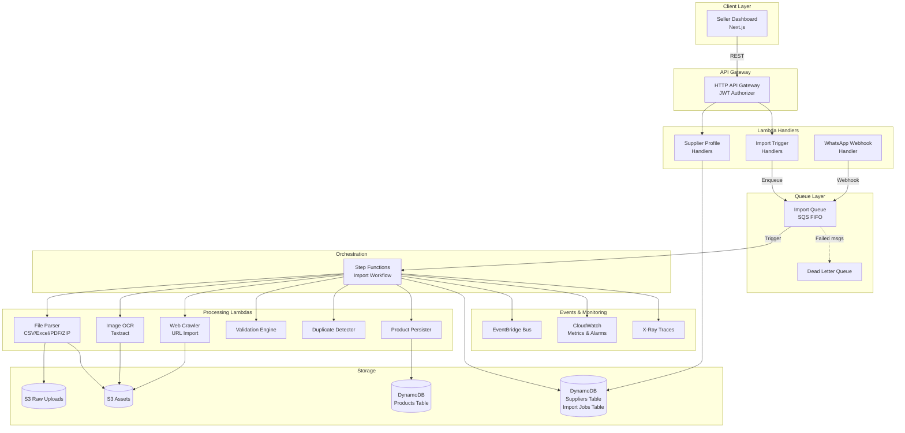
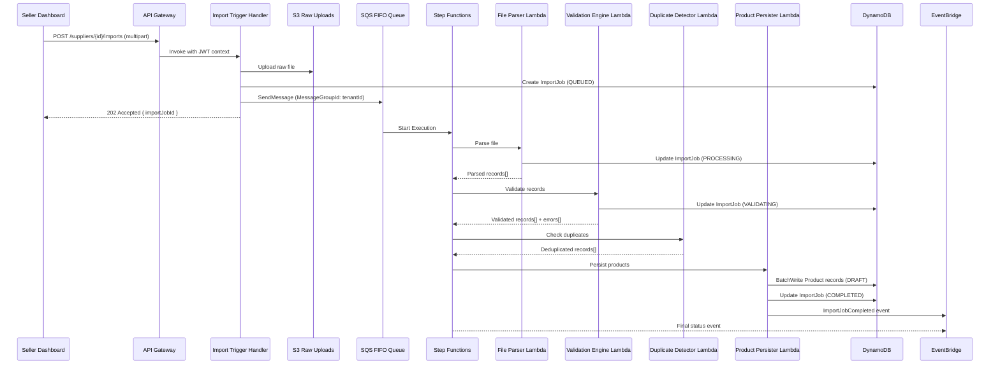
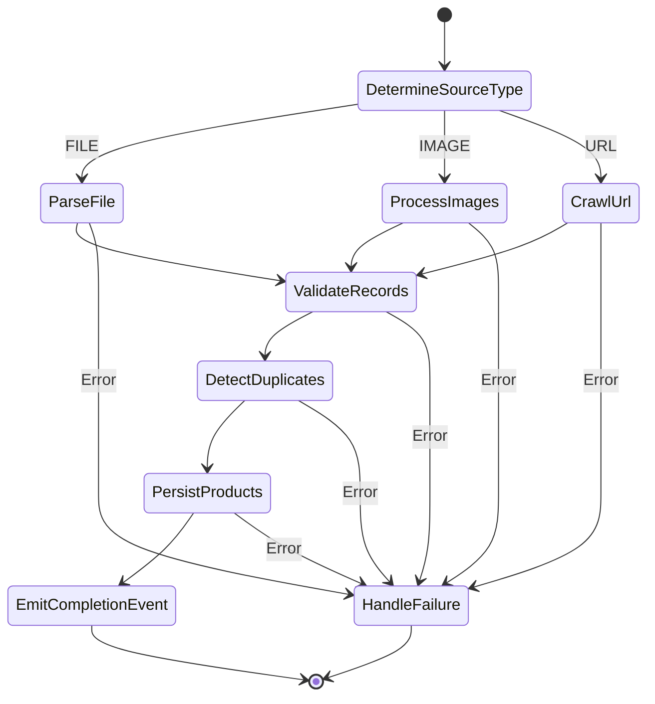

# Supplier Intelligence Platform — Technical Design

## Overview

The Supplier Intelligence Platform extends MerchOS with end-to-end supplier data ingestion capabilities, enabling sellers to import product catalogues from diverse sources (CSV, Excel, PDF, ZIP, images/OCR, WhatsApp, and web URLs) into the existing Product lifecycle pipeline. The system orchestrates background processing via SQS queues and Step Functions state machines, applies schema validation and duplicate detection, and provides real-time dashboard visibility into import progress.

The design integrates with the existing Foundation Stack (S3 buckets, EventBridge bus, KMS keys), the Auth API (Cognito JWT authorizer, RBAC middleware), and the Product data model (DynamoDB with `TENANT#{tenantId}` partition key pattern). All Lambda handlers follow the established middy middleware pipeline with AWS Powertools for structured logging and X-Ray tracing.

**Key design decisions:**
- **Service isolation**: A dedicated `services/supplier-intelligence/` workspace with its own handlers, keeping the import domain separate from auth and product services
- **CDK stack**: A new `SupplierIntelligenceStack` in the infrastructure package, importing Foundation Stack resources via SSM parameters
- **Step Functions orchestration**: Multi-step import workflows (parse → validate → deduplicate → persist) modelled as Express state machines for visibility and retry semantics
- **SQS FIFO queue**: Tenant-scoped message group IDs enable per-tenant FIFO ordering while allowing cross-tenant parallelism
- **Existing Product model**: Import produces `Product` records in DRAFT state using the canonical schema from `services/shared/types/product.types.ts`

## Architecture



### Request Flow — File Import



## Components and Interfaces

### 1. Supplier API (HTTP API Gateway)

| Method | Path | Auth | Rate Limit | Handler |
|--------|------|------|-----------|---------|
| POST | `/suppliers` | JWT + `supplier:manage` | 100/min | createSupplier |
| GET | `/suppliers` | JWT + `supplier:manage` | 100/min | listSuppliers |
| GET | `/suppliers/{supplierId}` | JWT + `supplier:manage` | 100/min | getSupplier |
| PUT | `/suppliers/{supplierId}` | JWT + `supplier:manage` | 100/min | updateSupplier |
| GET | `/suppliers/{supplierId}/versions` | JWT + `supplier:manage` | 100/min | getSupplierVersions |
| POST | `/suppliers/{supplierId}/imports/file` | JWT + `supplier:manage` | 10/min | triggerFileImport |
| POST | `/suppliers/{supplierId}/imports/images` | JWT + `supplier:manage` | 10/min | triggerImageImport |
| POST | `/suppliers/{supplierId}/imports/url` | JWT + `supplier:manage` | 10/min | triggerUrlImport |
| GET | `/imports` | JWT + `supplier:manage` | 100/min | listImportJobs |
| GET | `/imports/{importJobId}` | JWT + `supplier:manage` | 100/min | getImportJob |
| GET | `/suppliers/{supplierId}/imports` | JWT + `supplier:manage` | 100/min | getSupplierImports |
| POST | `/webhooks/whatsapp` | HMAC Signature | N/A | whatsAppWebhook |

### 2. Lambda Handlers (services/supplier-intelligence/handlers/)

Each handler uses the established middy middleware pipeline:

```typescript
import middy from '@middy/core';
import { withPowertools, rbacMiddleware, tenantContextMiddleware, rateLimitMiddleware, inputValidationMiddleware } from '@merch-os/shared/middleware';

export const handler = middy(baseHandler)
  .use(withPowertools())
  .use(tenantContextMiddleware())
  .use(rbacMiddleware({ requiredPermission: 'supplier:manage' }))
  .use(rateLimitMiddleware({ maxRequests: 100, windowMs: 60000 }))
  .use(inputValidationMiddleware({ schema: createSupplierSchema }));
```

### 3. Step Functions State Machine — Import Workflow



**Retry configuration per step:**
- Transient errors: 3 retries, exponential backoff (base 2s)
- DynamoDB throttling: 5 retries, exponential backoff with jitter (base 1s)
- S3 upload failures: 3 retries, exponential backoff

### 4. Import Processing Lambdas

| Lambda | Responsibility | Key Dependencies |
|--------|---------------|------------------|
| `file-parser` | CSV/Excel/PDF/ZIP parsing and field mapping | `csv-parse`, `exceljs`, `pdf-parse` |
| `image-processor` | OCR text extraction from product images | AWS Textract |
| `url-crawler` | Web page fetching, robots.txt parsing, product extraction | `cheerio`, `robots-parser` |
| `validation-engine` | Schema validation, type coercion, price normalisation | `zod` |
| `duplicate-detector` | SKU matching, title similarity scoring | String similarity algorithms |
| `product-persister` | Batch DynamoDB writes, Product record creation in DRAFT state | DynamoDB DocumentClient |

### 5. URL Import Engine — Crawl Architecture

```typescript
interface CrawlConfig {
  maxDepth: number;          // Default: 3
  rateLimit: number;         // Max 1 req/sec/domain
  circuitBreakerThreshold: number;  // 5 consecutive failures
  circuitBreakerPauseMs: number;    // 120000ms pause
  resumable: boolean;        // Persist progress for resumption
}
```

The URL Import Engine operates as a state-machine within the Step Functions workflow:
1. **Fetch robots.txt** → Parse allowed/disallowed paths
2. **Discover pages** → BFS traversal respecting depth limit and pagination
3. **Extract products** → Parse product data from HTML using CSS selectors
4. **Download images** → Store in S3 assets bucket
5. **Record statistics** → Log crawl metrics

### 6. Validation Engine

```typescript
interface ValidationResult {
  totalRecords: number;
  passed: number;
  failed: number;
  records: ValidatedRecord[];
  fieldErrorCounts: Record<string, number>;
}

interface ValidatedRecord {
  record: Partial<Product>;
  status: 'VALID' | 'VALIDATION_FAILED';
  errors: FieldError[];
  coercions: FieldCoercion[];
}
```

**Validation rules:**
- Required fields: `title`, `sku`, and at least one of (`images[0]` OR `description`)
- Price normalisation: Strip currency symbols (`$`, `€`, `£`, `¥`), remove thousand separators, parse to float
- Type coercion: Attempt string → number for price fields, string → date for date fields
- Flag for review if coercion fails

### 7. Duplicate Detector

```typescript
interface DuplicateCheckResult {
  isDuplicate: boolean;
  matchType: 'SKU_EXACT' | 'TITLE_SIMILAR' | null;
  matchedProductId: string | null;
  similarityScore: number | null;
}

type DuplicateStrategy = 'SKIP' | 'MERGE' | 'CREATE_FLAGGED';
```

**Detection algorithm:**
1. Exact SKU match (primary): Query Products table GSI on `sku` within tenant scope
2. Title similarity (secondary): Normalised Levenshtein distance, threshold 0.85
3. Apply supplier-configured strategy (SKIP, MERGE, or CREATE_FLAGGED)

### 8. Import Dashboard (Frontend)

New route group at `apps/seller-dashboard/app/(dashboard)/imports/`:
- `page.tsx` — Paginated import job list with filters (status, supplier, source type, date range)
- `[importJobId]/page.tsx` — Import job detail view with progress, statistics, and error report
- `components/ImportProgress.tsx` — Real-time progress bar with WebSocket/polling
- `components/ImportFilters.tsx` — Filter controls for the job list
- `components/ValidationErrorReport.tsx` — Downloadable error report table

Uses existing patterns: `@tanstack/react-query` for data fetching, `zustand` for local state, `recharts` for statistics visualisation, Radix UI primitives for accessible controls.

## Data Models

### Suppliers Table (DynamoDB)

| Attribute | Type | Description |
|-----------|------|-------------|
| PK | String | `TENANT#{tenantId}` |
| SK | String | `SUPPLIER#{supplierId}` |
| GSI1PK | String | `TENANT#{tenantId}` |
| GSI1SK | String | `SUPPLIER#CREATED#{createdAt}` |
| supplierId | String | UUID v4 |
| tenantId | String | From JWT claims |
| name | String | Supplier business name |
| contactEmail | String | Primary contact email |
| contactPhone | String | Contact phone number |
| website | String | Supplier website URL |
| notes | String | Free-text notes |
| duplicateStrategy | String | `SKIP` \| `MERGE` \| `CREATE_FLAGGED` |
| version | Number | Auto-incrementing version |
| createdAt | String | ISO 8601 |
| updatedAt | String | ISO 8601 |

**Version History:** Stored as additional sort key items:
- SK: `SUPPLIER#{supplierId}#VERSION#{version}` — contains the full snapshot of that version

### Import Jobs Table (DynamoDB)

| Attribute | Type | Description |
|-----------|------|-------------|
| PK | String | `TENANT#{tenantId}` |
| SK | String | `IMPORT#{importJobId}` |
| GSI1PK | String | `TENANT#{tenantId}#SUPPLIER#{supplierId}` |
| GSI1SK | String | `IMPORT#CREATED#{createdAt}` |
| GSI2PK | String | `TENANT#{tenantId}#STATUS#{status}` |
| GSI2SK | String | `IMPORT#CREATED#{createdAt}` |
| importJobId | String | UUID v4 |
| tenantId | String | From JWT claims |
| supplierId | String | Reference to supplier |
| sourceType | String | `FILE_CSV` \| `FILE_EXCEL` \| `FILE_PDF` \| `FILE_ZIP` \| `IMAGE` \| `URL` |
| sourceReference | String | S3 key or URL |
| status | String | `QUEUED` \| `PROCESSING` \| `VALIDATING` \| `PERSISTING` \| `COMPLETED` \| `FAILED` |
| stepFunctionExecutionArn | String | ARN of the running execution |
| progress | Map | `{ percentage, currentStep, estimatedTimeRemaining }` |
| results | Map | `{ totalExtracted, created, updated, duplicates, validationFailed }` |
| errors | List | `[{ code, message, field, recordIndex }]` |
| crawlStats | Map | `{ pagesCrawled, pagesSkipped, productsExtracted, imagesDownloaded, errorsEncountered, durationMs }` |
| validationSummary | Map | `{ totalRecords, passed, failed, fieldErrorCounts }` |
| startedAt | String | ISO 8601 |
| completedAt | String | ISO 8601 |
| createdAt | String | ISO 8601 |
| ttl | Number | Unix timestamp (365 days from creation) |

### Product Record Extensions

Products created via import include additional metadata fields on the existing `Product` interface:

```typescript
interface ImportMetadata {
  sourceImportJobId: string;
  sourceSupplierId: string;
  sourceType: 'FILE_CSV' | 'FILE_EXCEL' | 'FILE_PDF' | 'FILE_ZIP' | 'IMAGE' | 'URL';
  importedAt: string;           // ISO 8601
  ocrConfidence?: number;       // For image-based imports
  flaggedForReview?: boolean;   // When OCR confidence < 0.70
  duplicateOf?: string;         // If flagged as potential duplicate
}
```

Stored as `attributes.importMetadata` on the Product record.

### Zod Schemas (Request Validation)

```typescript
import { z } from 'zod';

export const createSupplierSchema = z.object({
  name: z.string().min(1).max(200),
  contactEmail: z.string().email().optional(),
  contactPhone: z.string().max(30).optional(),
  website: z.string().url().optional(),
  notes: z.string().max(2000).optional(),
  duplicateStrategy: z.enum(['SKIP', 'MERGE', 'CREATE_FLAGGED']).default('CREATE_FLAGGED'),
});

export const triggerUrlImportSchema = z.object({
  url: z.string().url(),
  crawlDepth: z.number().int().min(1).max(5).default(3),
});

export const triggerFileImportSchema = z.object({
  fileName: z.string().min(1),
  contentType: z.enum([
    'text/csv',
    'application/vnd.openxmlformats-officedocument.spreadsheetml.sheet',
    'application/pdf',
    'application/zip',
  ]),
  fileSizeBytes: z.number().max(50 * 1024 * 1024), // 50MB limit
});
```

### EventBridge Events

```typescript
// Source: "merch-os.supplier-intelligence"
interface SupplierProfileChangedEvent {
  source: 'merch-os.supplier-intelligence';
  'detail-type': 'SupplierProfileChanged';
  detail: {
    tenantId: string;
    supplierId: string;
    version: number;
    action: 'CREATED' | 'UPDATED';
  };
}

interface ImportJobCompletedEvent {
  source: 'merch-os.supplier-intelligence';
  'detail-type': 'ImportJobCompleted';
  detail: {
    tenantId: string;
    importJobId: string;
    supplierId: string;
    sourceType: string;
    results: {
      totalExtracted: number;
      created: number;
      updated: number;
      duplicates: number;
      validationFailed: number;
    };
    durationMs: number;
  };
}

interface ImportJobFailedEvent {
  source: 'merch-os.supplier-intelligence';
  'detail-type': 'ImportJobFailed';
  detail: {
    tenantId: string;
    importJobId: string;
    supplierId: string;
    error: { code: string; message: string };
  };
}
```


## Correctness Properties

*A property is a characteristic or behavior that should hold true across all valid executions of a system — essentially, a formal statement about what the system should do. Properties serve as the bridge between human-readable specifications and machine-verifiable correctness guarantees.*

### Property 1: Tenant isolation invariant

*For any* supplier profile operation (create, list, get, update) and any tenantId extracted from a JWT token, all returned records SHALL have a matching tenantId, and no records from other tenants SHALL ever be included in the response.

**Validates: Requirements 1.1, 1.4, 12.3**

### Property 2: Supplier version history integrity

*For any* sequence of N updates applied to a supplier profile, the version history SHALL contain exactly N+1 entries (initial creation + N updates), each with a monotonically increasing version number, and querying any historical version SHALL return the complete snapshot as it existed at that point in time.

**Validates: Requirements 1.2**

### Property 3: Invalid payload rejection with field-level errors

*For any* supplier profile payload that violates the Zod schema (missing required `name`, invalid email format, string exceeding max length), the API SHALL return HTTP 400 and the error response SHALL identify every invalid field by name.

**Validates: Requirements 1.6**

### Property 4: File parsing produces DRAFT products with correct field mapping

*For any* valid tabular data source (CSV or Excel) with recognised column headers, parsing SHALL produce Product records where each mapped field contains the corresponding source value, `lifecycleState` equals `DRAFT`, and the number of output records equals the number of data rows in the source.

**Validates: Requirements 2.1, 2.2**

### Property 5: ZIP archive routes files to correct parser by type

*For any* ZIP archive containing a combination of supported file types (CSV, Excel, PDF, images), each extracted file SHALL be dispatched to the parser matching its MIME type or file extension, and no file SHALL be processed by an incorrect parser.

**Validates: Requirements 2.4**

### Property 6: Corrupted or unparseable content marks job as FAILED

*For any* file content that cannot be parsed (random bytes, truncated files, invalid format headers), the Import_Job status SHALL transition to FAILED with a descriptive error message, and no partial Product records SHALL be created from the corrupted source.

**Validates: Requirements 2.8**

### Property 7: OCR confidence thresholding

*For any* OCR-extracted field with a confidence score, fields with confidence below 0.70 SHALL be flagged for manual review on the Product record, and fields with confidence at or above 0.70 SHALL NOT be flagged.

**Validates: Requirements 3.4**

### Property 8: robots.txt compliance

*For any* URL and corresponding robots.txt file, the URL_Import_Engine SHALL correctly parse Allow/Disallow directives for the configured user-agent, rejecting crawl requests for disallowed paths and permitting crawl requests for allowed paths.

**Validates: Requirements 4.2**

### Property 9: Crawl depth limit enforcement

*For any* website graph structure and configured crawl depth limit D, the URL_Import_Engine SHALL never visit a page whose link distance from the seed URL exceeds D, regardless of the number of available links at each level.

**Validates: Requirements 4.3**

### Property 10: Duplicate detection (SKU match and title similarity)

*For any* newly extracted Product record and existing product set within the same tenant, the Duplicate_Detector SHALL flag the record as duplicate if its SKU exactly matches an existing product's SKU, or if no SKU match exists and its normalised title similarity score against any existing product for the same supplier is ≥ 0.85.

**Validates: Requirements 7.1, 7.2, 4.7**

### Property 11: Duplicate strategy dispatch

*For any* detected duplicate and configured supplier strategy, the system SHALL: produce no new record when strategy is SKIP, update the existing record's changed fields when strategy is MERGE, or create a new record with a `duplicateOf` flag when strategy is CREATE_FLAGGED.

**Validates: Requirements 7.4**

### Property 12: Required field validation

*For any* extracted product record, the Validation_Engine SHALL mark it as VALID if and only if it contains a non-empty `title`, a non-empty `sku`, and at least one of (`images[0]` or non-empty `description`). Records missing any required combination SHALL be marked VALIDATION_FAILED with field-level error details for each missing/invalid field.

**Validates: Requirements 6.1, 6.4**

### Property 13: Price normalisation

*For any* price string containing currency symbols ($, €, £, ¥), thousand separators (commas or dots depending on locale), and decimal separators, the Validation_Engine SHALL produce a numeric float value that correctly represents the original monetary amount. Normalisation SHALL be idempotent: normalising an already-normalised value SHALL produce the same result.

**Validates: Requirements 6.3**

### Property 14: Type coercion correctness

*For any* string value that represents a valid number (integers, decimals, numbers with thousand separators), type coercion SHALL produce the correct numeric value. *For any* string that does not represent a valid number, coercion SHALL fail and the field SHALL be flagged for review.

**Validates: Requirements 6.2**

### Property 15: Validation summary consistency

*For any* batch of validated records, the validation summary SHALL satisfy: `totalRecords == passed + failed`, and the sum of per-field error counts SHALL equal the total number of individual field errors across all failed records.

**Validates: Requirements 6.5**

### Property 16: Import job status state machine

*For any* import job execution, status transitions SHALL follow only valid paths: QUEUED → PROCESSING → VALIDATING → PERSISTING → COMPLETED, or from any active state → FAILED. No other transitions SHALL occur, and the status SHALL never regress to a previous active state.

**Validates: Requirements 5.5**

### Property 17: Import provenance metadata

*For any* Product record created via import, the record SHALL contain `importMetadata` with the correct `sourceImportJobId`, `sourceSupplierId`, and `sourceType` matching the originating import job, and the S3 key for the raw source file SHALL follow the pattern `suppliers/{tenantId}/{supplierId}/{filename}`.

**Validates: Requirements 10.2, 2.5**

### Property 18: Import job chronological ordering

*For any* paginated list of import jobs (whether filtered by tenant, supplier, or status), results SHALL be ordered by `createdAt` descending (most recent first), and pagination SHALL not skip or duplicate any records when traversing pages.

**Validates: Requirements 9.1, 10.3**

### Property 19: Import job filtering correctness

*For any* combination of filters (status, supplier, source type, date range) applied to import job queries, every returned job SHALL match ALL active filter criteria, and no job matching all criteria SHALL be excluded from the result set.

**Validates: Requirements 9.5**

### Property 20: Partial failure preservation

*For any* import batch where a failure occurs at record index K (0-indexed), all records at indices 0 through K-1 that were successfully processed SHALL be persisted and accessible, and the import job SHALL report partial results accurately.

**Validates: Requirements 14.3**

### Property 21: Circuit breaker state transitions

*For any* sequence of HTTP responses from a target domain, the circuit breaker SHALL transition from CLOSED to OPEN after exactly 5 consecutive failures within 60 seconds, SHALL reject all requests for 120 seconds while OPEN, and SHALL transition to HALF_OPEN after the pause, allowing one probe request to determine recovery.

**Validates: Requirements 14.5**

### Property 22: Crawl session resumability

*For any* crawl session that is interrupted at an arbitrary point, persisting the progress state and resuming SHALL result in the crawler continuing from the last successfully processed page without re-processing already-completed pages, and the final crawl statistics SHALL reflect the combined work of all segments.

**Validates: Requirements 4.10, 4.11**

### Property 23: Incremental import (update only changed fields)

*For any* set of existing products and newly extracted products from the same supplier, the incremental import SHALL only update fields that have actually changed between the existing and extracted versions, SHALL not modify unchanged fields, and SHALL not create new records for products that already exist with identical data.

**Validates: Requirements 4.12**

## Error Handling

### Error Categories and Responses

| Category | HTTP Code | Retry | Action |
|----------|-----------|-------|--------|
| Schema validation failure | 400 | No | Return field-level errors |
| File too large (>50MB) | 413 | No | Reject with size limit message |
| Unauthenticated | 401 | No | Return standard auth error |
| Unauthorized (wrong permission) | 403 | No | Return RBAC error |
| Rate limit exceeded | 429 | Yes (after window) | Return retry-after header |
| S3 upload failure | N/A (internal) | Yes (3x exponential) | Retry then fail job step |
| DynamoDB throttling | N/A (internal) | Yes (5x with jitter) | Retry then fail job step |
| OCR extraction failure | N/A (internal) | Yes (3x) | Retry then flag for review |
| Robots.txt disallows | 422 | No | Return clear user message |
| HTTP error during crawl (4xx/5xx) | N/A (internal) | No | Log, skip page, continue |
| Circuit breaker open | N/A (internal) | Yes (after 120s) | Pause domain crawling |
| Unparseable file content | N/A (internal) | No | Mark job FAILED |
| SQS message processing failure | N/A (internal) | Yes (SQS retry) | Move to DLQ after max attempts |

### Dead Letter Queue Handling

Messages that fail processing after the configured retry count are moved to a dedicated DLQ. The DLQ retains messages for 14 days for manual investigation. A CloudWatch alarm triggers when DLQ depth exceeds 0 messages.

### Partial Failure Strategy

The import pipeline uses a "checkpoint and continue" approach:
1. Each successfully persisted batch of records is committed immediately
2. Progress metadata is updated after each batch
3. On failure, all records processed before the failure point are retained
4. The import job reports both the partial results and the failure details
5. Sellers can view partial results and re-trigger the import for remaining records

## Testing Strategy

### Property-Based Testing

This feature has significant pure-logic components that are excellent candidates for property-based testing:

**Library:** `fast-check` (already available in `@merch-os/seller-dashboard` devDependencies, will also be added to `services/supplier-intelligence`)

**Configuration:**
- Minimum 100 iterations per property test
- Each property test tagged with design property reference
- Tag format: `Feature: supplier-intelligence, Property {N}: {title}`

**Target components for PBT:**
- Validation Engine (Properties 12, 13, 14, 15)
- Duplicate Detector (Properties 10, 11)
- Price normalisation (Property 13)
- Type coercion (Property 14)
- S3 key construction (Property 17)
- Import job filtering/sorting (Properties 18, 19)
- Circuit breaker state machine (Property 21)
- robots.txt parser (Property 8)
- Crawl depth enforcement (Property 9)
- Status state machine (Property 16)
- File type routing (Property 5)

### Unit Testing (Example-Based)

Unit tests complement property tests for:
- EventBridge event emission (mocked PutEvents calls)
- Middleware pipeline wiring (RBAC, tenant context, rate limit)
- Retry logic with mocked S3/DynamoDB failures
- WhatsApp webhook payload parsing
- API handler response format validation

### Integration Testing

Integration tests with LocalStack or mocked AWS services:
- End-to-end import flow (file upload → SQS → Step Functions → DynamoDB)
- Tenant concurrency limiting (5 simultaneous jobs per tenant)
- DLQ message routing after max retries
- Real S3 upload and retrieval of files/images

### CDK Infrastructure Testing

CDK assertion tests (snapshot + fine-grained assertions):
- All Lambda functions use Node.js 20 runtime
- IAM roles follow least-privilege (no wildcard actions)
- DynamoDB tables use `TENANT#{tenantId}` partition key pattern
- SQS FIFO queue has DLQ configured
- CloudWatch alarms defined for failure rate, queue depth, error rate
- All routes have JWT authorizer attached

### Test File Organization

```
services/supplier-intelligence/
├── __tests__/
│   ├── properties/
│   │   ├── validation-engine.property.test.ts
│   │   ├── duplicate-detector.property.test.ts
│   │   ├── price-normalisation.property.test.ts
│   │   ├── circuit-breaker.property.test.ts
│   │   ├── robots-txt-parser.property.test.ts
│   │   ├── import-job-queries.property.test.ts
│   │   └── file-type-routing.property.test.ts
│   ├── unit/
│   │   ├── handlers/
│   │   ├── crawl-engine/
│   │   └── state-machine/
│   └── integration/
│       ├── import-flow.integration.test.ts
│       └── tenant-isolation.integration.test.ts
infrastructure/
└── __tests__/
    └── supplier-intelligence-stack.test.ts
```
