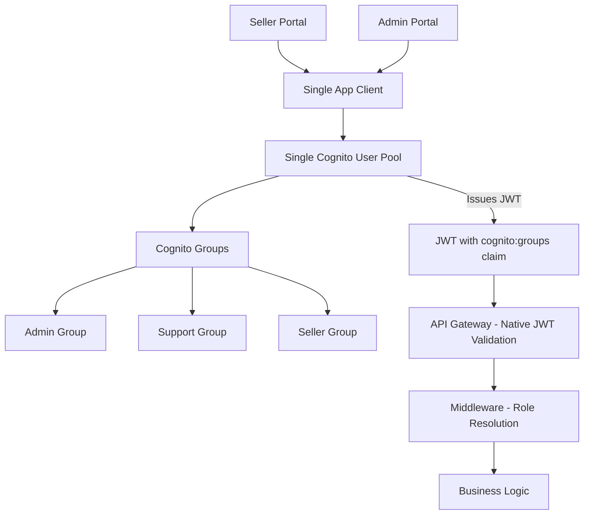

# ADR-002: Adoption of Single Cognito User Pool with Role-Based Access Control

## Status

**Accepted**

Date: 2025-01-20

## Context

The MerchOS platform requires a unified authentication and authorization system that supports multiple user types (Sellers, Support staff, Admins) while maintaining security, simplicity, and scalability. During the design phase, we evaluated several approaches to structuring our identity infrastructure and identified critical requirements that constrained the solution space:

### Authentication Requirements and Constraints

1. **Unified authentication for multiple user types** — The platform serves three distinct user types (Sellers, Support, Admins) with different permission levels. All users must authenticate through a single, consistent mechanism regardless of their role. Maintaining separate authentication flows per role increases frontend complexity and user confusion.

2. **JWT-based role enforcement without additional lookups** — Role-based access control must be enforceable directly from JWT claims at the API Gateway and middleware layers. If role information requires a secondary database lookup at request time, every authenticated request incurs additional latency and introduces a single point of failure outside the identity provider.

3. **Architecture must support future role expansion without redesign** — The platform roadmap includes Finance, Sales, Developer, QA, and Enterprise Customer roles. The identity architecture must accommodate new roles through configuration changes only, without requiring infrastructure changes, new authentication endpoints, or application code modifications.

4. **Single authentication endpoint simplifies frontend integration** — Both the Admin Portal and Seller Portal must authenticate against the same identity provider endpoint. Multiple endpoints create configuration drift, complicate token refresh logic, and make cross-portal session management impossible.

5. **Native AWS integration** — The platform is built on AWS (API Gateway, Lambda, DynamoDB). The identity solution must integrate natively with API Gateway JWT authorizers and Lambda authorization context without custom bridge logic or external API calls in the request path.

### Requirements That Motivated This Decision

- All users authenticate via a single Cognito User Pool (Requirement 1.2)
- Platform Role resolved from JWT cognito:groups claim (Requirement 2.6)
- Architecture supports 20+ roles with O(1) authorization latency (Requirement 11.4)
- Single authentication endpoint for all user types (Requirement 1.3)
- API Gateway validates JWT natively before Lambda (Requirement 1.5)

## Decision

**A single Amazon Cognito User Pool with Cognito Groups for role assignment is the adopted authentication and authorization identity architecture.**

Specifically:

1. All platform users — Sellers, Support staff, and Admins — reside in a single Cognito User Pool. There is no separation of users by role at the identity provider level.

2. Platform Roles are assigned exclusively through Cognito Groups. Each user is assigned to one or more groups (Admin, Support, Seller) that determine their permissions on the platform.

3. Upon successful authentication, Cognito issues a JWT containing the `cognito:groups` claim. This claim is the sole source of truth for role resolution — no client-supplied role claims are trusted.

4. A single App Client is configured for the User Pool, used by all frontend applications (Admin Portal and Seller Portal) to authenticate users.

5. API Gateway validates the JWT (signature, expiration, issuer) natively using its built-in Cognito authorizer. No custom Lambda authorizers are required for token validation.

6. The middleware pipeline resolves the user's Platform Role from the `cognito:groups` claim and constructs an `AuthorizedRequestContext` containing role, userId, tenantId, and permissions. Business logic never parses JWTs or resolves roles.

### Identity Architecture



### Benefits of Cognito Groups for Role Assignment

| Benefit | Description |
|---------|-------------|
| **Configuration-only role expansion** | Adding a new role requires creating a Cognito Group and updating the @merch-os/rbac configuration. No infrastructure changes, no new User Pools, no code changes to middleware or business logic. |
| **Single authentication endpoint** | All user types authenticate against the same Cognito User Pool and App Client. Frontend applications use one set of authentication configuration regardless of user role. |
| **Simplified user management** | Administrators manage all users in a single pool through one admin interface. User search, password resets, and account actions do not require cross-pool coordination. |
| **JWT-based role delivery** | The `cognito:groups` claim is included in every JWT automatically. Role information travels with the token — no secondary lookups, no additional service calls, no external dependencies at request time. |

## Consequences

### Benefits

| Benefit | Description |
|---------|-------------|
| **Single sign-on infrastructure reduces operational overhead** | One User Pool means one set of password policies, one MFA configuration, one set of Lambda triggers, and one monitoring dashboard. Operational burden scales with platform complexity, not with the number of roles. |
| **JWT contains all authorization claims** | No additional service calls at request time. The middleware resolves role, tenant, and permissions entirely from JWT claims. Authorization latency is O(1) regardless of how many roles exist in the system. |
| **Role expansion via configuration only** | Adding a new Platform Role (e.g., Finance, Developer) is an O(1) administrative operation: create a Cognito Group, update @merch-os/rbac config, assign users. No deployment required for middleware, guards, or business logic. |
| **Native AWS integration** | API Gateway natively validates Cognito JWTs without custom authorizer Lambda functions. This eliminates cold-start latency for authorization, reduces infrastructure cost, and leverages AWS's built-in security hardening. |
| **Consistent security posture across all roles** | All users are subject to the same authentication policies (password complexity, token expiration, account lockout). Security enhancements apply uniformly without per-pool configuration. |

### Trade-offs

| Trade-off | Description | Mitigation |
|-----------|-------------|------------|
| **Shared pool blast radius** | All users reside in one pool. A compromised pool (misconfigured triggers, leaked App Client secret) affects all roles simultaneously, including Admins with unrestricted platform access. | MFA enforcement for Admin users (planned), Cognito Advanced Security features (adaptive authentication, compromised credential detection), CloudWatch alarms on authentication anomalies, and regular security audits of User Pool configuration. |
| **Cognito 300-group limit** | AWS Cognito enforces a maximum of 300 groups per User Pool. This caps the total number of distinct roles the platform can define within a single pool. | 300 roles far exceeds foreseeable platform needs (current: 3, planned: 8). If the limit is approached, composite permission strategies (permission sets within fewer groups) or a hybrid model with attribute-based access control can extend capacity without architectural redesign. |
| **Role precedence ambiguity for multi-group users** | A user assigned to multiple Cognito Groups (e.g., both Admin and Support) has multiple entries in the `cognito:groups` claim. Without a defined resolution strategy, the middleware cannot determine which role governs access. | Defined precedence hierarchy enforced in middleware: Admin > Support > Seller. The highest-priority group in the user's `cognito:groups` claim wins. This is documented, tested, and enforced at the middleware layer before business logic executes. |

## Scalability

### Future Roles Without Redesign

The architecture supports adding new Platform Roles without any architectural changes:

1. **Create a Cognito Group** — Administrative action in AWS Console or via IaC (CloudFormation/CDK)
2. **Update @merch-os/rbac configuration** — Define permissions for the new role in the PermissionRegistry
3. **Assign users** — Add users to the new group via admin interface or API

No middleware, guard, navigation, or business logic code changes are required. The PermissionRegistry uses pre-built hash maps for constant-time permission lookups regardless of total role count, supporting 20+ distinct roles with O(1) authorization latency.

### Cognito Group Limit

AWS Cognito enforces a documented ceiling of **300 groups per User Pool**. With 3 current roles and 5 planned future roles, the platform operates well within this boundary. The 300-group limit is a hard constraint that should be monitored but does not represent a practical risk for the foreseeable platform roadmap.

### Role Precedence Resolution Strategy

For users assigned to multiple Cognito Groups simultaneously, the middleware enforces a strict precedence hierarchy:

```
Admin > Support > Seller
```

- The middleware reads the `cognito:groups` array from the JWT
- Groups are evaluated against the precedence hierarchy
- The highest-priority group determines the user's effective Platform Role
- This resolved role is set in the `AuthorizedRequestContext` and governs all downstream authorization decisions

This strategy ensures deterministic behavior, eliminates ambiguity, and is enforced consistently at the middleware layer before any business logic executes.

## Alternatives Considered

### 1. Multiple User Pools (One Per Role)

**Description:** Separate Cognito User Pools for each Platform Role — an Admin Pool, a Support Pool, and a Seller Pool. Each pool has independent configuration, App Clients, and user directories.

**Rejection Reasons:**
- **Operational complexity** — Three pools require three sets of password policies, three MFA configurations, three sets of Lambda triggers, three monitoring dashboards, and three deployment pipelines. Operational overhead scales linearly with the number of roles.
- **User management overhead** — Querying users across roles requires cross-pool API calls. A single admin searching for a user must check all pools. Promoting a user from Seller to Support requires deleting from one pool and recreating in another, losing authentication history.
- **Inability to share authentication infrastructure** — Each pool requires its own App Client, its own hosted UI configuration, and its own token endpoint. Frontend applications must maintain multiple authentication configurations and route users to the correct pool before login.
- **Role expansion friction** — Adding a new role (e.g., Finance) requires provisioning an entirely new User Pool with full configuration, not simply creating a group.
- **No cross-role visibility** — A single JWT cannot represent membership in multiple pools, making scenarios like "Support user with temporary Admin access" architecturally impossible without token exchange mechanisms.

### 2. Third-Party Identity Provider (Auth0, Okta, Firebase Auth)

**Description:** Replace Cognito with a third-party identity provider that offers role management, JWT issuance, and user directory services.

**Rejection Reasons:**
- **Additional vendor dependency and cost** — Third-party IdPs introduce a critical external dependency. Pricing scales with monthly active users and can become significant at platform scale. Vendor lock-in creates migration risk if pricing or terms change.
- **Latency from external API calls** — Token validation against an external IdP requires network calls outside the AWS boundary. This adds latency to every authenticated request and introduces a failure mode not present with native Cognito (regional outages of the IdP vendor).
- **Migration complexity from existing Cognito investment** — The platform already uses Cognito for authentication. Migrating users, password hashes, MFA configurations, and Lambda triggers to a third-party provider is a high-risk, multi-sprint effort with potential for authentication outages during transition.
- **Reduced AWS integration** — Third-party JWTs require custom Lambda authorizers at API Gateway (Cognito JWTs are validated natively). This adds cold-start latency, increases infrastructure cost, and loses API Gateway's built-in Cognito integration features (automatic scope validation, built-in token revocation checks).

## References

- [MerchOS RBAC Blueprint](../rbac-blueprint.md)
- [MerchOS RBAC Specification](../rbac-specification.md)
- [RBAC Future-Proofing Addendum](../rbac-future-proofing-addendum.md)
- [ADR-001: Centralized Middleware Authorization](./ADR-001-centralized-middleware-authorization.md)
- [MerchOS Blueprint v0.2](../merchos-blueprint.md)
