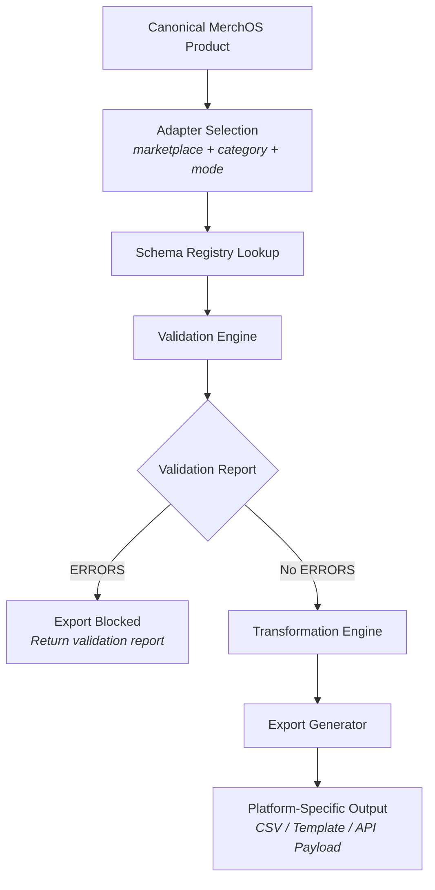

# ADR-003: Canonical Product Model with Marketplace-Specific Adapters

## Status

**Accepted**

Date: 2026-08-08

## Context

MerchOS must support product export to **five marketplaces** — Takealot, Makro, Amazon, Shopify, and WooCommerce — each with fundamentally different schemas, field requirements, validation rules, category systems, and export formats. The platform cannot adopt any single marketplace's schema as its internal model because:

### Problem Space

1. **Schema divergence across platforms** — Each marketplace defines its own product schema. Takealot uses a Bulk Offers template with barcode-centric identification; Makro uses vertical-specific loadsheets with category-dependent fields; Amazon uses product-type templates with hierarchical classification; Shopify uses a handle-based product/variant model; WooCommerce uses product-type-driven schemas with custom metadata. No two platforms agree on field names, required fields, data types, or validation rules.

2. **Category/vertical awareness** — Makro and Amazon both impose category-specific schema requirements. A product in the "Electronics" vertical on Makro requires different fields than one in "Duvet Covers." Amazon's product-type templates vary dramatically by category. The architecture must support schema selection based on the target marketplace AND category/vertical combination.

3. **Commercial vs content data separation** — Different marketplaces treat pricing, inventory, and listing status differently. Some require price at product creation (Takealot Bulk Offers), others separate product content from commercial listing data. MerchOS must maintain its own data boundaries without being dictated by any platform's structure.

4. **Export format requirements** — Each platform expects data in a specific format: CSV with particular encoding, specific column ordering, exact header names, or API payloads with defined schemas. The export pipeline must generate exact platform-compliant output.

5. **Validation before export** — Products must pass marketplace-specific validation BEFORE export file generation. Validation rules differ per platform and per category. Validation must be deterministic, producing a clear report of errors, warnings, and required fixes without silently altering data.

6. **Schema evolution** — Marketplace platforms update their templates, add/remove fields, change validation rules, and modify category systems over time. The architecture must support schema versioning and updates without requiring application code changes.

### Requirements That Motivated This Decision

- Support 5 marketplaces as first-class export targets from architecture inception
- No single marketplace's schema dictates the canonical product model
- Category/vertical-specific validation for Makro and Amazon
- Deterministic validation with clear error reporting before export
- Schema versioning to accommodate platform changes
- Platform-specific adapters isolate marketplace complexity from core business logic

## Decision

**MerchOS adopts a canonical product model with a versioned schema registry, category/vertical-aware validation engine, platform-specific mapping/transformation adapters, and deterministic export pipeline.**

Specifically:

### 1. Canonical Product Model

MerchOS maintains an **internal canonical product model** that is independent of any marketplace's schema. The canonical model separates:

- **Core content data** — Title, descriptions, images, brand, manufacturer, dimensions, weight, materials, attributes
- **Commercial/listing data** — Price, RRP, stock quantity, leadtime, listing status, fulfilment method
- **Platform-specific data** — Marketplace-specific identifiers, category mappings, platform metadata

No marketplace's CSV structure, field naming, or data organization influences the canonical model's design. The canonical model represents the complete product truth; adapters transform it into platform-specific formats.

### 2. Versioned Schema Registry

A **Schema Registry** stores the requirements for each marketplace, organized hierarchically:

```
Platform → Category/Vertical → Schema Version → Fields → Rules → Allowed Values → Transformations
```

Each schema entry includes:
- Platform identifier (takealot, makro, amazon, shopify, woocommerce)
- Category/vertical identifier (where applicable)
- Schema version and template version
- Source documentation URLs
- Verification status (draft / verified / deprecated)
- Date last verified

The registry is data-driven — adding or updating a marketplace's requirements is a configuration change, not a code change.

### 3. Category/Vertical-Aware Validation

The **Validation Engine** selects the appropriate schema from the registry based on:
- Target marketplace
- Product category/vertical
- Export mode (full product creation vs offer update vs inventory sync)

Validation produces a deterministic report with severity levels:
- **ERROR** — Prevents export; must be resolved
- **WARNING** — Export allowed but user should review
- **INFO** — Informational; no action required

The validation engine **never** silently truncates, invents, or alters data to pass validation.

### 4. Platform-Specific Adapters

Each marketplace has a dedicated **adapter** responsible for:
- Schema selection (choosing the correct registry entry for the product's category and export mode)
- Field mapping (translating canonical fields to platform-specific field names)
- Data transformation (applying platform-specific formatting rules)
- Validation (executing platform-specific validation rules from the schema registry)
- Export formatting (generating the exact CSV, template, or API payload the platform requires)
- Error interpretation (mapping platform rejection codes back to actionable validation errors)

Adapters: `TakealotAdapter`, `MakroAdapter`, `AmazonAdapter`, `ShopifyAdapter`, `WooCommerceAdapter`

### 5. Deterministic Export Pipeline

The export pipeline follows a strict sequence:

```
Canonical Product → Schema Selection → Validation → Transformation → Export Generation
```

Export is **gated** by validation — no export file is generated if validation produces ERROR-level findings. The pipeline is deterministic: given the same canonical product, marketplace, category, and schema version, the pipeline always produces the same output.

### Architecture Overview



## Consequences

### Benefits

| Benefit | Description |
|---------|-------------|
| **Platform independence** | The canonical model is not coupled to any marketplace. MerchOS can add new marketplaces without modifying the core product model. |
| **Isolated complexity** | Each adapter encapsulates the full complexity of its target platform. Changes to one marketplace's requirements affect only its adapter and schema registry entries. |
| **Category-aware validation** | Products are validated against the correct category/vertical schema, catching errors before they reach the marketplace and cause rejections. |
| **Deterministic exports** | The same input always produces the same output. Export behaviour is predictable, testable, and auditable. |
| **Schema versioning** | When a marketplace updates its templates, a new schema version is added to the registry. Old versions are deprecated but retained for audit trail. |
| **Configuration-driven** | Adding marketplace requirements is a data/configuration change. The validation and export engines are generic and adapter-driven. |
| **All platforms equal** | No marketplace is treated as primary or secondary. All five platforms exist in the architecture from day one. |

### Trade-offs

| Trade-off | Description | Mitigation |
|-----------|-------------|------------|
| **Schema registry maintenance** | Each marketplace's requirements must be captured and maintained in the registry. Platform changes require registry updates. | Schema entries include verification status and dates. A verification workflow tracks when schemas were last confirmed against platform documentation. Automated monitoring can detect template changes. |
| **Initial schema capture effort** | Populating the registry for 5 platforms across multiple categories requires significant upfront research. Some platforms (Amazon, Makro) have category-specific requirements that multiply the schema count. | Phased implementation: all 5 platforms exist in the registry from Phase 1 (core fields), with category-specific schemas added as marketplace adapters are built. |
| **Mapping complexity** | Some canonical fields map to different platform fields depending on context (e.g., "description" may map to different fields on different platforms with different length limits). | Mapping rules are explicit in the schema registry. No implicit or convention-based mapping — every transformation is declared. |
| **Validation rule maintenance** | Validation rules may change when platforms update their requirements. Rules must be kept in sync with actual platform behaviour. | Schema verification dates track freshness. Platform rejection patterns are mapped back to validation rules to identify drift. |
| **Schema non-permanence** | Marketplace requirements are treated as external knowledge/configuration and are never assumed to be permanently static. Platform templates, field requirements, allowed values, and validation rules can change at any time without notice. | Schema Registry versioning, verification status tracking, and the feedback loop from platform rejections all contribute to detecting and adapting to schema changes. No hard-coded marketplace rules in application code. |

## Alternatives Considered

### 1. Platform-First Model (Takealot Schema as Canonical)

**Description:** Use one marketplace's schema (e.g., Takealot) as the internal product model and transform to other platforms from it.

**Rejection Reasons:**
- Creates inherent bias toward one platform's field structure, naming, and validation rules
- Fields required by other platforms but absent from Takealot would need awkward additions to the "canonical" model
- Category systems differ across platforms — using one platform's categories as the base creates mapping complexity
- Platform-specific constraints (field lengths, allowed values) would leak into the canonical model
- Adding new marketplaces becomes increasingly difficult as the model accumulates platform-specific accommodations

### 2. Union Schema (All Fields from All Platforms)

**Description:** Create a canonical model that is the union of all fields across all platforms — every field from every marketplace exists in the canonical model.

**Rejection Reasons:**
- Results in an enormous, largely-sparse model where most products only populate a fraction of fields
- Field semantics conflict between platforms (e.g., "category" means different things on each platform)
- Validation becomes ambiguous — which platform's rules apply to shared field names?
- Model grows unboundedly as new platforms are added
- No clear distinction between content data, commercial data, and platform-specific requirements

### 3. Direct Platform Templates (No Canonical Model)

**Description:** Store product data directly in each platform's template format. Each product has a separate representation per marketplace.

**Rejection Reasons:**
- Data duplication across platform representations (title, description, images stored multiple times)
- Updates to core product data require synchronizing across all platform representations
- No single source of truth for product content
- Cannot validate data before it's in platform-specific format
- Platform-specific formats become the storage format, coupling the database to marketplace schemas

## References

- [MerchOS Marketplace Knowledge Base](../marketplace-knowledge-base.md)
- [MerchOS Schema & Validation Architecture](../schema-validation-architecture.md)
- [MerchOS Platform Architecture Blueprint — Section 11: Canonical Product Model](../merchos-blueprint.md#11-canonical-product-model)
- [MerchOS Platform Architecture Blueprint — Section 12: Marketplace Export Architecture](../merchos-blueprint.md#12-marketplace-export-architecture)
- [ADR-001: Centralized Middleware Authorization](./ADR-001-centralized-middleware-authorization.md)
- [ADR-002: Single Cognito User Pool with RBAC](./ADR-002-single-cognito-user-pool-rbac.md)
