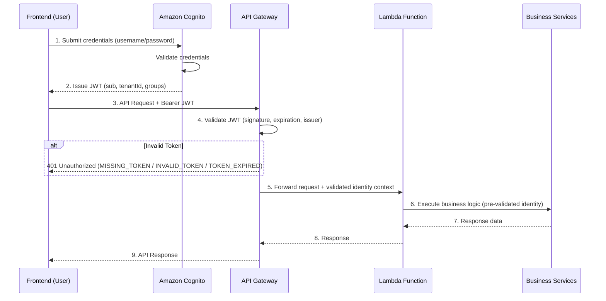
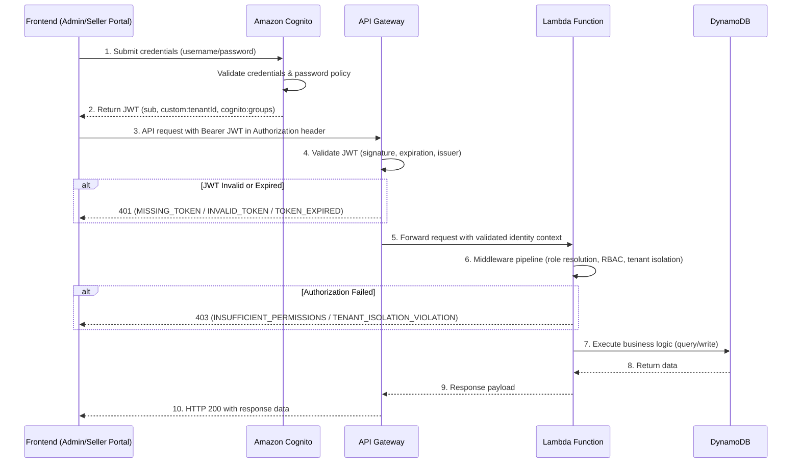
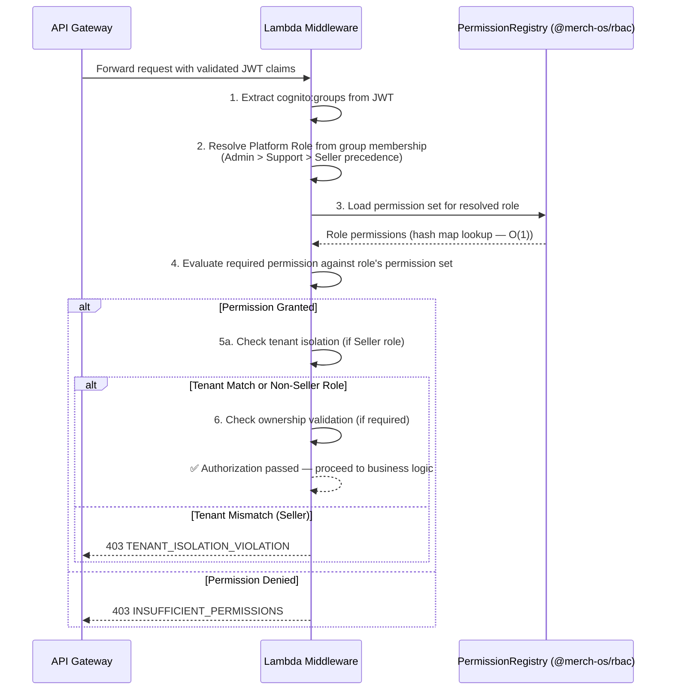
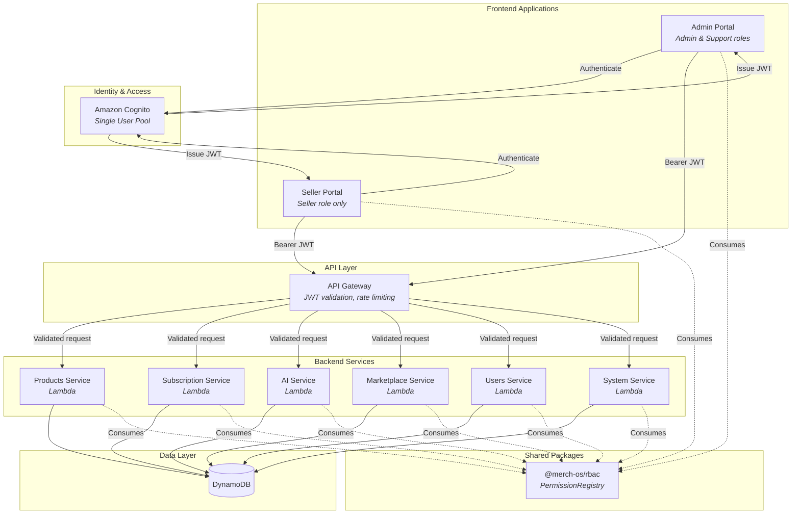

# MerchOS Platform Architecture Blueprint

> **Version:** 0.2  
> **Status:** Living Document  
> **Last Updated:** 2025

This Blueprint is the authoritative engineering architecture reference for the MerchOS platform. It serves as the single source of truth for authentication, authorization, security, API design, and portal architecture decisions. All engineering teams should reference this document for architectural guidance.

---

## Table of Contents

1. [Authentication Architecture](#1-authentication-architecture)
2. [RBAC Model](#2-rbac-model)
3. [Permission Matrix](#3-permission-matrix)
4. [API Specification Updates](#4-api-specification-updates)
5. [API Design Standards](#5-api-design-standards)
6. [Security Architecture](#6-security-architecture)
7. [Admin Portal Architecture](#7-admin-portal-architecture)
8. [Seller Portal Isolation](#8-seller-portal-isolation)
9. [Architecture Diagrams](#9-architecture-diagrams)
10. [Future Roles](#10-future-roles)

---

## 1. Authentication Architecture

This section documents the complete authentication architecture for the MerchOS platform, covering the identity provider configuration, token-based authentication flow, and failure handling.

### 1.1 Identity Provider

Amazon Cognito is the **sole Identity Provider** for the MerchOS platform. All user authentication — credential storage, password policies, token issuance, and session management — is handled exclusively by Cognito. No other identity provider is used or supported.

### 1.2 User Pool Architecture

The platform uses a **single Cognito User Pool** containing all platform users regardless of their Platform Role. Admins, Support staff, and Sellers all reside in the same User Pool. This design simplifies user management, provides a single authentication endpoint, and enables role assignment through Cognito Groups without requiring separate authentication infrastructure per role.

### 1.3 App Client Configuration

A **single App Client** is configured for the User Pool. All frontend applications (Admin Portal and Seller Portal) authenticate against Cognito using this shared App Client. The App Client is configured to issue JWTs containing the necessary claims for downstream authorization, including `sub`, `custom:tenantId`, and `cognito:groups`.

### 1.4 JWT Bearer Token Requirement

All API endpoints requiring authentication (endpoints that access user-specific or tenant-specific resources) require a valid JWT issued by Cognito, passed as a **Bearer token in the Authorization header**:

```
Authorization: Bearer <JWT>
```

The JWT contains the authenticated user's identity claims and group memberships, which downstream services use for authorization decisions. Endpoints that do not access user-specific or tenant-specific resources may be designated as public and do not require a token.

### 1.5 API Gateway JWT Validation

API Gateway validates every incoming JWT **before** forwarding requests to Lambda functions. The validation checks:

- **Signature** — Verifies the token was signed by the configured Cognito User Pool using the expected signing key.
- **Expiration** — Rejects tokens whose `exp` claim indicates the token has expired.
- **Issuer** — Confirms the `iss` claim matches the expected Cognito User Pool issuer URL.

Only requests with a valid, unexpired, correctly-signed JWT proceed to Lambda. Requests failing any of these checks are rejected at the gateway layer and never reach business logic.

### 1.6 Lambda Trust Model

Lambda functions **trust the authenticated identity** provided by API Gateway and **do not re-validate JWTs**. Since API Gateway has already verified the token's signature, expiration, and issuer, Lambda receives a pre-validated identity context. This trust model eliminates redundant cryptographic operations in business logic and establishes API Gateway as the single authentication boundary.

Lambda functions receive the validated JWT claims (userId, tenantId, groups) through the request context and use them directly for authorization decisions without performing additional JWT parsing or validation.

### 1.7 Authentication Flow

The complete authentication flow proceeds through the following stages:

1. **User Login** — The user submits credentials (username/password) through the frontend application (Admin Portal or Seller Portal).
2. **Cognito Authentication** — The frontend sends the credentials to the Cognito User Pool via the App Client. Cognito validates the credentials against stored user records.
3. **Token Issuance** — Upon successful authentication, Cognito issues a JWT containing the user's identity claims (`sub`, `custom:tenantId`) and group membership (`cognito:groups`).
4. **API Request** — The frontend includes the JWT as a Bearer token in the Authorization header of subsequent API requests.
5. **Gateway Validation** — API Gateway intercepts the request and validates the JWT (signature, expiration, issuer). Invalid tokens are rejected immediately.
6. **Lambda Execution** — For valid tokens, API Gateway forwards the request to the appropriate Lambda function with the authenticated identity context attached.
7. **Business Services** — The Lambda function executes business logic using the pre-validated identity, applying authorization rules (role checks, tenant isolation, ownership validation) via the middleware pipeline before accessing data stores.

### 1.8 Authentication Flow Diagram



### 1.9 Authentication Failure Responses

When authentication fails at the API Gateway layer, the request is rejected **before it reaches Lambda**. The API Gateway returns an HTTP 401 response with an error code distinguishing the failure reason:

| Error Code | Condition | Description |
|------------|-----------|-------------|
| `MISSING_TOKEN` | No Authorization header present, or header is empty | The request did not include a Bearer token. |
| `INVALID_TOKEN` | JWT signature verification fails, token is malformed, or issuer does not match | The provided token cannot be validated against the Cognito User Pool. |
| `TOKEN_EXPIRED` | JWT `exp` claim indicates the token has passed its expiration time | The token was valid but has expired. The client should refresh or re-authenticate. |

All 401 responses follow this structure:

```json
{
  "statusCode": 401,
  "error": "Unauthorized",
  "code": "MISSING_TOKEN | INVALID_TOKEN | TOKEN_EXPIRED",
  "message": "Human-readable description of the failure"
}
```

No request payload or business logic context is exposed in authentication failure responses.

### 1.10 Middleware Pipeline Reference

After API Gateway authentication succeeds and the request reaches Lambda, the **middleware authorization pipeline** handles role resolution, tenant isolation, ownership validation, and permission enforcement. The complete middleware pipeline specification — including stage ordering, inputs/outputs, and error handling — is documented in the [RBAC Architecture Blueprint](./rbac-blueprint.md).

---

## 2. RBAC Model

This section documents the approved Role-Based Access Control model for the MerchOS platform. Platform Roles are assigned via Cognito Groups and determine what each user can access across the system. For the detailed middleware pipeline that enforces these roles at runtime, see the [RBAC Architecture Blueprint](./rbac-blueprint.md). For permission naming standards and the full permission registry, see the [RBAC Specification](./rbac-specification.md).

### 2.1 Platform Role Resolution

Platform Role is resolved **exclusively** from the `cognito:groups` claim in the authenticated JWT. The middleware reads the user's Cognito Group membership from the token and maps it to a Platform Role. Client-supplied role claims — whether in request headers, query parameters, body fields, or custom headers — are **never trusted** and are ignored by the authorization pipeline.

This guarantees that role assignment is controlled entirely through the Cognito User Pool administrative interface. No client-side code or request manipulation can elevate a user's Platform Role.

### 2.2 Cognito Groups

The platform defines three Cognito Groups, each corresponding to a Platform Role:

| Cognito Group | Platform Role | Description |
|---------------|--------------|-------------|
| `Admin` | Admin | Platform administrators with unrestricted access |
| `Support` | Support | Support staff with read-oriented cross-tenant access for troubleshooting |
| `Seller` | Seller | Merchants with full control over their own tenant resources |

Each user belongs to exactly one Cognito Group. Group membership is managed by Admins through the Cognito console or user management API.

### 2.3 Admin Role

The Admin role has **unrestricted platform access**. Admins are responsible for platform-wide operations that span all tenants and system-level concerns.

**Responsibilities and Access:**

- **Cross-tenant visibility** — Full read and write access to all tenant resources across the platform. Admins can view, modify, and manage any tenant's data.
- **System configuration management** — Access to platform-wide settings, feature flags, taxonomy configuration, and operational parameters.
- **User management** — Create, modify, disable, and delete user accounts. Assign and modify Cognito Group membership. Reset credentials.
- **Platform monitoring** — Access to health dashboards, audit logs, alert management, and compliance reporting across all tenants.
- **Unrestricted API access** — No permission is denied to the Admin role. All API resources and actions are available.

**Restrictions:** None. The Admin role operates without permission boundaries.

### 2.4 Support Role

The Support role provides **read-oriented cross-tenant access** for troubleshooting and customer assistance, with strict restrictions on modification operations.

**Responsibilities and Access:**

- **Cross-tenant read access** — Read access to tenant data across the platform for investigating issues, reviewing account status, and responding to support requests.
- **Subscription and invoice visibility** — Read access to subscription plans, billing history, and invoice records to assist with billing inquiries.
- **Product read access** — Read access to product catalogs across tenants for troubleshooting listing issues, content reviews, and quality checks.

**Restrictions:**

- **No tenant data modification** — Cannot create, update, or delete tenant-owned resources (products, marketplace listings, AI-generated content).
- **No billing changes** — Cannot modify subscription plans, issue refunds, override pricing, or alter invoice records.
- **No system configuration** — Cannot access or modify platform-wide settings, feature flags, taxonomy, or operational parameters.
- **No user management** — Cannot create, modify, or delete user accounts or alter Cognito Group membership.

### 2.5 Seller Role

The Seller role provides **full ownership over own-tenant resources** with strict tenant isolation preventing any cross-tenant access.

**Responsibilities and Access:**

- **Full CRUD on own-tenant products** — Create, read, update, and delete products belonging to the Seller's own tenant.
- **AI content generation** — Access to AI-powered content generation services (descriptions, images, SEO content) scoped to own-tenant products.
- **Marketplace exports** — Create and manage marketplace export configurations for own-tenant products.
- **Self-service subscription management** — View current subscription plan, upgrade/downgrade within available tiers, and manage billing information for own tenant.

**Restrictions:**

- **No cross-tenant access** — Cannot read, modify, or even discover resources belonging to other tenants. Tenant isolation is enforced at the middleware layer using the JWT `custom:tenantId` claim.
- **No system-level operations** — Cannot access system configuration, user management, platform monitoring, audit logs, or any Admin/Support functionality.
- **No other-tenant visibility** — Search, navigation, and API responses are scoped exclusively to the Seller's tenant. No cross-tenant data appears in any response.

---

## 3. Permission Matrix

This section provides a comprehensive mapping of every API resource to the permitted actions for each Platform Role. The matrix serves as a quick-reference for engineers to determine access boundaries without reading the full RBAC specification.

### 3.1 Notation

| Symbol | Meaning |
|--------|---------|
| ✅ | Full access — granted unconditionally |
| 🔒 | Own-tenant only — granted but scoped to the user's tenant |
| ❌ | Denied — not permitted |

Each cell in the matrix resolves to exactly one of these three states. No cell is ambiguous or empty.

### 3.2 Products Domain

| Resource | Action | Seller | Support | Admin |
|----------|--------|:------:|:-------:|:-----:|
| products | Read | 🔒 | ❌ | ✅ |
| products | Create | 🔒 | ❌ | ✅ |
| products | Update | 🔒 | ❌ | ✅ |
| products | Delete | 🔒 | ❌ | ✅ |
| suppliers | Read | 🔒 | ❌ | ✅ |
| suppliers | Create | 🔒 | ❌ | ✅ |
| suppliers | Update | 🔒 | ❌ | ✅ |
| suppliers | Delete | 🔒 | ❌ | ✅ |

### 3.3 System Domain

| Resource | Action | Seller | Support | Admin |
|----------|--------|:------:|:-------:|:-----:|
| platform-settings | Read | ❌ | ❌ | ✅ |
| platform-settings | Create | ❌ | ❌ | ✅ |
| platform-settings | Update | ❌ | ❌ | ✅ |
| platform-settings | Delete | ❌ | ❌ | ✅ |
| platform-settings | Administrative | ❌ | ❌ | ✅ |
| infrastructure | Read | ❌ | ❌ | ✅ |
| infrastructure | Update | ❌ | ❌ | ✅ |
| processing-jobs | Read | ❌ | ✅ | ✅ |
| processing-jobs | Create | ❌ | ❌ | ✅ |
| processing-jobs | Update | ❌ | ❌ | ✅ |
| processing-jobs | Delete | ❌ | ❌ | ✅ |
| taxonomy | Read | ❌ | ❌ | ✅ |
| taxonomy | Create | ❌ | ❌ | ✅ |
| taxonomy | Update | ❌ | ❌ | ✅ |
| taxonomy | Delete | ❌ | ❌ | ✅ |
| alerts | Read | ❌ | ❌ | ✅ |
| alerts | Update | ❌ | ❌ | ✅ |
| compliance | Read | ❌ | ❌ | ✅ |
| compliance | Create | ❌ | ❌ | ✅ |
| compliance | Update | ❌ | ❌ | ✅ |
| compliance | Delete | ❌ | ❌ | ✅ |

### 3.4 AI Domain

| Resource | Action | Seller | Support | Admin |
|----------|--------|:------:|:-------:|:-----:|
| ai-listings | Read | 🔒 | ❌ | ✅ |
| ai-listings | Create | 🔒 | ❌ | ✅ |
| ai-listings | Update | 🔒 | ❌ | ✅ |
| ai-listings | Delete | 🔒 | ❌ | ✅ |

### 3.5 Marketplace Domain

| Resource | Action | Seller | Support | Admin |
|----------|--------|:------:|:-------:|:-----:|
| exports | Read | 🔒 | ❌ | ✅ |
| exports | Create | 🔒 | ❌ | ✅ |
| exports | Update | ❌ | ❌ | ✅ |
| exports | Delete | ❌ | ❌ | ✅ |

### 3.6 Subscription Domain

| Resource | Action | Seller | Support | Admin |
|----------|--------|:------:|:-------:|:-----:|
| subscription | Read | 🔒 | ❌ | ✅ |
| subscription | Create | ❌ | ❌ | ✅ |
| subscription | Update | 🔒 | ❌ | ✅ |
| subscription | Delete | ❌ | ❌ | ✅ |
| billing | Read | ❌ | ❌ | ✅ |
| billing | Create | ❌ | ❌ | ✅ |
| billing | Update | ❌ | ❌ | ✅ |
| billing | Delete | ❌ | ❌ | ✅ |

### 3.7 Users Domain

| Resource | Action | Seller | Support | Admin |
|----------|--------|:------:|:-------:|:-----:|
| users | Read | ❌ | ❌ | ✅ |
| users | Create | ❌ | ❌ | ✅ |
| users | Update | ❌ | ❌ | ✅ |
| users | Delete | ❌ | ❌ | ✅ |
| users | Administrative | ❌ | ❌ | ✅ |
| users.search | Read | ❌ | ✅ | ✅ |
| users.profile | Read | ❌ | ✅ | ✅ |
| users.profile | Update | ❌ | ❌ | ✅ |
| users.verification | Create | ❌ | ✅ | ✅ |

### 3.8 Tenants Domain

| Resource | Action | Seller | Support | Admin |
|----------|--------|:------:|:-------:|:-----:|
| tenants | Read | ❌ | ❌ | ✅ |
| tenants | Create | ❌ | ❌ | ✅ |
| tenants | Update | ❌ | ❌ | ✅ |
| tenants | Delete | ❌ | ❌ | ✅ |
| tenants | Administrative | ❌ | ❌ | ✅ |

### 3.9 Audit Log Domain

| Resource | Action | Seller | Support | Admin |
|----------|--------|:------:|:-------:|:-----:|
| audit-log | Read | ❌ | ❌ | ✅ |
| logs | Read | ❌ | ✅ | ✅ |

### 3.10 Consistency with @merch-os/rbac PermissionRegistry

This Permission Matrix **must remain consistent** with the `defaultPermissionConfig` defined in `@merch-os/rbac` (`packages/rbac/src/config.ts`). Every permission granted or denied in this matrix corresponds to the equivalent role-resource-action mapping in the PermissionRegistry. If the PermissionRegistry is updated — whether adding new resources, modifying role permissions, or removing access — this matrix must be updated to reflect those changes.

The PermissionRegistry is the **runtime source of truth** for permission enforcement. This matrix is the **documentation source of truth** for human-readable access reference. The two must never diverge.

### 3.11 Maintenance Requirement

**This Permission Matrix must be updated before deploying any new API endpoint to production.** When a new API resource is added to the platform:

1. Add the resource to the appropriate domain table in this matrix.
2. Populate the Seller, Support, and Admin columns with the correct access states (✅, 🔒, or ❌).
3. Ensure the corresponding `defaultPermissionConfig` in `@merch-os/rbac` is updated to match.
4. Verify consistency between this matrix and the PermissionRegistry before merging.

Non-compliant endpoints — those not represented in the Permission Matrix — must not be deployed to production.

---

## 4. API Specification Updates

This section defines the standardized authentication and authorization metadata that every API endpoint must include, ensuring security requirements are discoverable and auditable across the platform.

### 4.1 Protected Endpoint Definition

A **protected endpoint** is any API endpoint that requires a valid Bearer JWT in the Authorization header to access user-specific, tenant-specific, or system resources. Every protected endpoint must include the following metadata fields:

| Field | Required | Description |
|-------|:--------:|-------------|
| `endpoint` | Yes | HTTP method and path (e.g., `POST /api/products`) |
| `method` | Yes | HTTP verb (`GET`, `POST`, `PUT`, `PATCH`, `DELETE`) |
| `authentication` | Yes | Authentication mechanism — always `Bearer JWT (Cognito)` for protected endpoints |
| `required_role` | Yes | Platform_Role(s) permitted to access this endpoint |
| `required_permission` | Yes | Canonical permission identifier following the Permission Naming Standard |
| `ownership_required` | Yes | Whether the middleware performs ownership validation on the target resource |
| `ownership_field` | Conditional | The field used for ownership comparison (required when `ownership_required: true`, otherwise `null`) |
| `tenant_isolation` | Yes | Tenant scoping behavior: `scoped`, `global`, or `bypassed` |
| `error_responses` | Yes | Structured map of HTTP 401 and 403 error codes with descriptions |

### 4.2 Authentication Method

All protected endpoints authenticate using **Bearer JWT issued by Amazon Cognito**. The token must be passed in the HTTP Authorization header:

```
Authorization: Bearer <JWT>
```

API Gateway validates the JWT (signature, expiration, issuer) before any request reaches Lambda business logic. No other authentication mechanism is supported for protected endpoints.

### 4.3 Cognito Group Specification

Every protected endpoint must specify which **Cognito Groups** (Platform Roles) are permitted to access it via the `required_role` field. Requests from users whose `cognito:groups` claim does not include a permitted role are rejected with a 403 response.

Role examples:
- **Admin** — unrestricted platform access, cross-tenant operations
- **Support** — read-access for troubleshooting, cross-tenant visibility (read-only)
- **Seller** — own-tenant operations, scoped to the user's tenant

### 4.4 Expected JWT Claims

Each protected endpoint depends on the following JWT claims for authorization decisions:

| Claim | Description | Usage |
|-------|-------------|-------|
| `sub` | Cognito user identifier (UUID) | Identifies the authenticated user; used as `userId` in authorization context |
| `custom:tenantId` | Tenant identifier assigned at user registration | Enforces tenant isolation; used to scope Seller requests to their own tenant |
| `cognito:groups` | Array of Cognito Group memberships | Resolves the user's Platform_Role for permission evaluation |

These claims are extracted from the validated JWT by API Gateway and passed to Lambda as part of the Authorization Context. Lambda functions never parse or validate JWTs directly.

### 4.5 Standard Error Codes

Protected endpoints produce the following standardized error responses when authentication or authorization fails:

#### HTTP 401 — Authentication Failures

| Error Code | Description |
|------------|-------------|
| `MISSING_TOKEN` | No Bearer JWT provided in the Authorization header |
| `INVALID_TOKEN` | JWT signature is invalid, token is malformed, or issuer does not match the configured Cognito User Pool |
| `TOKEN_EXPIRED` | JWT `exp` claim indicates the token has passed its expiration time |

#### HTTP 403 — Authorization Failures

| Error Code | Description |
|------------|-------------|
| `INSUFFICIENT_PERMISSIONS` | The authenticated user's role does not have the required permission for this endpoint |
| `TENANT_ISOLATION_VIOLATION` | The target resource belongs to a different tenant than the authenticated user's `custom:tenantId` claim |
| `OWNERSHIP_VALIDATION_FAILURE` | The authenticated user does not own the target resource (ownership check failed against `ownership_field`) |

401 errors are produced by API Gateway before the request reaches Lambda. 403 errors are produced by the middleware authorization pipeline within Lambda after role and permission evaluation.

### 4.6 Authoritative Format Reference

The authoritative format for API endpoint documentation is defined in the [RBAC Specification Section 5](./rbac-specification.md). Section 5.1 specifies all required fields, and Section 5.2 provides the standard YAML template. All endpoint documentation in this Blueprint and across the platform must conform to that standard.

### 4.7 Representative Endpoint Examples

The following three examples demonstrate the complete API Documentation Standard for each authorization profile. All fields from Section 5.1 of the RBAC Specification are populated.

#### Example 1: Admin Endpoint — Manage System Configuration

This endpoint demonstrates the **global** tenant isolation model where Admin operates across all tenants without ownership constraints.

```yaml
endpoint: PUT /api/admin/system/configuration
method: PUT
authentication: Bearer JWT (Cognito)
required_role:
  - Admin
required_permission: system.configuration
ownership_required: false
ownership_field: null
tenant_isolation: global
error_responses:
  401:
    - code: MISSING_TOKEN
      description: No Bearer JWT provided in the Authorization header
    - code: INVALID_TOKEN
      description: JWT signature is invalid or malformed
    - code: TOKEN_EXPIRED
      description: JWT exp claim is in the past
  403:
    - code: INSUFFICIENT_PERMISSIONS
      description: Authenticated role lacks system.configuration permission
```

**Key characteristics:**
- `tenant_isolation: global` — Admin is not restricted to any tenant; operates platform-wide.
- `ownership_required: false` — No ownership validation is performed; Admin bypasses resource-level checks.
- Only `INSUFFICIENT_PERMISSIONS` in 403 responses — tenant isolation and ownership errors do not apply to global endpoints.

#### Example 2: Support Endpoint — View Subscription Invoices

This endpoint demonstrates the **bypassed** tenant isolation model where Support can view resources across tenants for troubleshooting purposes.

```yaml
endpoint: GET /api/support/subscriptions/:tenantId/invoices
method: GET
authentication: Bearer JWT (Cognito)
required_role:
  - Admin
  - Support
required_permission: subscription.invoice
ownership_required: false
ownership_field: null
tenant_isolation: bypassed
error_responses:
  401:
    - code: MISSING_TOKEN
      description: No Bearer JWT provided in the Authorization header
    - code: INVALID_TOKEN
      description: JWT signature is invalid or malformed
    - code: TOKEN_EXPIRED
      description: JWT exp claim is in the past
  403:
    - code: INSUFFICIENT_PERMISSIONS
      description: Authenticated role lacks subscription.invoice permission
```

**Key characteristics:**
- `tenant_isolation: bypassed` — Support can access resources across tenant boundaries for troubleshooting.
- `ownership_required: false` — Support accesses resources on behalf of sellers, not as resource owners.
- Admin is included in `required_role` because Admin can perform any operation.
- Seller is excluded — sellers access their own invoices through a separate tenant-scoped route.

#### Example 3: Seller Endpoint — Create Product

This endpoint demonstrates the **scoped** tenant isolation model with ownership validation, ensuring sellers only create resources within their own tenant.

```yaml
endpoint: POST /api/products
method: POST
authentication: Bearer JWT (Cognito)
required_role:
  - Admin
  - Seller
required_permission: products.create.own
ownership_required: true
ownership_field: tenantId
tenant_isolation: scoped
error_responses:
  401:
    - code: MISSING_TOKEN
      description: No Bearer JWT provided in the Authorization header
    - code: INVALID_TOKEN
      description: JWT signature is invalid or malformed
    - code: TOKEN_EXPIRED
      description: JWT exp claim is in the past
  403:
    - code: INSUFFICIENT_PERMISSIONS
      description: Authenticated role lacks products.create.own permission
    - code: TENANT_ISOLATION_VIOLATION
      description: Request tenantId does not match the authenticated user's JWT custom:tenantId
    - code: OWNERSHIP_VALIDATION_FAILURE
      description: Authenticated seller does not own the target resource context
```

**Key characteristics:**
- `tenant_isolation: scoped` — The middleware enforces that the Seller can only create resources within their own tenant.
- `ownership_required: true` with `ownership_field: tenantId` — The middleware validates that the request's tenant context matches the JWT `custom:tenantId` claim.
- All three 403 error codes apply: permission check, tenant isolation check, and ownership check.
- Admin is included in `required_role` because Admin can perform any operation across all tenants (Admin bypasses tenant isolation and ownership checks at the middleware level).

### 4.8 Public Endpoint Format

API endpoints that do not require authentication are documented with the following reduced format:

```yaml
endpoint: GET /api/health
method: GET
authentication: "None (Public)"
```

Public endpoints:
- Set `authentication` to `"None (Public)"`
- **Omit** the `required_role`, `required_permission`, `ownership_required`, `ownership_field`, and `tenant_isolation` fields — these concepts do not apply to unauthenticated endpoints
- **Omit** the `error_responses` section for 401/403 codes — public endpoints do not produce authentication or authorization errors

Public endpoints are typically limited to health checks, version endpoints, and other infrastructure routes that do not access user-specific or tenant-specific resources.

---

## 5. API Design Standards

This section documents the design standards that all protected API endpoints must follow. These standards ensure consistent authentication, tenant isolation, and role resolution patterns across the platform. Every new protected endpoint must conform to these standards before deployment to production.

### 5.1 Authentication Standard

All protected endpoints authenticate using a **Bearer JWT in the Authorization header**:

```
Authorization: Bearer <JWT>
```

The JWT must be issued by the configured Amazon Cognito User Pool. Endpoints that access user-specific or tenant-specific resources are classified as protected and require a valid token. No alternative authentication mechanisms (API keys, session cookies, basic auth) are permitted for protected endpoints.

### 5.2 Tenant Identity Resolution

Tenant identity is resolved **exclusively from the authenticated JWT `custom:tenantId` claim**. Tenant identity is never derived from:

- Client-supplied request query parameters
- Client-supplied path parameters
- Client-supplied request body fields
- Client-supplied HTTP headers (other than the Authorization header containing the JWT)

This standard ensures that a client cannot impersonate another tenant by manipulating request data. The middleware extracts `custom:tenantId` from the validated JWT and uses it as the sole source of tenant context for all downstream authorization and data-scoping decisions.

**Tenant-scoped enforcement** applies to Seller role requests — the middleware validates that the JWT `custom:tenantId` matches the target resource's tenant before allowing access. Admin and Support roles may access cross-tenant resources as defined by the [Permission Matrix](#3-permission-matrix), but their tenant identity is still resolved from the JWT for audit logging purposes.

### 5.3 Platform Role Resolution

Platform Role is resolved **exclusively from the `cognito:groups` claim in the JWT**. Client-supplied role claims are never trusted. The middleware reads the `cognito:groups` array from the validated JWT and maps it to the corresponding Platform Role (Admin, Support, or Seller).

Role resolution rules:

- The `cognito:groups` claim is the single source of truth for the user's Platform Role.
- No request parameter, header, or body field can influence role resolution.
- If a user belongs to multiple Cognito Groups, role precedence is resolved by the middleware according to the defined precedence order (Admin > Support > Seller).
- Requests with no valid `cognito:groups` claim are rejected.

### 5.4 API Gateway JWT Validation

API Gateway performs JWT validation **before** routing requests to Lambda functions. The gateway validates:

- **Signature** — Confirms the token was signed by the configured Cognito User Pool.
- **Expiration** — Rejects tokens whose `exp` claim has passed.
- **Issuer** — Verifies the `iss` claim matches the expected Cognito User Pool issuer URL.

Requests that fail any validation check are rejected at the gateway layer with an HTTP 401 response. Invalid requests never reach Lambda business logic. This establishes API Gateway as the single authentication boundary for the platform.

### 5.5 Lambda Authorization Context

Lambda functions receive a **pre-validated Authorization Context** from the middleware pipeline. This context contains:

| Field | Source | Description |
|-------|--------|-------------|
| `role` | Resolved from JWT `cognito:groups` | The authenticated user's Platform Role (Admin, Support, or Seller) |
| `userId` | JWT `sub` claim | The unique identifier of the authenticated user |
| `tenantId` | JWT `custom:tenantId` claim | The tenant the authenticated user belongs to |
| `permissions` | Resolved from role via @merch-os/rbac PermissionRegistry | The complete set of permissions granted to the user's role |

Lambda functions **must not**:

- Perform JWT parsing or signature validation (API Gateway handles this)
- Resolve the Platform Role from raw JWT claims (the middleware handles this)
- Resolve tenant identity from request parameters (the middleware extracts it from the JWT)
- Re-implement permission lookups (the Authorization Context provides the resolved permission set)

Lambda functions consume the Authorization Context as a trusted, pre-validated input and apply business logic against it directly.

### 5.6 Standard Error Responses

When authentication or authorization fails, the platform produces standardized error responses:

#### HTTP 401 — Authentication Failures

Produced by **API Gateway** when the request cannot be authenticated:

| Error Code | Condition |
|------------|-----------|
| `MISSING_TOKEN` | No Authorization header present, or header is empty |
| `INVALID_TOKEN` | JWT signature verification fails, token is malformed, or issuer does not match |
| `TOKEN_EXPIRED` | JWT `exp` claim indicates the token has expired |

#### HTTP 403 — Authorization Failures

Produced by the **middleware pipeline in Lambda** when the authenticated user lacks permission:

| Error Code | Condition |
|------------|-----------|
| `INSUFFICIENT_PERMISSIONS` | The user's role does not have the required permission for the requested operation |
| `TENANT_ISOLATION_VIOLATION` | The target resource's tenantId does not match the authenticated user's JWT `custom:tenantId` |

All error responses follow a consistent JSON structure and do not expose internal system details, stack traces, or request payloads.

### 5.7 Conformance Requirement

Every new protected endpoint **must conform to these API Design Standards before deployment to production**. Conformance means:

1. The endpoint authenticates via Bearer JWT in the Authorization header (no alternative auth methods).
2. Tenant identity is resolved from the JWT `custom:tenantId` claim only.
3. Platform Role is resolved from the JWT `cognito:groups` claim only.
4. The endpoint relies on API Gateway JWT validation — no Lambda-level JWT parsing.
5. The Lambda function consumes the pre-validated Authorization Context for all authorization decisions.
6. The endpoint produces standard 401/403 error responses as documented in [Section 5.6](#56-standard-error-responses).
7. The endpoint is documented using the [API Documentation Standard](#4-api-specification-updates) with all required fields populated.

Non-conforming endpoints must not be deployed to production. Conformance is verified during code review and API documentation review as part of the deployment process.

---

## 6. Security Architecture

This section documents the platform's defense-in-depth security strategy. The MerchOS platform applies multiple overlapping security layers so that no single control failure results in unauthorized access. Each layer is described below in order from the outermost boundary (first to encounter an inbound request) to the innermost enforcement point.

### 6.1 Defense-in-Depth Layers

The following security layers are applied to every request, listed from outermost to innermost:

| # | Layer | Enforcement Point | Purpose |
|---|-------|-------------------|---------|
| 1 | Rate Limiting | API Gateway | Protect against abuse and denial-of-service by throttling excessive requests |
| 2 | API Gateway Authorization | API Gateway | Reject requests lacking valid credentials before they reach business logic |
| 3 | JWT Validation | API Gateway | Verify token signature, expiration, and issuer |
| 4 | Cognito Authentication | Amazon Cognito | Manage credential storage, password policies, and token issuance |
| 5 | Zero Trust Posture | Platform-wide | Authenticate and authorize every request regardless of network origin |
| 6 | RBAC Enforcement | Lambda Middleware | Evaluate Platform Role permissions against the requested operation |
| 7 | Least Privilege | Lambda Middleware | Grant each role only the minimum permissions required for its responsibilities |
| 8 | Tenant Isolation | Lambda Middleware | Prevent cross-tenant data access for Seller role requests |
| 9 | Input Validation | Lambda Middleware | Validate request data before business logic executes |
| 10 | Audit Logging | Lambda Middleware | Record every state-changing operation for accountability and compliance |

A request must pass through every applicable layer before reaching business logic. Failure at any layer results in immediate rejection with an appropriate error response.

### 6.2 Cognito Authentication

Amazon Cognito is responsible for all user authentication concerns:

- **Credential storage** — User credentials (username/password) are stored and managed exclusively within Cognito. No application code stores or handles raw passwords.
- **Password policies** — Cognito enforces password complexity, rotation, and lockout policies. These policies are configured at the User Pool level and apply uniformly to all platform users.
- **Token issuance** — Upon successful authentication, Cognito issues a signed JWT containing the user's identity claims (`sub`, `custom:tenantId`) and group membership (`cognito:groups`). This token is the sole authentication credential for all subsequent API requests.

For full Cognito configuration details, see the [Authentication Architecture](#1-authentication-architecture) section.

### 6.3 JWT Validation at API Gateway

JWT validation occurs at the API Gateway layer **before** any request reaches Lambda business logic. The gateway verifies:

- **Signature** — Confirms the token was signed by the configured Cognito User Pool using the expected signing key.
- **Expiration** — Rejects tokens whose `exp` claim indicates the token has expired.
- **Issuer** — Verifies the `iss` claim matches the expected Cognito User Pool issuer URL.

Requests failing any validation check receive an HTTP 401 response and are never forwarded to Lambda. This ensures that all downstream services operate on pre-validated identity information.

### 6.4 API Gateway as Authorization Boundary

API Gateway acts as the **single authorization boundary** for the platform. Its responsibilities include:

- Rejecting requests with missing, malformed, or expired tokens (HTTP 401)
- Ensuring that only authenticated requests with valid JWTs reach Lambda functions
- Preventing unauthenticated traffic from consuming compute resources

Lambda functions trust the identity context provided by API Gateway and do not perform redundant JWT validation. This establishes a clear separation of concerns: API Gateway handles authentication, and Lambda middleware handles authorization.

### 6.5 Least Privilege

Each Platform Role receives **only the minimum permissions required** for its stated responsibilities as defined in the [Permission Matrix](#3-permission-matrix):

- **Admin** — Unrestricted access, required for platform-wide operations and system configuration.
- **Support** — Read-oriented cross-tenant access for troubleshooting. No modification, billing, or system configuration permissions.
- **Seller** — Full CRUD on own-tenant resources only. No cross-tenant visibility or system-level operations.

Permissions are not granted speculatively. A role receives an action on a resource only when a documented business responsibility requires it. New permissions are added through the governance process defined in the [RBAC Architecture Blueprint](./rbac-blueprint.md).

### 6.6 Tenant Isolation

Tenant Isolation is enforced at the **middleware layer** for all Seller role requests. The middleware validates that the JWT `custom:tenantId` claim matches the target resource's `tenantId` before allowing access:

- **Seller requests** — The middleware compares the authenticated user's `custom:tenantId` (from the JWT) against the resource's tenant identifier. If they do not match, the request is rejected with a `TENANT_ISOLATION_VIOLATION` error (HTTP 403) before business logic executes.
- **No cross-tenant discovery** — Seller queries are automatically scoped to the authenticated user's tenant. Resources belonging to other tenants never appear in search results, list responses, or navigation.
- **Middleware enforcement** — Tenant isolation is applied uniformly by the middleware pipeline, not by individual business logic handlers. This ensures consistent enforcement regardless of the endpoint being accessed.

For the detailed tenant isolation middleware implementation, see the [RBAC Architecture Blueprint](./rbac-blueprint.md).

### 6.7 Zero Trust Posture

The MerchOS platform adopts a **Zero Trust** security posture:

- **Every request is authenticated** — No request is implicitly trusted based on network location, VPN status, or source IP address. All requests must carry a valid JWT regardless of origin.
- **Every request is authorized** — After authentication, the middleware evaluates whether the authenticated user's role has permission to perform the requested operation. Network proximity does not grant implicit authorization.
- **No perimeter-based trust** — Internal service calls, requests from trusted networks, and requests from within the same VPC all require the same authentication and authorization checks as external requests.

This posture ensures that a compromised network segment or internal service cannot escalate access beyond its authenticated identity.

### 6.8 RBAC Enforcement

Role-Based Access Control is enforced by the Lambda middleware pipeline after API Gateway authentication succeeds. The middleware:

1. Resolves the Platform Role from the JWT `cognito:groups` claim
2. Loads the role's permission set from the @merch-os/rbac PermissionRegistry
3. Evaluates whether the resolved role has the required permission for the requested operation
4. Rejects the request with `INSUFFICIENT_PERMISSIONS` (HTTP 403) if the permission is not granted

RBAC enforcement applies to every protected endpoint uniformly. For role definitions and permission boundaries, see the [RBAC Model](#2-rbac-model) section.

### 6.9 Input Validation

Input validation is applied to all API request bodies **before** business logic executes. The validation layer enforces:

- **Data type validation** — Ensures each field matches its expected type (string, number, boolean, array, object).
- **Format validation** — Validates that fields conform to expected formats (email addresses, UUIDs, dates, URLs).
- **Length constraints** — Enforces minimum and maximum length boundaries on string fields to prevent buffer-related issues and storage abuse.
- **Required field presence** — Rejects requests that omit mandatory fields, preventing null reference errors in business logic.

Requests failing input validation are rejected with an HTTP 400 response containing field-level error details. Invalid data never reaches business logic or data stores.

### 6.10 Audit Logging

Every state-changing operation (create, update, delete) is recorded in the audit log. Each audit entry captures the following fields:

| Field | Description |
|-------|-------------|
| `userId` | Actor identity — the authenticated user who performed the action |
| `tenantId` | Tenant context — the tenant scope in which the action occurred |
| `timestamp` | When the action was performed (ISO 8601 format) |
| `action` | The operation performed (e.g., `products.create`, `subscription.update`) |
| `resource` | The affected resource identifier (e.g., product ID, subscription ID) |

Audit logs provide accountability, support compliance requirements, and enable forensic investigation of security incidents. Logs are immutable once written — they cannot be modified or deleted by any Platform Role.

### 6.11 Rate Limiting

Rate limiting is applied at the **API Gateway layer** to protect against abuse and denial-of-service attacks:

- **Request throttling** — Limits the number of requests a single client can make within a defined time window.
- **Burst protection** — Prevents sudden spikes in traffic from overwhelming backend services.
- **Pre-authentication enforcement** — Rate limits are evaluated before JWT validation, ensuring that token validation compute is not consumed by abusive traffic.

Requests exceeding rate limits receive an HTTP 429 (Too Many Requests) response. Rate limiting operates independently of authentication — both authenticated and unauthenticated requests are subject to limits.

### 6.12 Multi-Factor Authentication (Future Enhancement)

Multi-Factor Authentication (MFA) is **planned for Admin role users** as a future security enhancement. When implemented, MFA will:

- Require Admin users to provide a second authentication factor (e.g., TOTP code) in addition to their password
- Add an additional layer of protection for the highest-privilege role on the platform
- Be managed through Cognito's built-in MFA capabilities

MFA is not currently enforced. This section will be updated when MFA is implemented and activated for Admin users.

### 6.13 Cross-References

For detailed specifications of the security components referenced in this section:

- **Cognito configuration, JWT structure, and authentication flow** — see [Authentication Architecture](#1-authentication-architecture)
- **Role definitions, permission boundaries, and RBAC enforcement** — see [RBAC Model](#2-rbac-model)
- **Permission mappings per role and resource** — see [Permission Matrix](#3-permission-matrix)
- **Middleware pipeline implementation and tenant isolation details** — see [RBAC Architecture Blueprint](./rbac-blueprint.md)

---

## 7. Admin Portal Architecture

This section documents the architecture of the Admin Portal (`admin-dashboard` application) — the unified web application serving both Admin and Support roles. There is no separate Support application. All administrative and support workflows are accessed through this shared portal, with the UI adapting dynamically based on the authenticated user's Cognito Group membership.

### 7.1 Shared Application for Admin and Support Roles

The Admin Portal is a single Next.js application that serves both the **Admin** and **Support** Platform Roles. Rather than maintaining two separate applications with overlapping functionality, the platform uses one codebase where:

- Both Admin and Support users authenticate against the same application at the same URL
- The UI dynamically adapts to show only the pages, navigation items, and actions that the authenticated user's role permits
- All support workflows (tenant troubleshooting, subscription visibility, invoice viewing, product read access) are accessed through this shared portal
- **There is no separate Support application** — support personnel use the Admin Portal with their Support role permissions determining what is visible and accessible

This architectural decision reduces operational overhead (one deployment, one CI/CD pipeline, one codebase to maintain) while preserving strict role-based visibility boundaries through the permission system.

### 7.2 Role Resolution from Cognito Group Membership

When a user authenticates to the Admin Portal, their Platform Role is resolved from the JWT's `cognito:groups` claim:

1. The user's Cognito access token is decoded on the client side (signature validation is not required on the frontend since the backend enforces authorization)
2. The `cognito:groups` array is extracted from the JWT payload
3. Only recognized groups (`Admin`, `Support`, `Seller`) are considered
4. If a user belongs to multiple groups, role precedence resolves to the highest-priority role: **Admin > Support > Seller**
5. The resolved Platform Role determines all subsequent permission checks within the portal

This resolution happens via the `usePlatformRole` hook, which provides:
- `platformRole` — The resolved role (`Admin`, `Support`, or `null` if undetermined)
- `isResolved` — Whether role resolution is complete (authentication is no longer loading)

Client-supplied role claims are never trusted. The role is always derived from the Cognito-issued JWT.

### 7.3 Navigation Filtering by Permission Check

Navigation menu items are filtered dynamically based on the authenticated user's permissions. Each navigation item is annotated with a `requiredResource` identifier, and the portal uses the `filterNavigationItems` function from the `@merch-os/rbac` package to determine visibility:

```
filterNavigationItems(navigationItems, platformRole, permissionRegistry)
```

The filtering process:
1. Each navigation item specifies a `requiredResource` (e.g., `'infrastructure'`, `'tenants'`, `'billing'`, `'audit-log'`)
2. The `PermissionRegistry` is queried: does the user's resolved role have `read` permission on the item's required resource?
3. Items where the role lacks the required permission are excluded from the rendered navigation
4. The filtering is **data-driven** — it reads permissions from the registry at render time, requiring no role-specific conditional logic

This means:
- **Admin users** see all navigation items (Admin has unrestricted access)
- **Support users** see only the items their role's permission set grants access to
- When new navigation items are added, they are automatically filtered based on existing permission configuration — no code changes to the filtering logic are required

### 7.4 Route Guards and Component Guards

The Admin Portal enforces visibility at two levels: **route guards** (page-level) and **component guards** (element-level). Both consume permissions from the `@merch-os/rbac` package.

#### Route Guards (AdminRouteGuard)

The `AdminRouteGuard` component wraps protected pages and enforces both authentication and authorization:

- **Props:**
  - `requiredResource` (optional) — The resource identifier to check in the PermissionRegistry
  - `requiredAction` (optional, defaults to `'read'`) — The action to check for the resource

- **Behavior:**
  - While authentication or role resolution is loading → **renders nothing** (prevents flash of protected content)
  - If not authenticated → **redirects to login page** (`/login`)
  - If authenticated but lacking required permission → **redirects to access-denied page** (`/access-denied?path={attemptedPath}`)
  - If authenticated and authorized → **renders children** (the protected page content)

The guard renders `null` (no content whatsoever) in all non-authorized states. Protected content is never briefly displayed during the redirect — users see either nothing or a loading indicator while checks complete, then the redirect occurs.

#### Component Guards

For element-level visibility within an authorized page (e.g., hiding an "Edit" button from Support users who only have read access), the `@merch-os/rbac` package provides `RequirePermission`, `RequireAdmin`, and `RequireSupport` component guards. These conditionally render their children based on the current user's permission set.

### 7.5 No Separate Support Application

The MerchOS platform intentionally **does not maintain a separate Support application**. This is a deliberate architectural choice:

- All support workflows are accessed through the shared Admin Portal
- The permission system determines what each Support user can see and do
- Support users have their own permission boundaries (read cross-tenant data, view subscriptions/invoices, read products) enforced by the same guards that restrict any unauthorized access
- Adding new support-specific pages requires only: creating the page, annotating it with the appropriate `requiredResource`, and ensuring the Support role has the corresponding permission in the `@merch-os/rbac` configuration

This avoids the complexity of maintaining parallel applications, prevents feature drift between Admin and Support experiences, and ensures that permission enforcement is consistent across all internal users.

### 7.6 Frontend Guards Consuming @merch-os/rbac Permissions

All frontend access control in the Admin Portal is driven by the `@merch-os/rbac` package:

- **PermissionRegistry** — A singleton instance initialized with `defaultPermissionConfig` provides the `hasPermission(role, resource, action)` method for checking access
- **filterNavigationItems** — Filters navigation arrays based on the role's permission set; used by the `AdminAppShell` to build the sidebar
- **AdminRouteGuard** — Consumes `PermissionRegistry.hasPermission()` to gate page access
- **RequirePermission / RequireAdmin / RequireSupport** — Component-level guards that conditionally render children

The frontend guards are a **usability optimization**, not a security boundary. The backend middleware independently enforces the same permissions — if a user somehow bypasses a frontend guard, the backend will reject the request with `INSUFFICIENT_PERMISSIONS` (HTTP 403). However, the frontend guards ensure users never see UI elements or pages they cannot meaningfully interact with.

### 7.7 Redirect Behavior

The Admin Portal implements two redirect scenarios that both guarantee **no flash of protected content**:

#### Support User → Admin-Only Page

When a Support user attempts to navigate to a page that requires a permission their role does not have:

1. The `AdminRouteGuard` detects that `registry.hasPermission(platformRole, requiredResource, requiredAction)` returns `{ granted: false }`
2. The guard renders **nothing** (`null`) — no protected content is ever rendered
3. The router redirects to `/access-denied?path={attemptedPath}`
4. The access-denied page informs the user they do not have permission to view the requested page

At no point during this flow is the protected page content rendered, even momentarily. The guard returns `null` while the redirect is in progress.

#### Unauthenticated User → Protected Route

When an unauthenticated user attempts to access any protected Admin Portal route:

1. The `AdminRouteGuard` detects `isAuthenticated === false` (after auth loading completes)
2. The guard renders **nothing** (`null`) — no protected content is ever rendered
3. The router redirects to the login page at `/(auth)/login`
4. The user must authenticate before any protected content becomes accessible

The guard's loading state (while `isAuthLoading` or `!isRoleResolved`) also renders nothing, ensuring that during the brief period where authentication status is being determined, no protected content is displayed. This eliminates any possibility of a flash of privileged UI to unauthorized viewers.

---

## 8. Seller Portal Isolation

This section documents the tenant isolation guarantees enforced by the Seller Portal (seller-dashboard application). The Seller Portal is a Next.js application that restricts all access to the authenticated Seller's own tenant. Every layer — frontend route guards, UI components, API requests, and backend middleware — cooperates to ensure no cross-tenant access is possible.

### 8.1 Own-Tenant Resource Access

Sellers access **only resources belonging to their own tenant**. The Seller Portal does not provide any mechanism to view, search, navigate to, or interact with resources from other tenants. Every data fetch, mutation, and navigation action is scoped to the authenticated Seller's tenant as identified by their JWT `custom:tenantId` claim.

This guarantee is enforced at multiple layers:

- **Backend middleware** — Rejects any request where the target resource's tenantId does not match the JWT `custom:tenantId`.
- **API response scoping** — All list queries and search operations are automatically filtered to the Seller's tenant at the data layer.
- **Frontend guards** — Route guards and component guards verify tenant-scoped permissions before rendering content.

### 8.2 JWT Inclusion and Middleware Tenant Ownership Validation

Every backend request originating from the Seller Portal includes the authenticated **Bearer JWT** in the Authorization header. The backend middleware validates tenant ownership **before** executing any business logic:

1. The middleware extracts `custom:tenantId` from the validated JWT.
2. For read operations, the middleware applies a tenant filter to the query, ensuring only resources matching the Seller's tenantId are returned.
3. For write operations (create, update, delete), the middleware compares the JWT `custom:tenantId` against the target resource's `tenantId` field.
4. If the tenant identifiers do not match, the request is rejected immediately — business logic never executes.

This middleware enforcement is applied **uniformly** to all Seller-accessible endpoints. Individual business logic handlers do not implement their own tenant checks — the middleware pipeline handles tenant ownership validation consistently for all routes.

### 8.3 No Cross-Tenant Navigation, Search, or Data Retrieval

The Seller Portal does **not** expose any cross-tenant capabilities:

- **No cross-tenant navigation** — No UI routes, links, or navigation paths lead to resources belonging to other tenants. The navigation structure is scoped entirely to the authenticated Seller's tenant.
- **No cross-tenant search** — Search functionality queries only the Seller's own-tenant resources. No search input, filter, or query parameter can surface results from another tenant.
- **No cross-tenant data retrieval** — API calls are scoped to the Seller's tenant at the middleware layer. Even if a resource identifier belonging to another tenant were somehow known, the middleware would reject the request before data is returned.

**URL structure:** Seller Portal URLs **do not contain tenant identifiers** that could be manipulated to access another tenant's resources. There are no `/tenants/:tenantId` patterns or tenant-specific path segments in the Seller Portal's routing. The tenant context is derived exclusively from the JWT, making URL manipulation irrelevant as an attack vector.

### 8.4 Tenant Identity Source

Tenant identity for all Seller requests is resolved **exclusively from the JWT `custom:tenantId` claim**. The Seller Portal never supplies a tenantId through any client-controlled channel:

| Channel | Tenant Identity Allowed? |
|---------|:------------------------:|
| JWT `custom:tenantId` claim | ✅ (sole source) |
| Request query parameters | ❌ (never) |
| Request path parameters | ❌ (never) |
| Request body fields | ❌ (never) |
| Request headers (non-Authorization) | ❌ (never) |

This design eliminates the entire class of tenant-spoofing attacks where a malicious client supplies a different tenant identifier in the request payload. Since the tenantId is embedded in the Cognito-issued JWT at authentication time and cannot be modified by the client, the middleware always operates on a trustworthy tenant identity.

### 8.5 TENANT_ISOLATION_VIOLATION Response

If a Seller's JWT `custom:tenantId` does not match the target resource's `tenantId`, the backend rejects the request with a **`TENANT_ISOLATION_VIOLATION`** error:

```json
{
  "statusCode": 403,
  "error": "Forbidden",
  "code": "TENANT_ISOLATION_VIOLATION",
  "message": "Access denied — resource belongs to a different tenant"
}
```

This rejection occurs at the **middleware layer**, before business logic executes. Key properties:

- The response does not reveal the target resource's actual tenantId or any details about the other tenant.
- The request is fully terminated — no partial processing, side effects, or data leakage occurs.
- The violation is recorded in the [audit log](#610-audit-logging) for security monitoring and incident response.

### 8.6 Frontend Route Guards and Component Guards

The Seller Portal enforces tenant-scoped access at the frontend layer using the **`@merch-os/rbac`** package. The `DashboardRouteGuard` component wraps protected routes and validates permissions before rendering:

- **Route guards** — Each protected route declares the required permission (e.g., `products.read.own`). The `DashboardRouteGuard` evaluates the authenticated Seller's permission set via the `PermissionRegistry` from `@merch-os/rbac`. If the Seller lacks the required permission, the guard prevents navigation and displays an access-denied state.
- **Component guards** — Individual UI components (action buttons, data panels, navigation items) check permissions before rendering. Components that require permissions not granted to the Seller role are never rendered in the DOM.
- **Tenant-scoped data binding** — Components fetch data using the authenticated session's JWT, ensuring all API calls are automatically tenant-scoped through the middleware pipeline.

Frontend guards are a **defense-in-depth** measure. They improve user experience by preventing navigation to inaccessible areas, but they do not replace backend enforcement. The middleware remains the authoritative tenant isolation boundary — frontend guards complement, never substitute, server-side validation.

---


## 9. Architecture Diagrams

This section provides consolidated architecture diagrams illustrating the MerchOS platform's authentication flow, authorization pipeline, and system topology. All diagrams use Mermaid syntax for rendering in standard markdown viewers (GitHub, VS Code, etc.). For component-specific details, refer to the sections linked from each diagram.

### 9.1 End-to-End Authentication Flow

The following sequence diagram shows the complete authentication flow from user login through to a successful data response. This covers the path through Amazon Cognito, JWT issuance, API Gateway validation, Lambda execution, and DynamoDB data access.



### 9.2 Authorization Pipeline — Cognito Group Resolution

The following diagram shows how Cognito Groups are resolved within the authorization pipeline. After API Gateway validates the JWT, the Lambda middleware extracts group claims, resolves the Platform Role, loads the corresponding permission set, and makes an authorization decision.



### 9.3 System Topology

The following diagram shows the high-level system topology, illustrating the relationships between frontend portals, Amazon Cognito, API Gateway, Lambda services, and DynamoDB.



### 9.4 Diagram Maintenance

> **⚠️ Maintenance Requirement:** These architecture diagrams must be updated whenever architectural components change. Specifically, diagrams require updates when:
>
> 1. A new service (Lambda function) is added to or removed from the backend.
> 2. The authentication flow changes (e.g., new identity provider, additional validation steps).
> 3. The authorization pipeline adds or removes stages (e.g., new middleware steps).
> 4. A new frontend portal is introduced or an existing portal is retired.
> 5. Infrastructure components are added between existing layers (e.g., a caching layer, message queue).
> 6. The data layer changes (e.g., additional databases or storage services).
>
> Diagram updates should be included in the same pull request as the architectural change they reflect. Do not merge architectural changes without corresponding diagram updates.

---

## 10. Future Roles

This section documents the platform's ability to support future role expansion without architectural changes. The RBAC architecture is designed so that adding new Platform Roles is a configuration-only operation — no code changes to middleware, guards, navigation, or business logic are required.

### 10.1 Planned Future Roles

The following roles are identified as candidates for future addition as business needs evolve:

| Role | Purpose |
|------|---------|
| **Finance** | Financial reporting, revenue dashboards, billing oversight |
| **Sales** | Lead management, customer onboarding, subscription upsells |
| **Developer** | API access, integration management, webhook configuration |
| **QA** | Test environment access, quality assurance workflows, bug triage |
| **Enterprise Customer** | Multi-tenant enterprise accounts with delegated user management |

Each of these roles can be introduced using the same three-step process described below — no architectural redesign is required.

### 10.2 Role Addition Steps

Adding a new Platform Role requires **only three steps**:

1. **Create a Cognito Group** — Define the new role as a Cognito User Pool Group (e.g., `Finance`). This makes the role available as a `cognito:groups` claim value in issued JWTs.

2. **Update the @merch-os/rbac configuration** — Add the new role entry to `defaultPermissionConfig` in the shared `@merch-os/rbac` package. This defines the role's permission set (which resources and actions are granted, denied, or scoped to own-tenant).

3. **Assign users to the group** — Add users to the new Cognito Group via the AWS Console, CLI, or Admin API. Once assigned, their next JWT will contain the new group claim and the platform will immediately recognize and enforce the new role's permissions.

No deployment of application code changes is required. The new role's permissions take effect as soon as the configuration is published and users are assigned to the group.

### 10.3 No Code Changes Required

When adding a new role, the following components require **no modifications**:

| Component | Why No Changes Are Needed |
|-----------|---------------------------|
| **Middleware pipeline** | Middleware resolves the role from `cognito:groups` and evaluates permissions via the PermissionRegistry — it does not contain role-specific conditional logic |
| **Route guards** | Guards check `hasPermission(role, resource, action)` against the registry — any role present in the registry is evaluated correctly |
| **Component guards** | Same permission-check pattern — guards are role-agnostic and data-driven |
| **Navigation filtering** | `filterNavigationItems` queries the PermissionRegistry for the resolved role — new roles are filtered automatically |
| **Business logic** | Business logic receives a pre-validated Authorization Context and operates on permissions, not role names |

The entire authorization stack is **role-agnostic by design**. Code references permissions and resources, never specific role names. Adding a role with its permission set in the registry is sufficient for the entire stack to enforce it correctly.

### 10.4 Scalability: 20+ Roles with O(1) Authorization Latency

The architecture supports a minimum of **20 distinct Platform Roles** while maintaining **O(1) authorization latency per request**. This scalability is achieved through:

- **Pre-built hash maps** — The `PermissionRegistry` constructs lookup maps (JavaScript `Map`/object) at initialization time. Each role's permission set is indexed for constant-time access.
- **Single-role evaluation** — At request time, only the requesting user's resolved role is evaluated. The system does not iterate over all defined roles — it performs a direct lookup into the hash map for the specific role.
- **No linear scanning** — Permission checks execute as `O(1)` hash map lookups regardless of whether 3 roles or 30 roles are defined in the system.
- **Cognito capacity** — AWS Cognito supports up to **300 groups per User Pool**, providing ample headroom well beyond the 20+ role target.

Adding a new role does not degrade the performance of existing permission checks. The pre-built hash map approach ensures that authorization latency remains constant as the number of roles grows.

### 10.5 Architectural Guarantees for Configuration-Only Expansion

The following architectural guarantees ensure that role expansion remains a configuration-only operation:

1. **Runtime configuration reads** — Role resolution reads from the `@merch-os/rbac` configuration at runtime. The PermissionRegistry is initialized with `defaultPermissionConfig` which defines all roles and their permission sets. Adding a role to this configuration is immediately reflected in all permission evaluations without recompiling or redeploying middleware, guards, or business logic.

2. **Dynamic permission evaluation** — Permission guards evaluate the resolved role's permission set dynamically. Guards call `registry.hasPermission(role, resource, action)` which performs a lookup against the pre-built hash map. No guard contains hardcoded role names or role-specific branching logic.

3. **Permission-derived navigation** — Navigation filtering derives visible items from the current user's permissions without role-specific conditional logic. The `filterNavigationItems` function queries the PermissionRegistry for each navigation item's required resource — it does not maintain a list of "which roles see which pages." A new role's navigation is automatically determined by its permission set.

These guarantees mean that the only artifact that changes when adding a role is the `defaultPermissionConfig` object in `@merch-os/rbac`. All downstream systems — middleware, guards, navigation, UI components — adapt automatically based on the registry contents.

### 10.6 Detailed Governance and Expansion Procedure

For the complete step-by-step role expansion procedure, governance checklist, and permission design guidelines, see the [RBAC Future-Proofing Addendum](./rbac-future-proofing-addendum.md).

---
