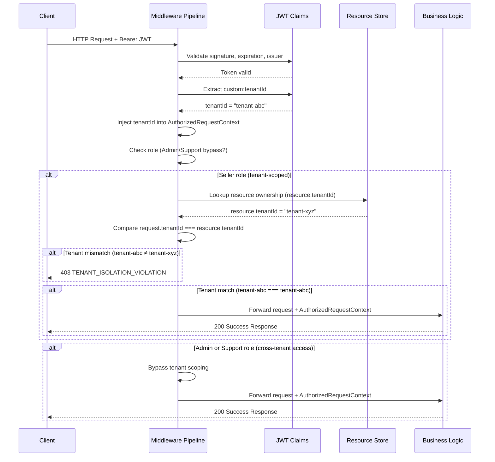
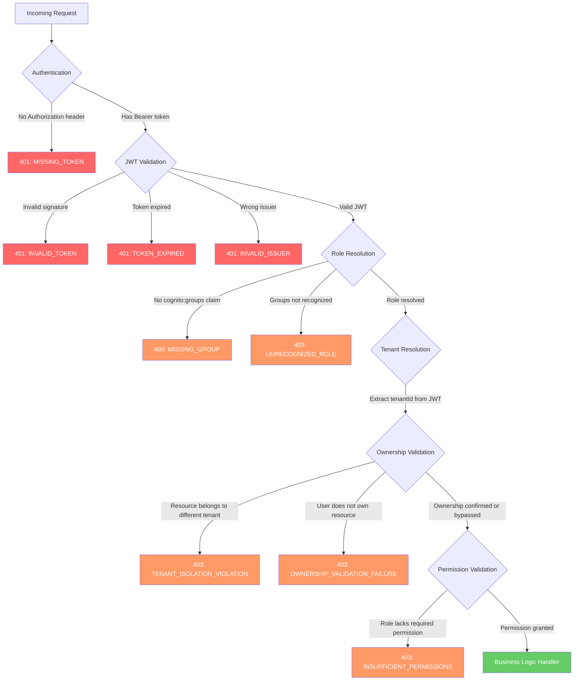
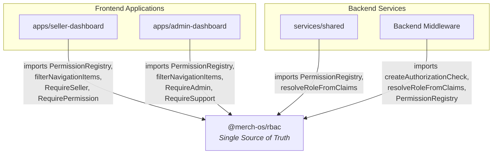

# MerchOS RBAC Architecture Blueprint

> **Status:** Living Document  
> **Last Updated:** 2025  
> **Extends:** `.kiro/specs/rbac-platform-access-control/` (approved baseline)

This Blueprint is the authoritative architecture reference for the MerchOS RBAC system. It describes tenant isolation principles, ownership validation patterns, the middleware authorization pipeline, the shared authorization library, and future-proofing guidance. All engineers building on the MerchOS platform should treat this document as the definitive source for authorization architecture decisions and patterns.

---

## 1. Tenant Isolation Principles

Tenant isolation is the foundational security constraint of the MerchOS platform. Every protected request must operate within a verified tenant boundary, ensuring that no user can access, modify, or observe data belonging to another tenant.

### 1.1 Tenant Identity Extraction

The Middleware Pipeline extracts `tenantId` **exclusively** from the authenticated JWT `custom:tenantId` claim. Tenant identity is never derived from:

- Client-supplied request parameters
- Query strings
- Path parameters
- Request headers (other than the Authorization header containing the JWT)
- Request body fields

This guarantees that tenant context cannot be forged or manipulated by the client. The JWT is signed by AWS Cognito and validated by the middleware before any claims are trusted.

### 1.2 Automatic Tenant Context Injection

After successful JWT validation and tenant extraction, the Middleware Pipeline automatically injects the resolved `tenantId` into the request context **before** business logic executes. Business logic handlers receive a pre-populated `tenantId` and never need to parse, extract, or validate tenant identity themselves.

The injection occurs at the Tenant Resolution stage of the pipeline:

1. JWT is validated (signature, expiration, issuer)
2. `custom:tenantId` claim is extracted from the validated token
3. `tenantId` is injected into the `AuthorizedRequestContext` object
4. All downstream stages and business logic use this injected value

### 1.3 Tenant Ownership Validation

Every protected request validates tenant ownership **before** executing business logic. This ensures that a Seller can never access another tenant's data, even if they possess the correct role and permissions.

The validation follows this logic:

1. The resource's `tenantId` is looked up from the resource store
2. The resource's `tenantId` is compared against the authenticated user's `tenantId` (from JWT)
3. If the values do not match, the request is rejected immediately
4. Business logic is never invoked for cross-tenant requests (for tenant-scoped roles)

### 1.4 Tenant Isolation Flow

The following sequence diagram illustrates the complete tenant isolation flow, from JWT extraction through ownership validation to business logic execution:



### 1.5 Tenant Isolation Violation Error Response

If a request targets a resource belonging to a different tenant than the authenticated user, the Middleware Pipeline returns an HTTP 403 response with a structured error body:

```json
{
  "error": {
    "code": "TENANT_ISOLATION_VIOLATION",
    "message": "Access denied. The requested resource belongs to a different tenant.",
    "details": {
      "stage": "TENANT_RESOLUTION",
      "requiredPermission": null,
      "userRole": "Seller"
    }
  }
}
```

**Key characteristics of this error response:**

- **HTTP Status:** `403 Forbidden` — the user is authenticated but not authorized for cross-tenant access
- **Error code:** Machine-readable `TENANT_ISOLATION_VIOLATION` for programmatic handling
- **Message:** Human-readable explanation that does not leak the target tenant's identity
- **Details:** Includes the pipeline stage that rejected the request and the user's role
- The response deliberately does **not** reveal the target resource's tenant ID, preventing information leakage

### 1.6 Role-Based Tenant Scoping Rules

Tenant scoping behavior varies by Platform Role:

| Role | Tenant Scoping | Behavior |
|------|---------------|----------|
| **Admin** | Bypassed | Can access resources across all tenants. No tenant ownership check is performed. Used for platform administration. |
| **Support** | Bypassed | Can access resources across all tenants. Used for customer support scenarios requiring cross-tenant visibility. |
| **Seller** | Always enforced | Every request is validated against the Seller's `tenantId` from their JWT. A Seller can never access, modify, or list resources belonging to another tenant. |
| **Future roles** | Configurable | New roles added via `@merch-os/rbac` configuration specify whether they are tenant-scoped or bypass tenant isolation. |

**Design rationale:**

- Admin and Support roles require cross-tenant access for platform management and customer assistance
- Seller roles represent tenant-bound users who must never escape their tenant boundary
- The bypass is determined by role configuration in `@merch-os/rbac`, not by any request-time parameter
- Business logic handlers do not need to check role-based scoping — the middleware handles this entirely

---

## 2. Ownership Validation Architecture

Ownership Validation is the middleware stage responsible for verifying that the requesting user actually owns the resource being accessed. While RBAC permission checks validate **role-level** access (e.g., "does this user have the `products.update.own` permission?"), Ownership Validation validates **resource-level** access (e.g., "does this specific product belong to this specific Seller?").

This distinction is critical: a Seller may possess the correct role and permission to update products in general, but must still be prevented from updating another Seller's product — even within the same tenant scope.

### 2.1 RBAC vs. Ownership Validation

| Concern | RBAC Permission Check | Ownership Validation |
|---------|----------------------|---------------------|
| **What it validates** | Role-level access — does the user's role grant the required permission? | Resource-level access — does the user own the specific resource being acted upon? |
| **Granularity** | Coarse — applies to all resources of a type | Fine — applies to a single resource instance |
| **Example pass** | Seller has `products.update.own` permission | Product `prod-123` belongs to the requesting Seller |
| **Example fail** | Seller lacks `system.configuration` permission | Product `prod-456` belongs to a different Seller |
| **Pipeline position** | Permission Validation stage | Ownership Validation stage (before Permission Validation) |

Both checks must pass for a request to reach business logic. RBAC alone is insufficient for resource-level access control.

### 2.2 Pipeline Position

Ownership Validation executes in the Middleware Pipeline **after Tenant Resolution** and **before Permission Validation**. The complete stage ordering around ownership is:

```
... → Tenant Resolution → Ownership Validation → Permission Validation → Business Logic
```

This ordering ensures:

1. The user's identity and tenant are already resolved
2. Resource ownership is validated (tenant isolation + user ownership)
3. Only then are role-level permissions checked
4. Business logic is never invoked unless both ownership and permissions are confirmed (or bypassed for Admin/Support)

### 2.3 Architectural Pattern

The Ownership Validation stage follows a three-step architectural pattern:

#### Step 1: Resource Identifier Extraction

The middleware extracts the resource identifier from the incoming request. This may come from:

- Path parameters (e.g., `/api/products/:productId`)
- Request body (for creation or batch operations)
- Query parameters (for filtered operations)

The extraction strategy is configured per-route and encapsulated in the middleware configuration.

#### Step 2: Resource Ownership Lookup

Using the extracted resource identifier, the middleware queries the resource store to determine the resource's owner. The lookup returns:

- `ownerId` — the user who owns the resource
- `tenantId` — the tenant the resource belongs to

If the resource does not exist, the middleware may return a 404 or delegate to business logic depending on the operation type.

#### Step 3: Comparison Against Authenticated User Identity

The middleware compares the resource's ownership data against the authenticated user's identity (extracted from the JWT in earlier pipeline stages):

- `resource.tenantId` must match `request.context.tenantId` (tenant isolation)
- `resource.ownerId` must match `request.context.userId` (ownership validation)

If either comparison fails (for tenant-scoped roles), the request is rejected before business logic executes.

### 2.4 Ownership Validation Middleware Pattern

The following TypeScript code examples demonstrate the Ownership Validation middleware pattern for the products resource. These are architecture reference patterns — not direct implementation code.

#### Configuration Interface

```typescript
import { Request } from 'express';

type PlatformRole = 'Admin' | 'Support' | 'Seller';

interface OwnershipValidationConfig {
  /** Extract the resource identifier from the request */
  extractResourceId: (request: Request) => string | null;
  /** Look up the owner of the resource */
  lookupResourceOwner: (resourceId: string) => Promise<{ ownerId: string; tenantId: string } | null>;
  /** Roles that bypass ownership validation (cross-tenant access) */
  bypassRoles: PlatformRole[];
}

interface OwnershipCheckResult {
  passed: boolean;
  reason?: 'RESOURCE_NOT_FOUND' | 'TENANT_ISOLATION_VIOLATION' | 'OWNERSHIP_VALIDATION_FAILURE';
}
```

#### Middleware Factory

```typescript
import { Request, Response, NextFunction } from 'express';

interface AuthorizedRequestContext {
  role: PlatformRole;
  userId: string;
  tenantId: string;
  ownershipVerified: boolean;
  grantedPermission: string;
}

function createOwnershipValidationMiddleware(config: OwnershipValidationConfig) {
  return async (req: Request, res: Response, next: NextFunction): Promise<void> => {
    const context = req.context as AuthorizedRequestContext;

    // Step 0: Bypass for privileged roles (Admin, Support)
    if (config.bypassRoles.includes(context.role)) {
      context.ownershipVerified = true;
      return next();
    }

    // Step 1: Extract resource identifier from the request
    const resourceId = config.extractResourceId(req);
    if (!resourceId) {
      // No resource to validate (e.g., list or create operations)
      context.ownershipVerified = false;
      return next();
    }

    // Step 2: Look up resource ownership
    const ownership = await config.lookupResourceOwner(resourceId);
    if (!ownership) {
      res.status(404).json({
        error: {
          code: 'RESOURCE_NOT_FOUND',
          message: 'The requested resource does not exist.',
          details: { stage: 'OWNERSHIP_VALIDATION' }
        }
      });
      return;
    }

    // Step 3a: Tenant isolation check
    if (ownership.tenantId !== context.tenantId) {
      res.status(403).json({
        error: {
          code: 'TENANT_ISOLATION_VIOLATION',
          message: 'Access denied. The requested resource belongs to a different tenant.',
          details: {
            stage: 'OWNERSHIP_VALIDATION',
            userRole: context.role
          }
        }
      });
      return;
    }

    // Step 3b: Ownership check
    if (ownership.ownerId !== context.userId) {
      res.status(403).json({
        error: {
          code: 'OWNERSHIP_VALIDATION_FAILURE',
          message: 'Access denied. You do not own the requested resource.',
          details: {
            stage: 'OWNERSHIP_VALIDATION',
            userRole: context.role,
            requiredPermission: context.grantedPermission
          }
        }
      });
      return;
    }

    // Ownership confirmed
    context.ownershipVerified = true;
    return next();
  };
}
```

#### Products Route Configuration Example

```typescript
import { ProductRepository } from '../repositories/product-repository';

// Ownership validation configuration for the products resource
const productsOwnershipConfig: OwnershipValidationConfig = {
  extractResourceId: (req) => req.params.productId ?? null,

  lookupResourceOwner: async (productId) => {
    const product = await ProductRepository.findById(productId);
    if (!product) return null;
    return { ownerId: product.sellerId, tenantId: product.tenantId };
  },

  bypassRoles: ['Admin', 'Support'],
};

// Usage in route definition
router.put(
  '/api/products/:productId',
  authenticationMiddleware,
  jwtValidationMiddleware,
  roleResolutionMiddleware,
  tenantResolutionMiddleware,
  createOwnershipValidationMiddleware(productsOwnershipConfig),
  permissionValidationMiddleware('products.update.own'),
  productUpdateHandler  // Business logic — no ownership checks here
);
```

### 2.5 Business Logic Separation

**Business logic handlers never perform ownership checks.** All ownership validation is completed in the middleware layer before the handler is invoked.

This principle ensures:

- **Single responsibility** — Handlers focus exclusively on business operations (CRUD, transformations, integrations)
- **Consistent enforcement** — Ownership checks cannot be accidentally omitted or inconsistently applied
- **Auditability** — All access control decisions are made in a single architectural layer, simplifying security reviews
- **Testability** — Handlers can be tested in isolation without mocking authorization logic

If a request reaches a business logic handler, the handler can trust that:

1. The user is authenticated (valid JWT)
2. The user has the required role and permission
3. The user's tenant context is verified
4. The user owns the resource (or ownership was bypassed for Admin/Support)

The `AuthorizedRequestContext.ownershipVerified` field confirms whether ownership validation was performed and passed.

### 2.6 Ownership Validation Failure Error Response

If an authenticated Seller requests modification of a resource they do not own, the Middleware Pipeline returns an HTTP 403 response with a structured error body:

```json
{
  "error": {
    "code": "OWNERSHIP_VALIDATION_FAILURE",
    "message": "Access denied. You do not own the requested resource.",
    "details": {
      "stage": "OWNERSHIP_VALIDATION",
      "requiredPermission": "products.update.own",
      "userRole": "Seller"
    }
  }
}
```

**Key characteristics of this error response:**

- **HTTP Status:** `403 Forbidden` — the user is authenticated and has the correct role/permission, but does not own the resource
- **Error code:** Machine-readable `OWNERSHIP_VALIDATION_FAILURE` for programmatic handling
- **Message:** Human-readable explanation that does not leak the actual resource owner's identity
- **Details:** Includes the pipeline stage (`OWNERSHIP_VALIDATION`), the permission that was validated, and the user's role
- The response deliberately does **not** reveal the resource owner's `userId` or any identifying information about the actual owner, preventing information leakage

---

## 3. Middleware Pipeline Specification

The Middleware Pipeline is the sequential authorization chain that every protected request traverses before reaching business logic. Each stage has a single responsibility, well-defined inputs and outputs, and a set of failure modes that terminate processing immediately. No stage is optional for protected routes, and no stage may be reordered.

### 3.1 Pipeline Stages Overview

The complete pipeline executes in this fixed order:

```
Request → Authentication → JWT Validation → Role Resolution → Tenant Resolution → Ownership Validation → Permission Validation → Business Logic
```

Each stage either passes the request to the next stage (enriching the request context) or terminates immediately with an HTTP error response. Business logic is never invoked unless all preceding stages pass.

### 3.2 Pipeline Flowchart



### 3.3 Stage Responsibilities

#### Stage 1: Authentication

| Property | Value |
|----------|-------|
| **Order** | 1 |
| **Inputs** | `Authorization` HTTP header |
| **Outputs** | Raw JWT string extracted from `Bearer <token>` |
| **Responsibility** | Verify that a Bearer token is present in the request's Authorization header. Does not validate the token — only confirms its presence and correct format. |
| **Failure Modes** | |

| Condition | HTTP Status | Error Code | Message |
|-----------|------------|------------|---------|
| No `Authorization` header present | 401 | `MISSING_TOKEN` | No authentication token provided. |
| Header present but not `Bearer` scheme | 401 | `MISSING_TOKEN` | No authentication token provided. |

---

#### Stage 2: JWT Validation

| Property | Value |
|----------|-------|
| **Order** | 2 |
| **Inputs** | Raw JWT string from Authentication stage |
| **Outputs** | Decoded and verified JWT payload (all claims accessible) |
| **Responsibility** | Validate the JWT signature against the Cognito User Pool's public keys, verify the `exp` claim has not passed, and confirm the `iss` claim matches the expected Cognito User Pool URL. |
| **Failure Modes** | |

| Condition | HTTP Status | Error Code | Message |
|-----------|------------|------------|---------|
| Signature does not verify against Cognito public keys | 401 | `INVALID_TOKEN` | The provided token is invalid. |
| Token is malformed or cannot be decoded | 401 | `INVALID_TOKEN` | The provided token is invalid. |
| `exp` claim is in the past | 401 | `TOKEN_EXPIRED` | The authentication token has expired. |
| `iss` claim does not match expected Cognito Pool URL | 401 | `INVALID_ISSUER` | Token issuer is not recognized. |

---

#### Stage 3: Role Resolution

| Property | Value |
|----------|-------|
| **Order** | 3 |
| **Inputs** | Validated JWT payload (specifically the `cognito:groups` claim) |
| **Outputs** | Resolved `PlatformRole` (Admin, Support, Seller, or future configured roles) written to request context |
| **Responsibility** | Extract the `cognito:groups` claim from the validated JWT and map it to a recognized `PlatformRole` using the `@merch-os/rbac` role configuration. If a user belongs to multiple groups, the highest-priority role is selected (Admin > Support > Seller). |
| **Failure Modes** | |

| Condition | HTTP Status | Error Code | Message |
|-----------|------------|------------|---------|
| No `cognito:groups` claim present in JWT | 403 | `MISSING_GROUP` | User has no assigned platform role. |
| Group values do not match any configured `PlatformRole` | 403 | `UNRECOGNIZED_ROLE` | User's group membership does not map to a recognized platform role. |

---

#### Stage 4: Tenant Resolution

| Property | Value |
|----------|-------|
| **Order** | 4 |
| **Inputs** | Validated JWT payload (specifically the `custom:tenantId` claim) |
| **Outputs** | `tenantId` written to request context |
| **Responsibility** | Extract the `custom:tenantId` claim from the validated JWT and inject it into the request context. Tenant identity is never sourced from client-supplied parameters, query strings, path parameters, or request body fields. |
| **Failure Modes** | |

| Condition | HTTP Status | Error Code | Message |
|-----------|------------|------------|---------|
| No `custom:tenantId` claim present in JWT | 403 | `TENANT_ISOLATION_VIOLATION` | Unable to resolve tenant context. |

> **Note:** Tenant Resolution does not fail for Admin or Support roles when the claim is absent in cross-tenant scenarios. The middleware trusts the JWT as the sole source of tenant identity.

---

#### Stage 5: Ownership Validation

| Property | Value |
|----------|-------|
| **Order** | 5 |
| **Inputs** | Request context (`tenantId`, `userId`, `role`), resource identifier from request path/body, resource store |
| **Outputs** | `ownershipVerified` flag written to request context |
| **Responsibility** | For tenant-scoped roles (Seller), verify that the target resource belongs to the same tenant and is owned by the requesting user. Admin and Support roles bypass this stage. For list/create operations where no specific resource is targeted, the stage passes without performing a lookup. |
| **Failure Modes** | |

| Condition | HTTP Status | Error Code | Message |
|-----------|------------|------------|---------|
| Resource's `tenantId` does not match the user's `tenantId` | 403 | `TENANT_ISOLATION_VIOLATION` | Access denied. The requested resource belongs to a different tenant. |
| Resource's `ownerId` does not match the user's `userId` | 403 | `OWNERSHIP_VALIDATION_FAILURE` | Access denied. You do not own the requested resource. |
| Resource not found by identifier | 404 | `RESOURCE_NOT_FOUND` | The requested resource does not exist. |

---

#### Stage 6: Permission Validation

| Property | Value |
|----------|-------|
| **Order** | 6 |
| **Inputs** | Resolved `PlatformRole` from request context, required permission identifier declared on the route |
| **Outputs** | `grantedPermission` written to request context |
| **Responsibility** | Check the `PermissionRegistry` (from `@merch-os/rbac`) to determine whether the user's resolved role grants the permission required by the current route. The required permission is declared in the route definition. |
| **Failure Modes** | |

| Condition | HTTP Status | Error Code | Message |
|-----------|------------|------------|---------|
| User's role does not include the required permission | 403 | `INSUFFICIENT_PERMISSIONS` | Access denied. Your role does not grant the required permission. |

---

#### Stage 7: Business Logic

| Property | Value |
|----------|-------|
| **Order** | 7 |
| **Inputs** | Complete `AuthorizedRequestContext` populated by all preceding stages |
| **Outputs** | HTTP response to the client |
| **Responsibility** | Execute the application's business logic (CRUD operations, transformations, integrations). Business logic handlers receive a fully authorized request and trust that all security validation has already been performed. |
| **Failure Modes** | Application-specific (not authorization failures) |

### 3.4 Sequential Execution and Immediate Termination

The pipeline stages execute **strictly sequentially** in the order defined above. This means:

1. Each stage runs only after the preceding stage has passed successfully.
2. If any stage determines that the request is unauthorized, processing **terminates immediately**. Subsequent stages are never invoked.
3. Business logic is never executed for a request that fails at any authorization stage.
4. Error responses are returned to the client as soon as a stage rejects the request — there is no accumulation of errors.

This design guarantees:

- **Predictable debugging** — the error code in the response identifies exactly which stage rejected the request.
- **Minimal processing** — failed requests are rejected as early as possible, avoiding unnecessary database lookups or permission checks.
- **Security by default** — no path through the middleware can bypass a required stage.

### 3.5 Business Logic Separation Principle

**Business logic handlers NEVER perform:**

- Authentication (token extraction or presence checks)
- JWT validation (signature verification, expiration checks)
- Authorization (role or permission checks)
- Tenant resolution (extracting or validating tenant identity)
- Ownership validation (verifying resource ownership)

All of the above are completed **exclusively** in the Middleware Pipeline before the handler is invoked. If a request reaches a business logic handler, the handler can unconditionally trust that:

- The user is authenticated with a valid, unexpired JWT
- The user's role has been resolved and is recognized
- The user's tenant context is established and verified
- The user owns the target resource (or ownership was bypassed for Admin/Support)
- The user's role grants the required permission for this operation

This separation ensures single-responsibility handlers, consistent enforcement across all routes, and simplified testing (handlers can be tested without mocking authorization logic).

### 3.6 AuthorizedRequestContext

After all middleware stages pass, the pipeline populates an `AuthorizedRequestContext` object and attaches it to the request. This is the sole interface between the authorization layer and business logic:

```typescript
/**
 * The enriched request context populated by the Middleware Pipeline
 * and passed to business logic handlers. This is the contract between
 * authorization middleware and application logic.
 */
interface AuthorizedRequestContext {
  /** Resolved platform role (Admin | Support | Seller | future roles) */
  role: string;

  /** User's unique identifier (JWT `sub` claim) */
  userId: string;

  /** Tenant identifier extracted from JWT `custom:tenantId` claim */
  tenantId: string;

  /**
   * Whether ownership validation was performed and passed.
   * - true: resource ownership was verified (Seller accessing own resource)
   * - true: ownership was bypassed (Admin/Support role)
   * - false: no specific resource to validate (list/create operations)
   */
  ownershipVerified: boolean;

  /** The specific permission identifier that was validated for this request */
  grantedPermission: string;
}
```

**Field population by stage:**

| Field | Populated By | Source |
|-------|-------------|--------|
| `role` | Role Resolution (Stage 3) | `cognito:groups` claim mapped via `@merch-os/rbac` |
| `userId` | JWT Validation (Stage 2) | JWT `sub` claim |
| `tenantId` | Tenant Resolution (Stage 4) | JWT `custom:tenantId` claim |
| `ownershipVerified` | Ownership Validation (Stage 5) | Comparison of resource owner against authenticated user |
| `grantedPermission` | Permission Validation (Stage 6) | Route-declared permission identifier |

### 3.7 Error Response Format

All middleware stages produce structured error responses following a consistent format:

```json
{
  "error": {
    "code": "MACHINE_READABLE_ERROR_CODE",
    "message": "Human-readable explanation of the failure.",
    "details": {
      "stage": "STAGE_NAME",
      "requiredPermission": "permission.identifier (if applicable)",
      "userRole": "Role (if resolved)"
    }
  }
}
```

**Design principles for error responses:**

- Error responses never leak sensitive information (other users' IDs, tenant IDs, resource owners)
- The `stage` field in `details` identifies exactly where in the pipeline the request was rejected
- The `code` field is machine-readable for programmatic error handling by client applications
- 401 errors indicate identity problems (missing/invalid/expired tokens)
- 403 errors indicate authorization problems (insufficient role, permission, or ownership)

### 3.8 Complete Error Code Summary

| Stage | HTTP Status | Error Code | When Triggered |
|-------|------------|------------|----------------|
| Authentication | 401 | `MISSING_TOKEN` | No Bearer token in Authorization header |
| JWT Validation | 401 | `INVALID_TOKEN` | Malformed JWT or invalid signature |
| JWT Validation | 401 | `TOKEN_EXPIRED` | JWT `exp` claim is in the past |
| JWT Validation | 401 | `INVALID_ISSUER` | JWT `iss` does not match Cognito Pool |
| Role Resolution | 403 | `MISSING_GROUP` | No `cognito:groups` claim in JWT |
| Role Resolution | 403 | `UNRECOGNIZED_ROLE` | Groups don't match any configured PlatformRole |
| Tenant Resolution | 403 | `TENANT_ISOLATION_VIOLATION` | Cannot resolve tenant context |
| Ownership Validation | 403 | `TENANT_ISOLATION_VIOLATION` | Resource belongs to a different tenant |
| Ownership Validation | 403 | `OWNERSHIP_VALIDATION_FAILURE` | User does not own the resource |
| Ownership Validation | 404 | `RESOURCE_NOT_FOUND` | Target resource does not exist |
| Permission Validation | 403 | `INSUFFICIENT_PERMISSIONS` | Role lacks the required permission |

---

## 4. Shared Authorization Library

The `@merch-os/rbac` package is the **single source of truth** for all permission definitions, role configurations, and authorization utilities consumed by frontend applications, backend services, and middleware. Authorization logic is never duplicated or redefined locally in any consumer — every consumer imports from this shared package.

This design guarantees that:

- Permission definitions are declared once and consumed everywhere
- Role-to-permission mappings are consistent across frontend guards, backend middleware, and navigation filtering
- A change to a role or permission propagates automatically to all consumers without individual updates
- Security audits need only review one package to understand the complete authorization model

### 4.1 Public API Surface

The `@merch-os/rbac` package exports the following types, classes, functions, and components:

| Export | Type | Layer | Description |
|--------|------|-------|-------------|
| `PermissionRegistry` | Class | All | Permission lookup engine. Resolves whether a given role has a specific permission. Used by middleware for authorization checks and by frontend for conditional rendering. |
| `resolveRoleFromClaims` | Function | Backend / Middleware | Accepts decoded JWT claims (specifically `cognito:groups`) and returns the resolved `PlatformRole`. Implements priority resolution when a user belongs to multiple groups (Admin > Support > Seller). |
| `createAuthorizationCheck` | Function | Backend / Middleware | Factory function that produces Express-compatible middleware for route-level permission validation. Accepts a permission identifier string and returns a middleware function. |
| `filterNavigationItems` | Function | Frontend | Accepts a user's resolved role and a navigation configuration array, returns only the navigation items the role is authorized to see. Powers sidebar and menu rendering. |
| `RequireAdmin` | Component | Frontend | React component guard that renders children only when the authenticated user has the Admin role. Redirects or shows fallback UI otherwise. |
| `RequireSupport` | Component | Frontend | React component guard that renders children when the authenticated user has Admin or Support role. |
| `RequireSeller` | Component | Frontend | React component guard that renders children when the authenticated user has the Seller role. |
| `RequirePermission` | Component | Frontend | Generic React component guard. Accepts a `permission` prop (string) and renders children only if the user's role grants that permission via `PermissionRegistry`. |

### 4.2 Dependency Diagram

All frontend applications, backend services, and middleware import authorization logic exclusively from `@merch-os/rbac`. No consumer defines permissions, roles, or authorization utilities locally.



**Key constraints:**

- Arrows flow **inward** toward `@merch-os/rbac` — no consumer exports authorization logic back
- Frontend apps consume UI guards (`Require*` components) and `filterNavigationItems`
- Backend services and middleware consume `resolveRoleFromClaims` and `createAuthorizationCheck`
- `PermissionRegistry` is consumed by all layers for permission lookups

### 4.3 Versioning and Release Strategy

The `@merch-os/rbac` package follows a strict versioning strategy to ensure all consumers always operate against identical authorization definitions:

| Concern | Strategy |
|---------|----------|
| **Monorepo protocol** | Uses `workspace:*` protocol in `package.json` dependencies, ensuring all apps and services within the monorepo resolve to the same local version at build time. |
| **Version consistency** | All consumer applications are guaranteed to use the **same version** of `@merch-os/rbac` within any given release. There is never a scenario where the frontend uses one permission set and the backend uses another. |
| **Release coupling** | When `@merch-os/rbac` is updated (new role, new permission, modified mapping), all consumers automatically pick up the change on the next build — no individual dependency bumps required. |
| **Breaking change policy** | Removing or renaming a permission requires a deprecation period. The package maintains backward compatibility within a major version. |
| **CI validation** | The CI pipeline builds all consumers after any change to `@merch-os/rbac`, catching type mismatches or missing imports immediately. |

**`package.json` dependency example (any consumer):**

```json
{
  "dependencies": {
    "@merch-os/rbac": "workspace:*"
  }
}
```

This workspace protocol ensures that `npm install` or `pnpm install` links the local package rather than fetching from a registry, guaranteeing version alignment across the entire monorepo.

### 4.4 Configuration-Only Change Principle

Adding a new role or permission requires **only** updating the `@merch-os/rbac` package configuration. No changes to consumer applications — frontend, backend, or middleware — are necessary.

**Why this works:**

1. **Middleware** uses `resolveRoleFromClaims` which reads from the role configuration dynamically — a new Cognito Group mapping is picked up automatically.
2. **Permission checks** use `PermissionRegistry` which loads the role-permission matrix at startup — a new permission in the configuration is available to all middleware routes immediately.
3. **Frontend guards** (`RequirePermission`) query `PermissionRegistry` at render time — new permissions are respected without component changes.
4. **Navigation filtering** uses `filterNavigationItems` which evaluates against the current registry state — new role visibility rules apply automatically.

**What "configuration-only" means in practice:**

| Change Type | Where to Update | Consumer Code Changes |
|-------------|----------------|----------------------|
| Add a new permission | `@merch-os/rbac` permission config | None |
| Add a new role | `@merch-os/rbac` role config + Cognito Group | None |
| Grant existing permission to a role | `@merch-os/rbac` role-permission mapping | None |
| Revoke a permission from a role | `@merch-os/rbac` role-permission mapping | None |
| Add a new permission domain | `@merch-os/rbac` permission config | None |

This principle eliminates the risk of authorization drift between consumers and reduces the blast radius of RBAC changes to a single, well-tested package.

---

## 5. Future-Proofing Guide

This section documents how new Platform Roles are introduced to the MerchOS platform through configuration only, provides example future role configurations, defines the governance process for role proposals, and states the scalability guarantees of the architecture.

### 5.1 Adding a New Platform_Role — Step-by-Step Procedure

Adding a new role to the platform requires exactly three steps. No source code modifications to middleware, guards, navigation, or business logic are necessary.

#### Step 1: Create a Cognito Group

Create a new User Pool Group in AWS Cognito that corresponds to the new role:

1. Navigate to the Cognito User Pool console (or use the AWS CLI / IaC template).
2. Create a group with a name that matches the role identifier (e.g., `Finance`, `Developer`, `EnterpriseCustomer`).
3. The group name becomes the value that appears in the `cognito:groups` JWT claim for users assigned to this role.

**AWS CLI example:**

```bash
aws cognito-idp create-group \
  --user-pool-id us-east-1_XXXXXXXXX \
  --group-name Finance \
  --description "Finance team with billing and subscription management access"
```

#### Step 2: Add Role Entry to `@merch-os/rbac` Configuration

Add the new role and its permissions to the `defaultPermissionConfig` in the `@merch-os/rbac` package:

```typescript
// packages/rbac/src/config/permissions.ts

export const defaultPermissionConfig: PermissionRegistryConfig = {
  roles: [
    // ... existing roles (Admin, Support, Seller) ...
    {
      roleId: 'Finance',
      permissions: [
        { resource: 'subscription', actions: ['read', 'update', 'delete'] },
        { resource: 'billing', actions: ['read', 'update'] },
        { resource: 'analytics', actions: ['read'] },
      ],
      tenantScoped: false,      // Finance has cross-tenant visibility
      bypassOwnership: true,    // No resource-level ownership checks
    },
  ],
};
```

This single configuration change propagates automatically to:

- Backend middleware (via `resolveRoleFromClaims` and `PermissionRegistry`)
- Frontend guards (via `RequirePermission` and `filterNavigationItems`)
- Navigation rendering (items are shown/hidden based on new role permissions)

#### Step 3: Assign Users to the Cognito Group

Add users to the newly created Cognito Group to grant them the new role:

```bash
aws cognito-idp admin-add-user-to-group \
  --user-pool-id us-east-1_XXXXXXXXX \
  --username user@example.com \
  --group-name Finance
```

Once a user is assigned, their next JWT will include the new group in the `cognito:groups` claim. The middleware resolves this to the new Platform_Role automatically.

### 5.2 No Source Code Modifications Required

When a new Platform_Role is added following the procedure above, **no source code changes** are required in any of the following layers:

| Layer | Why No Changes Are Needed |
|-------|--------------------------|
| **Middleware Pipeline** | `resolveRoleFromClaims` reads from the `@merch-os/rbac` configuration dynamically. New group mappings are resolved automatically. |
| **Permission Guards** | `createAuthorizationCheck` queries `PermissionRegistry` at request time. New role-permission mappings are evaluated without code changes. |
| **Frontend Navigation** | `filterNavigationItems` evaluates visibility against the live registry state. New roles see appropriate navigation items automatically. |
| **UI Component Guards** | `RequirePermission` checks permissions at render time against `PermissionRegistry`. No hardcoded role lists. |
| **Business Logic Handlers** | Handlers never perform authorization checks — they trust the middleware pipeline. Adding a role does not affect any handler. |
| **Tenant Resolution** | Tenant scoping behavior (scoped vs. bypass) is configured per-role in `@merch-os/rbac`, not in middleware code. |
| **Ownership Validation** | The `bypassRoles` array is read from configuration. New bypass roles are respected without middleware changes. |

This zero-code-change principle is a direct consequence of the centralized middleware architecture (see ADR-001) and the single-source-of-truth design of `@merch-os/rbac`.

### 5.3 Example Future Role Configurations

The following configurations demonstrate how three projected future roles would be defined in `@merch-os/rbac`. These are illustrative examples showing the configuration pattern:

#### Finance Role

The Finance role provides access to billing, subscription management, and financial analytics across all tenants.

```typescript
{
  roleId: 'Finance',
  permissions: [
    { resource: 'subscription', actions: ['read', 'update', 'delete'] },
    { resource: 'subscription.invoice', actions: ['read'] },
    { resource: 'billing', actions: ['read', 'update'] },
    { resource: 'analytics', actions: ['read'] },
    { resource: 'system.metrics', actions: ['read'] },
  ],
  tenantScoped: false,
  bypassOwnership: true,
}
```

| Permission Identifier | Description |
|----------------------|-------------|
| `subscription.view` | View all tenant subscriptions |
| `subscription.change` | Modify subscription plans |
| `subscription.cancel` | Process subscription cancellations |
| `subscription.invoice` | View and download invoices |
| `billing.read` | Access billing records and payment history |
| `billing.update` | Process refunds and adjustments |
| `analytics.read` | View financial analytics and revenue reports |
| `system.metrics` | Access platform financial metrics |

#### Developer Role

The Developer role provides access to system diagnostics, infrastructure monitoring, AI training management, and background job administration.

```typescript
{
  roleId: 'Developer',
  permissions: [
    { resource: 'system.logs', actions: ['read'] },
    { resource: 'system.metrics', actions: ['read'] },
    { resource: 'system.health', actions: ['read'] },
    { resource: 'system.jobs', actions: ['read', 'update'] },
    { resource: 'ai.training', actions: ['read', 'update'] },
    { resource: 'infrastructure', actions: ['read'] },
  ],
  tenantScoped: false,
  bypassOwnership: true,
}
```

| Permission Identifier | Description |
|----------------------|-------------|
| `system.logs` | View application and system logs |
| `system.metrics` | Access performance metrics and dashboards |
| `system.health` | Monitor service health and uptime |
| `system.jobs` | View and manage background job queues |
| `ai.training` | Manage AI model training pipelines |
| `infrastructure.read` | View infrastructure status and configurations |

#### Enterprise Customer Role

The Enterprise Customer role is a tenant-scoped role providing read access to products, analytics, and marketplace exports within their own tenant boundary.

```typescript
{
  roleId: 'EnterpriseCustomer',
  permissions: [
    { resource: 'products', actions: ['read'] },
    { resource: 'analytics', actions: ['read'] },
    { resource: 'exports', actions: ['read'] },
    { resource: 'marketplace.takealot', actions: ['read'] },
    { resource: 'marketplace.amazon', actions: ['read'] },
    { resource: 'marketplace.makro', actions: ['read'] },
    { resource: 'marketplace.shopify', actions: ['read'] },
  ],
  tenantScoped: true,
  bypassOwnership: false,
}
```

| Permission Identifier | Description |
|----------------------|-------------|
| `products.read.own` | View products within their tenant |
| `analytics.read` | Access tenant-specific analytics dashboards |
| `exports.read` | View export history and status |
| `marketplace.takealot.export` | View Takealot export status (read-only) |
| `marketplace.amazon.export` | View Amazon export status (read-only) |
| `marketplace.makro.export` | View Makro export status (read-only) |
| `marketplace.shopify.export` | View Shopify export status (read-only) |

> **Note:** The Enterprise Customer role is tenant-scoped (`tenantScoped: true`) and does not bypass ownership validation (`bypassOwnership: false`). This means the middleware enforces full tenant isolation and ownership checks, identical to the Seller role pattern.

### 5.4 Governance Process for New Roles

Every new Platform_Role must go through a structured governance process before being added to the platform. This ensures security, consistency, and organizational alignment.

#### Phase 1: Proposal

1. **Author** submits a Role Proposal document containing:
   - Role name and description
   - Business justification (why the role is needed)
   - Proposed permission set (using Permission_Naming_Standard)
   - Tenant scoping decision (scoped or bypass) with rationale
   - Ownership validation behavior (enforced or bypassed) with rationale
   - Estimated number of users who will hold this role
   - Comparison to existing roles (why existing roles are insufficient)

2. **Template fields:**
   | Field | Required | Description |
   |-------|----------|-------------|
   | Role Name | Yes | PascalCase identifier (e.g., `Finance`) |
   | Description | Yes | One-paragraph description of the role's purpose |
   | Business Justification | Yes | Why no existing role satisfies the need |
   | Permissions | Yes | Complete list using `resource.action.scope` format |
   | Tenant Scoped | Yes | `true` or `false` with rationale |
   | Bypass Ownership | Yes | `true` or `false` with rationale |
   | Priority (Cognito Group) | Yes | Integer determining resolution order vs. other roles |
   | Estimated Users | Yes | Approximate count for capacity planning |

#### Phase 2: Security Assessment

1. **Security team** reviews the proposed permission set for:
   - **Least privilege compliance** — Does the role grant only the minimum permissions required?
   - **Privilege escalation risk** — Could this role be used to gain unauthorized access to higher-privilege operations?
   - **Tenant isolation impact** — If bypassing tenant scoping, is cross-tenant access justified and bounded?
   - **Data exposure scope** — What sensitive data does this role expose, and is access proportionate to the business need?
   - **Conflict analysis** — Do any proposed permissions conflict with existing role boundaries?

2. **Output:** Security assessment report with one of: `Approved`, `Approved with Modifications`, or `Rejected`.

#### Phase 3: Permission Scope Validation

1. **Architecture team** validates that:
   - All proposed permissions conform to the Permission_Naming_Standard
   - Permissions exist in the central registry (or new permissions are added as part of the proposal)
   - The role does not duplicate an existing role's permission set (suggesting the existing role should be modified instead)
   - The tenant scoping and ownership bypass settings are architecturally consistent

2. **Output:** Architecture validation sign-off.

#### Phase 4: Approval and Implementation

1. **Approval** requires sign-off from:
   - Engineering lead (technical feasibility)
   - Security team (security assessment passed)
   - Architecture team (scope validation passed)
   - Product owner (business alignment)

2. **Implementation** follows the three-step procedure documented in Section 5.1 above.

3. **Post-implementation verification:**
   - Confirm JWT claims include the new group after user assignment
   - Confirm `resolveRoleFromClaims` correctly resolves the new role
   - Confirm `PermissionRegistry` returns correct permissions for the role
   - Confirm navigation filtering shows appropriate items for the role
   - Confirm middleware rejects unauthorized actions for the role

### 5.5 Scalability: Minimum 20 Distinct Platform_Roles

The MerchOS platform architecture supports a **minimum of 20 distinct Platform_Roles** without degradation of authorization performance or configuration complexity.

**Why 20+ roles are supported without performance impact:**

| Concern | Design | Impact at 20+ Roles |
|---------|--------|---------------------|
| **Role Resolution** | `resolveRoleFromClaims` performs a single pass over `cognito:groups` (O(n) where n = number of groups per user, typically 1–3) and a lookup against the role config map (O(1) hash lookup). | Negligible — user group count is bounded, not role count. |
| **Permission Lookup** | `PermissionRegistry` uses a pre-built role→permission map constructed at startup. Permission checks are O(1) hash lookups. | Negligible — adding roles increases map size linearly but lookup remains O(1). |
| **JWT Size** | Users belong to 1–3 groups regardless of total platform role count. JWT size is unaffected by the total number of defined roles. | No impact — JWT size is bounded by per-user group membership, not total role definitions. |
| **Configuration Complexity** | Each role is an independent entry in the permission config. Roles do not interact or depend on each other. | Linear growth in config file size; no combinatorial complexity. |
| **Cognito Group Limits** | AWS Cognito supports up to 300 groups per User Pool. | Well within limits at 20 roles. |
| **Frontend Navigation** | `filterNavigationItems` evaluates the authenticated user's single role against navigation config. Total role count does not affect per-request filtering. | No impact — filtering is per-user, not per-role-catalog. |
| **Middleware Overhead** | Authorization middleware executes the same number of stages regardless of how many roles exist in the system. Only the authenticated user's role is evaluated. | No impact — pipeline complexity is constant per request. |

**Architectural guarantee:** Because the middleware pipeline evaluates only the **requesting user's resolved role** (not all possible roles), authorization latency is O(1) with respect to the total number of defined Platform_Roles. The system can scale to the Cognito limit of 300 groups without architectural changes.
