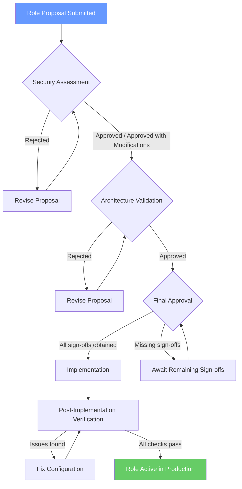

# RBAC Future-Proofing Addendum

> **Status:** Living Document  
> **Last Updated:** 2025  
> **Companion to:** [RBAC Blueprint](./rbac-blueprint.md) | [RBAC Specification](./rbac-specification.md)

This addendum provides detailed guidance for expanding the MerchOS RBAC system with new Platform Roles through configuration only. It serves as the operational reference for teams proposing, reviewing, and implementing new roles. For architectural context, refer to the [RBAC Blueprint](./rbac-blueprint.md). For permission naming and domain details, refer to the [RBAC Specification](./rbac-specification.md).

---

## 1. Configuration-Only Role Expansion Procedure

The MerchOS RBAC architecture is designed so that new Platform Roles are introduced **without any source code changes** to middleware, guards, navigation, or business logic. The entire expansion is accomplished through configuration updates and AWS Cognito group management.

### 1.1 Prerequisites

Before beginning the role expansion procedure, confirm:

- [ ] The role has completed the governance process (see [Section 4](#4-governance-process-for-new-roles))
- [ ] All proposed permissions exist in the central permission registry (see [RBAC Specification — Permission Naming Standard](./rbac-specification.md#1-permission-naming-standard))
- [ ] Security assessment is approved
- [ ] Architecture team has validated the permission scope

### 1.2 Step-by-Step Procedure

#### Step 1: Create a Cognito User Pool Group

Create a new group in AWS Cognito that maps to the new Platform Role.

**Using AWS CLI:**

```bash
aws cognito-idp create-group \
  --user-pool-id <YOUR_USER_POOL_ID> \
  --group-name <RoleName> \
  --description "<Brief description of the role's purpose>" \
  --precedence <priority_integer>
```

**Key considerations:**

| Parameter | Guidance |
|-----------|----------|
| `group-name` | Use PascalCase matching the `roleId` in `@merch-os/rbac` config (e.g., `Finance`, `Developer`, `EnterpriseCustomer`) |
| `description` | One sentence describing the role's access level and purpose |
| `precedence` | Lower numbers = higher priority. Used when a user belongs to multiple groups to determine which role is resolved. Assign based on privilege level (Admin=1, Support=5, Seller=10, new roles=15+) |

**Using Infrastructure as Code (recommended for production):**

```typescript
// Example: AWS CDK definition
const financeGroup = new cognito.CfnUserPoolGroup(this, 'FinanceGroup', {
  userPoolId: userPool.userPoolId,
  groupName: 'Finance',
  description: 'Finance team with billing and subscription management access',
  precedence: 15,
});
```

#### Step 2: Add Role Entry to `@merch-os/rbac` Configuration

Update the `defaultPermissionConfig` in the `@merch-os/rbac` package to include the new role and its permission set.

**File:** `packages/rbac/src/config.ts`

```typescript
import type { PermissionRegistryConfig } from './types';

export const defaultPermissionConfig: PermissionRegistryConfig = {
  roles: [
    // ... existing roles (Seller, Support, Admin) remain unchanged ...

    // NEW ROLE ADDED HERE
    {
      roleId: 'Finance',
      permissions: [
        { resource: 'subscription', actions: ['read', 'update', 'delete'] },
        { resource: 'subscription.invoice', actions: ['read'] },
        { resource: 'billing', actions: ['read', 'update'] },
        { resource: 'analytics', actions: ['read'] },
        { resource: 'system.metrics', actions: ['read'] },
      ],
      // Optional metadata fields (documented convention):
      // tenantScoped: false,     — Finance has cross-tenant visibility
      // bypassOwnership: true,   — No resource-level ownership checks
    },
  ],
};
```

**What happens automatically after this change:**

| System Component | Automatic Behavior |
|-----------------|-------------------|
| Backend middleware | `resolveRoleFromClaims` resolves the new Cognito group to the Platform Role. `PermissionRegistry` evaluates permissions for the new role. |
| Frontend guards | `RequirePermission` and other guard components recognize the new role's permissions. |
| Navigation filtering | `filterNavigationItems` shows/hides menu items based on the new role's permission set. |
| API authorization | `createAuthorizationCheck` evaluates the new role against endpoint permission requirements. |

#### Step 3: Configure Tenant Scoping and Ownership Behavior

Specify how the new role interacts with tenant isolation and ownership validation. This is part of the configuration entry in Step 2, but deserves explicit attention:

```typescript
{
  roleId: 'NewRole',
  permissions: [ /* ... */ ],
  tenantScoped: true | false,    // Does the role see only its own tenant's data?
  bypassOwnership: true | false, // Does the role skip resource-level ownership checks?
}
```

**Decision matrix:**

| Role Type | tenantScoped | bypassOwnership | Example |
|-----------|:---:|:---:|---------|
| Global administrative | `false` | `true` | Admin, Support, Finance |
| Global read-only operational | `false` | `true` | Developer (system access) |
| Tenant-bound with full CRUD | `true` | `false` | Seller |
| Tenant-bound read-only | `true` | `false` | Enterprise Customer |

#### Step 4: Assign Users to the Cognito Group

Once the configuration is deployed, assign users to the new group:

```bash
aws cognito-idp admin-add-user-to-group \
  --user-pool-id <YOUR_USER_POOL_ID> \
  --username <user_email_or_sub> \
  --group-name <RoleName>
```

**Verification checklist:**

- [ ] User's next JWT includes the new group in `cognito:groups` claim
- [ ] `resolveRoleFromClaims` resolves the correct Platform Role for the user
- [ ] `PermissionRegistry.hasPermission(role, resource, action)` returns expected results
- [ ] Frontend navigation renders appropriate items for the new role
- [ ] Unauthorized actions return HTTP 403 with correct error codes

#### Step 5: Validate in Non-Production Environment

Before production rollout, validate in a staging environment:

1. **Authentication flow** — Confirm the user can log in and receives a JWT with the correct group claim.
2. **Permission checks** — Confirm the user can access all permitted resources and is denied access to non-permitted resources.
3. **Tenant isolation** — Confirm cross-tenant behavior matches the `tenantScoped` setting.
4. **Ownership validation** — Confirm ownership checks are enforced or bypassed per `bypassOwnership`.
5. **UI rendering** — Confirm navigation, guards, and components render correctly for the new role.

### 1.3 What Does NOT Change

The following components require **zero modifications** when a new role is added:

- Middleware pipeline logic (stages, ordering, error handling)
- Permission guard implementations
- Frontend route guards and component guards
- Navigation rendering logic
- Business logic handlers
- Tenant resolution logic
- Ownership validation middleware
- API endpoint implementations
- Database schemas

This is documented in detail in the [RBAC Blueprint — Section 5.2](./rbac-blueprint.md#52-no-source-code-modifications-required).

---

## 2. Registering New Permissions

If a new role requires permissions that do not yet exist in the permission registry, those permissions must be registered before the role can use them.

### 2.1 Adding a New Permission

1. **Verify naming compliance** — The permission must follow the `resource.action.scope` format defined in the [RBAC Specification — Permission Naming Standard](./rbac-specification.md#1-permission-naming-standard).
2. **Check for existing coverage** — Confirm no existing permission already covers the intended access.
3. **Add to the domain section** — If the permission belongs to an existing domain, add it to that domain's section in the RBAC Specification. If it requires a new domain, follow the domain addition process.
4. **Update the role-permission matrix** — Ensure the new permission appears in the matrix with correct role assignments.

### 2.2 Adding a New Permission Domain

Follow the process documented in the [RBAC Specification — Permission Domain Addition Process](./rbac-specification.md#4-permission-domain-addition-process) which requires:

- Domain name and description
- Complete permission list within the domain
- Role assignments for each permission
- Security review sign-off

---

## 3. Example Future Role Configurations

The following examples demonstrate complete role configurations for projected future roles. Each includes the full TypeScript configuration, permission identifiers using the naming standard, and architectural notes.

### 3.1 Finance Role

**Purpose:** Provides the finance team with cross-tenant access to billing, subscription management, invoice processing, and financial analytics.

**Tenant scoping:** Global (cross-tenant visibility for financial operations)  
**Ownership validation:** Bypassed (finance operates across all resources)

```typescript
// packages/rbac/src/config.ts — Finance role configuration

{
  roleId: 'Finance',
  permissions: [
    { resource: 'subscription', actions: ['read', 'update', 'delete'] },
    { resource: 'subscription.invoice', actions: ['read'] },
    { resource: 'billing', actions: ['read', 'update'] },
    { resource: 'billing.refunds', actions: ['create', 'read'] },
    { resource: 'analytics', actions: ['read'] },
    { resource: 'analytics.revenue', actions: ['read'] },
    { resource: 'system.metrics', actions: ['read'] },
    { resource: 'tenants', actions: ['read'] },
  ],
  tenantScoped: false,
  bypassOwnership: true,
}
```

**Full permission set:**

| Permission Identifier | Resource | Action | Scope | Description |
|----------------------|----------|--------|-------|-------------|
| `subscription.view` | subscription | view | — | View all tenant subscriptions |
| `subscription.change` | subscription | change | — | Modify subscription plans |
| `subscription.cancel` | subscription | cancel | — | Process subscription cancellations |
| `subscription.invoice` | subscription.invoice | read | — | View and download invoices |
| `billing.read` | billing | read | — | Access billing records and payment history |
| `billing.update` | billing | update | — | Process refunds and billing adjustments |
| `billing.refunds.create` | billing.refunds | create | — | Issue new refunds |
| `analytics.read` | analytics | read | — | View financial analytics and revenue reports |
| `analytics.revenue.read` | analytics.revenue | read | — | View revenue-specific dashboards |
| `system.metrics` | system | metrics | — | Access platform financial metrics |
| `tenants.read` | tenants | read | — | View tenant information for billing context |

**Cognito Group setup:**

```bash
aws cognito-idp create-group \
  --user-pool-id us-east-1_XXXXXXXXX \
  --group-name Finance \
  --description "Finance team with billing and subscription management access" \
  --precedence 15
```

---

### 3.2 Developer Role

**Purpose:** Provides the engineering team with access to system diagnostics, infrastructure monitoring, AI training management, background job administration, and deployment status.

**Tenant scoping:** Global (developers need cross-tenant visibility for debugging)  
**Ownership validation:** Bypassed (developers operate on system-level resources)

```typescript
// packages/rbac/src/config.ts — Developer role configuration

{
  roleId: 'Developer',
  permissions: [
    { resource: 'system.logs', actions: ['read'] },
    { resource: 'system.metrics', actions: ['read'] },
    { resource: 'system.health', actions: ['read'] },
    { resource: 'system.jobs', actions: ['read', 'update'] },
    { resource: 'system.configuration', actions: ['read'] },
    { resource: 'ai.training', actions: ['read', 'update'] },
    { resource: 'ai.jobs', actions: ['read'] },
    { resource: 'infrastructure', actions: ['read'] },
    { resource: 'infrastructure.deployments', actions: ['read'] },
    { resource: 'processing-jobs', actions: ['read', 'update'] },
    { resource: 'audit-log', actions: ['read'] },
  ],
  tenantScoped: false,
  bypassOwnership: true,
}
```

**Full permission set:**

| Permission Identifier | Resource | Action | Scope | Description |
|----------------------|----------|--------|-------|-------------|
| `system.logs` | system.logs | read | — | View application and system logs |
| `system.metrics` | system.metrics | read | — | Access performance metrics and dashboards |
| `system.health` | system.health | read | — | Monitor service health and uptime |
| `system.jobs` | system.jobs | read, update | — | View and manage background job queues |
| `system.configuration` | system.configuration | read | — | View system configuration (read-only) |
| `ai.training` | ai.training | read, update | — | Manage AI model training pipelines |
| `ai.jobs` | ai.jobs | read | — | View AI processing job status |
| `infrastructure.read` | infrastructure | read | — | View infrastructure status and configurations |
| `infrastructure.deployments.read` | infrastructure.deployments | read | — | View deployment history and status |
| `processing-jobs.read` | processing-jobs | read | — | View background processing job details |
| `processing-jobs.update` | processing-jobs | update | — | Retry or cancel processing jobs |
| `audit-log.read` | audit-log | read | — | View security and access audit logs |

**Cognito Group setup:**

```bash
aws cognito-idp create-group \
  --user-pool-id us-east-1_XXXXXXXXX \
  --group-name Developer \
  --description "Engineering team with system diagnostics and infrastructure access" \
  --precedence 12
```

---

### 3.3 Enterprise Customer Role

**Purpose:** Provides enterprise customers (B2B partners) with tenant-scoped read access to their own products, analytics, export history, and marketplace integration status.

**Tenant scoping:** Scoped (enterprise customers see only their own tenant's data)  
**Ownership validation:** Enforced (full tenant isolation and ownership checks apply)

```typescript
// packages/rbac/src/config.ts — Enterprise Customer role configuration

{
  roleId: 'EnterpriseCustomer',
  permissions: [
    { resource: 'products', actions: ['read'] },
    { resource: 'analytics', actions: ['read'] },
    { resource: 'analytics.reports', actions: ['read'] },
    { resource: 'exports', actions: ['read'] },
    { resource: 'marketplace.takealot', actions: ['read'] },
    { resource: 'marketplace.amazon', actions: ['read'] },
    { resource: 'marketplace.makro', actions: ['read'] },
    { resource: 'marketplace.shopify', actions: ['read'] },
    { resource: 'subscription', actions: ['read'] },
    { resource: 'subscription.invoice', actions: ['read'] },
  ],
  tenantScoped: true,
  bypassOwnership: false,
}
```

**Full permission set:**

| Permission Identifier | Resource | Action | Scope | Description |
|----------------------|----------|--------|-------|-------------|
| `products.read.own` | products | read | own | View products within their tenant |
| `analytics.read` | analytics | read | own | Access tenant-specific analytics dashboards |
| `analytics.reports.read` | analytics.reports | read | own | Generate and view custom analytics reports |
| `exports.read` | exports | read | own | View export history and download status |
| `marketplace.takealot.export` | marketplace.takealot | read | own | View Takealot export status |
| `marketplace.amazon.export` | marketplace.amazon | read | own | View Amazon export status |
| `marketplace.makro.export` | marketplace.makro | read | own | View Makro export status |
| `marketplace.shopify.export` | marketplace.shopify | read | own | View Shopify export status |
| `subscription.view` | subscription | read | own | View their own subscription details |
| `subscription.invoice` | subscription.invoice | read | own | View and download their own invoices |

**Cognito Group setup:**

```bash
aws cognito-idp create-group \
  --user-pool-id us-east-1_XXXXXXXXX \
  --group-name EnterpriseCustomer \
  --description "B2B enterprise customers with read-only access to their tenant data" \
  --precedence 20
```

**Important architectural notes:**

- This role follows the same tenant isolation pattern as the Seller role (`tenantScoped: true`, `bypassOwnership: false`)
- The middleware enforces that Enterprise Customer users can only access resources where `resource.tenantId === jwt.custom:tenantId`
- The role is intentionally read-only to prevent B2B partners from modifying catalog data
- Marketplace permissions provide visibility into export status but not the ability to trigger exports

---

## 4. Governance Process for New Roles

Every new Platform Role must follow a structured governance process to ensure security, consistency, and alignment with platform architecture. This section defines the complete workflow from proposal to implementation.

### 4.1 Role Proposal Template

Teams proposing a new role must submit a completed proposal using the following template:

```markdown
# Platform Role Proposal: [Role Name]

## 1. Overview

| Field | Value |
|-------|-------|
| **Role Name** | [PascalCase identifier, e.g., `Finance`] |
| **Proposed By** | [Team/Individual name] |
| **Date** | [YYYY-MM-DD] |
| **Priority (Cognito Group Precedence)** | [Integer, e.g., 15] |
| **Estimated Users** | [Approximate count] |

## 2. Description

[One paragraph describing the role's purpose and who will hold it.]

## 3. Business Justification

[Explain why no existing role satisfies the need. Include specific use cases
that cannot be achieved with current roles.]

## 4. Proposed Permission Set

| Permission Identifier | Resource | Actions | Justification |
|----------------------|----------|---------|---------------|
| `resource.action.scope` | resource | [actions] | [Why this permission is needed] |

## 5. Tenant Scoping

- **Tenant Scoped:** [true / false]
- **Rationale:** [Why this role needs cross-tenant access or should be tenant-restricted]

## 6. Ownership Validation

- **Bypass Ownership:** [true / false]
- **Rationale:** [Why ownership checks should or should not apply]

## 7. Comparison to Existing Roles

| Existing Role | Overlap | Why Insufficient |
|---------------|---------|-----------------|
| [Role name] | [Shared permissions] | [Why modifying this role is not appropriate] |

## 8. Configuration Preview

```typescript
{
  roleId: '[RoleName]',
  permissions: [
    // Complete permission configuration
  ],
  tenantScoped: [true/false],
  bypassOwnership: [true/false],
}
```

## 9. Rollout Plan

- **Target environment:** [staging/production]
- **Initial user set:** [Who will be assigned first]
- **Rollback plan:** [How to revert if issues arise]
```

### 4.2 Review Workflow

The governance workflow proceeds through four phases with defined reviewers and gates:



#### Phase 1: Submission

1. Author completes the Role Proposal Template (Section 4.1)
2. Proposal is submitted to the Architecture Board (shared channel or review system)
3. Proposal is assigned a tracking ID (e.g., `ROLE-2025-004`)

#### Phase 2: Security Assessment

The security team evaluates the proposal against these criteria:

| Criterion | Assessment Question |
|-----------|-------------------|
| **Least Privilege** | Does the role request only the minimum permissions required for its stated purpose? |
| **Privilege Escalation Risk** | Could combining this role with existing user attributes enable unintended access? |
| **Tenant Isolation Impact** | If `tenantScoped: false`, is cross-tenant access justified and appropriately bounded? |
| **Data Exposure Scope** | What sensitive data does this role expose? Is access proportionate to business need? |
| **Audit Trail Coverage** | Are all actions performed by this role captured in audit logs? |
| **Temporal Scope** | Is this role permanent, or should it have an expiration/review date? |

**Outcome:** `Approved`, `Approved with Modifications` (modifications documented), or `Rejected` (rejection reason documented).

#### Phase 3: Architecture Validation

The architecture team validates:

| Check | Pass Criteria |
|-------|---------------|
| **Naming compliance** | All permission identifiers follow `resource.action.scope` format |
| **Registry coverage** | All permissions exist in the central registry (or are being added as part of this proposal) |
| **Uniqueness** | The role does not duplicate an existing role's permission set |
| **Consistency** | Tenant scoping and ownership bypass settings are architecturally consistent with the role's stated purpose |
| **Scalability** | Adding this role does not push the total role count beyond architectural limits (300 Cognito group maximum) |
| **Configuration integrity** | The proposed TypeScript config is syntactically valid and follows existing patterns |

**Outcome:** `Approved` or `Rejected` (with specific items to address).

#### Phase 4: Final Approval

Approval requires sign-off from **all four** stakeholders:

| Approver | Validates |
|----------|-----------|
| **Engineering Lead** | Technical feasibility, implementation effort, deployment timeline |
| **Security Team** | Security assessment passed (Phase 2) |
| **Architecture Team** | Scope validation passed (Phase 3) |
| **Product Owner** | Business alignment, user impact, priority |

Once all sign-offs are obtained, the role moves to implementation following the procedure in [Section 1.2](#12-step-by-step-procedure).

### 4.3 Approval Criteria Summary

A role proposal is approved when **all** of the following are satisfied:

1. ✅ Business justification is clear and no existing role satisfies the need
2. ✅ Permission set follows least-privilege principle
3. ✅ All permission identifiers conform to the Permission Naming Standard
4. ✅ Tenant scoping decision is justified and architecturally sound
5. ✅ Ownership validation behavior is appropriate for the role's scope
6. ✅ Security assessment identifies no unacceptable risks
7. ✅ Role does not duplicate or excessively overlap with existing roles
8. ✅ All four stakeholders have signed off
9. ✅ Rollback plan is documented

### 4.4 Post-Implementation Verification

After a new role is deployed, the implementing team must verify:

| Verification Step | Method | Pass Criteria |
|------------------|--------|---------------|
| JWT claims | Decode token after user assignment | `cognito:groups` includes the new group name |
| Role resolution | Unit test or manual check | `resolveRoleFromClaims` returns the correct `PlatformRole` |
| Permission evaluation | Unit test or manual check | `PermissionRegistry.hasPermission` returns `true` for all granted permissions |
| Permission denial | Manual check | `PermissionRegistry.hasPermission` returns `false` for non-granted permissions |
| Navigation rendering | UI check | Correct navigation items appear for the new role |
| Tenant isolation | Integration test | Cross-tenant access is permitted or denied per `tenantScoped` setting |
| Ownership validation | Integration test | Ownership checks are enforced or bypassed per `bypassOwnership` setting |
| Error responses | API test | Unauthorized requests return correct 403 error codes |

### 4.5 Role Lifecycle Management

Roles are not permanent by default. The governance process includes ongoing lifecycle management:

- **Annual review:** Every role is reviewed annually to confirm it is still needed and its permission set remains appropriate.
- **Deprecation:** Roles that are no longer needed are deprecated by removing user assignments, then removing the Cognito group and `@merch-os/rbac` configuration entry.
- **Modification:** Changes to an existing role's permission set follow the same governance process as new role creation (security assessment + architecture validation).

---

## 5. Scalability and Constraints

The MerchOS RBAC architecture supports a minimum of **20 distinct Platform Roles** without degradation of authorization performance or configuration complexity. This is documented in detail in the [RBAC Blueprint — Section 5.5](./rbac-blueprint.md#55-scalability-minimum-20-distinct-platform_roles).

**Key architectural guarantees:**

- Authorization latency is O(1) with respect to the total number of defined roles (only the requesting user's role is evaluated per request)
- AWS Cognito supports up to 300 User Pool groups
- JWT size is bounded by per-user group membership (typically 1–3 groups), not total platform role count
- The `PermissionRegistry` uses pre-built hash maps for O(1) permission lookups regardless of role count

---

## 6. Cross-Reference Guide

| Topic | Document | Section |
|-------|----------|---------|
| Middleware pipeline stages and ordering | [RBAC Blueprint](./rbac-blueprint.md) | [Section 3](./rbac-blueprint.md#3-middleware-pipeline-specification) |
| Tenant isolation principles and flow | [RBAC Blueprint](./rbac-blueprint.md) | [Section 1](./rbac-blueprint.md#1-tenant-isolation-principles) |
| Security Principle — Never Trust the Client | [RBAC Blueprint](./rbac-blueprint.md) | [Security Principle](./rbac-blueprint.md#security-principle--never-trust-the-client) |
| Authorization Context field reference | [RBAC Blueprint](./rbac-blueprint.md) | [Authorization Context](./rbac-blueprint.md#authorization-context) |
| Lambda vs. Middleware responsibility boundary | [RBAC Blueprint](./rbac-blueprint.md) | [Lambda Responsibilities](./rbac-blueprint.md#lambda-responsibilities) |
| 10-step authorization lifecycle | [RBAC Blueprint](./rbac-blueprint.md) | [Authorization Lifecycle Sequence](./rbac-blueprint.md#authorization-lifecycle-sequence) |
| Ownership validation architecture | [RBAC Blueprint](./rbac-blueprint.md) | [Section 2](./rbac-blueprint.md#2-ownership-validation-architecture) |
| Shared library (`@merch-os/rbac`) API | [RBAC Blueprint](./rbac-blueprint.md) | [Section 4](./rbac-blueprint.md#4-shared-authorization-library) |
| Future-proofing architectural guarantees | [RBAC Blueprint](./rbac-blueprint.md) | [Section 5](./rbac-blueprint.md#5-future-proofing-guide) |
| Permission naming standard | [RBAC Specification](./rbac-specification.md) | [Section 1](./rbac-specification.md#1-permission-naming-standard) |
| Expanded permission domains | [RBAC Specification](./rbac-specification.md) | [Section 2](./rbac-specification.md#2-expanded-permission-domains) |
| Role-permission matrix | [RBAC Specification](./rbac-specification.md) | [Section 3](./rbac-specification.md#3-role-permission-matrix) |
| API documentation standard | [RBAC Specification](./rbac-specification.md) | [Section 5](./rbac-specification.md#5-api-documentation-standard) |
| Centralized middleware decision rationale | [ADR-001](./adr/ADR-001-centralized-middleware-authorization.md) | Full document |
| Approved RBAC baseline | `.kiro/specs/rbac-platform-access-control/` | Full spec |

---

## Revision History

| Date | Change | Author |
|------|--------|--------|
| 2025 | Initial addendum creation | Architecture Team |
